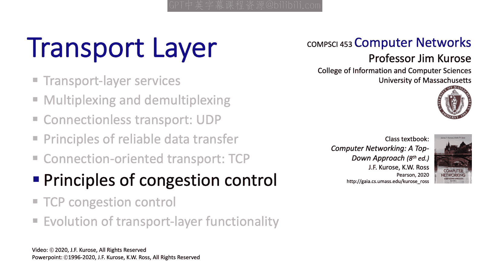

# 3.6：拥塞控制原理 🚦

在本节中，我们将从宏观视角审视拥塞控制，旨在从原理上理解拥塞的成因和代价，并识别处理拥塞的两种基本方法。下一节我们将具体探讨TCP如何实现这些原理，但现在，我们先退一步，把握整体概念。

## 概述
本节我们将学习什么是网络拥塞，分析其产生的根本原因和带来的性能代价，并介绍两种主要的拥塞控制方法。

---

### 什么是拥塞？
首先，让我们回答最基本的问题：什么是拥塞？非正式地说，拥塞是指**网络中的某个链路**有**太多源主机**以**过快的速度**发送**太多数据包**，导致该链路无法处理。

需要记住，每条链路都有其**传输速率**。当数据包的**到达速率**超过链路的**传输速率**时，队列开始形成，延迟会变得越来越大。如果链路的包缓冲区完全填满，新到达的数据包将被丢弃和丢失。

一个重要的区分是：**拥塞控制**是关于**多个发送方**聚合发送过快的问题；而我们在上一节学习的**流量控制**，是关于**单个发送方**与**单个接收方**之间的速度匹配。

有了这个背景，让我们深入探讨拥塞的成因和代价。

---

### 场景一：无限缓冲的理想情况
我们将从一个简单的理想化场景开始分析。我们观察一个会发生拥塞的单一路由器，并首先假设其拥有**无限大的缓冲区**（这当然是理想化的）。

该路由器的输入和输出链路容量为 **R bits/s**，有两条数据流：红色流和蓝色流。我们重点关注红色流：在发送端，应用层向传输层传递数据的速率记为 **λ_in**；在接收端，数据被递交给应用层的实际速率记为 **λ_out**，我们称之为**吞吐量**。我们想探究的问题是：当我们同步提高红色流和蓝色流的发送速率时，吞吐量会发生什么变化？

在无限缓冲的情况下，没有数据包会丢失。每个发送的包最终都会被接收。因此，接收端的吞吐量等于发送端的发送速率，如下图所示。请注意，X轴终点是 **R/2**，因为如果每个发送方的速率超过 **R/2**，每条流的吞吐量将简单地达到最大值 **R/2**，这是因为路由器的输入输出链路每秒无法承载超过 **R** 比特的流量（两条流各 **R/2**）。

从吞吐量的角度看，这似乎不错。但请记住，我们在第一章学过，当链路的到达速率接近其传输速率时，会产生很大的排队延迟，如下图所示。因此，即使在这个理想化场景中，我们也看到了代价——延迟代价。

---

### 场景二：有限缓冲与重传
现在，让我们放弃“无限缓冲”这个不切实际的假设，考虑相同场景但缓冲区大小有限的情况。

从可靠数据传输的学习中我们知道，发送方在面对因缓冲区溢出或损坏导致的丢包时，会进行重传。因此，我们现在需要更仔细地审视发送速率。具体来说，我们需要区分：
*   **λ_in**：从应用层传递下来的原始数据速率。
*   **λ_in‘**：传输层发送数据的总速率，包括重传。

到达路由器的数据包速率是 **λ_in‘**，而不是 **λ_in**。请务必理解这个区别，它非常重要。并且，**λ_out = λ_in**，而 **λ_in‘ ≥ λ_in**，因为它包含了重传。

对于有限缓冲区的情况，我们仍从一个理想化场景开始：假设发送方能神奇地知道传输的数据包是否有空闲缓冲区。此时，没有数据包会丢失。源发送一个包，在路由器缓冲，最终被传输并在接收端接收。这种情况下，吞吐量 **λ_out** 等于 **λ_in**。除了当 **λ_in** 接近 **R/2** 时产生的排队延迟外，没有问题。

接下来，我们放松“发送方神奇地知道空闲缓冲区”这个假设，考虑当数据包到达路由器但没有空闲缓冲区时会发生什么。如下图所示，一个数据包到达时发现缓冲区已满，它被丢弃，因此发送方最终重传该数据包的一个副本，这次它找到了空闲缓冲区，通过缓冲区并最终被路由器传输到目的地。

在这种情况下，由于已知丢包而发生重传，总到达速率与吞吐量的关系图大致如下：
*   在低到达速率区域，缓冲区几乎总是可用的，每个原始传输的数据包都能通过。因此，在这个区域，包含重传（实际上很少发生）的总到达速率 **λ_in‘** 基本等于接收端吞吐量 **λ_out**。总到达速率每增加一个单位，吞吐量也增加一个单位，即图中红色曲线的斜率接近1。
*   更有趣的是高到达速率区域。到达的数据包中越来越多地包含重传包。因此，接收端吞吐量不再随总到达速率的增加而等比例增加。我们看到，当X轴上的总到达速率 **λ_in‘** 接近 **R/2**（无法更高）时，接收端的最大吞吐量实际上**小于 R/2**。这个差距很重要，因为**一个数据包的N次重传副本最多会占用单包传输容量的N倍资源，但这N次传输最终只贡献一个数据包给吞吐量**。

现在，让我们看看如果放弃“所有重传都是必要的”这个不切实际的假设会怎样。也就是说，假设发送方可能过早超时（如下图所示），从而实际上向接收方交付了两个数据包副本。在这个例子中，第一个包被延迟，发送方最终超时并重传，两个包最终都到达接收方。当然，接收方只向应用层交付一个段的数据，尽管收到了两个重复段。

有了这些不必要的重传，意味着流中总的重传段更多（有些是必要的，有些是重复的），因此最大吞吐量会进一步下降，从下图中的这里降到那里。

我们可以总结从第二个场景中学到的东西：**拥塞导致的丢包需要重传，而N次重传的数据包最多会占用单包N倍的资源（缓冲区和传输容量），但这些N个包最终只贡献一个包给吞吐量。因此，端到端的最大吞吐量可能显著低于拥塞路由器的实际传输容量。**

---

### 场景三：多跳路径与资源浪费
在我们的第三个场景中，我们考虑四个发送方和四个接收方，发送-接收对之间隔着两个路由器。红色流现在跨越两跳。同样存在重传，因此我们需要像之前一样区分 **λ_in** 和 **λ_in‘**，并关注红色流的 **λ_in** 和吞吐量 **λ_out**。

现在，红色流在这里与蓝色流共享一个链路，在这里与绿色流共享另一个链路。这一点很关键：**一个红色流数据包要成功从主机A传输到主机C，必须被两个路由器都成功转发**。这很重要，因为如果一个红色数据包通过了第一个路由器，但在第二个路由器丢失，红色发送方将不得不再次重传它，并再次穿越第一个路由器。

另一种看待这个例子的方式是：**在第二跳丢失的数据包的第一次传输，本质上浪费了成功通过第一跳所消耗的链路缓冲和传输容量**。

考虑到这一点，我们想问的问题是：当所有流的 **λ_in‘** 增加时会发生什么？

一种可视化和思考这个问题的方式是：随着 **λ_in‘** 增加，路径上第一跳路由器的到达速率会增加，从而增加丢包率。现在从渐近角度思考：**如果第一跳发送方（例如这里的红色发送方）的发送速率远高于 R/2，这第一跳的流量将挤占所有第二跳的流量，并且这种对第二跳流量的丢弃会发生在所有路由器上**。这意味着，当我们调高发送速率时，所有流的端到端（两跳）吞吐量将趋于零。零吞吐量！情况不能再糟了。

因此，我们学到的另一个教训是：**在多跳场景中，用于将一个数据包传送到最终丢弃它的路由器所消耗的所有上游网络资源（缓冲区、带宽）都将被浪费**。既然这个包无论如何都无法到达目的地，它将不得不被重传，并再次尝试使用端到端路径上的所有资源。

---

### 拥塞的代价总结
让我们总结从这三个场景中学到的内容：

1.  **从吞吐量角度看**：最好的情况是吞吐量等于从发送方应用层传递下来的流量速率。一旦链路达到其容量，发送更多流量无法使吞吐量超过链路容量。
2.  **延迟代价**：当链路利用率接近1时（即流量到达速率接近链路容量），延迟会变得非常大。
3.  **重传开销**：当发生丢包时，重传的段（无论是否必要）会降低最大端到端吞吐量，因为链路同时承载原始流量和重传流量。记住，N次重传的数据包最多会占用单包N倍的传输容量和缓冲，但最终只贡献一个包给吞吐量。
4.  **多跳资源浪费**：在多跳情况下，用于那些最终在下游丢失的数据包的上游资源（缓冲区、带宽）是真正的资源浪费。在过度拥塞的场景下，这可能导致端到端吞吐量实际上降为零，这种现象被称为**拥塞崩溃**。

---

### 应对拥塞的两种基本方法
我们已经看到拥塞绝对是件坏事，这就是我们首先需要拥塞控制的原因——以避免我们刚刚看到的那些代价。下一节我们将看看TCP实际上如何进行拥塞控制。但既然我们在这里探讨大原则，让我们退一步，识别两种基本的拥塞控制方法。我们将看到，TCP同时实现了这两种方法。

拥塞控制的基本方法很简单：**当发送方检测到拥塞时，它应该降低其发送速率**（即我们之前例子中的 **λ_in‘**）。

**第一种方法：端到端拥塞控制**
在这种方法中，发送方通过**丢包指示**（可能是超时或三个重复ACK）或**测量的RTT**来推断拥塞。在这种情况下，网络层不提供任何明确的拥塞指示，它只是丢弃或延迟数据包，发送方从这些事件中**隐式地推断**出拥塞。这是TCP/IP协议栈最初采用的拥塞控制方法，至今仍是TCP拥塞控制算法的核心部分。

**第二种方法：网络辅助的拥塞控制**
在这种方法中，**网络层向传输层提供明确的反馈**来指示拥塞，这可以在实际发生丢包或过度延迟之前发生。这种反馈可以通过几种不同的方式提供。一些较新版本的TCP将网络辅助的拥塞控制与TCP原有的端到端拥塞控制结合实现，这实际上是必需的。

---

### 总结
本节课中，我们一起学习了网络拥塞的原理。我们探讨了拥塞的成因及其带来的多种代价，包括吞吐量下降、延迟增加、重传导致资源浪费，以及在多跳场景下可能发生的拥塞崩溃。我们还识别了应对拥塞的两种基本方法：端到端（隐式）控制和网络辅助（显式）控制。掌握了这些核心见解，我们现在已经准备好深入探讨TCP具体如何执行拥塞控制，这将是下一节的内容。