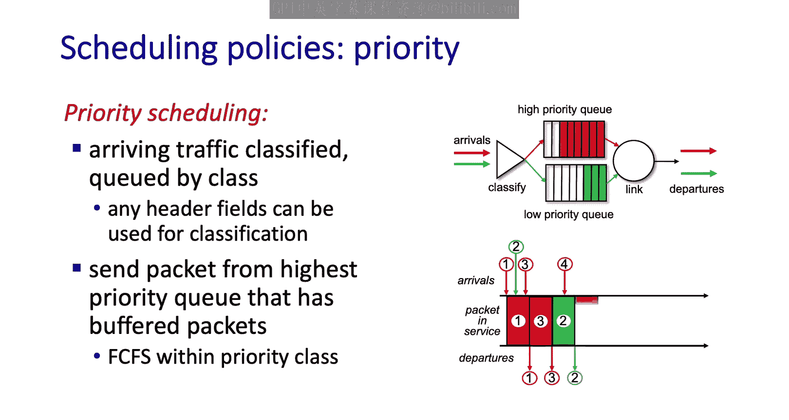
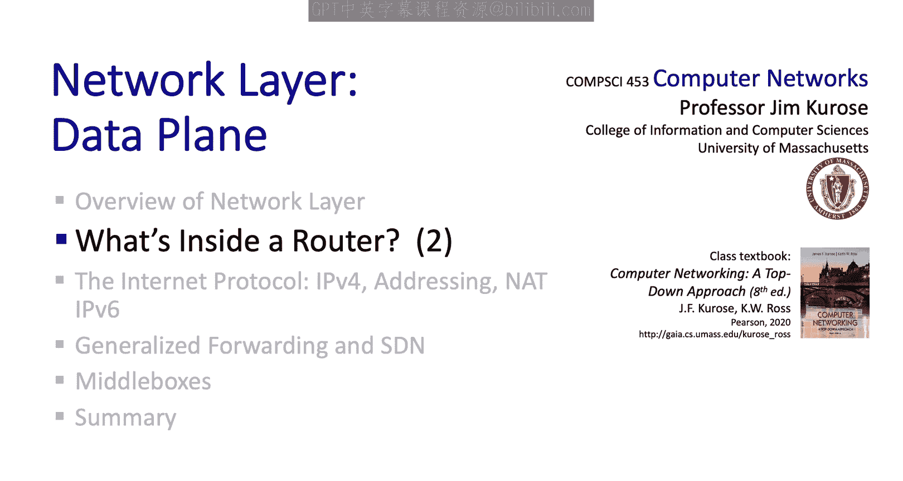

# 4.2：路由器内部探秘（第二部分）

在本节中，我们将深入探讨路由器内部的两个核心机制：**分组调度**和**缓存管理**。我们将了解它们如何影响网络性能，并学习几种实际应用的调度策略。最后，我们还将触及一个与这些技术紧密相关的社会性话题——网络中立性。

---

## 输入端口排队与队头阻塞

上一节我们介绍了路由器的输入端口、输出端口和交换结构。本节中，我们来看看当数据流在这些组件间流动时，可能发生的排队现象。

首先，我们关注输入端口。当交换结构的处理速度低于所有输入链路速率之和时，就会在输入端口发生排队。在单位时间内，到达的报文数量可能超过交换结构从输入端转移到输出端的能力。

一种在交换结构输入端特有的排队现象被称为**队头阻塞**。当来自不同输入端口的报文都想去往同一个输出端口时，就会发生队头阻塞。如果一次只能将一个报文从输入端转移到给定的输出端，那么想去往同一输出端口的K个报文中，将有K-1个必须在输入端等待。这些等待的报文还会阻塞其所在输入队列中排在后面的报文，这就是队头阻塞。

以下是一个队头阻塞的示例，其中报文的颜色代表其目的输出端口：
*   假设在时间T，顶部和底部的输入端口各有一个红色报文要去往上方的输出端口。
*   在一个时钟周期内，顶部的红色报文被从输入端转移到了输出端。
*   中间队列的蓝色报文也能转移到其目的输出端口。
*   然而，底部的红色报文被阻塞了，因为顶部的红色报文已经占用了那个红色输出端口。
*   因此，排在这个底部红色报文后面的绿色报文就经历了队头阻塞。

---

## 输出端口：缓存需求与分组丢失

现在，让我们聚焦于输出端口，因为这里是真正的“行动”发生地。我们首先来看看为什么需要缓存。

假设输出端口的链路传输速率为 **R** 比特/秒，而交换结构是非阻塞的，能够以 **n * R** 比特/秒的速率向输出端口交付数据。缓存发生的原因就很明显了：数据到达的速率（n * R）可能超过数据离开（发送）的速率（R）。当到达速率超过离开速率时，缓存区就会被填满。

由于缓存区容量是有限的，可能没有足够的空间来存储所有需要缓存的报文，因此一些报文将不得不被丢弃。正是在输出端口这里，发生了**拥塞导致的分组丢失**。

问题的根源并非交换结构交付过快，而在于网络边缘有**太多**的运输层发送方，向网络中注入了**太多**的报文，导致它们都试图通过这个拥塞的输出端口。

---

## 缓存容量：多少才合适？

面对缓存和拥塞，你可能会想：路由器应该配备多少缓存才合适？拥有大量缓存似乎是好事，因为可以减少因流量突发性导致的丢包。

然而，即使在网络发展50多年后的今天，“多少缓存才是合适的”这个问题在很大程度上仍未完全解决。目前有一些建议：
*   **RFC 3439经验法则**：缓存容量应等于典型的往返时延（例如几百毫秒）乘以输出链路容量。
*   **更近期的理论研究**：假设运输层发送方彼此独立，建议将RFC 3439的缓存量除以 **√n**，其中n是经过该链路的流数量。这个值要小得多。

虽然大缓存可以减少丢包，但也有缺点：**大缓存意味着更大的时延和更长的RTT**。对于游戏玩家和交互式视频会议用户，几十毫秒的时延都至关重要。更重要的是，大的RTT时延意味着TCP发送方会更慢地检测到拥塞并做出反应。

理想的缓存策略是：**缓存应足以吸收短期流量波动并保持链路繁忙，但又不能太大，以免拥塞控制反应变得迟钝**。这就像烹饪中的盐，适量则佳，过量则毁。

输出端口的缓存和排队之所以如此复杂和微妙，是因为**全球范围内成千上万个活跃发送方的行为，都在这个单一的输出链路缓冲区汇聚**。我们在互联网深处的一个点上，看到了全球互联网规模行为的汇聚。

---

## 输出端口模型与分组丢弃策略

接下来，我们将探讨缓存管理和分组调度的机制。将输出端口抽象地看作一个队列会很有帮助，如下图所示。

报文到达队列、等待服务、最终被选中服务（即其比特被链路层通过输出链路发送），然后离开队列。

如果一个到达的报文发现没有空闲的缓存空间，它要么被丢弃（这称为**队尾丢弃**），要么根据某种优先级机制（例如，丢弃低优先级报文），将一个已排队的报文移除并丢弃，以便为新到达的报文腾出空间。

此外，正如我们在学习网络辅助拥塞控制时所了解的，一个已缓存的报文也可能被**标记拥塞指示**，以信号告知链路正变得拥塞。在互联网的显式拥塞通知机制中，IP首部服务类型字段中的2个比特用于ECN标记。正是在发生拥塞的输出端口，这些比特会被设置。

---

## 分组调度策略

现在，我们来看几种实践中使用的分组调度策略。

**1. 先来先服务调度**
在这种调度方式下，报文简单地按照它们到达输出端口的顺序进行发送。这与我们日常生活中最常见的排队方式一致。

**2. 优先级调度**
在这种调度方式下，到达输出链路的报文在进入队列时被分类到不同的优先级类别中，如下图所示，我们有高优先级的红色流量类别和低优先级的绿色流量类别。

优先级排队策略会从**具有非空队列（即有报文等待发送）的最高优先级类别**中发送一个报文。在同一优先级类别内的报文选择通常采用先来先服务的方式。

那么，如何定义优先级类别呢？这实际上由网络运营商（ISP）决定。ISP可能认为网络管理流量非常重要，设为最高优先级；网络电话流量比电子邮件优先级更高，等等。通过查看运输层端口号，可以确定数据报携带的流量类型，这是确定优先级的一种方式。另一种方式可能是基于源地址甚至目的地址。

**3. 轮询调度与加权公平排队**
在轮询调度下，报文像优先级调度一样被分类。然而，不同类别之间没有严格的服务优先级，轮询调度器在各类别之间交替服务。例如，调度器会从类别1选一个报文，然后从类别2选一个，接着从类别3选一个，依此类推。如果某个类别没有报文，调度器就转到调度顺序中的下一个类别。

一种在实践中被路由器广泛实现的、更通用的轮询排队形式称为**加权公平排队**。与优先级和轮询调度类似，到达的报文被分类并排入相应的每类等待区域。WFQ调度器以类似轮询的方式为各类服务（例如先服务类别1，再类别2，再类别3，然后重复）。

WFQ与简单轮询的不同之处在于，**每个类别在任何时间间隔内可以获得不同数量的服务**。其工作原理如下：
*   每个报文类别i有一个权重 **Wᵢ**。假设所有权重之和为1。
*   在任何存在类别i报文要发送的时间间隔内，类别i**保证能获得Wᵢ比例的服务**。
*   这意味着如果链路速率为R，那么每个服务类别将获得**保证的最小带宽 Wᵢ * R**。

由此可见，加权公平排队允许在每类基础上提供某种带宽保证。

---

## 网络中立性：技术与社会政策的交汇

网络中立性是一个我们的计算机网络技术兴趣与社会、政治、经济考量相交汇的领域。我们已经看到了共享资源的机制，但关于这些资源如何共享的社会、政治和经济考量呢？

网络中立性涉及管理互联网服务提供商如何使用我们刚刚学到的流量控制机制（特别是分组调度）来控制网络流量的法律和政策。它涉及多个方面：
*   **言论自由**：例如，ISP是否可以拒绝承载某些类型的流量（如特定新闻或政治观点）？
*   **鼓励创新与竞争**：例如，ISP是否必须对所有公司（无论大小）的流量给予平等对待？

不同国家在这些问题上采取了不同的立场。我们以美国为例，因为其情况有据可查且公开。

2015年，美国联邦通信委员会关于“保护与促进开放互联网”的命令定义了与网络中立性相关的三条明确规则：
1.  **无阻塞**：ISP不得阻塞合法的内容、应用、服务或无危害的设备（受合理网络管理约束）。例如，曾有ISP阻止客户使用与其自身电话服务竞争的网络电话服务，这将不被允许。
2.  **无节流**：ISP不得基于互联网内容、应用、服务或无危害设备的使用，损害或降低合法互联网流量（受合理网络管理约束）。例如，曾有ISP通过内部创建并发送TCP重置报文给对等网络应用的客户端和服务器，干扰其流量，这被视为违规。
3.  **无付费优先**：例如，所有视频流服务提供商的流量必须被同等对待。一个流媒体服务提供商不能通过付费使其报文在传输给客户时获得更好的服务。

你可能会问，为什么不允许付费优先？付费获得优先服务似乎已是常态。一个论点是，如果现有的大型服务提供商能够支付高额费用获得更好服务，这将为新的竞争者设置很高的市场进入壁垒。当然，也有反对观点认为，付费优先为ISP创造了额外收入，从竞争角度看是好事，因为这使得ISP市场更具吸引力，会鼓励更多投资。

此外，从监管角度看，ISP属于“电信服务提供商”还是“信息服务提供商”至关重要，因为两者受不同法律约束（前者监管更严），而这个问题在美国尚未最终确定。

需要注意的是，这些2015年的规则已被后续的FCC命令大幅修改。在相关法律完善、诉讼和判例法进一步发展之前，可以说情况仍在不断演变，这在许多国家都是如此。

有趣的是，自互联网近30年前向公众开放以来，我们就已经具备了流量优先级区分的技术能力。尽管互联网有着坚实的技术基础，但三十年后的今天，管理这一创造物的社会、政治和经济政策仍未完全定义或达成共识。

---

## 总结

本节课中，我们一起深入学习了路由器内部的核心运作机制。

我们首先探讨了**输入端口排队**及特有的**队头阻塞**现象。接着，重点分析了**输出端口**，理解了缓存的需求、分组丢失的发生原因，以及关于**缓存容量**“多少才合适”的持续讨论。

然后，我们将输出端口抽象为队列模型，介绍了**分组丢弃策略**（如队尾丢弃和基于优先级的丢弃）以及**拥塞标记**。

在**分组调度策略**部分，我们学习了三种主要方式：
1.  **先来先服务**：按到达顺序发送。
2.  **优先级调度**：按ISP定义的类别优先发送高优先级报文。
3.  **加权公平排队**：为不同类别分配权重，保证其获得相应比例的带宽。

最后，我们探讨了与这些技术密切相关的**网络中立性**话题，了解了其核心原则（无阻塞、无节流、无付费优先）以及围绕它的社会、政治和经济争论。

至此，我们完成了对“路由器内部有什么”的全面探讨，涵盖了输入端口、输出端口、交换结构以及本节深入讨论的分组调度与缓存管理。接下来，我们将把目光转向互联网协议——IPv4。