# 4.3：互联网协议（第二部分）🌐

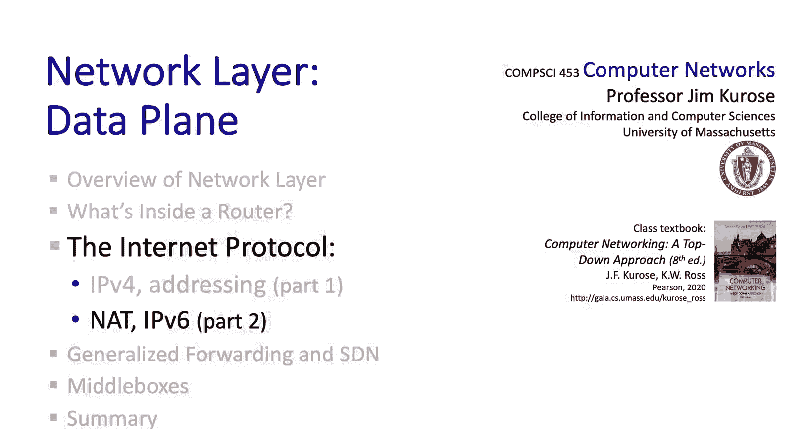

在本节课程中，我们将继续深入学习互联网协议（IP）。上一节我们详细探讨了IPv4寻址及其32位地址空间的局限性。本节中，我们将聚焦于两个在20世纪90年代中后期为解决IPv4地址耗尽问题而发展起来的重要技术：**网络地址转换**和**IPv6**。我们将会看到，这两项技术除了解决地址空间问题外，还带来了其他重要优势，并且正得到越来越广泛的部署。

## 网络地址转换（NAT）🔄

网络地址转换，简称NAT，其核心思想相当简单。在一个局域网（如家庭网络、机构网络或网吧）内部，所有设备都使用一个被称为**私有IP地址**的特殊地址范围内的IP地址。例如，`10.0.0.0/8` 就是这样一个地址范围。

在这个网络内部，主机之间交换的数据报照常使用这些私有地址，此时不涉及NAT。但是，当需要与这个局域网外部进行通信时，NAT就发挥作用了。具体来说，从该网络内部任何主机（可能有数十、数百甚至数千台设备）发送到外部网络的数据报，都将使用**同一个**32位的公共IP地址。

例如，尽管内部所有主机的IP地址形式都是 `10.0.0.0/24`，但当它们的数据报通过路由器进入更广阔的互联网时，其源IP地址都会被替换为同一个地址，例如 `138.76.29.7`。同时，这些外出数据报的源端口号也会被重新映射。实现和管理这种转换的设备就是这里的路由器，它被称为**NAT路由器**或**NAT盒子**。

以下是NAT使用的三个私有IP地址范围：
*   `10.0.0.0/8`
*   `172.16.0.0/12`
*   `192.168.0.0/16`

如果你查看连接到家庭网络、机构网络或蜂窝网络的笔记本电脑、平板电脑的IP地址，你很可能会发现它属于上述范围之一。

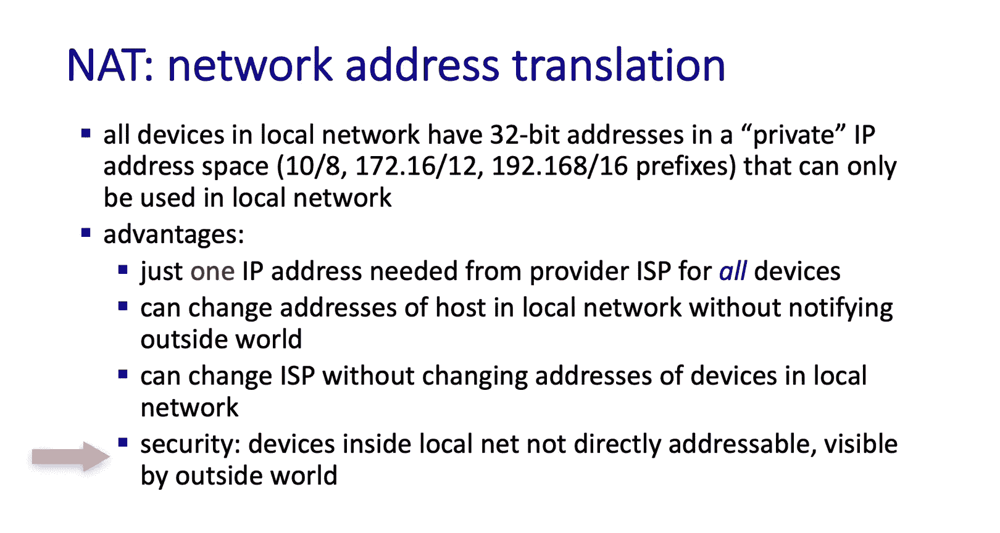

NAT具有多项优势：
*   **地址复用**：所有位于NAT路由器后的主机发出的数据报都使用同一个公共IP地址，极大地节省了IPv4地址。
*   **内部网络灵活性**：可以更改局域网内主机的地址，而无需通知外部世界，因为它们使用的是私有地址。
*   **ISP更换便利**：更换互联网服务提供商时，无需更改局域网内设备的地址。
*   **安全性增强**：局域网内的设备对外部世界来说不是直接可寻址或可见的，提供了一定的安全屏障。

### NAT的实现机制 ⚙️

接下来我们看看NAT是如何实现的。NAT路由器需要完成以下三件事：

1.  **处理外出数据报**：对于每一个从局域网发往互联网的数据报，NAT路由器需要将其**源IP地址和源端口号**替换为NAT的公共IP地址和一个**新的源端口号**。需要注意的是，NAT对本地主机和远程主机都是透明的。远程主机只会看到一个来自某个IP地址和端口号的数据报，并会像往常一样使用该地址和端口号进行回复。

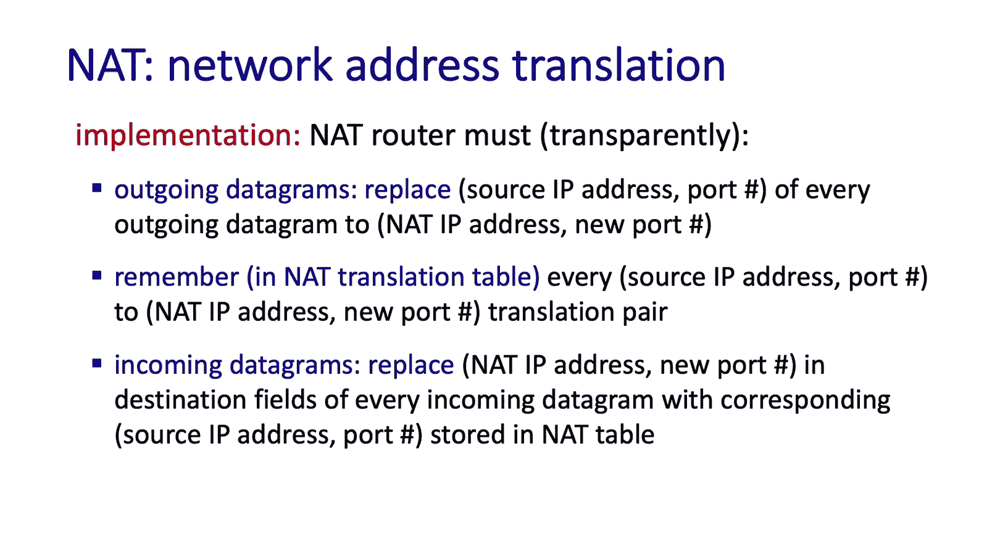

2.  **维护转换表**：NAT路由器需要记住每一个**转换映射对**，即将（本地IP地址，本地端口号）映射到（NAT IP地址，新端口号）。这个映射关系被存储在一个**NAT转换表**中。

3.  **处理进入数据报**：当数据报从外部互联网到达，并且目的地是局域网内的某个主机时，NAT路由器需要根据NAT表中的记录，将数据报的**目的IP地址和目的端口号**替换为对应的内部主机的IP地址和端口号。

让我们通过一个实例来清晰地理解这个过程。

**NAT工作实例**：
假设局域网地址范围为 `10.0.0.0/24`，NAT路由器使用的公共地址是 `138.76.29.7`。NAT转换表初始为空。

1.  主机 `10.0.0.1`（源端口3345）发送一个数据报到目的地址 `128.119.40.186`（端口80，通常为Web服务器）。
2.  数据报到达NAT路由器。路由器将数据报的源地址从 `(10.0.0.1, 3345)` 更改为 `(138.76.29.7, 5001)`，并相应地在NAT表中创建一条记录：`(10.0.0.1, 3345) <-> (138.76.29.7, 5001)`。注意，数据报的目的地址和端口保持不变。
3.  远程主机回复。回复数据报的目的地址是 `138.76.29.7`，目的端口是 `5001`。
4.  NAT路由器收到回复后，使用目的IP地址和目的端口号 `(138.76.29.7, 5001)` 作为索引查询NAT表，得到对应的内部地址 `(10.0.0.1, 3345)`。然后，路由器将数据报的目的地址和端口重写为这个内部地址，并将数据报转发到家庭网络中。

### 关于NAT的讨论 💬

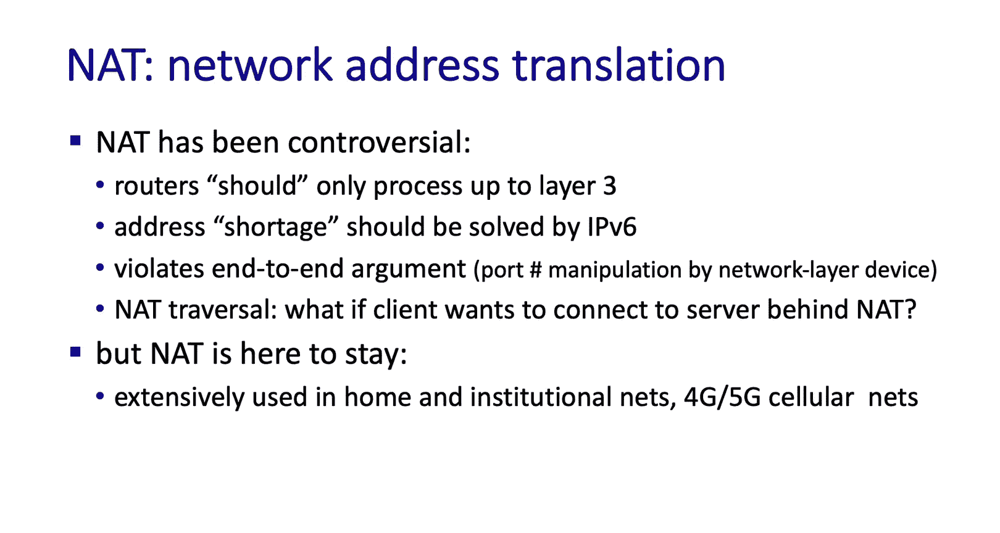

在结束对NAT的学习之前，需要指出的是，NAT最初颇具争议。一个网络层设备去修改属于传输层（端主机范畴）的端口号，这在纯粹主义者看来是不合适的。他们认为，如果真要解决IPv4地址耗尽问题，应该直接采用IPv6，毕竟IPv6就是为了这个目的而开发的。

NAT也带来了一些复杂性。例如，如果外部主机想要主动与NAT路由器后的主机建立连接，就会遇到所谓的 **NAT穿越** 问题。虽然可以通过一些技术手段实现，但这些方法通常比较复杂。

尽管NAT存在这些缺点，但网络运营商们用实际行动做出了选择——NAT已被广泛部署，并且在未来相当长一段时间内都将持续存在。

## IPv6 🚀

在了解了NAT之后，我们接下来看看**IPv6**。正如我们提到的，IPv6的主要动机是提供更大的**128位地址空间**。但除此之外，IPv6还包含了许多其他重要创新。在我们学习IPv6时，还会遇到一个非常重要的新概念：**隧道技术**。

### IPv6的设计动机 🎯

是的，IPv6最主要的需求无疑是更大的地址空间。但还有其他一些动机：

1.  **更快的处理速度**：IP报头需要在纳秒级速度下处理。这在1981年IPv4标准化时并非必需，但鉴于链路速率的发展，这已成为一项重要要求。IPv6通过简化IPv4路由器处理中一些更复杂的方面来实现快速转发，例如变长报头、数据报分片与重组以及每跳都需要重新计算校验和等问题。
2.  **对流（Flow）的支持**：在早期，互联网更多地被视为一个面向数据报的网络。但近年来，端点之间的**流**（或称为连接）的概念变得越来越重要。人们希望提供基于流的服务，而不仅仅是基于单个数据报的服务。IPv6通过在IP报头中引入**流标签**字段，将“流”的概念提升为一级对象。

### IPv6数据报格式 📄

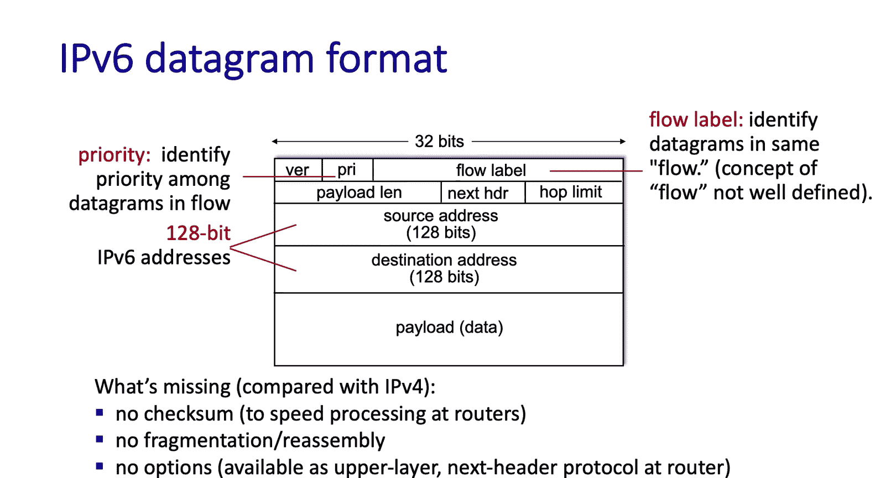

让我们快速浏览一下IPv6数据报的格式。你会看到我们一直在讨论的**128位IPv6源地址和目的地址**。还有我们刚刚提到的**16位流标签**字段。需要理解的是，这个字段是用于标记流的机制，但IPv6并未强制规定如何定义流或如何使用这个字段。这些实际上是留给ISP的策略问题。IPv6提供了处理流的机制，而非策略。

**8位流量类别**字段类似于IPv4中的服务类型字段，可用于为流内的某些数据报或特定类别的流量赋予优先级。和流标签一样，这个字段也是关于机制而非策略的。

版本号、有效载荷长度、下一个报头（上层协议）字段以及有效载荷本身，都与我们在IPv4中看到的类似。希望所有这些对你来说都相当熟悉。

既然这些都很相似，那么更有趣的问题或许是：哪些IPv4中的字段在IPv6中不存在？具体来说，IPv6报头中**没有校验和、分片/重组或选项字段**。正如我们之前提到的，这使得报头长度固定，有利于更快地处理。分片和重组需要在端点完成，而选项功能可以通过在路由器上将IPv6数据报的有效载荷传递给上层协议来实现。

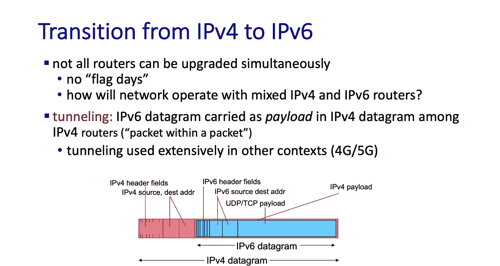

### IPv4到IPv6的过渡：隧道技术 🚇

让我们通过思考以下问题来结束对IPv6的讨论：如果我们目前有一个IPv4网络，但最终希望过渡到IPv6网络，我们该如何实现这种过渡？我们已经看到IPv4和IPv6是非常不同的协议。

我们是否要设定一个“旗帜日”，让全球所有人同时从IPv4切换到IPv6，关闭所有IPv4设备并开启所有IPv6设备？由于许多你可能想到的原因，这非常困难。

相反，我们更希望IPv4和IPv6能够**共存并互操作**，随着新设备的引入，路由器和主机逐步迁移到IPv6。因此，我们今天拥有的互联网是：一些路由器是IPv4的，一些是IPv6的，还有一些同时支持IPv4和IPv6。

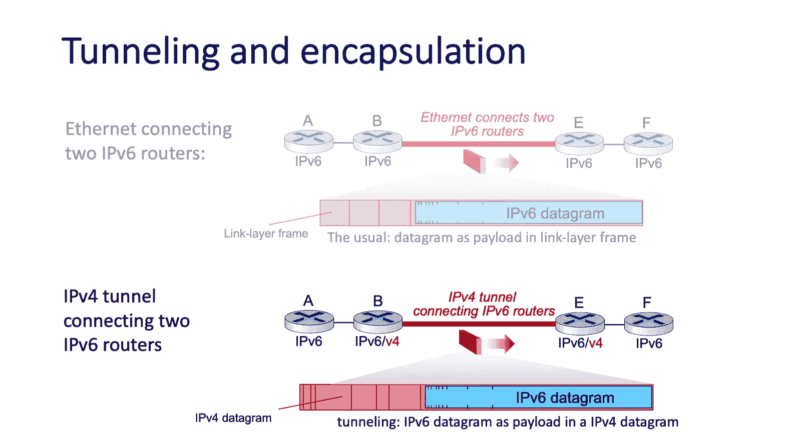

但如何在保持互联网运行的同时实现这种共存呢？这有点像试图在飞机飞行时更换引擎。幸运的是，这并不那么难。用于允许IPv4和IPv6网络互操作的关键技术被称为**隧道技术**。

隧道技术的关键在于，让一个数据报（例如一个IPv4数据报）将其有效载荷承载为另一个数据报（例如一个IPv6数据报）。这听起来可能有点奇怪——一个数据报里面装着另一个数据报？让我们来看看它是如何工作的。

**隧道技术原理**：
回想一下我们在网络介绍中学到的分层和封装概念。在下图中，我们看到两个IPv6路由器通过以太网物理连接。这两个路由器之间的链路层以太网帧，其有效载荷承载着一个IPv6数据报。这是完全正常的操作，没有什么新东西。

现在，让我们再次看两个IPv6路由器，但假设它们除了知道如何处理IPv6，还知道如何处理IPv4（就像它们知道如何处理以太网一样）。并且，这两个路由器不是直接通过以太网连接，而是通过一个**IPv4路由器网络**相互连接。

这两个IPv6路由器如何相互转发IP数据报呢？答案当然是利用连接它们的IPv4网络。在这种情况下，它们不是将IPv6数据报放在以太网帧中发送给对方，而是简单地将IPv6数据报**放入一个IPv4数据报中**，寻址并将这个IPv4数据报发送给对方。这个过程就是**隧道**。

**隧道技术实例**：
在这个例子中，路由器A和F是**仅IPv6**路由器，路由器C和D是**仅IPv4**路由器，而路由器B和E**同时支持IPv6和IPv4**。

假设左侧的IPv6路由器A需要发送一个IPv6数据报到IPv6路由器F。让我们一步步看发生了什么。

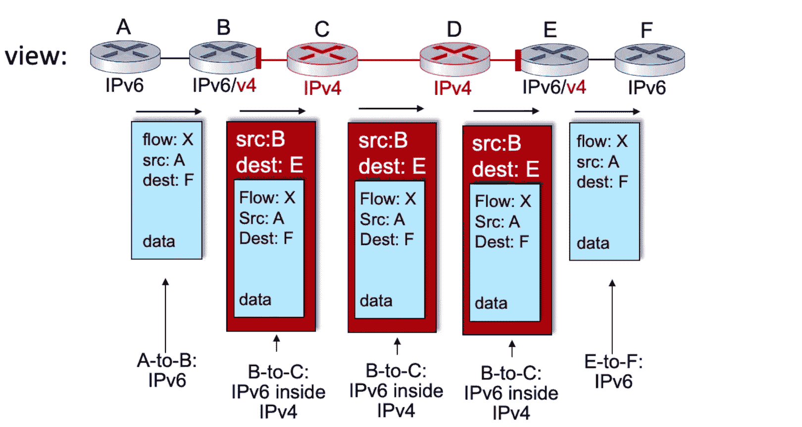

1.  A的转发表指出，IPv6路由器B是下一跳。因此，这个IPv6数据报被转发到B。注意，这仍然是一个IPv6数据报（源地址是A，目的地址是F，都是IPv6地址，并且包含仅IPv6才有的流标签字段）。从A到B的过程没有新内容。
2.  现在看路由器B，这里变得有趣了。它从A收到IPv6数据报，看到目的地是F，并且IPv6网络中的下一跳路由器是E。这是关键：**IPv6网络中的下一跳是E**。B需要思考：我如何将这个IPv6数据报转发给E？记住，B和E是通过一个IPv4网络连接的。好在B和E都支持IPv4和IPv6，并且它们之间有一条IPv4隧道。实际上，在B的转发表中，会有一条记录指明：要到达F，需要通过一个通往E的IPv4隧道接口转发。
3.  于是，B创建一个IPv4数据报，将该数据报的目的地址设为E的IPv4地址（这是关键），并将原始的IPv6数据报作为有效载荷放入这个IPv4数据报中，然后将该数据报转发进隧道。
4.  让我们仔细看看这个从B发往C（进入隧道）的IPv4数据报。对于这个IPv4数据报（外层），源地址是路由器B，目的地址是路由器E。当然，在这个IPv4数据报内部，是原始的IPv6数据报（内层），其源地址是A，目的地址是F。
5.  然后，这个IPv4数据报通过IPv4网络，使用我们熟知的IPv4机制被转发，最终到达E。在IPv4网络看来，这只是一个普通的IPv4数据报，目的地址是E。
6.  在IPv4目的地E，E说：“好的，我是这个红色IPv4数据报的目的地。”于是它查看内部，发现了一个IPv6数据报。它提取出这个IPv6数据报，查看其IPv6目的地址F，在自己的转发表中查找F，然后将这个IPv6数据报转发到通往F的链路上。

在这个例子中，我们看到IPv4几乎可以被视为一种直接连接两个IPv6路由器的链路层技术。通过IPv4网络的路径可以被抽象地看作一条**直接连接两个IPv6路由器的隧道**。通过这种方式，利用隧道技术，IPv4和IPv6可以共存，并沿着混合了IPv4和IPv6路由器的路径端到端地转发数据报。关键在于，在两种技术（IPv4和IPv6）的边界上，我们需要有能同时处理两者的路由器，而所有现代路由器都具备这个能力。

我们稍后会看到，隧道技术在蜂窝网络中被广泛用于支持移动性，因此它是一个通用且重要的概念。但请注意，这个概念有时学生初次接触会觉得难以理解，你可能需要多思考一下或再听一遍这部分内容，因为它是一项超越IPv4/IPv6互操作的重要技术。

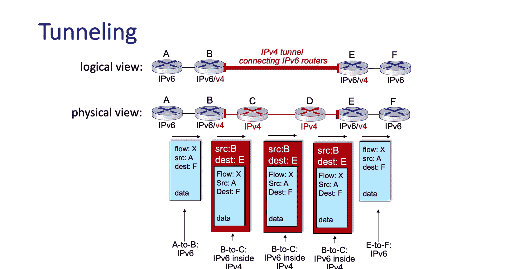

### IPv6的部署现状 📈

我们已经看到IPv6在20世纪90年代末就已标准化。那么25年后的今天，它的部署情况如何呢？谷歌报告称，访问其服务的客户端中，有近30%使用IPv6。在美国，国家标准与技术研究院报告显示，约三分之一的美国政府域名支持IPv6。

这算是一些进展，但25年后的今天，IPv4仍然是绝对主导的技术。你可能会想，为什么会这样？当然，NAT的广泛部署缓解了IPv4地址空间的压力，降低了对IPv6的迫切需求。但有趣的是，对比一下过去25年应用层发生的变化：万维网、社交媒体、媒体流、游戏、远程呈现等的出现，应用层发生了惊人的巨变。这恰恰表明，在应用层进行构建、创新和部署是多么容易，而在网络层构建、创新和部署新的“管道”则需要长得多的时间。

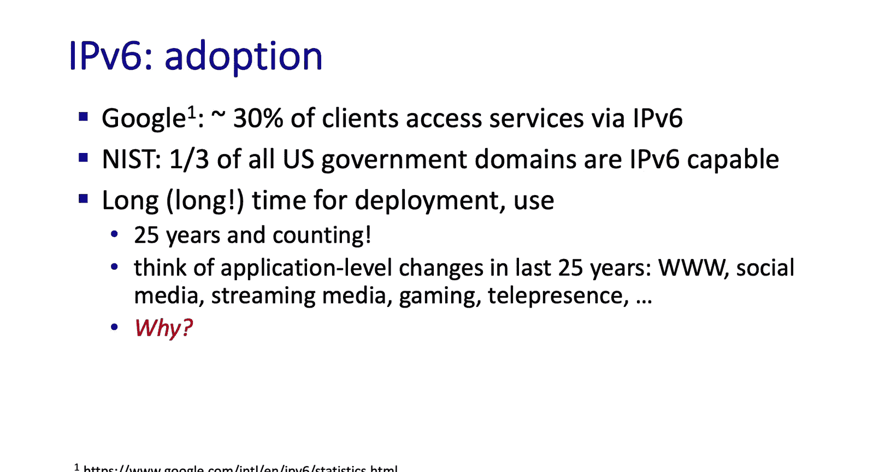

## 总结 📝

在本节课程中，我们深入探讨了位于互联网网络层核心的**互联网协议**，涵盖了大量的内容。我们学习了IPv4数据报格式、IPv4寻址、**网络地址转换**以及**IPv6**。也许你现在感觉有点信息过载，但希望你已经学到了很多。

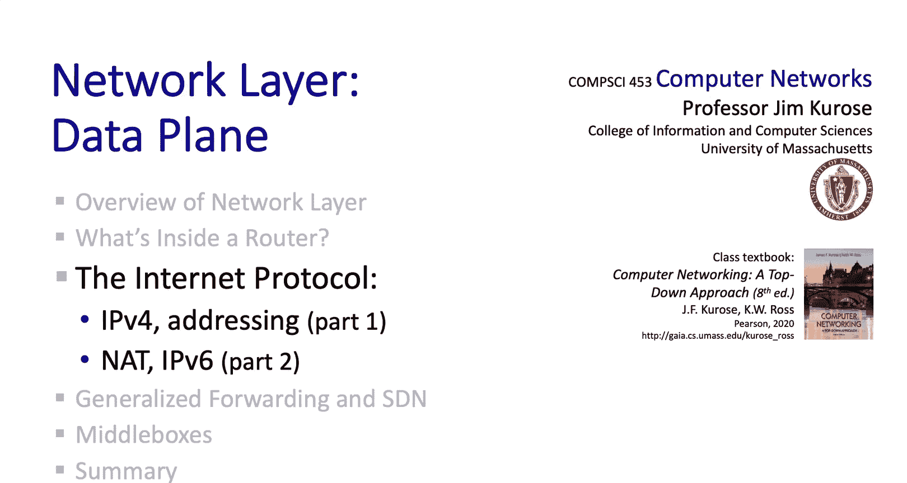

接下来，我们将学习**通用转发**，这将为我们后续学习控制平面时的**软件定义网络**打下良好的基础。