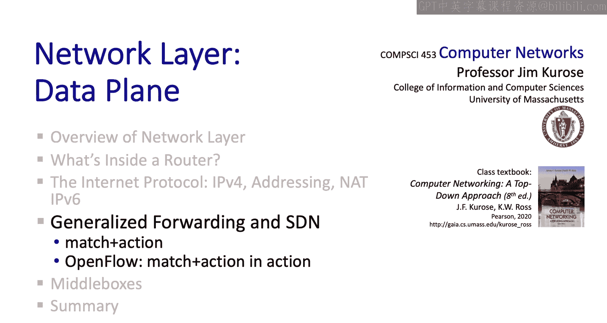

# 4.4：通用转发 🚦

在本节中，我们将学习一种超越传统目的地址转发的新方法——通用转发。我们将探讨其核心的“匹配加动作”抽象模型，并了解一个名为OpenFlow的标准化实现。

---

## 回顾传统路由器转发

上一节我们介绍了路由器的基本工作原理，本节中我们来看看它的演进形式。

传统路由器的工作方式如下：当一个IP数据报到达路由器时，路由器会检查其首部中的**目的IP地址**，然后在**转发表**中查找该地址，以确定数据报应从哪个输出端口转发出去。这种基于目的地址的转发方式已经沿用了几十年。

其核心流程可以用以下伪代码描述：
```python
def destination_based_forwarding(arriving_packet):
    dest_ip = arriving_packet.header.destination_address
    output_port = forwarding_table.lookup(dest_ip)
    forward_packet_to_port(arriving_packet, output_port)
```

---

## 通用转发的概念

通用转发在两个方面对传统转发行为进行了**泛化**。

首先，**匹配**不再仅限于目的IP地址。它可以基于到达分组的多个首部字段进行，包括链路层帧首部、网络层数据报首部或传输层段首部中的字段。

其次，**动作**空间也远比单纯的“转发”要广泛得多。

在通用转发中，转发表有时被称为**流表**。当数据包匹配到某条规则时，路由器可以执行的动作包括：
*   将数据包转发到指定的输出端口（传统转发）。
*   阻塞或丢弃数据包（防火墙功能）。
*   修改数据包，例如重写首部（网络地址转换NAT功能）。
*   将数据包封装并发送给SDN控制器。

此外，每条流规则还可以关联优先级，并维护匹配数据包数量的计数器。

---

## 流表示例

以下是路由器流表的一个示例，包含匹配列和对应的动作列：

| 匹配规则 | 动作 |
| :--- | :--- |
| 目的IP = 10.3.*.* | 转发至 端口1 |
| 源IP = 128.119.1.* | 丢弃 |
| 源IP = 10.1.2.34 | 封装并发送至控制器 |

如果多个流规则（即多行）被匹配，则需要某种**优先级机制**来选择最终执行的具体动作。

---

## OpenFlow标准

到目前为止，我们的讨论是通用的。现在让我们来看一个已被标准化的具体通用转发方法——**OpenFlow**。我们将以最初的OpenFlow 1.0规范为例。

在OpenFlow 1.0中，可以使用多达12个不同的首部字段进行匹配。
*   **网络层字段**：如IP源地址、IP目的地址、上层协议类型、服务类型字段。
*   **传输层字段**：如源端口号和目的端口号。例如，可以基于知名端口号来允许或阻止特定服务。
*   **链路层字段**：也可以基于链路层信息进行匹配。

匹配成功后，可以执行的动作包括：
*   转发到特定输出端口，或复制并发送到一组端口。
*   丢弃数据包。
*   修改下列任何首部中的字段。
*   将数据包封装并转发给SDN控制器。

---

## OpenFlow应用实例

我们看到，OpenFlow的匹配加动作规则能实现的功能远不止基于目的地的转发。以下是几个具体例子：

**1. 实现传统目的地址转发**
这个例子表明，通用转发可以完成传统转发能做的所有事情。
*   **规则**：匹配目的IP地址为 `51.6.0.8` 的数据报。
*   **动作**：转发至路由器输出端口6。

**2. 实现防火墙（阻止服务）**
此规则用于关闭经过该路由器的SSH服务（使用端口22）。
*   **规则**：匹配目的TCP端口为 `22` 的数据报。
*   **动作**：丢弃。
*   **效果**：任何试图通过此路由器SSH到远程主机的数据报都将被丢弃。

**3. 实现防火墙（黑名单主机）**
此规则用于阻止特定主机发出的所有流量。
*   **规则**：匹配源IP地址为 `128.119.1.1` 的数据报。
*   **动作**：丢弃。

**4. 实现链路层交换**
此规则执行传统的链路层帧转发。
*   **规则**：匹配目的MAC地址为 `22:A7:23:11:E1:02` 的链路层帧。
*   **动作**：转发至输出端口3。

通过这些例子，我们看到“匹配加动作”抽象可以用来实现多种不同设备的功能：
*   实现网络层基于目的地的转发。
*   实现链路层交换。
*   实现防火墙功能。
*   结合重写首部的能力，还可以实现NAT（网络地址转换）类服务。

---

## 从本地动作到网络级行为

以上讨论的动作都是**本地动作**。现在让我们退一步，从更宏观的**网络层面**来思考。

如果我们能为网络中所有路由器的流表进行编程和指定，那么我们就能实现任何想要的网络级路由行为。我们可以在SDN控制器中计算转发表，通过控制器中的程序生成这些表，并将其安装到路由器中。在这种情况下，甚至不需要路由协议，因为转发表是在SDN控制器中计算的。这是一个非常强大的理念。

以下是一个指定端到端路由行为的简单示例：
假设我们希望从主机H5和H6发往主机H3和H4的流量，通过交换机S1进行路由（即不直接使用S3和S2之间的直连链路）。

以下是各交换机的流表配置：
*   **S3的流表**：源IP为 `10.3.*.*` 且目的IP为 `10.2.*.*` 的流量，从本地端口3转发出去（指向S1）。
*   **S1的流表**：源IP为 `10.3.*.*` 且目的IP为 `10.2.*.*` 的流量，从本地端口4转发出去（指向S2）。
*   **S2的流表**：从端口2进入、目的IP为 `10.2.0.3` 的流量，从本地端口3转发（指向H3）；目的IP为 `10.2.0.4` 的流量，从本地端口4转发（指向H4）。

通过精心设计每个节点的流表项，SDN控制器就能有效地编程实现网络级的路由行为。

---

## 总结与展望

本节课中，我们一起学习了通用转发和匹配加动作模型。

我们了解到，匹配可以基于链路层、网络层和传输层首部中的许多字段进行。本地动作包括转发、丢弃、修改首部字段或将匹配的数据包发送给控制器。这些本地动作使得**第三层路由**、**第二层交换**、**防火墙**以及**NAT类功能**都能在统一的“匹配加动作”抽象下完成。

更重要的是，这为我们预览了控制平面的概念：SDN控制器可以通过精心编排流表项，有效地编程实现网络级行为（如路由）。

“匹配加动作”之所以能实现如此广泛的功能，是因为它本质上是一种**有限形式的可编程性**——能够对每个数据包定义处理步骤。这种思想可以追溯到约20年前DARPA的“主动网络”项目。如今，研究人员正积极探索用于指定和执行这种每包处理行为的编程语言，其中最引人注目的是**P4编程语言**。




接下来，我们将探讨中间盒，这将为我们提供一个审视互联网架构大局观问题的机会。