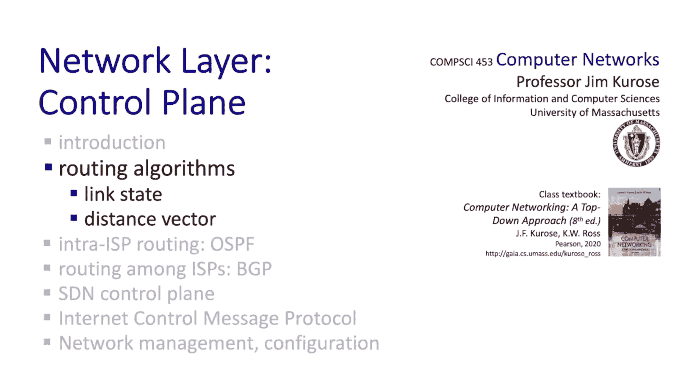
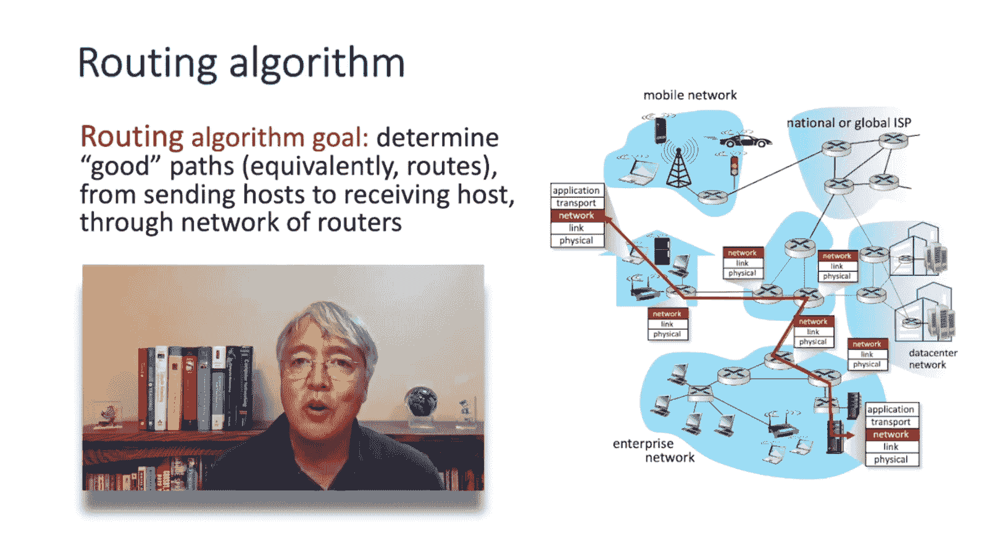
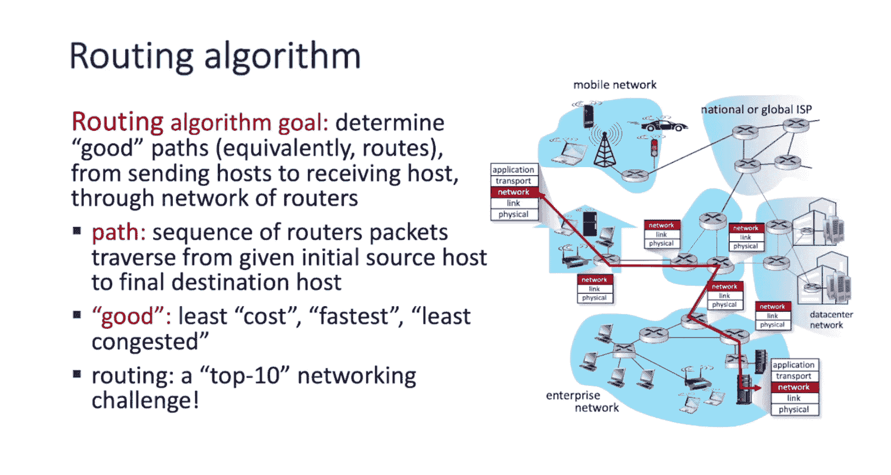
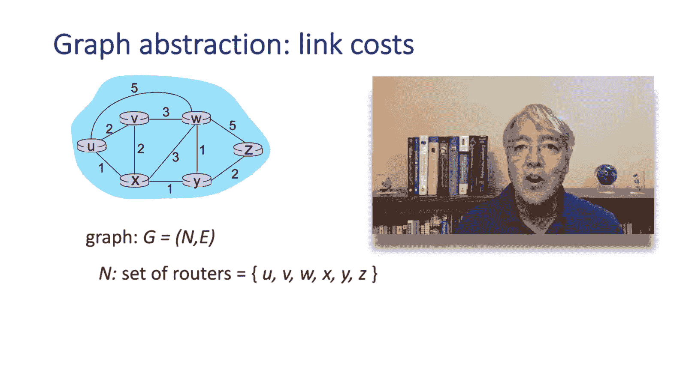
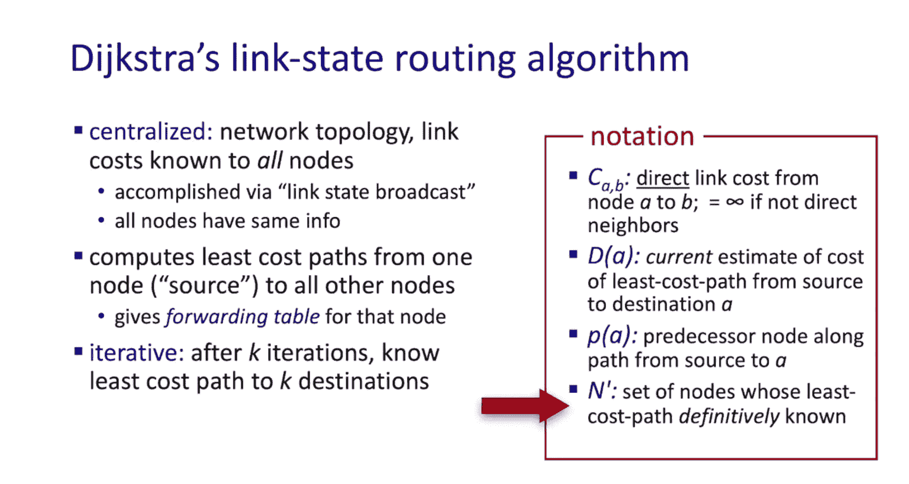
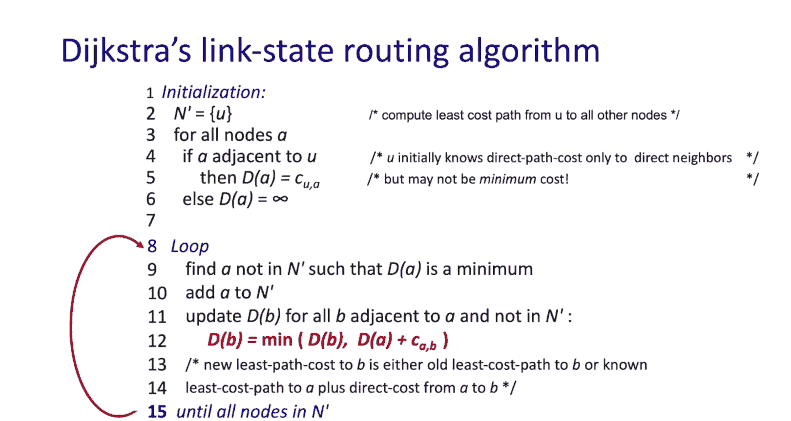
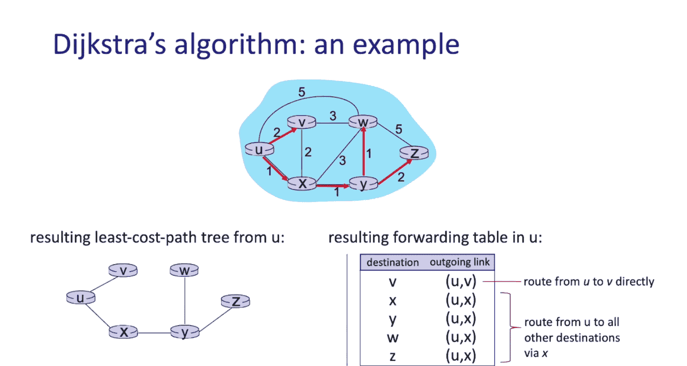
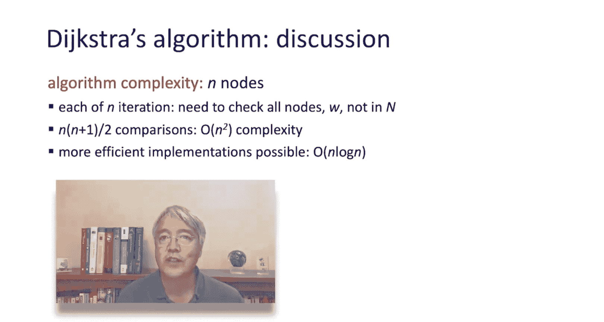
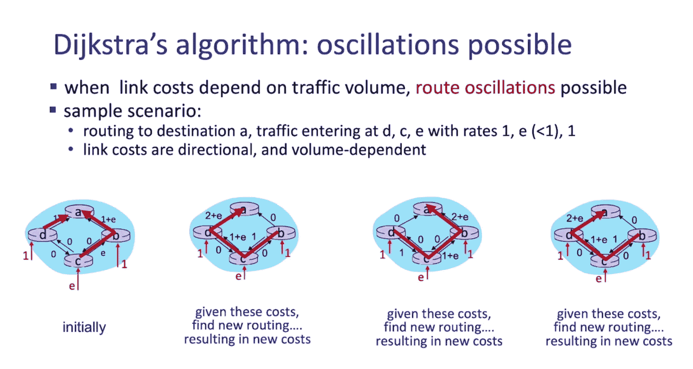
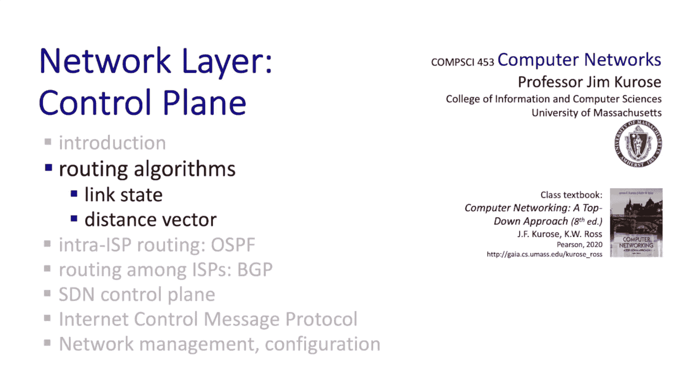

# 5.2：路由算法之链路状态路由 📡

在本节中，我们将介绍两种在实践中广泛使用的路由算法，用于计算从给定源节点到给定目的节点的路径。第一种被称为**链路状态算法**，第二种被称为**距离向量算法**。尽管它们共享计算最短路径或最低成本路径的共同目标，但我们将看到，它们在计算这些最短路径的实际方式上存在很大差异。

任何路由算法的目标都是通过路由器网络，在源节点和目的节点之间确定一条**好**的路径或路由。为了理解路由算法，我们需要稍微展开说明一下。我们所说的“路径”是什么意思？通过路由器网络的路径是什么？此外，“好”意味着什么？一条路由“好”或比另一条路由“更好”意味着什么？

## 路径与“好”的定义 🛤️

让我们将**路径**定义为数据包从给定的初始源主机到最终目的主机所经过的一系列路由器。例如，从左边的源主机到右下角的目的主机的路径，会经过这五个路由器。路径作为一系列路由器，隐含了连接路径中路由器的链路序列。这些链路很重要，我们马上就会看到。

那么“好”意味着什么呢？它可以有很多不同的含义，可能是**最低成本路径**，可能是**最快路径**，也可能是**最不拥塞的路径**。正如我们将看到的，成本的定义和“好”的定义，将由网络运营商来决定。在深入探讨路由算法之前，我想补充一点，路由绝对是网络领域的十大挑战之一。

## 图论抽象 📊

我们将使用图论抽象来描述路由算法，这对于任何上过数据结构或算法课程的计算机科学本科生来说都是一个熟悉的概念。一个图由一组节点组成，这些节点可能对应于网络内的路由器。这些节点通过边或链路连接。

每条链路都有一个相关的**成本**。节点A和B之间的链路成本记为 **C(A, B)**，是连接A和B的直接链路的成本。例如，这里链路W和Z之间的成本 **C(W, Z)** 是5。X和Y之间链路的成本是1。链路成本在每个方向上可以不同，也可以相同（如本例所示）。最后，两个不直接连接的节点之间的链路成本将是**无穷大**。例如，不直接连接的U和Z之间的链路成本是无穷大。

那么这些成本从何而来呢？路由算法或协议本身并不真正关心，但在实践中，它是由网络运营商定义的。成本可以是1，在这种情况下，最低成本路径算法就是最短路径算法；或者成本可以与带宽成反比，带宽越高，成本越低；或者成本可以与链路的拥塞水平（即排队延迟）直接相关，拥塞水平越高，成本越高。

## 路由算法的分类 🗂️

我们马上会看两种路由算法。但总的来说，我们可以根据算法是**全局的**还是**分散的**，以及是**静态的**还是**动态的**来对任何路由算法进行分类。

在**全局算法**中，算法拥有关于网络拓扑和所有链路成本的完整全网信息。具有全局状态信息的算法有时被称为**链路状态算法**，因为算法必须知道网络中每条链路的成本。**Dijkstra算法**就是一个全局链路状态算法的例子。

在**分布式或分散式路由算法**中，最低成本路径的计算是由路由器以迭代、分布式的方式进行的。没有路由器拥有所有网络链路成本的完整信息。相反，每个路由器开始时只知道其直接连接的链路的成本（即其本地邻居信息），然后通过与直接相邻节点进行计算和信息交换的迭代过程，节点迭代地计算到一组目的地的最低成本路径。我们将学习的**Bellman-Ford算法**就是一个分布式算法的例子，也称为**距离向量算法**，因为它迭代地计算一个向量，该向量包含当前已知的到所有网络节点的最低成本。

路由算法也可以根据其运行的时间尺度分为**静态的**或**动态的**（或准静态的）。

## Dijkstra链路状态路由算法 🧮

我们现在准备来看看Dijkstra的链路状态路由算法。我知道，如果你是像马萨诸塞大学Compsi 311这样的算法课程的学生，你已经见过Dijkstra算法了。了解到你在理论课上学到的算法实际上正在实践中使用，这不是很棒吗？我几乎可以向你保证，现在作为本视频一部分传输给你的数据包，几乎肯定是使用Dijkstra链路状态路由算法路由给你的。

Dijkstra链路状态路由算法是一种**集中式算法**，因为它假设进行计算的节点知道完整的网络拓扑和网络中所有的链路成本。算法本身将计算从一个节点（我们称之为**源节点**）到网络中所有其他节点的最低成本路径。你可以看到这如何为该节点生成一个转发表。Dijkstra算法有一个非常好的特性：它是**迭代的**。经过K次迭代后，我们将知道到最近的或成本最低的K个目的地的最低成本路径。

以下是我们要使用的符号：
*   **C(A, B)**：节点A和B之间的直接链路成本。如果节点A和B未连接，则此成本为无穷大。这仅仅是两个直接相连节点之间的一跳直接链路成本。
*   **D(A)**：从源节点到目的地A的最低成本路径成本的当前估计值。正如我们将看到的，随着算法的进行，D(A) 将针对所有目的地A进行迭代更新。
*   **π(A)**：从源节点到节点A的路径上的**前驱节点**。
*   **N‘**：在计算的当前阶段，其最低成本路径已明确已知的节点集合。

现在让我们看看Dijkstra链路状态路由算法的伪代码。简单的部分是初始化。我们要做的是初始化 N‘（记住，N’ 是那些从源节点U出发的最低成本路径已知的节点集合）。我们将初始化 N‘ 只包含源节点U。对于网络中的所有其他节点A：
*   如果A直接连接到U，那么 D(A) 就等于那一跳的成本（从节点U到A的成本）。
*   否则，D(A) 将是无穷大。

这就是初始化，很简单。第8到15行是算法的核心，这只是一个循环。在循环的每次迭代中，我们将找到一个节点A，将其添加到 N‘ 中，然后执行一次更新，接着再次迭代。所以这个循环基本上有两个部分：找到一个节点，然后执行更新。现在让我们来看看它。

在第9步和第10步，我们找到一个不在 N‘ 中的节点A（这是一个其最低成本路径尚未明确已知的节点）。我们将找到那个不在 N‘ 中且 D(A) 最小的节点A，然后将其添加到 N‘ 中。记住，一旦节点被添加到 N‘，它就永远在里面了，因为我们绝对知道到达A的最短路径。这就是循环内的**识别步骤**。

然后我们有一个**更新步骤**，如第11和12步所示。更新步骤如下：我们将更新网络中所有与A相邻（即直接连接）且尚未在 N‘ 中的节点B的 D(B)。更新公式是：**D(B) = min( D(B) 的旧值, D(A) + C(A, B) )**。新的潜在成本是到达A的最小成本（记住，这个现在已知了）加上从A到B的一跳成本。一旦我们对所有与A相邻的节点B执行了这个更新步骤，我们就循环回去，找到一个新的A，然后从第8步重新开始。我们继续这个循环过程，每次将一个节点A添加到 N‘ 中，直到网络中的所有节点都在 N‘ 中。

理解Dijkstra算法最简单的方法可能是看一个例子。所以我们接下来就做这个。

## 算法示例演示 📝

在左下角，你看到我们想要运行Dijkstra算法的网络。有六个节点，图中显示了链路及其相关的链路成本。我们要计算所有最低成本路径的源节点是最左边的节点U。

让我们从最简单的初始化步骤开始。记住，初始化步骤说：对于所有节点A，如果A与源节点U相邻，则 D(A) 简单地等于从U到A的一跳直接链路成本。让我们看看这里，节点U的直接邻居是V、W和X。所以你可以看到在第一行，到达V的成本是2，到达W的直接成本是5，到达X的直接成本是1。我们填写了前驱节点，简单地说明节点V、W和X的前驱（从U出发的最短路径）实际上是节点U本身。节点Y和Z被初始化为无穷大，因为它们没有到源节点U的直接一跳连接。

现在该进入我们的第一次循环了（第8、9、10步）。在第9和10步，我们将进行节点识别。我们想找到一个尚未在 N‘ 中的节点A，使得 D(A)（到A的成本）最小，然后我们将把A添加到 N‘ 中。查看上表，我们看到V的成本是2，W的成本是5，X的成本是1。所以X在这里是最小的。我们将把节点X添加到 N‘ 中。你可以在左下角的图上看到，我们画了一个红色箭头，表示从U到X是直接连接。

现在让我们继续到更新步骤（如第11步所示）。我们将更新 D(B) 的方式如下：D(B) 的新值将是 D(B) 的旧值和 (D(A) + C(A, B)) 之间的最小值。这里的逻辑是，我们想更新到B的成本，知道它不可能超过到B的旧成本，但现在我们知道到A的最低成本，并且我们知道从A到B的直接成本，所以我们将这两个相加，这将给出通过A到达B的成本，然后我们将取这两个值中的最小值。你可以看到，在灰色部分，我们更新了 D(V)、D(W) 和 D(Y) 的值。正如你所见，到W的新成本从5降到了4，到Y的新成本从无穷大降到了2。所以我们将在上表中更新这些值，然后迭代回到循环的开头。

现在我们已经完成了表中的两行，又回到了循环的开头。所以我们处于识别步骤。让我们找到一个尚未在 N‘ 中且 D(A) 值最小的节点A。查看上表，我们可以看到节点Y的成本是2，节点V的成本也是2。我们可以任意打破平局，让我们选择Y。所以我们将把Y添加到集合 N‘ 中。

现在我们进入更新步骤（第11步）。鉴于我们已经将Y添加到了 N‘ 中，我们想再次更新所有与Y相邻且尚未在 N‘ 中的节点B的 D(B)。更新公式在这里。让我们看看Y，我们刚刚添加了Y，Y有两个尚未在 N‘ 中的邻居：W和Z。所以我们将更新W和Z的值，如图所示。你可以看到，到W的新成本现在从4降到了3，到Z的新成本从无穷大降到了4。所以我们更新上表，准备再次迭代。

我们第三次进入循环的第8步。再次，我们从识别步骤开始。让我们找到一个尚未在 N‘ 中的节点A，使得 D(A) 最小。当我们扫描在步骤2中计算的行时，我们看到V现在是成本为2的最小值。所以让我们把V添加到集合 N‘ 中。

完成识别步骤后，下一步又是更新步骤。现在我们要更新所有与这个新添加到 N‘ 中的节点V相邻的节点B的 D(B)。更新公式在那里。让我们看看下面我们刚刚添加的节点V。那么，哪些尚未在 N‘ 中且直接连接到V的邻居呢？U已经在里面了，X已经在里面了，但W不在里面。所以我们更新W，如图所示（灰色部分）。我们看到到W的成本没有改变。所以我们完成了更新步骤，让我们再次循环回去。

再次进入循环后，我们首先进行识别：让我们找到一个不在 N‘ 中且 D(A) 最小的节点。嗯，只剩下两个节点不在 N‘ 中：W和Z。W的成本是3，比Z的成本4小。所以我们将把W添加到 N‘ 中。

我们将再次执行更新步骤。你可以看到更新步骤。唯一需要更新成本的节点是Z。所以你看到更新Z成本的步骤，D(Z) 的值没有改变，所以表格保持不变。

我们再次循环回到第8步，进入识别步骤，我们将找到一个不在 N‘ 中且 D(A) 最小的节点A。嗯，只剩下一个节点了，那就是Z。所以我们将把Z添加到 N‘ 中。现在没有节点剩下了，所以没有更新步骤。我们退出算法，全部完成。

现在，如果你看一下左下角的网络，你可以看到从节点U到网络中所有其他节点的最低成本路由树。由此，我们能够恢复转发表。具体来说，从U出发：
*   如果我们想去目的地V，我们通过这条直接成本为2的链路。
*   否则，如果我们想去X、Y、W或Z，我们将把数据包转发给X，因为X是从U到所有目的地X、Y、W和Z的最低成本路径上的下一跳节点。

## 算法复杂度与潜在问题 ⚠️

我希望关于Dijkstra算法的讨论让你对集中式链路状态算法的工作原理有了很好的了解。让我们通过讨论其复杂度（计算复杂度和消息复杂度）以及一个可能的病理情况来结束对Dijkstra算法的讨论。

考虑计算复杂度时，请注意我们需要从第6行到第11行循环N次。每次我们通过该循环时，在最坏情况下需要进行n次比较。所以这将给我们一个 **O(N²)** 的计算复杂度。

让我们从传播链路状态信息所需消息数量的角度来分析Dijkstra算法的消息复杂度。每个路由器都需要向其他所有路由器广播其链路状态信息。存在一些非常有趣的广播算法，它们只需要 **O(N)** 次链路穿越就能将广播消息从一个源传播到N个其他节点。考虑到现在有N个源，因此传播链路状态的总体消息复杂度是 **O(N²)**。

在结束对链路状态算法的讨论之前，让我们考虑一个可能出现的非常有趣的病理情况。我们还没有过多讨论链路成本，但现在想象一下链路成本是动态的，反映了链路上的负载量。例如，负载越高，成本越高。ARPANET中一些最早的路由算法就使用了这种短期负载相关的链路成本。

我们来看看下面这个简单网络拓扑的例子，其中链路成本等于链路上承载的负载。请注意，现在链路上的成本在每个方向上是不同的。假设节点B、C和D各自只向节点A路由流量，B和D各发送一个单位的负载给A，C发送一个很小的负载ε给A。假设初始路由如图所示（最左边）。当下一次链路状态算法运行时，节点C根据链路负载（也就是成本）确定，到A的顺时针路径现在的成本是1，而它一直在使用的逆时针路径到A的成本是1+2ε。现在C到A的最低成本路径是顺时针的。类似地，B确定其到A的新最低成本路径也是顺时针的，导致路由如第二个图所示。当链路状态算法再次运行时，节点B、C和D都检测到在逆时针方向有一条成本为0的路径到A，于是都将流量路由到逆时针路径。下一次算法运行时，B、C和D都看到顺时针路由的成本为0，因此又将流量路由到顺时针方向，如此往复。

这只是一个玩具场景，但它反映了动态路由算法可能非常微妙的事实。也许正是因为这些问题，后来的路由算法倾向于避免基于短期拥塞或负载水平来定义成本。

## 总结 📋

好了，这结束了我们对Dijkstra集中式链路状态路由算法的讨论。但我们还没有完成对路由算法的探讨，因为接下来，我们将要看看一种非常不同的算法：分布式的Bellman-Ford路由算法。

在本节课中，我们一起学习了路由算法的基本概念，特别是深入探讨了Dijkstra链路状态路由算法。我们定义了路径和“好”路由的含义，引入了图论抽象来描述网络，并对路由算法进行了分类。我们详细讲解了Dijkstra算法的原理、符号、伪代码，并通过一个具体示例逐步演示了其迭代计算过程。最后，我们分析了该算法的计算和消息复杂度，并探讨了在动态链路成本下可能出现的路由振荡问题。这为我们理解另一种重要的路由算法——距离向量算法——奠定了基础。