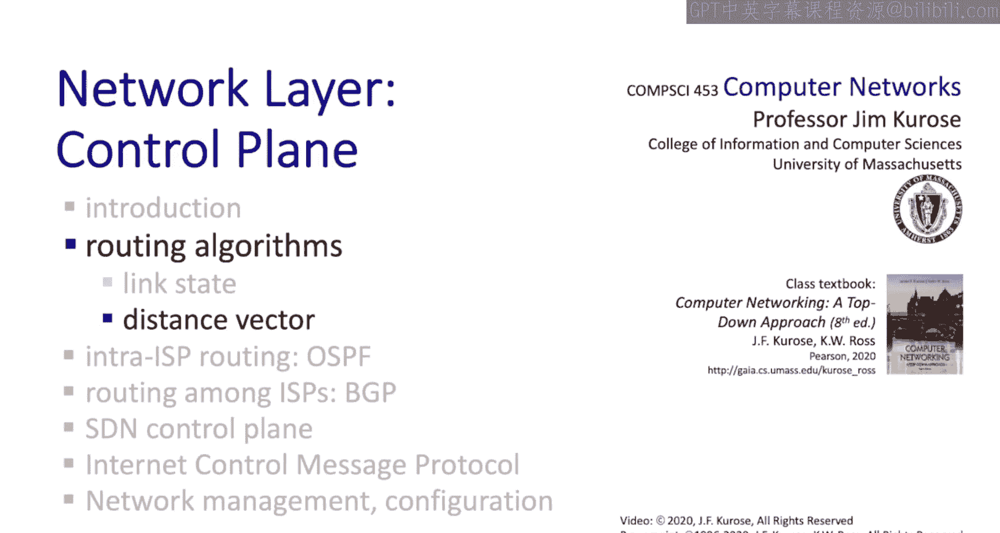

# 5.2：距离向量路由算法（贝尔曼-福特算法）🚀

在本节课中，我们将要学习第二大类路由算法——距离向量路由算法，其核心是**分布式贝尔曼-福特算法**。我们将了解其工作原理、计算过程、收敛特性，并与链路状态算法进行比较。

上一节我们介绍了迪杰斯特拉的链路状态路由算法，本节中我们来看看**分布式贝尔曼-福特距离向量路由算法**。这个算法展示了简单的、本地的、直观的分布式计算如何达成与集中式算法相同的结果——计算最小成本路径。

## 贝尔曼-福特方程：算法的核心🧮

距离向量算法计算最小成本路径的基础是**贝尔曼-福特方程**。这个方程虽然看起来有些复杂，但其背后的思想非常直观。

贝尔曼-福特方程表达了这样一个概念：如果我想找到从源节点 **X** 到目的节点 **Y** 的最小成本路径，那么这条路径的**第一跳**必定是 **X** 的某个邻居节点，假设为 **V**。因此，总成本就是从 **X** 到 **V** 的成本，加上从 **V** 到 **Y** 的成本。这就是通过邻居 **V** 到达 **Y** 的总成本。然后，在所有可能的邻居 **V** 中，选择总成本最小的那条路径。因为 **X** 的最小成本路径必然经过其某个邻居 **V**。

用公式表示如下：
`D_x(y) = min_v { c(x, v) + D_v(y) }`
其中：
*   `D_x(y)` 是节点 **X** 到节点 **Y** 的最小估计成本。
*   `c(x, v)` 是节点 **X** 到其直接邻居 **V** 的链路成本。
*   `D_v(y)` 是邻居 **V** 到目的节点 **Y** 的估计成本（来自 **V** 的距离向量）。
*   `min_v` 表示对所有邻居 **V** 取最小值。

理解贝尔曼-福特方程最好的方式是看一个例子。考虑一个网络，源节点是 **U**，目的节点是 **Z**。**U** 有三个邻居：**V**、**X** 和 **W**。邻居们知道以下信息：
*   邻居 **V** 到达 **Z** 的成本是 5。
*   邻居 **X** 到达 **Z** 的成本是 3。
*   邻居 **W** 到达 **Z** 的成本是 3。

邻居们将这些信息告知 **U**。根据贝尔曼-福特方程，**U** 到 **Z** 的最小成本是以下三个值中的最小值：
1.  `c(U, V) + D_V(Z)`
2.  `c(U, X) + D_X(Z)`
3.  `c(U, W) + D_W(Z)`

代入数字后，**U** 会发现通过邻居 **X** 到达 **Z** 的成本最低，为 4。

## 距离向量算法：关键思想与步骤⚙️

贝尔曼-福特方程描述了相邻节点距离向量之间的关系，但我们还需要计算这些距离向量本身。计算方式自然地遵循了这种关系。

以下是距离向量算法的关键思想：
*   **周期性信息交换**：每个节点会不时地向其所有直接相连的邻居发送自己的距离向量估计。
*   **基于接收信息更新**：当一个节点 **X** 从某个邻居那里收到一个新的距离向量估计时，它会使用贝尔曼-福特方程更新自己的距离向量。

分布式贝尔曼-福特算法包含三个步骤，网络中的所有节点都执行相同的这三个步骤：

以下是每个节点执行的三个核心步骤：
1.  **等待事件**：节点等待，直到发生以下事件之一：
    *   从某个直接相连的邻居那里接收到一个距离向量。
    *   检测到本地链路成本发生变化。
2.  **重新计算距离向量**：在接收到上述事件后，节点使用从邻居那里最新收到的距离向量，为网络中的所有目的地运行贝尔曼-福特计算。
3.  **通知变化**：如果由于贝尔曼-福特计算导致节点自身的距离向量发生改变，那么它将把自己的新距离向量发送给每一个邻居。

然后，节点回到步骤1，开始新的迭代。这个算法非常简单。与链路状态算法不同，节点不需要知道从源到目的地的完整路径，它只需要知道为了沿着最小成本路径到达给定目的地，应该将数据包转发给哪个邻居。

## 算法特性与信息扩散🌐

距离向量算法具有一些重要特性：
*   **迭代与异步**：每次迭代由本地链路成本变化或收到邻居的距离向量更新消息触发。节点可以异步迭代，以不同的速度运行，算法依然能够收敛。
*   **分布式与自停止**：只有当节点的距离向量发生变化时，它才会通知其邻居。邻居们仅在必要时才会通知它们的邻居。如果没有变化发生，则无需采取任何行动。

贝尔曼-福特算法可以看作是在网络中**扩散信息**。为了理解这种扩散概念，让我们看看网络中其他节点是如何逐步了解节点 **C** 的状态的：
*   在 `t=0` 时，**C** 没有与任何人通信，其他节点没有关于 **C** 的信息。
*   在 `t=1` 时，通过距离向量交换，**C** 在 `t=0` 时的状态传播到了其邻居 **B**，并影响了 **B** 在 `t=1` 时的计算。
*   在 `t=2` 时，关于 **C** 的信息传播得更远，到达了节点 **E** 和 **A**。此时 **E** 首次感受到 `t=0` 时 **C** 状态的影响。
*   这个过程继续下去，信息像星光一样传播：**E** 在 `t=2` 时看到的关于 **C** 的成本，反映的是 **C** 在 `t=0` 时的状态，即使 **E** 是在 `t=2` 时才收到这个信息。
*   最终，信息需要经过网络直径（本例中为4个时间步）才能从网络一端传播到另一端。

## 链路成本变化与“坏消息”问题⚠️

到目前为止，我们只看了初始距离向量的计算。经过若干次迭代后，计算过程会**静止**（收敛）。当没有节点的距离向量再发生变化时，算法就收敛了，不再有距离向量被交换。

我们的距离向量算法也能处理链路成本变化，步骤完全相同：本地节点检测到链路成本变化，使用新的本地链路成本和旧的邻居距离向量重新计算本地距离向量。如果本地距离向量发生变化，就将其发送给本地邻居。

**当链路成本下降时**（“好消息”），所有节点重新计算最终距离向量的速度相对较快。例如，**XY** 链路成本从4降到1，信息在约2次迭代（与网络直径相关）后就在全网传播完毕，算法快速收敛。正所谓“好消息传得快”。

**当链路成本上升时**（“坏消息”），则可能出现**计数到无穷大问题**。考虑一个例子：**X** 和 **Y** 之间的链路成本突然增加到60（远高于通过 **Z** 的路径成本5+1=6）。**Y** 发现直接链路变贵，于是决定通过 **Z** 路由到 **X**，并更新自己的距离向量为6，然后通知 **Z**。**Z** 收到更新后，发现通过 **Y** 到 **X** 的成本变成了6+1=7，于是更新自己的距离向量为7，并通知 **Y**。**Y** 收到后，发现通过 **Z** 到 **X** 的成本变成了7+1=8，于是又更新为8……如此循环，成本会缓慢地（本例中每次增加2）计数增加，直到最终超过直接链路的60，这个过程可能需要很多次迭代。如果成本增加到600万，则需要数百万次迭代。虽然有解决计数到无穷大问题的方法（如毒性逆转、水平分割），但这个例子说明了分布式算法的操作和可能出现的异常情况有时非常微妙。

## 链路状态 vs. 距离向量：对比总结📊

让我们通过比较链路状态和距离向量算法来结束对路由算法的讨论。

以下是两种算法在几个关键维度的对比：
*   **消息复杂度**：
    *   **链路状态**：需要泛洪链路状态信息，复杂度约为 `O(n * e)`，其中 `n` 是节点数，`e` 是边数。在最坏情况下（全连接网络）接近 `O(n^2)`。
    *   **距离向量**：每次迭代，节点可能需要与所有邻居通信。信息传播需要的时间与网络直径相关，约为 `O(d)`，其中 `d` 是直径，在最坏情况下 `d` 可接近 `n`。
*   **收敛速度**：
    *   **链路状态**：`O(n^2)` 的计算和通信复杂度。可能存在振荡。
    *   **距离向量**：收敛时间可变。在收敛过程中可能出现路由环路（如计数到无穷大问题）。
*   **健壮性（路由器故障或遭破坏）**：
    *   **链路状态**：路由器可能广播错误的链路成本。但由于每个路由器独立计算自己的路由表，故障的影响相对局部化。
    *   **距离向量**：路由器可能广播错误的路径成本（例如，声称到所有地方的成本都非常低，这被称为“黑洞路由”）。由于每个路由器的距离向量被其他路由器使用，错误会通过网络传播，因为其他路由器会基于错误信息更新并广播自己的新距离向量。互联网历史上曾发生过因小型ISP错误配置路由器，广播了到达大型ISP（如AT&T）的零成本路径，导致大量流量被吸引到该小型ISP并被丢弃（黑洞）的真实案例。

本节课中我们一起学习了**距离向量路由算法（贝尔曼-福特算法）**。我们理解了其核心的贝尔曼-福特方程，掌握了算法的三个迭代步骤，认识了其信息扩散的本质和异步收敛的特性，并通过例子分析了链路成本变化时算法的行为，特别是“计数到无穷大”问题。最后，我们将其与链路状态算法在消息复杂度、收敛速度和健壮性方面进行了对比。在接下来的章节中，我们将看到这些路由算法在互联网路由协议（OSPF和BGP）中的具体实现。