# 5.6：Traceroute、ICMP与SNMP - IP网络管理 📡

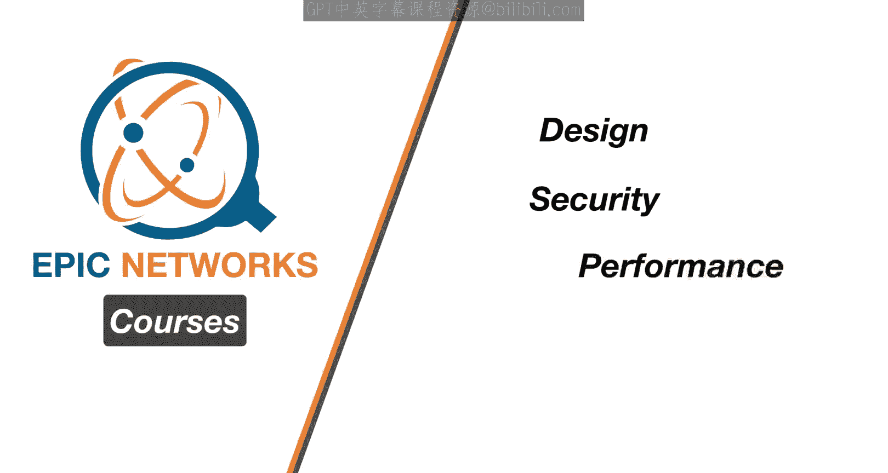

在本节课中，我们将学习IP网络管理的核心机制。我们将从**ICMP（互联网控制消息协议）** 开始，然后探讨其他管理工具，如**SNMP（简单网络管理协议）**。这些协议是网络诊断和运维的基础。

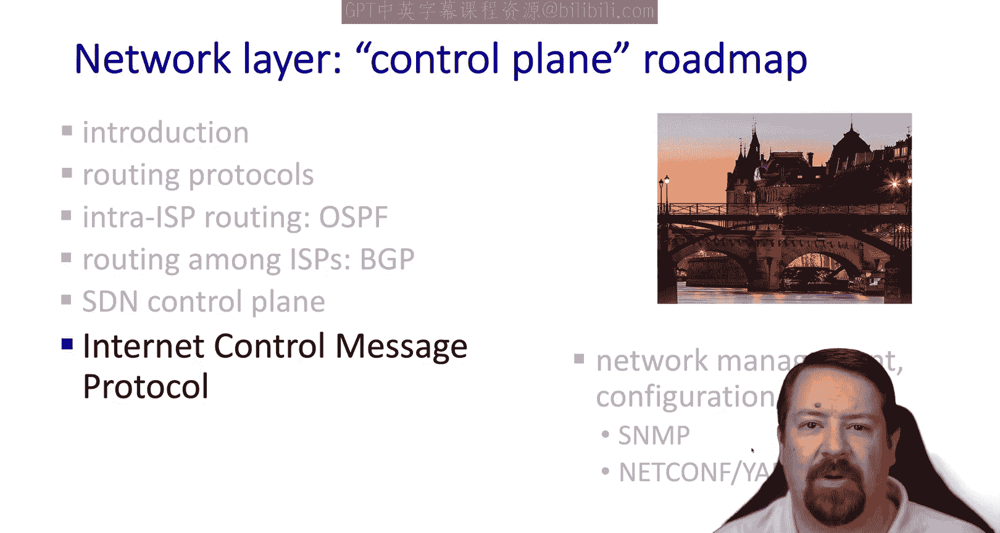

---

## ICMP：互联网控制消息协议

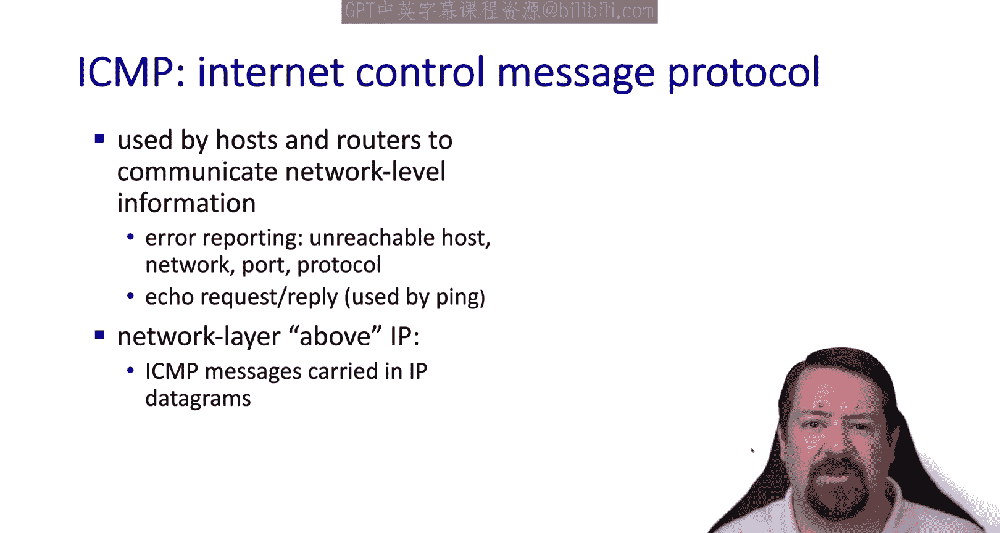

上一节我们介绍了网络管理的整体概念，本节中我们来看看最基础的网络层信令协议——ICMP。

ICMP被IP主机用来传递网络层相关的信息，最常用于**错误报告**。例如，报告“主机不可达”或“网络不可达”等网络层错误，或与更高层相关的消息，如“端口不可达”或“协议不可达”。

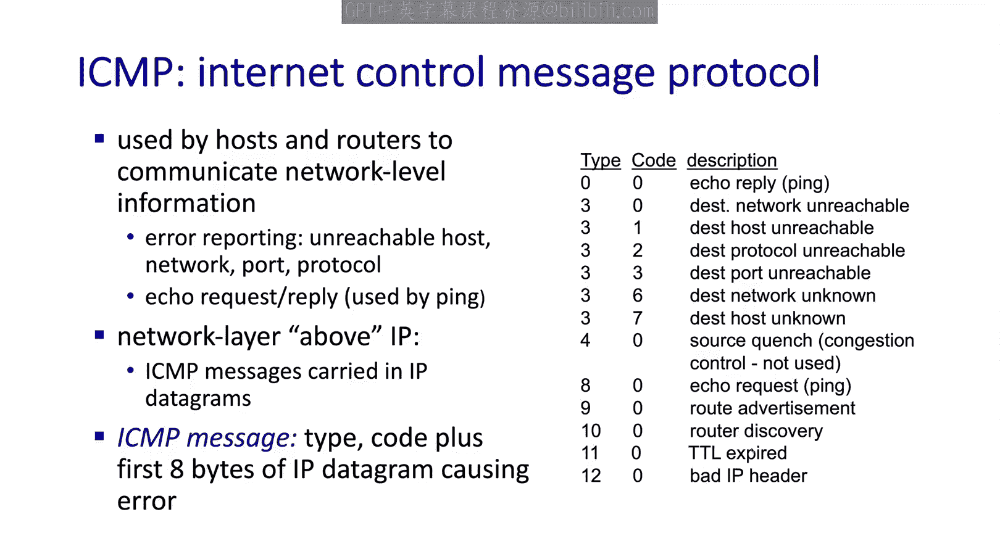

我们可能都熟悉 **Ping** 应用程序，它使用一种特定的ICMP消息，称为 **Echo Request（回显请求）**，该消息会触发 **Echo Reply（回显应答）** 消息。因此，ICMP除了错误报告外，还具有一些诊断功能。

需要注意的是，ICMP是一个**带内信令协议**，这意味着ICMP消息被封装在IP数据包内部进行传输。因此，如果错误导致IP层连接中断，那么由此产生的任何ICMP消息也将无法送达。

ICMP包含许多不同类型的消息，但它们都由一个**类型（Type）** 字段和一个**代码（Code）** 字段组成。由于它们通常由某个IP数据包触发，因此ICMP消息的有效载荷会“引用”触发该错误消息的数据包的前面部分。

以下是部分常见的ICMP消息类型：
*   **类型3消息**：指示触发它的数据包的目的地（网络、主机、端口或协议）不可达。
*   **类型8/0消息**：Ping应用使用的Echo Request和Echo Reply消息。
*   **类型11消息**：TTL超时消息，被Traceroute工具使用。

---

## Traceroute的工作原理 🔍

上一节我们了解了ICMP的基本功能，本节中我们深入探讨一个巧妙利用ICMP协议的工具——Traceroute。

Traceroute应用与ICMP的行为紧密耦合，但它并非按ICMP最初的设计意图来使用。Traceroute本质上是一个存在了数十年的“技巧”，它允许用户获取其数据所经路径的拓扑信息。

Traceroute在不同操作系统上的实现会发送不同类型的探测包，这些包可以是**TCP**、**UDP**或**ICMP**数据包。另一个变量是每个TTL值是发送一个还是多个探测包。无论如何，第一组数据包的TTL都会被设置为**1**。

这意味着它们将在第一跳就过期，导致路径上的第一个路由器生成 **ICMP TTL超时** 消息。

源主机发送目的地址为目标主机的数据包，但收到的却是包含ICMP错误消息的数据包，且这些数据包来自路径中间的路由器。这使源主机获得了之前未知的信息：路径中间存在一个具有特定IP地址的路由器接口。

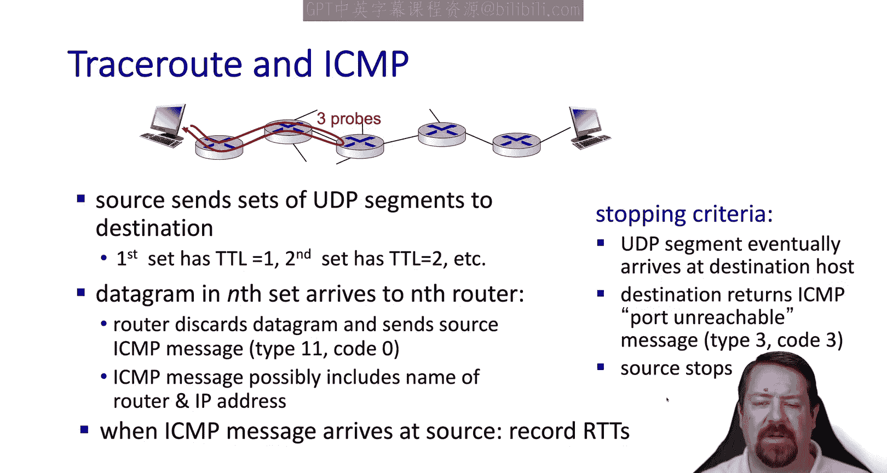

以下是Traceroute（以每跳发送3个UDP探测包为例）的工作步骤：
1.  源主机发送3个TTL=1的UDP数据包。第一个路由器将TTL减至0，丢弃数据包，并发回3个ICMP TTL超时消息。源主机记录该路由器的IP地址和往返时间。
2.  源主机发送3个TTL=2的UDP数据包。第一个路由器将TTL减为1并转发，第二个路由器将TTL减至0，丢弃数据包并发回ICMP TTL超时消息。源主机记录第二个路由器的信息。
3.  源主机持续发送TTL递增的数据包，逐步发现路径上的每一个路由器。
4.  最终，UDP探测包会到达目的地。这些UDP数据包的目的端口被故意设置为一个预期不会被使用的端口号，因此该端口是关闭的。这将导致目的主机生成 **ICMP端口不可达** 消息。
5.  源主机上的Traceroute应用收到此消息，便知道已到达目标地址，并停止探测。

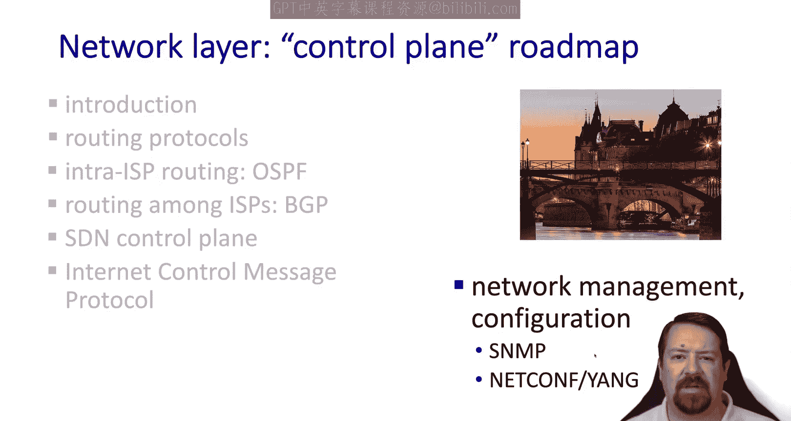

这个工具对网络运维人员甚至终端用户都非常有用，可用于诊断或了解特定网络路径的性能特征。它不仅能揭示路径上的跳数及各路由器的IP地址，还能显示源主机到每个路由器的往返时间，从而帮助用户推断距离或观察路径上是否存在拥塞。

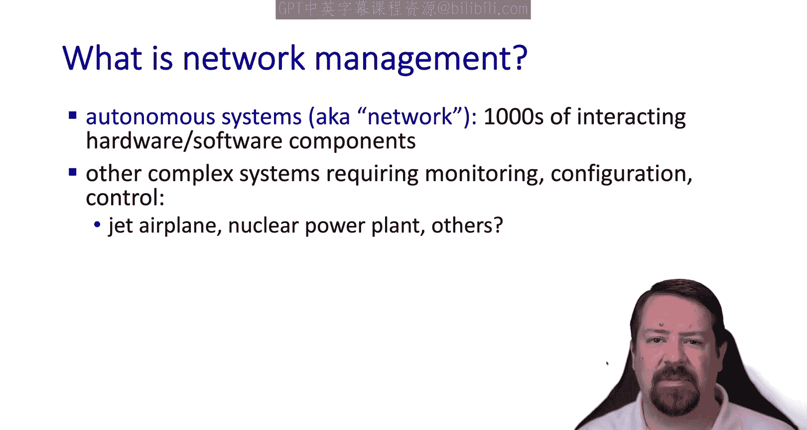

---

## 网络管理概述

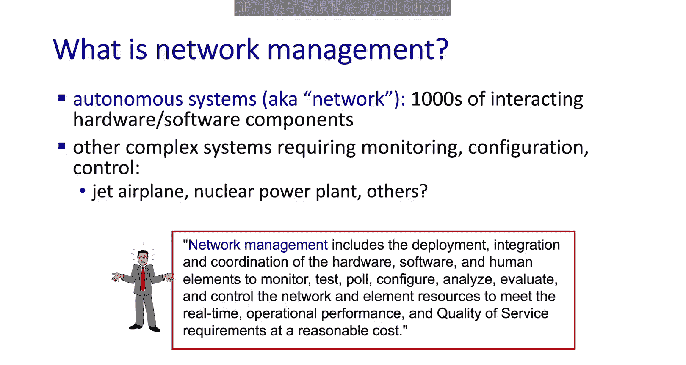

在简要概述了主要用于错误报告的ICMP之后，我们现在来看看一些专门用于网络管理和配置的协议。

首先，我们明确一下“网络管理”的含义。网络通常是由**自治系统（AS）** 或域管理的复杂系统，其内部可能包含数十万甚至上百万个网络基础设施组件。

网络管理的定义是：对硬件、软件和人力要素进行部署、集成和协调，以监控、测试轮询、配置、分析、评估和控制网络及元素资源，从而以合理的成本满足实时运行、性能和服务质量要求。

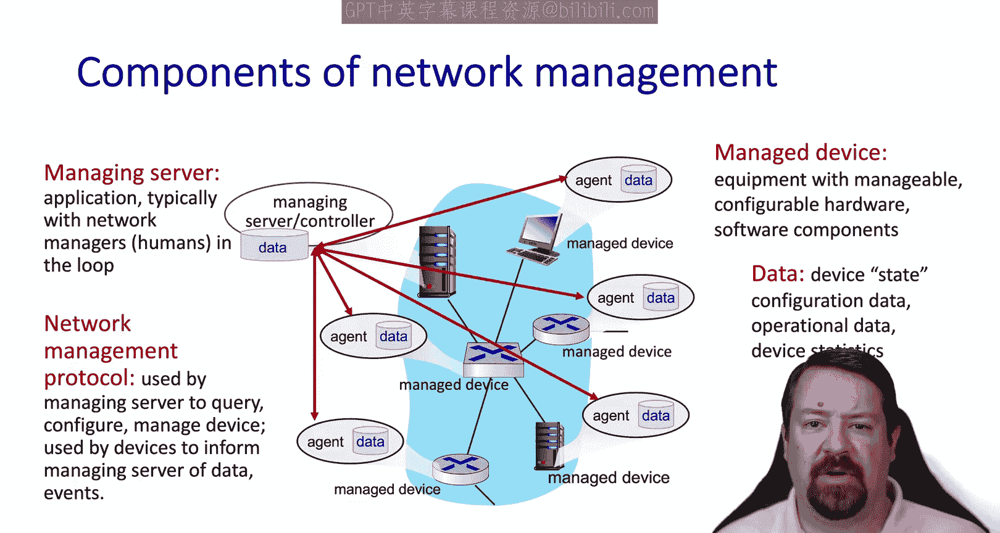

正确执行网络管理非常具有挑战性。让我们先看看网络管理的一些组成部分。

一个典型的网络管理体系结构包括：
*   **管理服务器**：维护所需状态，并提供供网络管理员交互的界面。
*   **被管设备**：包括二层交换机、三层路由器、主机、中间盒等。每个设备都维护其配置、使用统计数据和特定于该设备的操作数据。
*   **管理协议**：运行在管理服务器和每个设备之间，定义查询、配置消息和报告消息如何在设备与控制器之间交换。

这可以像管理员使用命令行界面登录设备进行配置和读取状态统计信息一样简单（通常是设备初始配置的方式）。但也有更专业的协议，如**简单网络管理协议（SNMP）**，它使用标准化格式发送控制消息和读取状态，便于一次性管理大量设备。

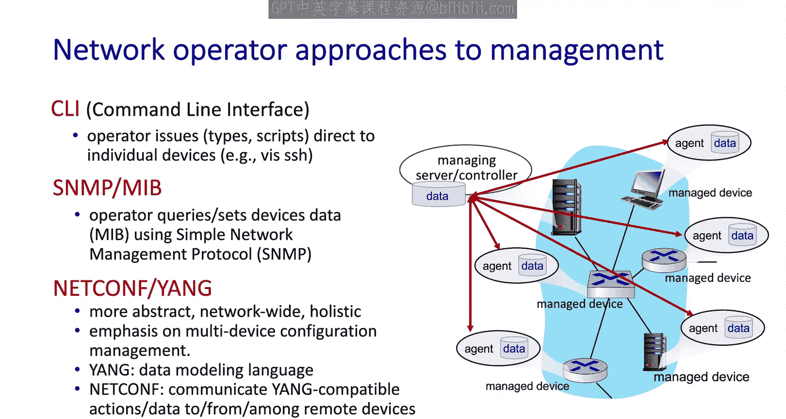

---

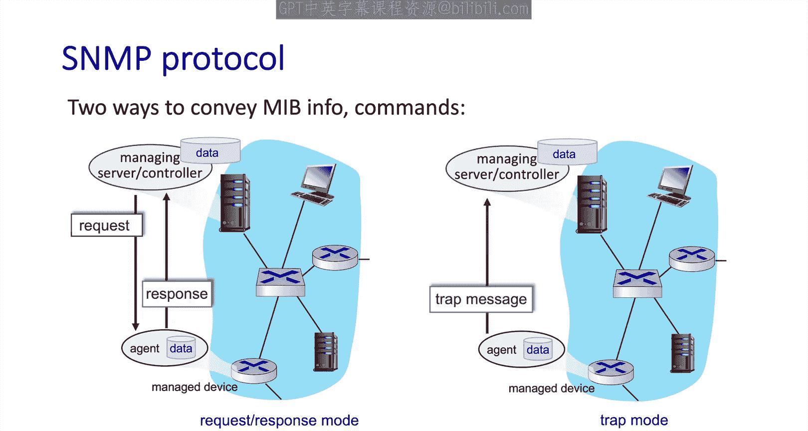

## SNMP：简单网络管理协议

上一节我们介绍了网络管理的架构，本节中我们聚焦于一个经典的管理协议——SNMP。

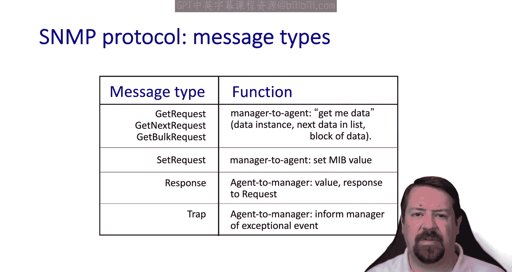

SNMP已经发展了多年，是一个相对简单且已使用了约三十年的协议。使用SNMP交换的信息存储在 **MIB（管理信息库）** 中，这是一种基于键的简单数据结构。

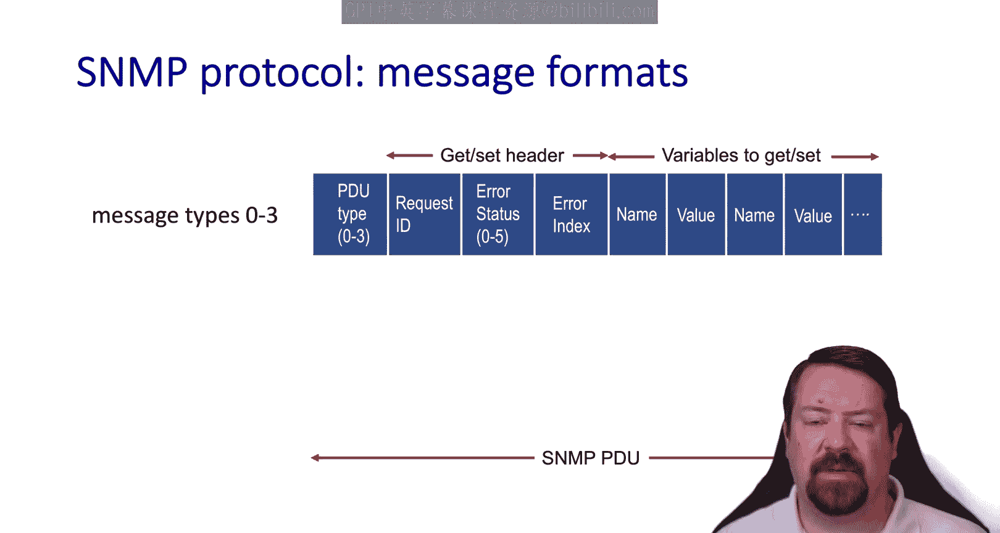

SNMP交换MIB中数据的方式有两种：
1.  **查询-响应**：服务器主动查询设备，这是一种直接的请求-响应行为。传统上通过UDP执行，如今SNMP也支持TCP。
2.  **陷阱（Trap）消息**：由设备主动发起，由某些外部事件（如定时器或设备上的特定条件）触发，向控制器发送未经请求的消息。

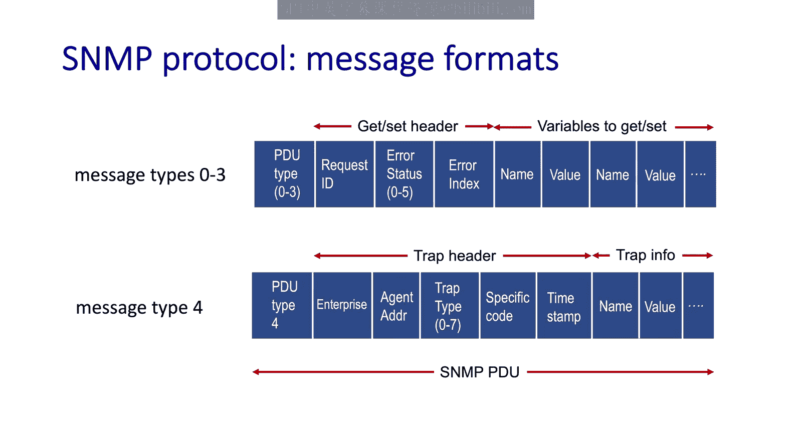

SNMP的主要消息类型包括：
*   **GetRequest, GetNextRequest, GetBulkRequest**：控制器从代理处获取数据。由于MIB可能很大，可能需要多次请求。
*   **SetRequest**：控制器更改代理的配置。
*   **Response**：代理对Get或Set消息的回复。
*   **Trap / InformRequest**：由代理主动发起的消息（InformRequest需要确认）。

SNMP消息格式通常包括：消息类型、请求ID（用于匹配请求和响应）、错误状态，以及一系列键值对（对象标识符OID和值）。Trap消息的头部略有不同，包含陷阱类型和时间戳。

代理在MIB中存储其收集的数据。这些信息有些是通过RFC标准化的，但许多厂商也扩展了自己的专有信息类型。数据定义语言称为 **SMI（管理信息结构）**。

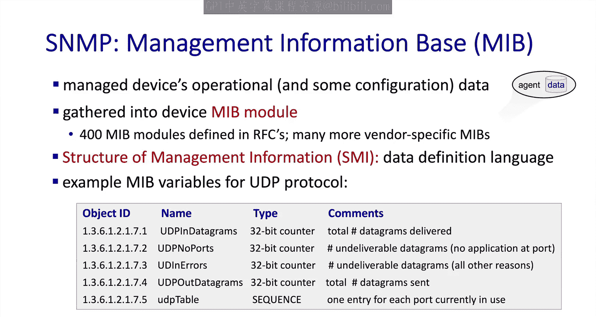

例如，针对UDP协议的MIB可能包含：
*   **计数器**：记录接收到的UDP数据报数量、生成的“端口不可达”消息数量、因其他原因（如校验和失败）未能交付的UDP数据报数量，以及发送的UDP数据报总数。
*   **序列**：列出当前正在使用的所有UDP端口号列表。

---

## Netconf与YANG：现代网络管理

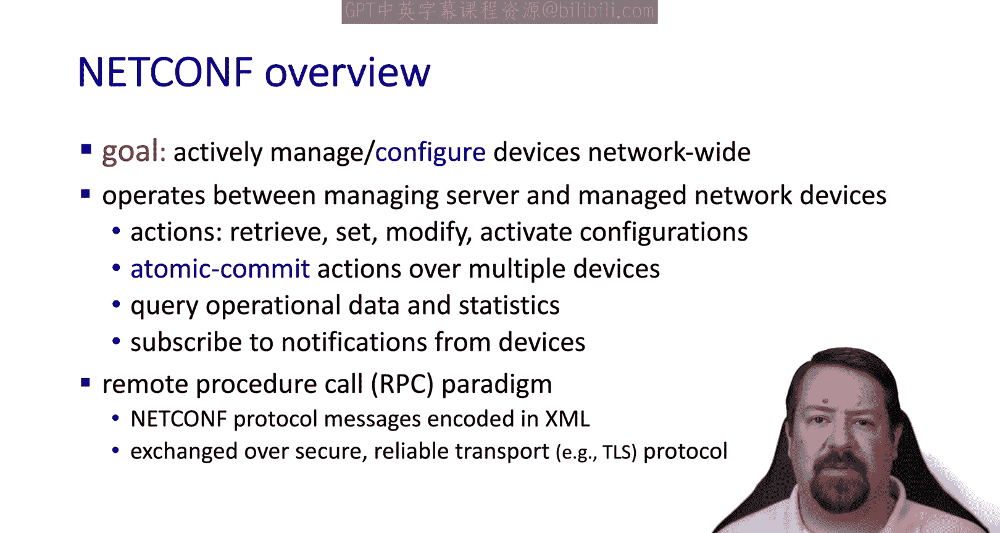

上一节我们探讨了传统的SNMP，本节中我们看看更现代的网络管理方法——Netconf协议及其数据建模语言YANG。

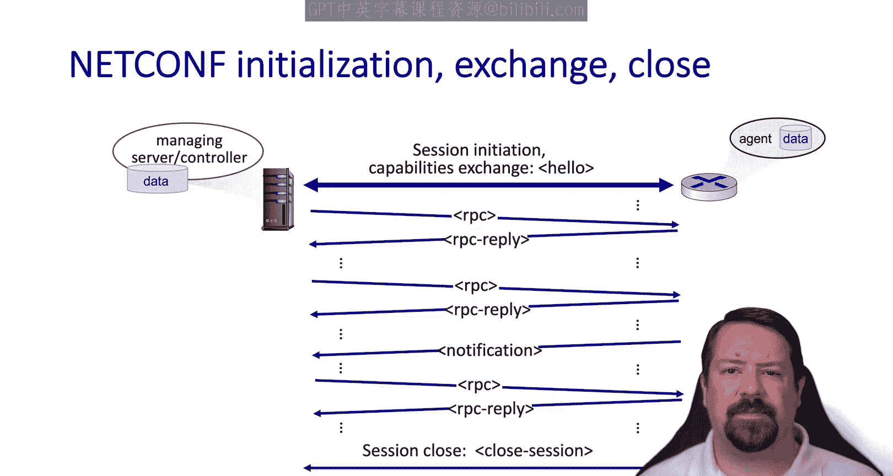

**Netconf** 的目标是采取更主动的管理方式。SNMP主要处理静态信息快照的报告，而Netconf定义了许多与配置设备相关的操作（例如，设置新配置并激活它），并且允许跨多个设备同时执行操作。相比之下，SNMP协议一次只与一个设备交互，跨设备聚合功能需要依靠运行在SNMP之上的应用程序来完成。

Netconf也具备从设备查询操作统计数据和信息的能力，在这方面可以取代SNMP协议。Netconf遵循 **RPC（远程过程调用）** 范式，其协议消息使用 **XML** 编码，并通过TCP进行加密传输。

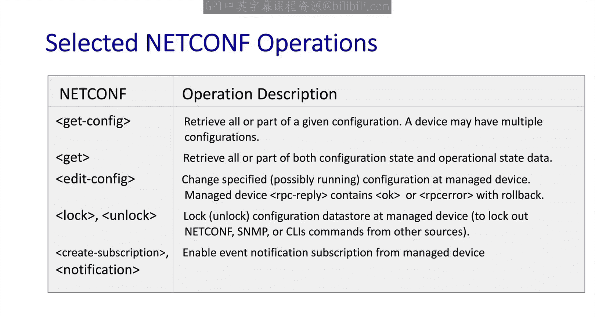

一个Netconf会话交换示例如下：
1.  控制器和代理首先交换 `hello` 消息。
2.  进入一系列的远程过程调用和回复。
3.  代理可以发送 `notification`（类似于SNMP的Trap消息）。
4.  会话结束时，交换 `close-session` 消息。

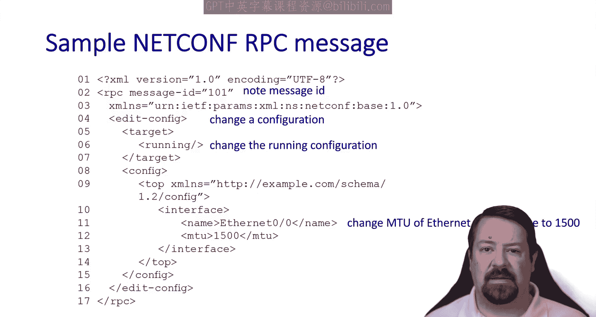

Netconf可以执行的操作示例包括：
*   `get-config`：从设备检索配置。
*   `get`：获取特定值的状态。
*   `edit-config`：修改运行中的配置。
*   `lock` / `unlock`：锁定或解锁部分数据存储。
*   `create-subscription`：创建对事件通知的新订阅。

这些消息的结构由 **YANG** 指定，YANG是一种数据建模语言。例如，设备的YANG描述可以生成一个指定该设备功能的XML文档。这些信息存储在设备和控制器的数据库中，并在消息中交换。形式化这种描述允许表达约束或依赖关系，确保配置必须满足这些约束。

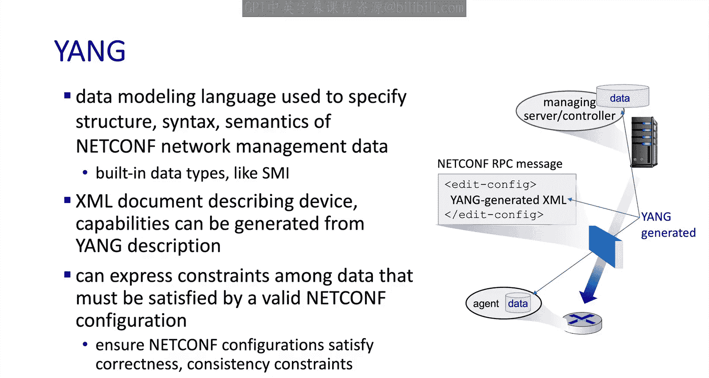

---

## 总结与展望

本节课中，我们一起学习了网络层的控制平面收尾部分：**ICMP** 和网络管理协议（**SNMP** 与 **Netconf/YANG**）。

ICMP是网络层重要的信令协议，用于错误报告和诊断（如Ping和Traceroute）。SNMP作为经典的网络管理协议，通过查询和陷阱机制管理设备状态。而Netconf和YANG提供了更现代、基于配置和模型的集中式管理框架。

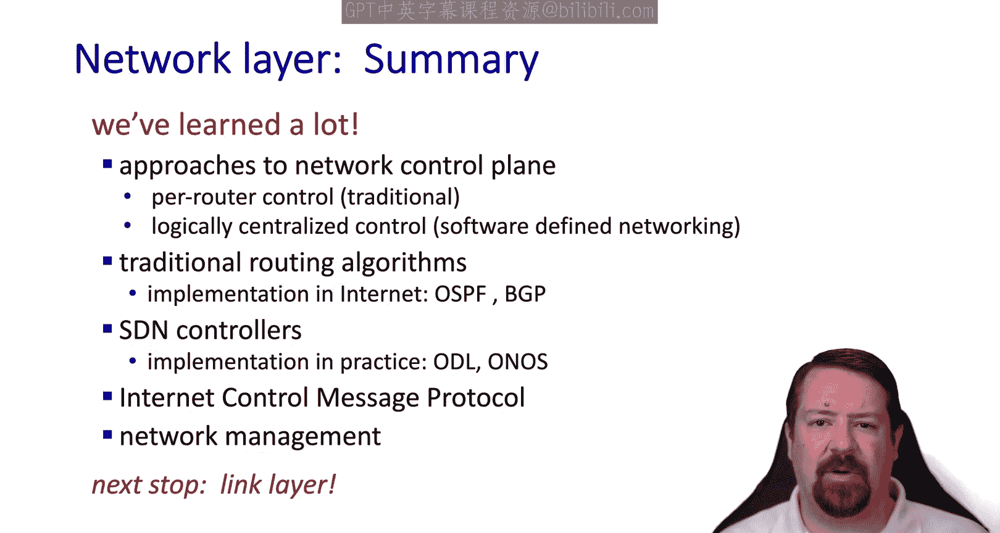

至此，我们完成了对网络栈中一个重要层边界的探讨。到目前为止，我们关注的协议（应用层、传输层、网络层）都是跨越网络端到端的。然而，当我们进入**数据链路层（第2层）** 时，我们将关注更局部化的网络视图，以及针对特定场景（如有线以太网、无线蜂窝链路）的技术，而IP网络层则在这些异构技术之上提供了一个统一的协议。

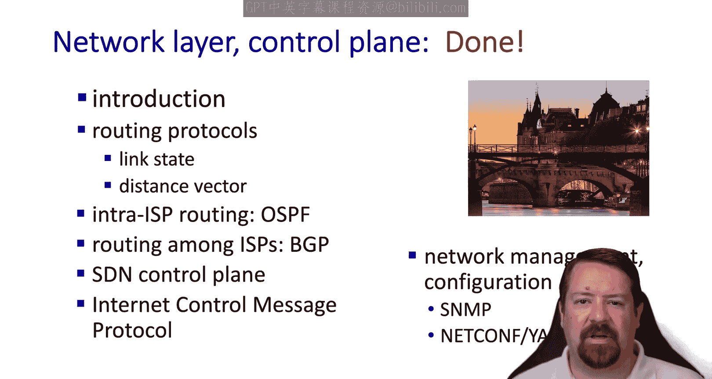

在下一讲中，我们将开始学习一些第2层技术及其适用场景。