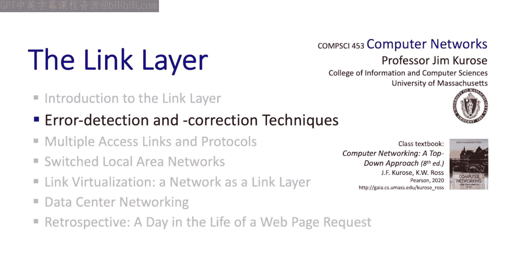
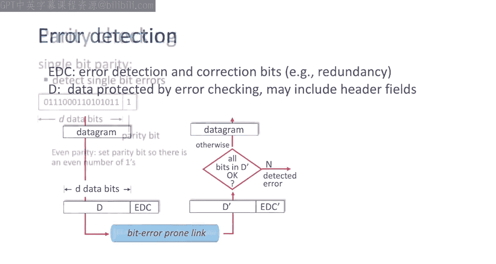
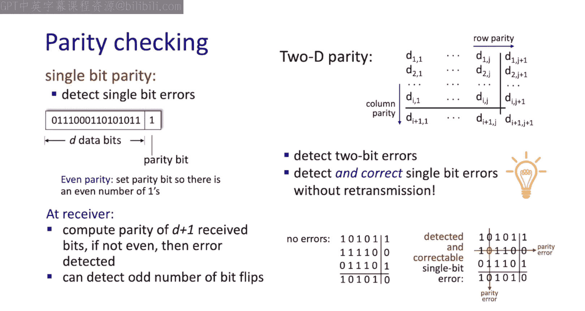
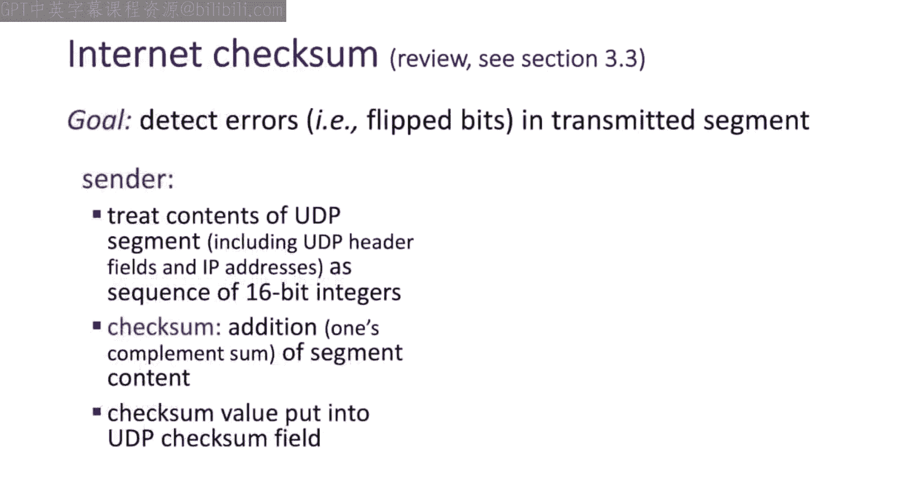
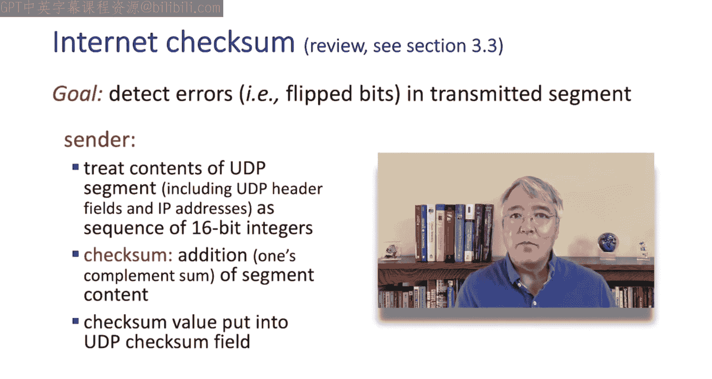
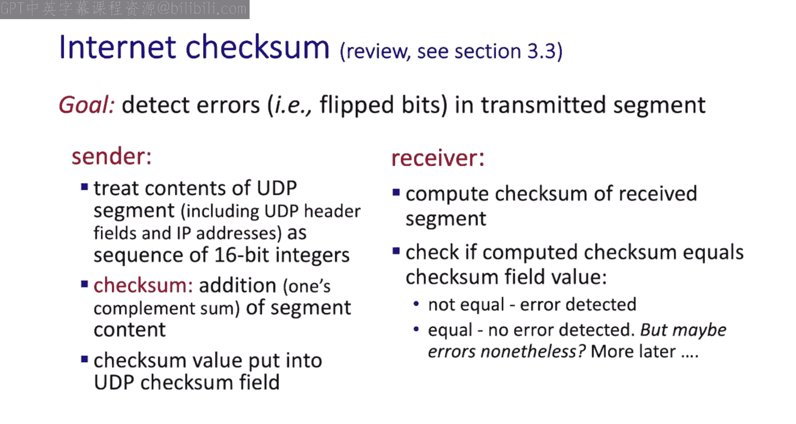
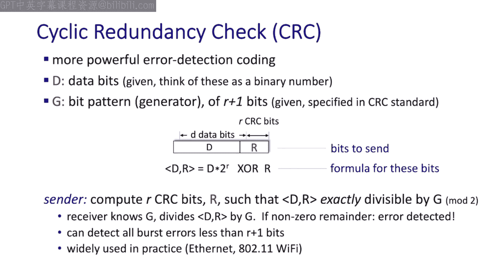
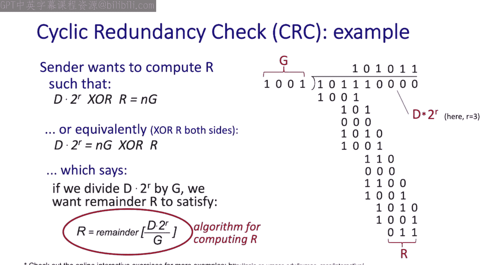
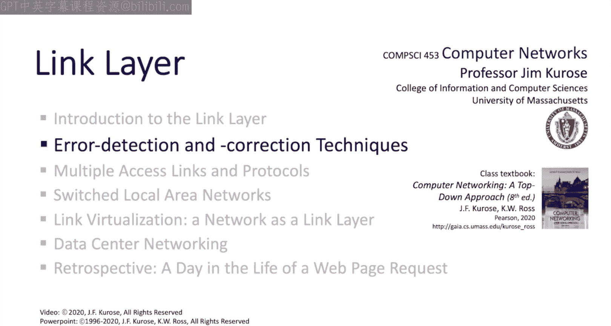

# 6.2：链路层差错检测与纠错 🔍

在本节中，我们将重新探讨一个在第三章学习UDP协议时接触过的主题：差错检测。当时我们遇到了互联网校验和，它被UDP用于检测数据报中的比特级错误。现在，我们处于链路层，同样关注帧的传输。我们将从两个方面扩展之前的讨论。

首先，我们将通过例子引入一个概念：比特级错误不仅能在接收端被检测到，还能在不重传的情况下被纠正。这是一个非常棒的想法。其次，我们将了解一种在实践中使用的、比互联网校验和强大得多的差错检测技术——循环冗余校验。内容不多，本节将简短而精炼。

## 差错检测场景回顾 📡

以下是我们在链路层背景下研究的差错检测场景。网络层将数据报向下传递给链路层进行传输。发送方的链路层会接收数据报，添加一些首部字段，创建一个包含D比特的帧，然后计算并附加差错检测和纠错比特（此处标记为EC）。该帧随后通过可能引入比特错误的链路进行传输。

接收方执行检查，以确定接收到的帧比特是否已损坏。我们稍后将看到这是如何完成的。如果帧通过检查，接收方将提取数据报并向上传递给网络层。否则，帧将被丢弃，或者可能像我们在第三章学习的那样，启动重传过程。

我们现在要关注的是如何执行这项检查。要理解这一点，我们需要了解在发送方，这些EC比特是如何计算的。

## 奇偶校验：从一维到二维 📊

我们能想到的最简单的差错检测和纠错案例是简单奇偶校验。其中，单个奇偶校验比特被设置为0或1，使得原始D比特加上这个额外奇偶校验比特的总比特数在偶校验的情况下为偶数。

在这个例子中，前D比特中有奇数个值为1的比特，因此奇偶校验比特被设置为1，使得在D+1比特中，值为1的比特总数为偶数。

在接收端，检查很简单：接收方只需判断接收到的数据（包括奇偶校验比特）中值为1的比特数是否为偶数。如果值为1的比特数是奇数，接收方知道至少存在一个比特错误。如果值为1的比特数是偶数，接收方知道要么没有错误，要么可能存在偶数个错误。这就是简单的一维奇偶校验。

我们可以将其推广到二维奇偶校验：将比特排列在如这里所示的网格上，为每一行和每一列计算一个奇偶校验比特，然后让接收方同时检查行和列的奇偶性。

我们在这里使用了额外的比特，因此你希望这种额外的开销能带来更好的保护。当然，确实如此。你现在应该能确信，二维奇偶校验总能检测出两个比特错误。但二维奇偶校验还为我们带来了更多东西，一些真正特别的东西：在发生单个比特错误的情况下，它不仅允许接收方检测到发生了比特错误，还能检测出该比特错误发生的位置，并在无需重传的情况下纠正它。这有多酷？让我们看一个二维奇偶校验的例子。

这里再次展示了我们的D比特排列成网格的情况。对于第一行，我们计算行奇偶校验比特为1；对于第二行，奇偶校验比特为0；对于第三行，奇偶校验比特为1。我们也可以计算列奇偶校验比特。

现在，假设在传输中有一个比特发生了翻转，如本例所示。在这种情况下，接收方会说：“嘿，第2行存在奇偶校验错误，第2列也存在奇偶校验错误。”因此它知道第2行第2列的比特被翻转了。错误可以在无需重传的情况下被检测和纠正。

这只是所谓的前向纠错技术的一个简单例子。它们被用于DVD、光盘、数字用户线路接入网络以及深空通信中，在这些场景下接收延迟非常长。你更愿意在接收时纠正错误，而不是请求并等待重传。这是一个完整的研究领域——纠错码。如果你热爱数学，并且喜欢具有非常实用和酷炫应用的数学，这是一个值得关注的好领域。

## 互联网校验和回顾 🔢

我们已经在第3.3节介绍过互联网校验和。在某些方面，校验和与奇偶校验非常相似，只不过互联网校验和不是累加比特，而是累加字节。但从概念上讲，行为是相同的：在发送方，我们简单地累加字节，计算校验和，并将校验和与待校验的数据一起发送。

接收方的操作在概念上也与我们上面看到的类似。我们已经说过并看到，互联网校验和并不是特别强大。因此，据我所知，它没有在任何链路层协议中使用。相反，在以太网和Wi-Fi中使用了一种强大得多的技术，称为循环冗余校验。

## 循环冗余校验详解 ⚙️

让我们来看看循环冗余校验。这里再次展示了我们想要保护的D个数据比特。CRC有一个所谓的生成器G，它是一个精心选择的、长度为R+1比特的比特模式，已经过标准化，并由所有发送方和接收方商定使用，因为双方都需要使用相同的G值。例如，CRC-32 IEEE标准有一个32比特的生成器。

这里我们看到我们想要发送的D个数据比特以及R个CRC比特。如果我们考虑这D+R个比特（给定的比特D和CRC比特R），我们首先通过将数据比特左移R位，然后通过异或操作加入R个CRC比特，来计算我们想要发送的D+R比特。

以下是发送方的操作：它将计算R个CRC比特，使得这里的这个量（即待发送的比特序列）能够被商定的生成器G**精确整除**。

由于接收方知道G，它将接收到的比特除以G。如果余数非零，那么它就能检测到错误。CRC比我们之前研究的差错检测技术更强大，因为它们能够检测所有长度小于R+1比特的突发错误（即连续的比特错误串）。这非常强大。

正是由于这些强大的特性，例如CRC-32被用于以太网和Wi-Fi帧中，在链路层进行差错检测。

## 如何计算CRC比特？ 🧮

但我们还有一个重要问题需要回答：发送方如何计算R？我们知道发送方希望计算R，使得发送的比特模式能被G精确整除。

让我们在这个等式的两边都异或R，得到这个式子。这实际上只是用一种数学方式说明：如果我们用G除这个量（D乘以2的R次方），R就是余数。这为我们提供了一个计算R的算法。

让我们看一个例子。这只是一个玩具示例，使用一个小的4比特生成器G。这是D，这是D左移3位后的结果。现在，如果我们想遵循这里的算法，我们用G除这个量。这里是一个执行该除法运算的动画演示，我们得到的结果——余数——就是将要发送的R值。

这就是全部内容，尽管在实践中，标准的生成器长度远不止4比特。

## 总结 📝

本节对链路层的差错检测和纠错进行了快速研究。我希望你发现前向纠错的概念和我第一次学习时一样巧妙。我也希望你喜欢学习循环冗余校验。它有点枯燥，但确实是非常值得了解的知识，因为正如我们所看到的，CRC码在实践中被广泛使用。