# 6.6：以太网交换机与VLAN 🧠

在本节课中，我们将学习网络链路层中的两个核心设备：以太网交换机和虚拟局域网。我们将了解交换机如何通过自学习机制转发数据帧，以及VLAN如何通过逻辑划分来提升网络管理的灵活性与效率。

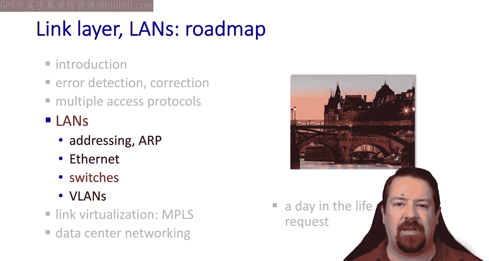

---

## 交换机基础 🔌

上一节我们介绍了共享介质以太网。本节中我们来看看一种更高效的设备：以太网交换机。

交换机是一种工作在链路层（第二层）的设备，它根据以太网帧的目的地址，主动执行存储和转发操作。在网络核心，你可能会遇到其他二层协议的交换机，但由于以太网最为常见，我们将专注于以太网交换机。

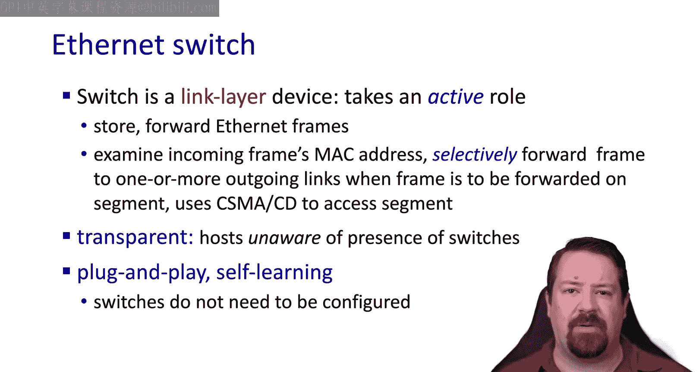

其基本操作是：交换机查看帧的目的地址，并决定应将帧转发到哪个端口。在访问链路时，它将使用以太网协议中的CSMA/CD算法。交换机的操作对主机是透明的，主机感觉不到交换机的存在，就像它们之间是直接连接的一样。由于其自学习行为，交换机的基本功能无需配置，可以即插即用。

以下是交换机网络的一个示例：

## 交换机的工作原理 ⚙️

现在，让我们深入了解交换机内部是如何工作的。

这里有一个包含交换机的以太网局域网。交换机有六个端口，每个主机独占一个端口。与我们之前讨论的共享介质架构不同，这里的每条链路都是一个独立的冲突域。由于每条链路上只有两个接口，它们可以运行全双工模式。交换机的每个端口都独立地运行以太网协议。

交换机还执行缓冲功能。就像我们在路由交换平面中看到的那样，如果出站端口存在争用，数据包可以被暂时缓冲，待端口可用时再传输。同样，也可能出现缓冲区溢出并丢包的拥塞情况。

综合来看，这意味着我们可以有多个数据流同时通过交换机。例如，A向A‘传输的同时，B可以向B’传输，这些流之间没有争用，可以同时进行，并各自利用其全部链路带宽。当然，如果两个不同的主机向同一个主机（例如A和C都向A‘）发送数据，它们将不得不共享交换机与A‘之间链路的带宽，交换机会暂时缓冲数据包并交错传输。但如果总速率超过A‘链路的带宽，缓冲区将开始丢包。

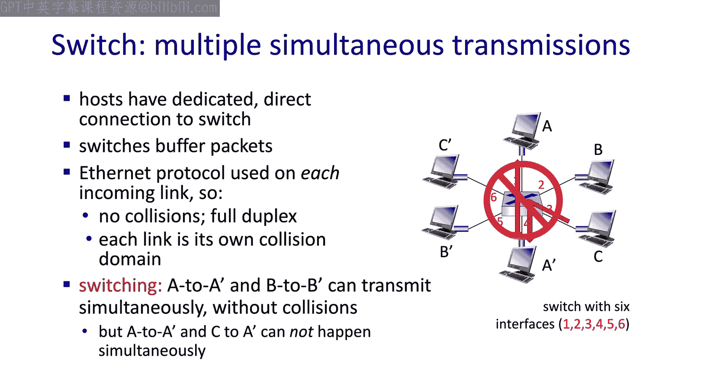

## 交换机的自学习过程 🧠

我们已经说过，交换机执行其基本功能无需任何配置。那么，它是如何知道将发往A‘的帧从正确的接口转发出去的呢？

交换机使用帧中的目的MAC地址。它必须以某种方式学习到，目的地址为A‘ MAC地址的帧需要从端口4转发出去。这正是存储在交换机转发表中的信息：**MAC地址、关联端口和超时时间**。

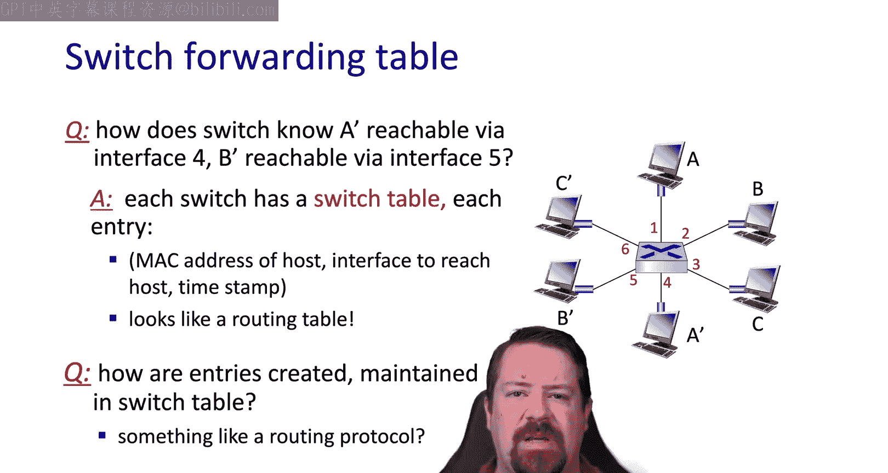

回想三层路由器，我们必须手动或使用动态路由协议来配置路由表。那么，二层交换机是如何在没有配置步骤的情况下执行相同的转发功能的呢？

在交换机的情况下，它没有路由协议，也无需与其他交换机通信。相反，它能够学习到哪些主机可以通过哪个接口到达。过程如下：

假设主机A向A‘发送一个帧，此时交换机刚刚启动，其转发表为空。然而，每当交换机收到一个帧时，它都可以读取源地址，并刚刚学习到可以通过哪个接口到达该源地址。因此，从这个传入的帧中，它刚刚学习到A在接口1上。虽然这个信息对于下次需要向A发送帧时很有用，但它无助于交换机将帧送达A‘。

让我们看看当帧到达交换机时还会发生什么。

## 帧处理与转发决策 🔄

正如我们所见，交换机记录源MAC地址和帧到达的端口，以填充其转发表。MAC地址被用作该表的键或索引。正如我们之前提到的，MAC地址与其在网络中的位置之间没有结构关系，因此搜索此交换表需要精确匹配。

如果它在转发表中找到了帧中目的MAC地址的条目，那么它必须检查并确认是否在同一个接口上收到了此帧。这意味着它不会将帧从刚刚进入的同一端口发送回去。只要表中的端口与帧进入的端口不同，它就会根据交换表转发以太网帧。

但是，如果目的MAC地址尚未在转发表中呢？在这种情况下，交换机会将其从所有接口发送出去（泛洪）。在这里，你可以看到其行为与三层转发过程截然不同。在三层，默认行为是丢弃没有匹配转发记录的包，原因是可扩展性。交换机用于每个子网内主机数量相对较少的本地子网，因此它们可以偶尔承受将数据包泛洪到整个网络，以促进学习MAC地址的过程。而路由器则不能默认采用这种行为，因为如果这样做，它们最终会将发往未知目的地的数据包转发到整个互联网。

## 自学习示例 📝

让我们完成我们的示例。A向A‘发送一个帧，目前交换机的转发表中没有任何条目。

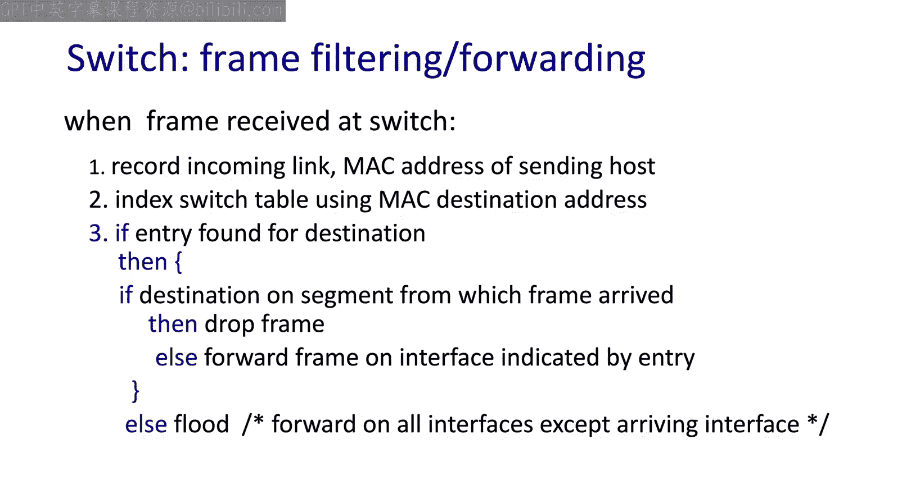

当帧到达交换机时，它从帧的源地址字段学习，并在转发表中填充A的MAC地址和端口号。由于A‘不在转发表中，它必须回退到默认行为，将帧泛洪到所有其他接口。

由于帧从所有端口发出，A‘收到了它并可以回复。A‘通过交换机向A发送一个帧，而交换机已经知道A在哪个接口上，因此它可以有选择地从该端口发送出去。同时，它也刚刚学习到A‘在哪个接口上，因此可以相应地填充其交换表。

现在，未来任何从A发往A‘的帧都只需要从通往A‘的端口发送出去，不再需要泛洪。

这就是交换机无需配置目的地就能填充其转发表的基本原理。即使多个交换机连接在一起，相同的行为也有效。现在我们有一台交换机连接了三台主机，并连接到多台其他交换机。这是常见的企业场景，例如，一个交换机连接走廊上的所有办公室，而所有走廊交换机都连接回一个楼宇交换机。如果我们需要将帧从A发送到G，其工作方式完全相同。A将向S1发送帧，如果S1不知道G的MAC地址在哪个接口上，它会将该帧泛洪给所有主机。现在，被泛洪的帧将到达S4，S4将执行相同的行为。因此，如果所有主机的表中都没有G的MAC地址，A的帧将到达整个网络上的每一台主机。

我们当然不希望泛洪过程发生得太频繁，因为它确实会消耗网络上每条链路的资源。然而，一旦G收到A的帧并回复，路径上的每台交换机都将学习到使用哪个接口可以到达G，针对G的MAC地址的泛洪就会停止。

## 交换机与路由器的对比 🌉

现在让我们将其与更大的图景联系起来。我们有一些交换机连接在一起，它们可以使用自学习到达该二层网络上的所有其他主机。由于所有这些交换机都挂在路由器的一个端口上，它们必须属于同一个IP子网。因此，自学习过程在到达路由器时停止。

与交换机不同，路由器只接受目的地址字段为路由器MAC地址的以太网帧。路由器不会转发目的地址为其他地址的以太网帧。因此，这种泛洪自学习发现过程的范围被限制在单个IP子网内。

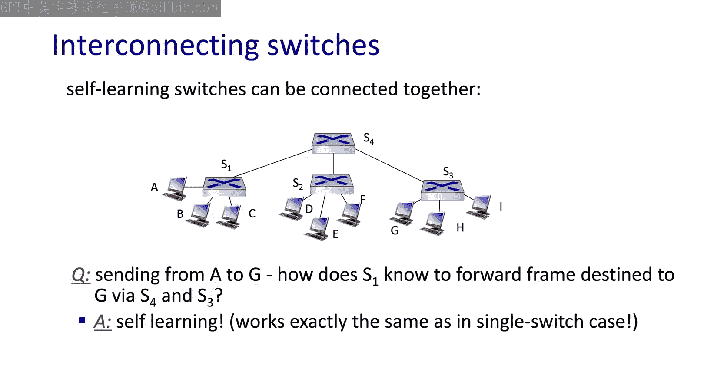

作为提醒，让我们看看这些设备上的网络协议栈。我们的终端主机运行整个网络协议栈。然后我们有作为三层设备的路由器。当数据包到达路由器时，第一个二层报头被剥离，路由器只转发IP数据报，然后在输出端口创建一个全新的二层帧。然而，当该帧到达交换机时，交换机不会移除二层报头，它只是基于现有的二层目的地址做出转发决策。

因此，这两种设备都执行转发，我们甚至讨论过路由器内部的交换结构。所以真正的区别在于转发决策的标准。路由器使用路由算法基于IP地址计算转发表。而交换机学习二层MAC地址，并基于这些地址填充其交换表。

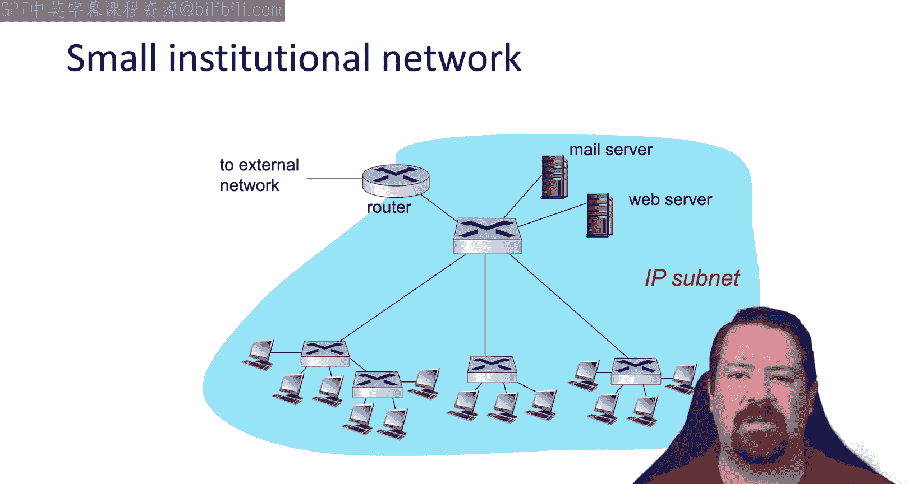

## 引入虚拟局域网 🏷️

现在我们将看看VLAN，这是一种增强功能，它修改了交换机的工作方式以增加灵活性。

我们提到了交换机MAC地址学习过程中的泛洪方面，这显然是一个可扩展性问题。任何时候你将一个数据包泛洪到整个网络，都是对资源的指数级消耗。我们也看到其他一些使用广播流量的协议。因此，任何使用目的广播地址的数据包也会被泛洪到整个交换以太网子网。

解决这个问题的一个方法是将子网拆分成多个更小的子网。这通过减少会听到每个泛洪帧的主机数量来提高效率。然而，如果每次用户移动并需要连接回特定交换机（因为它被路由器分隔开）时都必须更改物理布线，这可能会降低灵活性。在这个例子中，我们有一个计算机科学用户，其办公室物理位置在电子工程部门，但希望连接到计算机科学交换机。

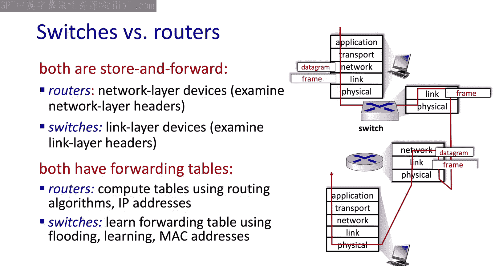

在这种环境中，维护一个像我们在这张图片中看到的扁平交换局域网更容易，而不必担心用户在该网络拓扑中的物理位置。因此，我们有两个相互竞争的目标。我们为了效率而希望分割广播域，但为了方便而希望有一个大型扁平网络。

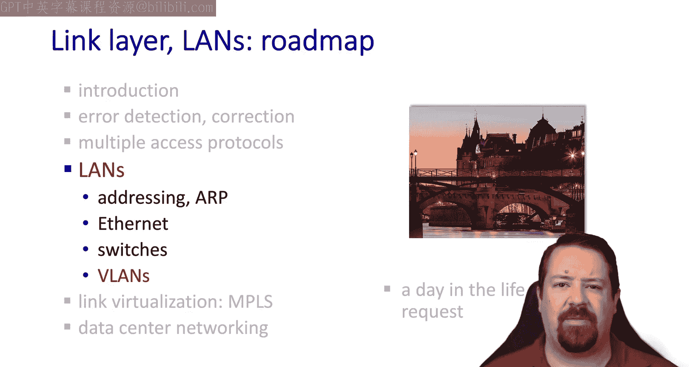

## VLAN的解决方案 🧩

VLAN是解决这个问题的方案。我们可以将一台物理交换机划分为多台逻辑交换机。

例如，如果我们有一个用于走廊的交换机，但该走廊中的用户属于两个不同的逻辑组，我们并不真的希望必须添加一台单独的物理交换机，并从路由器到该交换机以及从该交换机到某些办公室铺设相关线缆。相反，我们在现有交换机上进行软件配置更改，就能够以这种方式划分用户。因此，该交换机将像两台或更多台物理交换机一样运行。如果需要，我们可以配置大量VLAN。

我们在如何实现这一点上也有一些灵活性。我们可以将物理端口分配给VLAN。

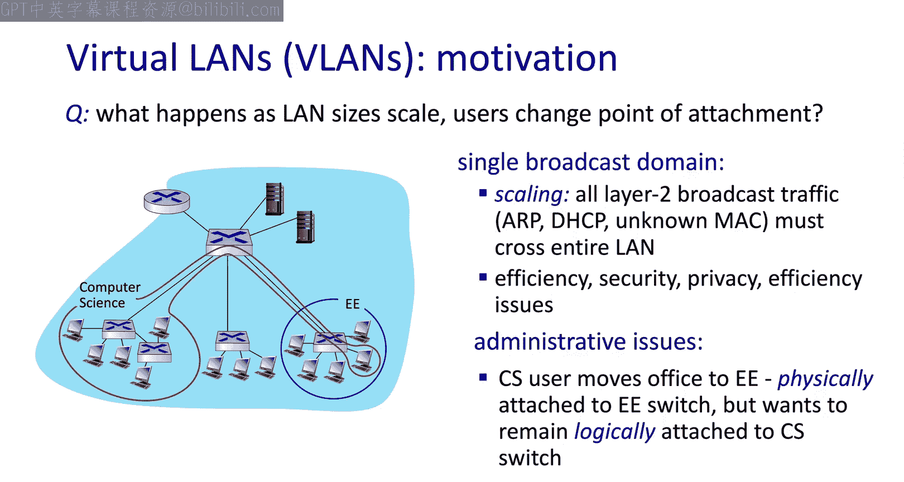

或者，我们可以将某些MAC地址分配给某些VLAN。因此，无论那台特定的计算机插入哪个端口，它将始终位于其配置所在的VLAN上。正如我们提到的，将其分成两个逻辑交换机的目的是通过减少听到广播或泛洪消息的主机数量来提高效率。这意味着这两个VLAN需要位于由路由器分隔的不同子网上。因此，每个VLAN都需要一个上行链路回到其VLAN内的其他交换机或路由器接口。

## VLAN中继与802.1Q帧 🌉

通常，VLAN会跨越多个交换机。因此，在最简单的情况下，要连接这些交换机，我们需要一条连接红色VLAN的链路和一条单独连接蓝色VLAN的链路。

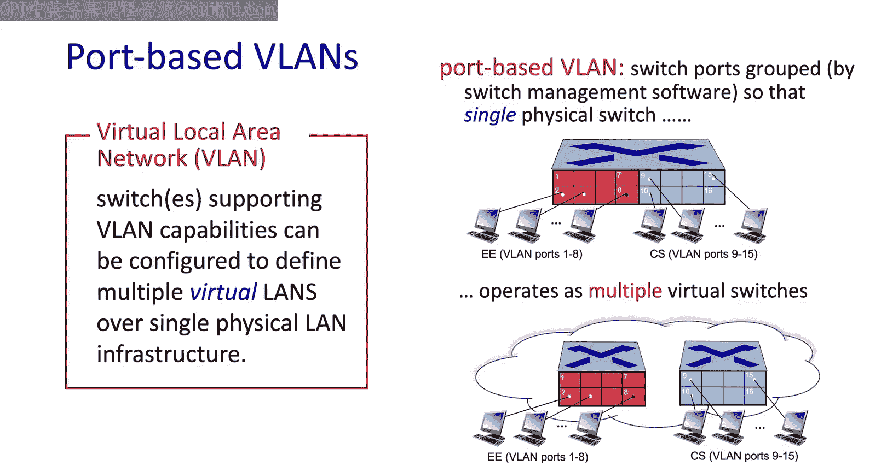

但这会导致其自身的可扩展性问题，需要在这些设备之间并行铺设多条电缆，并额外消耗交换机端口。因此，VLAN包含了中继端口的概念。来自多个VLAN的帧可以通过中继端口发送，并且它们有一个额外的报头字段，告诉接收方它们属于哪个VLAN。这个VLAN报头不是原始以太网规范的一部分，因此它在802.1Q标准中添加。

一个802.1Q帧在我们原始的以太网帧的“类型”字段之前添加了几个字段。这些字段包括标签协议标识符、VLAN ID本身（它有12位，因此如果需要，我们可以定义许多不同的VLAN）和一个3位的优先级字段。

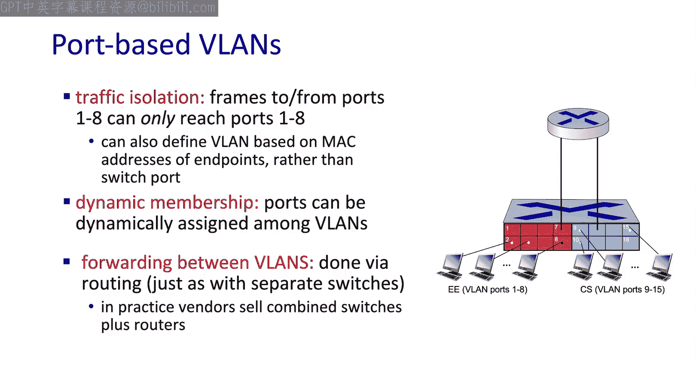

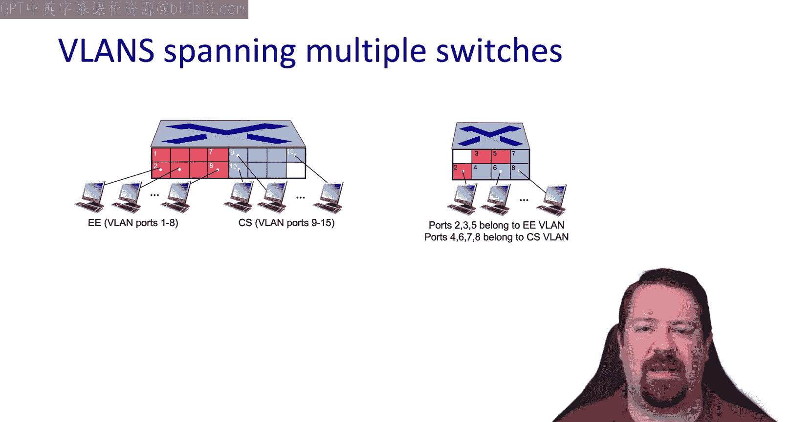

## 总结 📚

本节课中我们一起学习了以太网交换机和虚拟局域网。

我们首先了解了交换机作为二层设备，如何通过自学习机制构建转发表，并基于MAC地址进行高效的、无需配置的帧转发。交换机将网络划分为多个独立的冲突域，支持全双工通信和并发数据流。

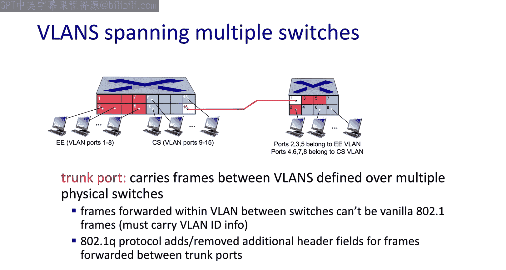

接着，我们探讨了VLAN技术。VLAN通过在物理交换机上创建逻辑交换机，解决了大型扁平网络广播效率低与网络管理灵活性需求之间的矛盾。它允许基于端口或MAC地址进行逻辑分组，并使用802.1Q帧格式和中继端口来实现跨交换机的VLAN通信。

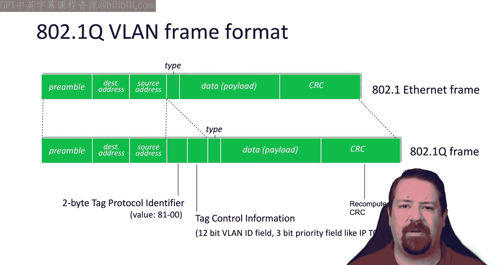

总而言之，交换机是构建本地网络的基础，而VLAN则是在此基础上提供逻辑隔离和管理灵活性的强大工具。它们共同构成了现代企业网络架构的核心组成部分。

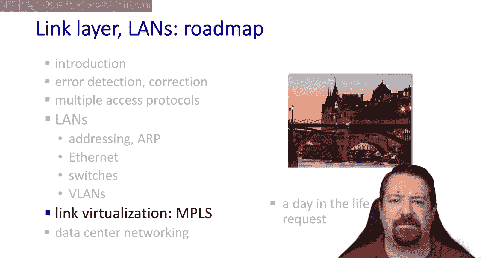

我们的下一个主题是MPLS（多协议标签交换），这是一种虚拟化链路的机制。

