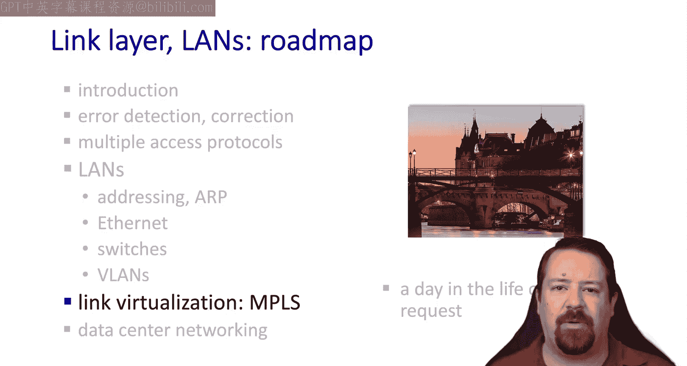
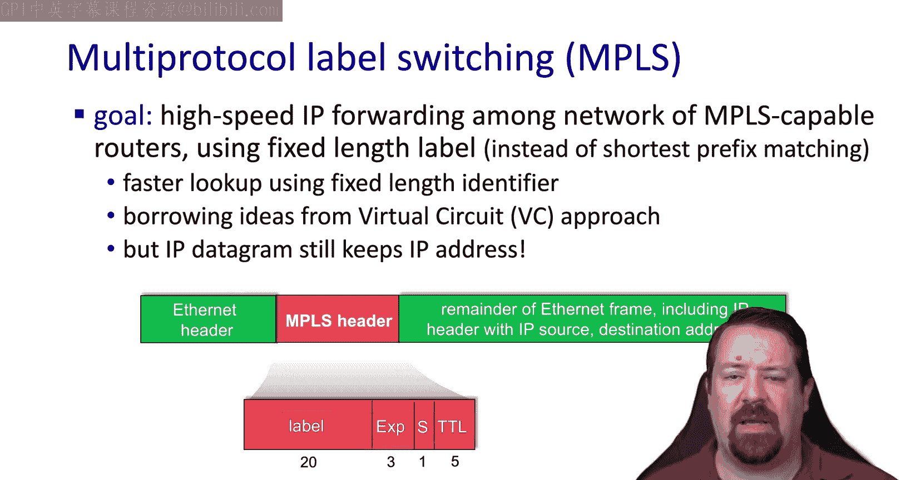
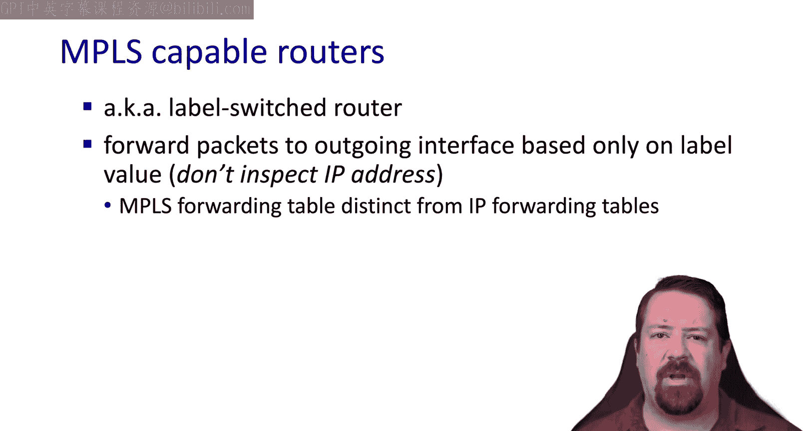
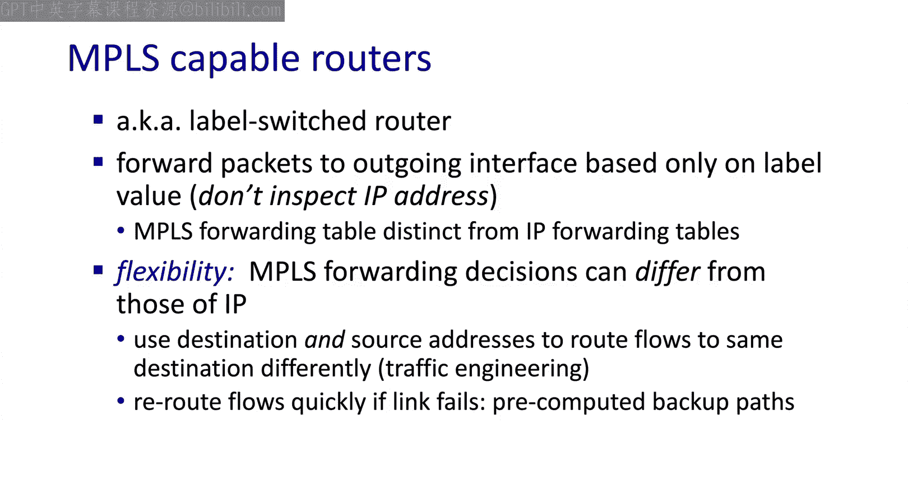
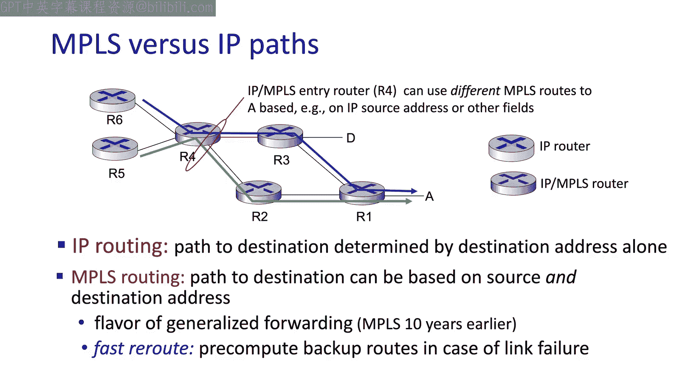
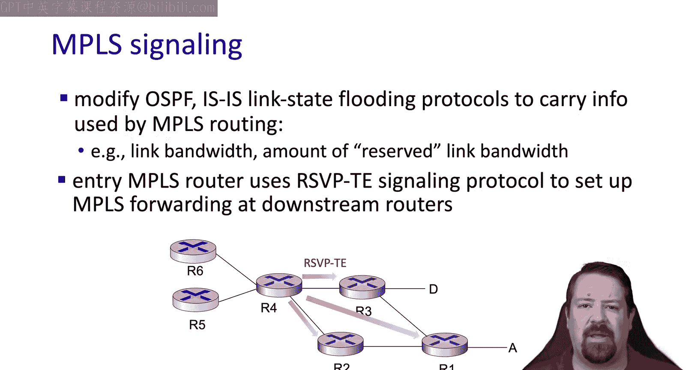
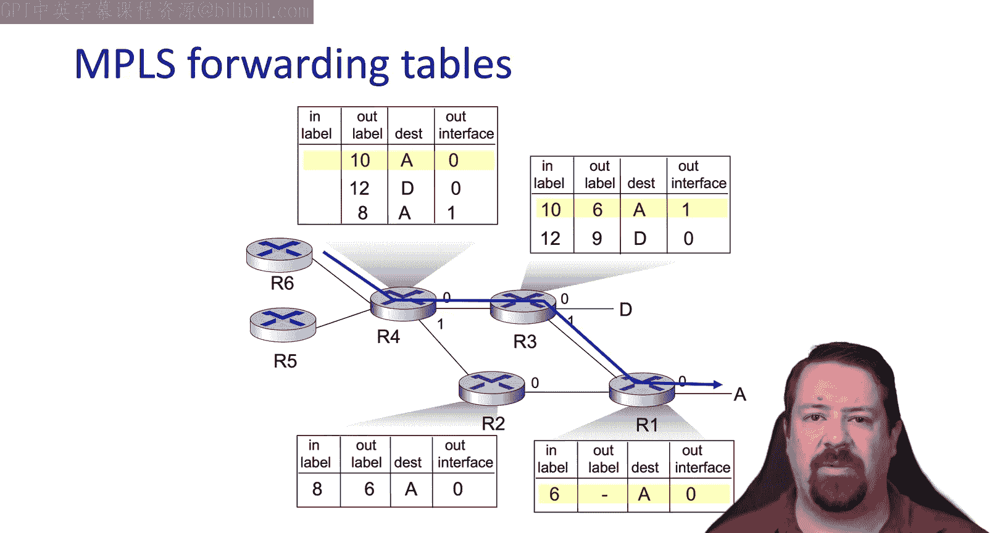
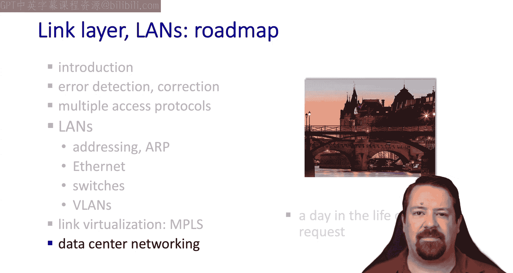

# 6.7：多协议标签交换 (MPLS) 🏷️


在本节课中，我们将要学习多协议标签交换（MPLS）。这是一种在数据链路层（第2层）和网络层（第3层）之间工作的技术，用于高效地转发数据包。我们将了解它的工作原理、优势以及与IP转发的区别。



## 什么是MPLS？🤔

MPLS，全称多协议标签交换，有时被称为“第2.5层”。这是因为它在第2层（如以太网）的头部和第3层（IP）的头部之间，插入了一个额外的“垫片”头部。

这个垫片头部包含一个固定长度的标识符，即**标签**。网络中的路由器根据这个标签，沿着预先配置好的路径转发数据包，而无需在每一跳都进行IP地址的最长前缀匹配查找。

## MPLS的工作原理 ⚙️

上一节我们介绍了MPLS的基本概念，本节中我们来看看它的具体工作方式。

MPLS在数据包中插入一个头部，其结构可以简化为：
```
| 第2层头部 | MPLS头部 | IP头部 | 数据 |
```
MPLS头部包含标签值和其他几个字段，例如一个用于MPLS层的TTL字段。这意味着，当数据包在MPLS网络中传输时，IP头部的TTL字段不会被修改。



因此，可以将MPLS路径视为一个**隧道**。IP数据包从一端进入，从另一端原封不动地出来。中间的MPLS路由器（也称为标签交换路由器）不会处理IP头部，因此在`traceroute`等工具中可能不会显示。

MPLS路由器只查看标签值来决定将数据包发送到哪里。它们不查看IP头部，也不使用IP路由和转发表。



## MPLS的决策与优势 🚀

MPLS决定为特定数据包分配哪个标签时，其原则与我们之前讨论的**广义转发**类似。它可以查看数据包的任何头部字段（如源IP、目的IP、端口号等），来决定数据包应该被放置到哪条MPLS路径上。

以下是MPLS带来的主要优势：
*   **流量工程**：网络管理员可以灵活地引导流量走不同的路径，以优化网络性能或避免拥塞。
*   **服务质量**：可以为不同的数据流分配优先级。
*   **快速故障恢复**：可以预先计算好备份路径。当主路径出现故障时，流量可以非常快速地切换到备份路径上。



## MPLS与IP转发的对比 🔄

为了更清楚地理解MPLS，我们将其与传统的IP转发进行对比。

假设有蓝色和绿色两个IP数据流，它们的目的地都是A。在基于目的地的IP转发中，这两个流会在网络中汇聚到同一条路径上。

而在MPLS网络中，数据流进入MPLS网络的第一个路由器（称为入口路由器）可以基于源地址等信息（而不仅仅是目的地址）来决定为每个流分配不同的标签。这样，出于流量工程的目的，这两个流就可以被引导至网络中不同的路径上。

虽然我们在课程后面才讨论MPLS，但它实际上比我们之前视频中讨论的SDN广义转发技术早了大约十年。然而，它与广义转发或软件定义网络有许多共同的目标。



## MPLS的路径建立 🛠️

MPLS需要一些信令协议来建立预先计算好的路径。它通过修改后的链路状态路由协议（如OSPF-TE）来实现这一点。

值得注意的是，MPLS具有类似于虚电路网络的**预留带宽**概念。这使得在MPLS网络内部防止拥塞成为可能。



当建立一条MPLS路径时，路由器使用**RSVP-TE**协议通知网络中的其他路由器：它将使用哪个标签，以及带有该标签的数据包应该从哪个接口转发出去。

## MPLS转发表示例 📋

让我们通过一个具体的例子来看MPLS的转发过程。

假设我们有一条从R4到R1的路径。以下是实现该路径的转发表：
*   **R4 (入口路由器)**：接收到的数据包没有标签。R4根据其IP源和目的地址为其应用标签（例如标签10），然后根据MPLS转发表将其从接口0转发出去。
*   **R3 (中转路由器)**：当带有标签10的数据包到达R3时，R3将其标签**交换**为标签6，并从接口1转发出去。
*   **R1 (出口路由器)**：当带有标签6的数据包到达R1（MPLS网络的出口）时，R1**移除**MPLS标签，并将其作为普通IP数据包从接口0转发出去。



在这个过程中，标签会在每一跳被交换，直到在出口路由器被移除。

## 总结 📝



本节课中我们一起学习了多协议标签交换（MPLS）。我们了解到MPLS是一种“第2.5层”技术，它通过在数据包中添加标签，使路由器能够沿着预先配置的路径进行高效转发，而无需进行复杂的IP路由查找。MPLS支持灵活的流量工程、服务质量保证和快速的故障恢复。虽然它的路径建立需要额外的信令协议，但它为大规模网络管理提供了强大的控制能力。

在下一个视频中，我们将探讨数据中心网络的构建细节及其因巨大规模而必须考虑的特定因素。