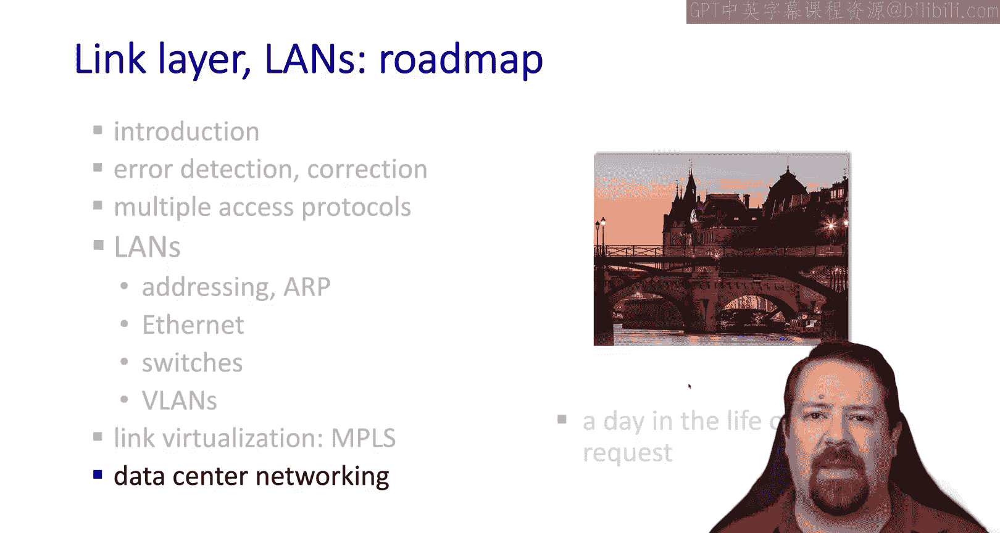
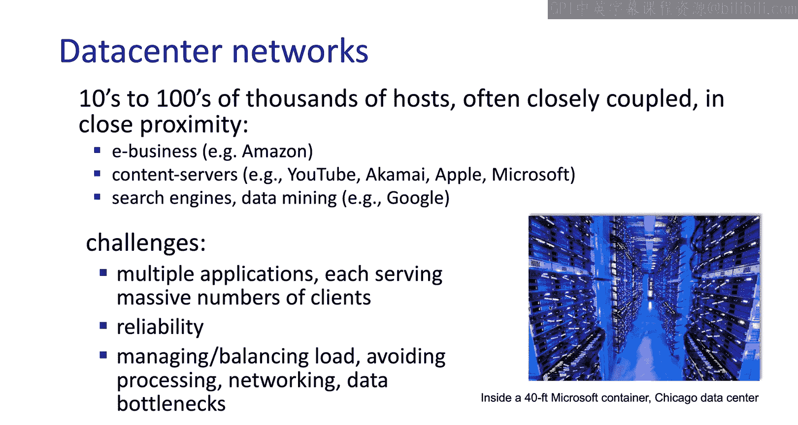
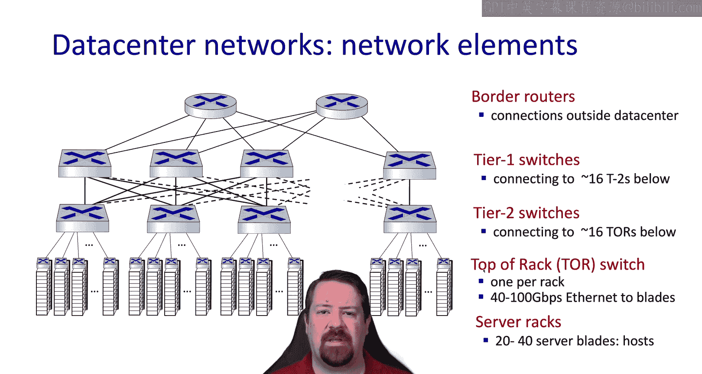
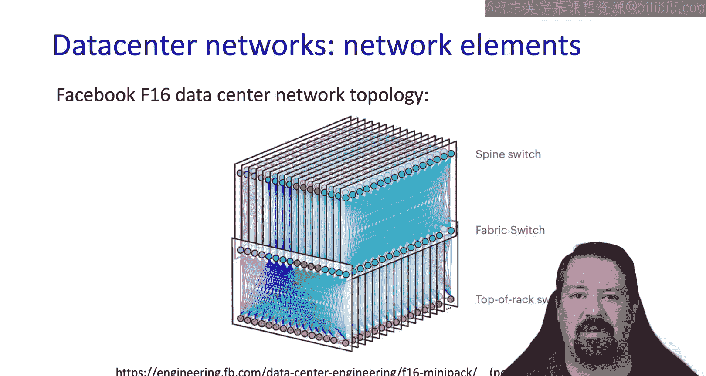
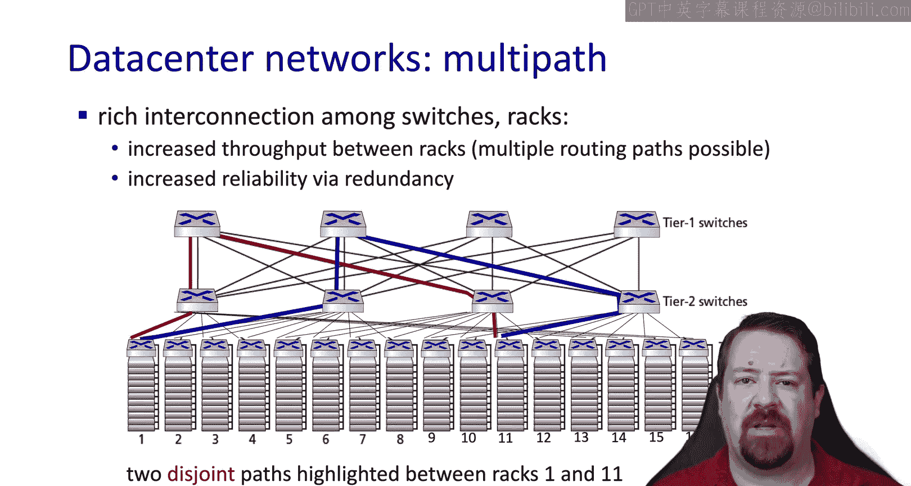
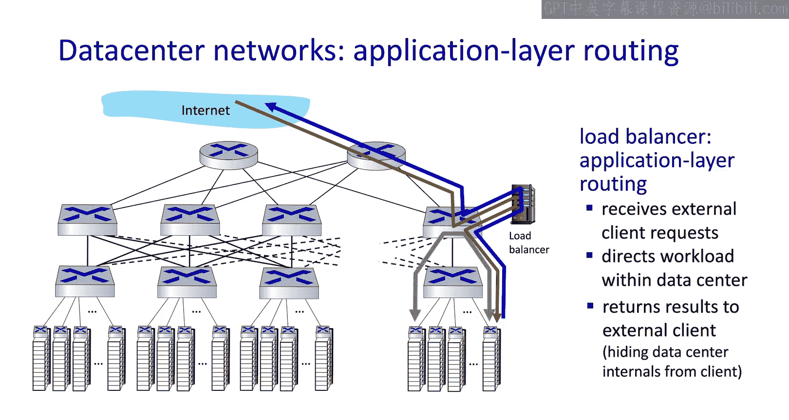
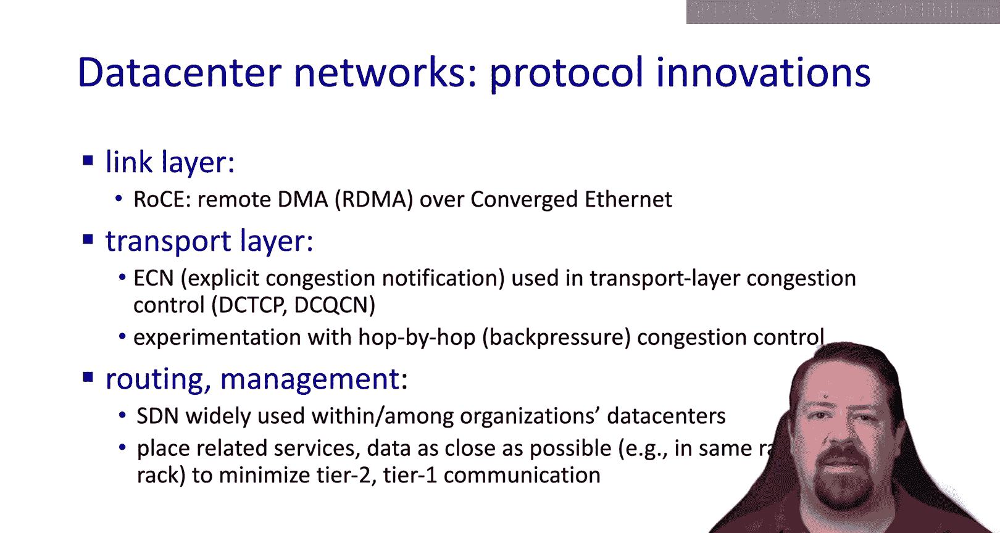
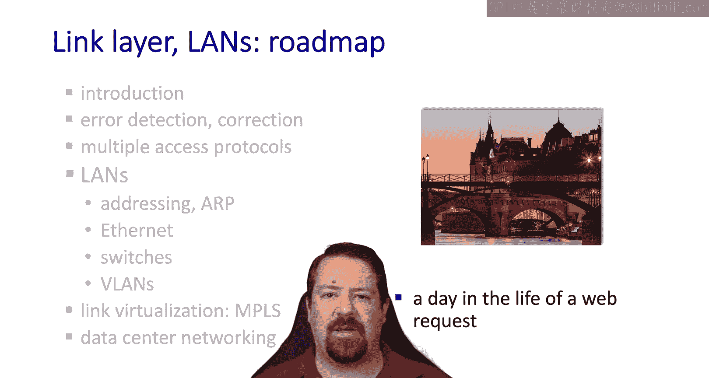

# 6.8：数据中心网络 🏢

在本节课程中，我们将学习数据中心网络。数据中心是大型云服务、内容提供商和社交网络的核心基础设施，其网络设计面临着独特的挑战。我们将探讨其架构、设计目标以及相关的网络技术。

## 数据中心概述

上一节我们介绍了以太网和链路层交换，本节中我们来看看大规模网络——数据中心网络。数据中心通常容纳成千上万的服务器，这些服务器被尽可能紧凑地安置并通过网络连接。它们被主要的云提供商、内容提供商、社交网络和电子商务平台所使用。高性能计算中心和其他有大量计算需求的场所也会使用数据中心。

我们单独讨论数据中心网络，并非因为其技术截然不同，而是因为在这种规模下运营会面临独特的挑战。一个数据中心可能服务于特定企业，但该企业几乎肯定会在数据中心内运行多个应用程序，每个应用程序都服务于海量客户端。此外，在这种使用商用硬件的规模下，故障是常态，因此架构设计必须确保即使某些组件失效，系统也能继续正常运行。整个系统必须经过设计以避免瓶颈，无论是数据处理瓶颈、网络拥塞瓶颈、延迟瓶颈，甚至是电力和冷却资源的可用性瓶颈。

## 数据中心网络架构

接下来，我们具体看看数据中心的网络架构。通常，数据中心内摆满了服务器机架，一个典型的机架可容纳约40台服务器。每个机架顶部会有一个交换机，为这些服务器提供网络连接。为了冗余，通常还会配备两个顶架交换机，每台服务器都连接到这两个交换机上。

多个机架随后被聚合在一起，连接到第二层交换机。由于我们需要聚合来自多个机架的数据，第二层交换机与顶架交换机之间的链路带宽，通常高于顶架交换机与单个服务器之间的链路带宽。

在整个数据中心内，许多这样的机架集群通过第二层交换机聚合。第二层交换机再连接到第一层交换机。这种互连的目的不再是进一步聚合，而是提供一个灵活的交换主干网，使得任意两个机架之间，或任意机架与特定边界路由器之间，存在多条路径。

这种架构会根据访问应用程序的客户端位于数据中心内部还是外部而有所不同。对于典型的面向客户的应用程序，客户端位于数据中心外部，并通过这些边界路由器提供服务。

## 实例：Facebook的网络架构

Facebook是这种数据中心交换网络架构的一个具体例子。从概念上讲，他们的每个顶架交换机都连接到许多不同的结构交换机，而这些结构交换机又互连到许多不同的主干交换机。

回到我们简化的架构图，我们可以看到这种设计如何在网络中的任意两点之间提供多条不相交的路径。这既允许我们聚合这些路径的带宽以提高吞吐量，也允许我们在特定端口或交换机发生故障时，网络能够容忍故障。

在我们最近关于以太网的讨论中，没有谈到如果一个特定的MAC地址可以通过交换机的两个不同接口到达会发生什么。事实上，以太网交换机的基本自学习行为无法处理这种情况，如果发生这种情况，会导致环路并引发广播风暴。

因此，这种架构不能仅基于自学习的以太网交换机来部署，而是需要一个专用的控制器来配置通过这些网络的路径。这很可能使用我们在讨论OpenFlow时看到的某种软件定义网络变体。

## 应用负载均衡与性能要求

在这个例子中，我们还有一个专用的应用负载均衡器，它是面向客户端的服务器，负责处理传入的请求并将其分配给数据中心内的服务器。请求进入后，被发送到一个或一组服务器进行应答。这些服务器之间可能会相互通信，但应答会返回给应用负载均衡器，然后由它发送给客户端。

当我们谈论客户端请求时，可能指的是加载网页这样的操作。例如，当你在搜索引擎中输入查询并按下回车键时，请求会发送到这个应用负载均衡器，它必须与一堆服务器通信并获取答案，然后网页才能加载。因此，所有这些操作完成的时间预算通常只有几十毫秒。这就是为什么任何拥塞或延迟方面的瓶颈都会显著降低此类应用程序的性能。

## 数据中心驱动的协议创新

由于数据中心网络的需求，我们已经看到了许多协议创新。这些创新包括远程直接内存访问，即通过以太网实现的直接内存访问。我们讨论过的其他创新还包括显式拥塞通知。虽然ECN在公共互联网上难以使用，但在数据中心网络内部被广泛采用。请记住，ECN允许我们在不丢弃数据包的情况下管理拥塞，这对于我们试图最小化延迟时非常重要。

此外，还进行了逐跳拥塞控制的实验，因为它可以比等待TCP拥塞控制所需的端到端信令发生快得多。总的来说，我们看到软件定义网络在数据中心类型的网络中被采纳得最为迅速。在管理方面也有很多创新，以确定如何最佳地调度应用程序，或如何以最小化资源间网络延迟的方式将任务分配给可用的计算资源。

## 总结

本节课中，我们一起学习了数据中心网络。我们了解了数据中心的基本构成、其多层交换架构的设计目标（如冗余、避免瓶颈、提供多路径），以及Facebook的具体案例。我们还探讨了为何传统以太网的自学习机制不适用于这种复杂架构，从而需要软件定义网络等集中控制方式。最后，我们看到了数据中心对低延迟、高吞吐量的严苛要求如何推动了如RDMA、ECN等网络协议的创新。数据中心网络是现代互联网服务的基石，其设计深刻体现了在超大规模下对可靠性、效率和性能的极致追求。

在下一个视频中，我们将通过“一个Web请求的一天”，来串联我们迄今为止所学的所有网络层次，看看从客户端请求网页到收到响应并显示页面，中间必须发生的所有步骤。