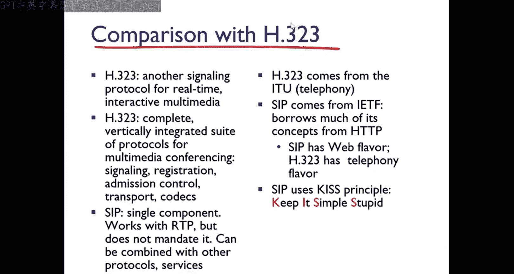

# 9.3：实时传输协议（RTP）与会话发起协议（SIP）

在本节课中，我们将学习多媒体网络中的两个关键协议：实时传输协议（RTP）和会话发起协议（SIP）。我们将了解它们如何支持实时音视频应用，例如视频会议和互联网电话。

## 概述：实时应用协议

上一节我们介绍了多媒体网络的基础概念，本节中我们来看看专门为实时通信设计的协议。实时应用对数据传输的及时性有严格要求，因此需要特殊的协议来处理音视频数据的打包、传输和控制。

## 实时传输协议（RTP）

RTP是一个互联网协议，用于管理多媒体数据（如音频和视频）在单播、组播或广播网络服务上的实时传输。它由互联网工程任务组（IETF）在RFC 3550中定义，主要用于音视频传输，支持视频会议等多目的地应用。

需要注意的是，RTP本身**不保证**数据的实时交付。因为它通常封装在UDP数据报中传输，其交付的及时性依赖于底层网络的特性。RTP的主要工作是在端系统（源和目的地）之间运行，监控数据传输，并尽力提供最佳性能。

以下是RTP的核心功能组件：

*   **载荷类型标识**：标识数据包中音频或视频的编码格式（如PCM、GSM）。
*   **序列号**：用于检测数据包丢失，每个RTP包都有一个16位的序列号。
*   **时间戳**：反映数据的采样时刻，帮助接收方在正确的时间播放，它是一个32位的值。
*   **同步源标识符（SSRC）**：唯一标识RTP流中的源，长度为32位。

RTP数据包的结构封装在UDP段中。例如，发送64 kbps的PCM编码语音时，应用每20毫秒收集一个编码后的数据块（160字节），加上RTP头部，形成RTP包，再封装进UDP段进行传输。

### RTP与服务质量（QoS）

RTP可以包含服务质量反馈信息，例如数据包丢失比例、往返时间、延迟抖动等。发送方可以根据这些反馈调整数据传输速率。然而，由于RTP在端系统实现，中间路由器通常不为其提供特殊处理，因此QoS的保证是有限的。

### 实时传输控制协议（RTCP）

RTCP是RTP的配套控制协议。它不传输媒体数据本身，而是定期发送控制包，提供会话中媒体传输质量的反馈。

以下是RTCP的主要数据包类型：

*   **发送方报告包**：包含当前时间、已发送数据包和字节数等信息。
*   **接收方报告包**：包含数据包丢失比例、收到的最高序列号、延迟抖动等信息。
*   **源描述包**：包含发送方的电子邮件、姓名等信息，用于将SSRC映射到用户。

RTCP使用单独的组播地址和端口号，其流量通常被限制为会话总带宽的5%。其中，75%的RTCP带宽分配给接收方，25%分配给发送方，以确保在大型会议中控制信令开销。

### RTP流同步

在一个RTP会话中（如视频会议），音频和视频是独立的流，拥有各自的时间戳序列。RTCP发送方报告包包含了RTP时间戳与“挂钟时间”的映射关系。接收方利用这个信息，可以对音频和视频流进行同步播放。

## 会话发起协议（SIP）

SIP是一个应用层信令协议，用于创建、修改和终止包含视频、语音、即时消息等在内的多媒体会话。它的作用类似于传统电话系统中的呼叫建立过程，但更加灵活，基于文本，易于扩展。

SIP提供以下主要服务：

*   **用户定位**：确定被叫方当前使用的终端设备（如PC、手机）的IP地址。
*   **用户可用性**：判断被叫方是否愿意加入通信。
*   **用户能力协商**：协商双方支持的媒体类型和编码格式。
*   **会话建立**：在主叫和被叫之间建立会话参数。
*   **会话管理**：在会话中进行转移、修改（如增加媒体流）或终止操作。

SIP消息通常通过UDP或TCP发送。一个典型的SIP“邀请（INVITE）”消息包含主叫和被叫的地址、会话描述（使用SDP协议）等信息。

### SIP名称翻译与用户定位

SIP使用电子邮件格式的地址（如 `bob@domain.com`）来标识用户。用户的实际位置（IP地址、设备）可能随时变化。SIP通过注册机制来维护这种映射关系：用户启动SIP客户端时，会向所属域的 **SIP注册服务器** 发送 `REGISTER` 消息，告知其当前地址。

### SIP代理与呼叫建立

当主叫发起呼叫时，其请求首先发送到本地的 **SIP代理服务器**。代理服务器负责将请求路由到被叫方的SIP服务器（可能经过多个代理），最终到达被叫方的设备。响应则沿原路径返回。

## 总结

本节课中我们一起学习了支持实时多媒体应用的两个核心协议。
*   **RTP** 负责实际音视频数据的传输，提供时间戳、序列号等机制以支持有序播放和同步，其配套协议 **RTCP** 负责监控传输质量并提供反馈。
*   **SIP** 是一个信令协议，负责会话的建立、管理和终止，处理用户定位、能力协商等呼叫控制功能。

这两个协议通常协同工作：SIP用于建立会话并协商参数（如使用的端口和编码），然后媒体数据通过RTP/RTCP在已建立的会话通道上流动。理解它们的分工与协作，是掌握现代互联网实时通信技术的关键。