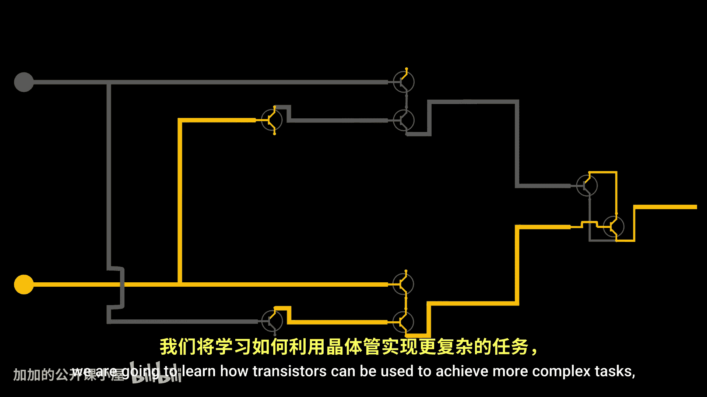
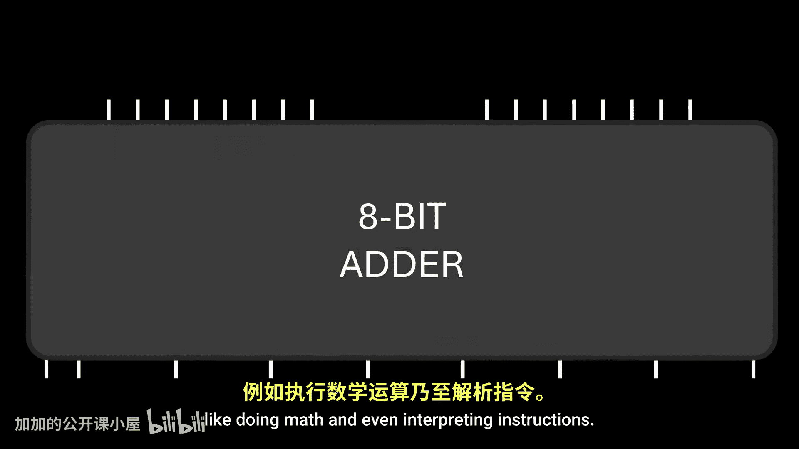
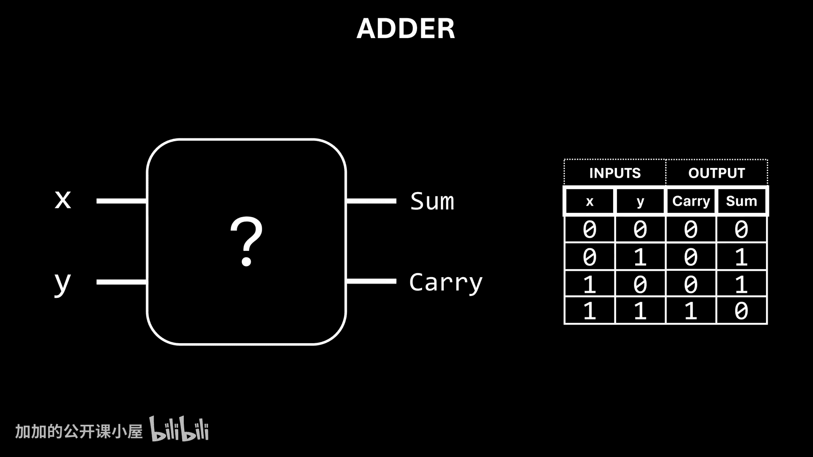
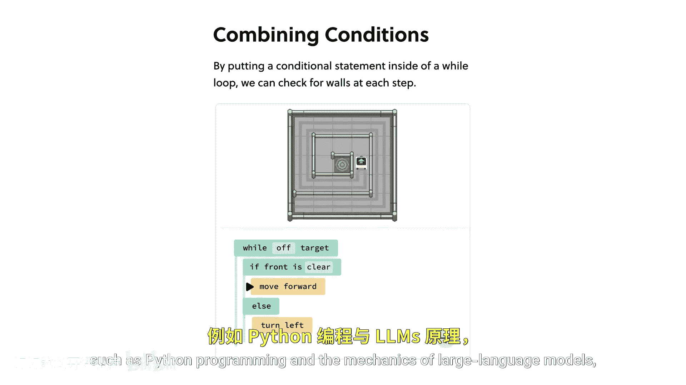
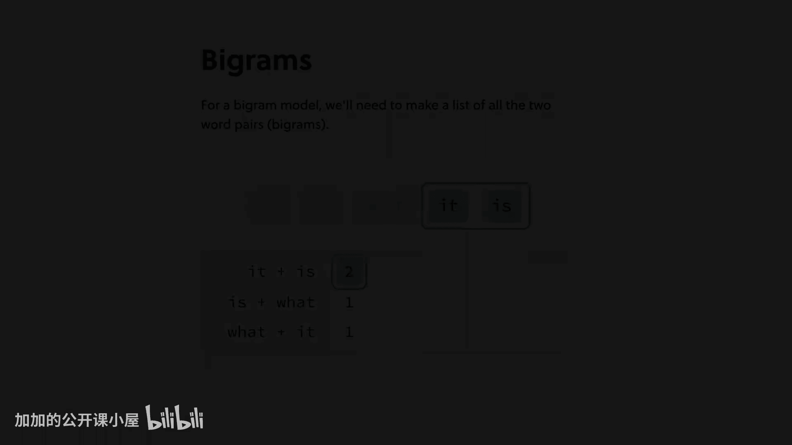
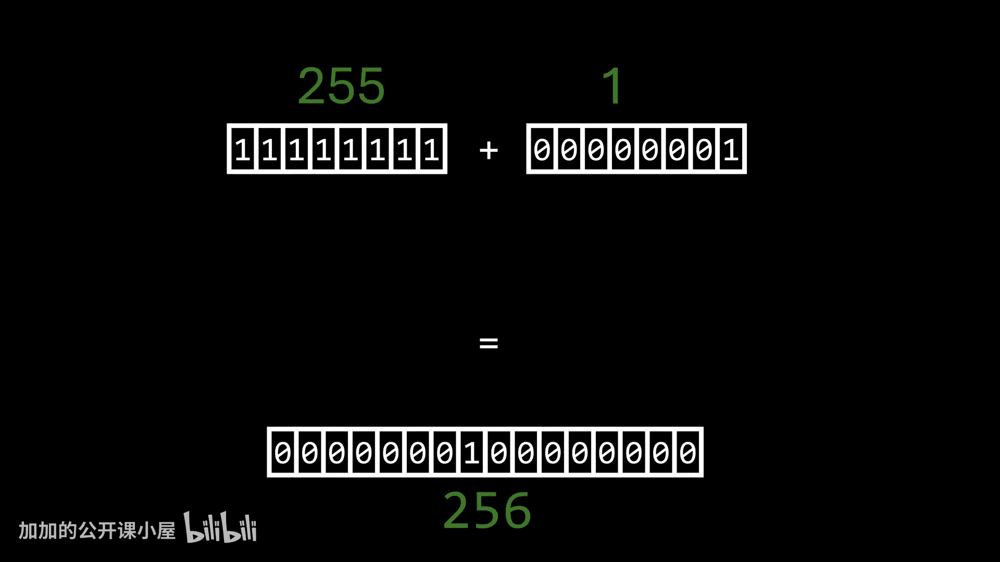
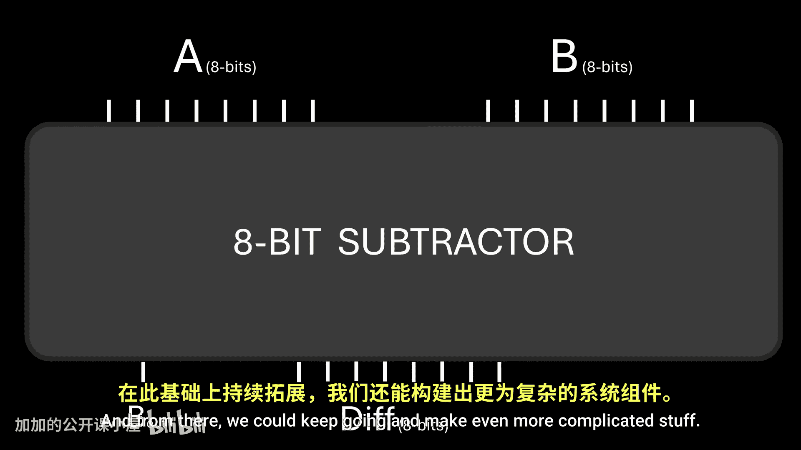
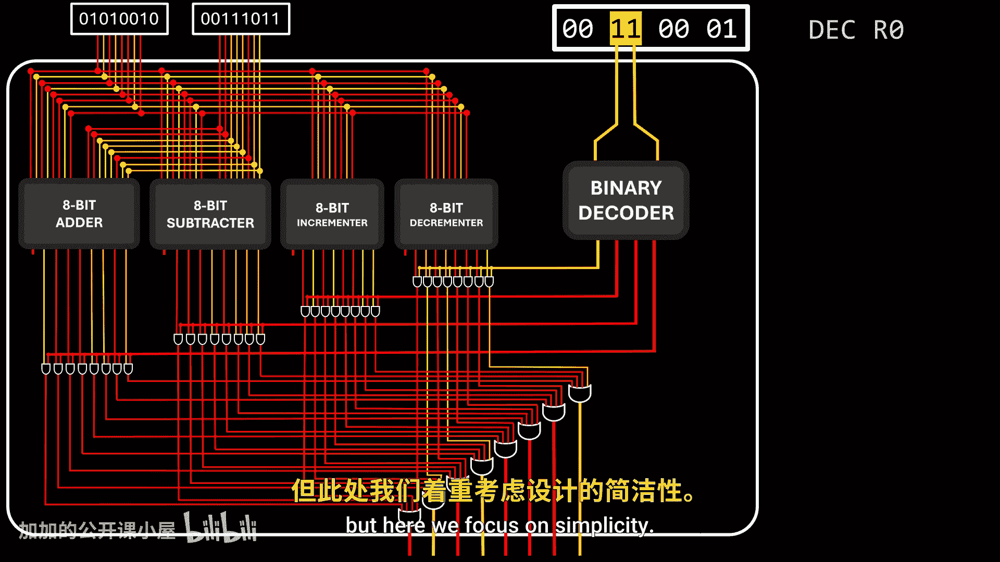
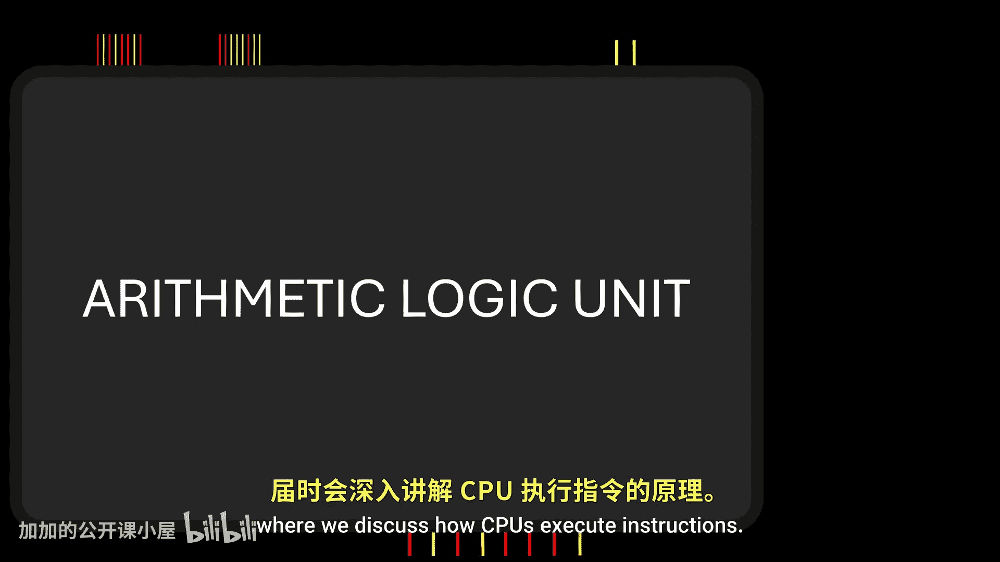

# CoreDumped【中英⚡图解计算机体系结构｜Computer architecture from scratch】 p01 P1 HOW TRANSISTORS RUN CODE？ -BV1mBWzzAEek_p1-

This video is sponsored by Brilliant。Transistors are very simple components。

They are basically electronic switches。When we apply current to one of its terminals。

 a transistor lets electricity pass through。But how can this simple behavior make computers possible？

In today's video， we are going to learn how transistors can be used to achieve more complex tasks。

Like doing math and even interpreting instructions。

Hi friends， my name is George and this is Core dumpumped Before we begin just a reminder that you can find me on social media and our Discord server。

 where I'm available to answer your questions， and by the way I keep getting requests to use my own voice instead of using text to speech。

 the reason I don't record myself is because I grew up in South America and I'm not a native English speaker。

 so I hope you like modern family， because once I start recording myself that's what it will sound like。

Anyway， let's start， a single transistor typically has three terminals， a collector。

 an emit emitter and a base in a circuit it can act as an insulator。

 preventing electricity from flowing between the collector and emitter terminals。

But if we apply a small current to the base terminal， it acts as a conductor。

 allowing electricity to flow。Essentially a transistor can be seen as a switch。

 but instead of mechanical movement， it operates by using electrical signals。In this example circuit。

 we are using a transistor to turn on and off an LED by utilizing the base terminal as an input and the emitter terminal as an output signal。

 we can mimic the input signal with a switch and visually represent the output signal with the LED。

Let's duve this a simple gate in a simple gate when the input is0， the output is 0。

When the input is1， the output is1。Now， let's tweak things a bit here， when the input is zero。

 the LED is on due to the way it is arranged within the circuit， but pay attention to this。

 setting the input to one causes the LED to turn off， indicating to us the output is a zero。

This setup is commonly referred to as an inverter or a knot gate。This may seem a bit confusing。

This video I found on Twitter is a perfect example of this effect。And if you want more details。

 you can watch this video by Ben Eer， where he explains all this using real components。

We're not limited to just one transistor by using multiple transistors。

 we can achieve more complex behavior if two transistors are connected in series when both inputs are zero。

 the output will be zero because both transistors act as insulators， Similarlyly。

 if either input is zero， the output will be zero。The only way to obtain a one in the output is by having both transistors act as conductors。

 which happens when both inputs are set to one。This is where we begin to apply a powerful concept called abstraction instead of focusing on the individual transistors in the circuit。

 we can abstract this into a white box， a box that consistently outputs a specific value based on two given inputs。

This is known as an and gate， an and gate outputs a value of1， if and only if both inputs are1。

 otherwise the output will be zero。If we connect the transistors in parallel。

 when both transistors act as insulators， electricity cannot flow。But in this setup。

 having any transistor acting as conductor is enough to allow electricity to flow。

So in this arrangement， to get an output of one is not strictly necessary to set both inputs to one。

Once more， we can abstract this circuit into a box， known as an or gate。

 an or gate outputs a value of zero， if and only if both inputs are zero。Otherwise。

 it outputs a value of1。These circuits known as logic gates are so fundamental that instead of representing them with boxes。

 each one is assigned a dedicated symbol。Notice that since inputs and outputs are electrical signals。

 we can connect the output of one logic gate to the input of another。

This allows us to combine logic gates to achieve even more complex behavior。For example。

 if we desire this particular behavior， we can combine logic gates accordingly to achieve it。

This is where we begin to see the power of abstractions。

While this setup is ultimately composed of transistors。

 it's much simpler to understand what's happening by thinking in terms of logic gates。

This circuit is known as an Xor gate， and it is also very important in computer science。

 so it has its own symbol。And now that we understand what logic gates are。

 let's use them to create more useful things。Let's start with adders。

Adding binary numbers is actually quite simple； in fact。

 binary edition works just like decimal edition 0 plus 0 equals0，0 plus1 equals 1， 1 plus 0 equals 1。

 and 1+ 1 equals 2。However， the value too cannot be represented with a single binary digit。

When this occurs， we say the addition has overflowed。

 meaning we require an additional bit to represent the value。

So what we're aiming for is a circuit that takes two input values and produces two outputs。

 the sum and the carry。

Let's break down the sum。But before， a quick message from Brilliant。

Your learning process doesn't have to be synonymous with mindlessly scrolling through a PDF。

Brilliant is designed to offer small lessons that you can engage with whenever you find the time。

 making learning a little each day both enjoyable and convenient。

One of the best brilliant features is the interactive nature of their lessons。

 which encourage critical thinking skills through problem solving activities。

 for those aiming to enhance their problem solving abilities， Brit is an ideal platform。

Its latest course， thinkinging in code， lays down the foundational principles of coding。

 enabling you to adopt the mindset of a programmer。

And you can pick more advanced topics such as Python programming and the mechanics of large language models。

 all while engaging with small and fun interactive lessons。

You can get for free 30 days of brilliant premium and a lifetime 20% discount when subscribing by accessing brilliant。

org/coredumped， or by using the link in the description below。

And now back to the video， let's break down the sum。

 We require a circuit that outputs zero when both inputs are the same and one when they differ。

Does this sound familiar？It's precisely what an Xor gate accomplishes。

 so we've already solved half of the puzzle。For the carry output。

 we need a circuit that outputs the value1 only when both inputs are one。

This matches the behavior of an ant gate。And there we have it。

 we've crafted a circuit capable of adding two single digit binary numbers。Okay。

 but what about multidit binary Ed？Well， let's try。Since we have to add numbers in each row。

 using one adder for each row seems logical， it works well for the first row。

 but when we move to the second row， there's an issue。

We need to consider that the previous row might have created a carry。

 but because the adder circuit only accepts two inputs， it doesn't account for this carry。

Because of this limitation， this circuit is known as a half adder。

 and it is not useful in this scenario。What we need is a full adder。

 a circuit that can handle not only the two bits being added。

 but also take into account the carry from a previous edition。

Here's the circuit we're working towards。Think of it as a circuit capable of adding three single digit binary numbers。

To simplify matters， we can encapsulate this in a box， which we'll call a full adder。

With full adders， we can now add multidigit binary numbers。

The carry output of each full adder feeds directly into the carry input of the next full adder。

 as shown here in this animation。To add binary numbers of n digits in one go。

 n full adders are needed for example， if we aim to add two8 bit numbers。

 we'll need eight full adders。Remember that values are represented here using electrical signals since electricity moves at incredible speed。

 once we alter the input， the output changes almost instantly。

 and this is what makes transistors ideal for this job。

 while logic gates can be crafted from other components。

 like relays and even fancy 3D printed parts powered by weird stuff like marbles or even water。

 none of this matches the speed and compactness of transistors。Before things become overly complex。

 we can one more time package all of this functionality into a special component known as an eight bit adder。

An 8 bit adder takes two8 bit numbers as input and produces the sum of the inputs as another8 bit number。

 it also provides an overflow signal， which is essentially the carryout output of the last full adder inside。

This overflow signal is crucial because it informs us whether the storage capacity being utilized is adequate to represent the result of the operation。

In this example， both inputs are one byte long， but if we attempt to store the output in just one byte。

 we will miss information resulting in an incorrect value。By monitoring the overflow output。

 we can recognize the need for an extra byte to accurately store the output。

Believe it or not， neglecting to manage operation overflows can lead to undefined behavior。

 sometimes with severe consequences， like this rocket accident in 1996。

And we can continue to move to higher levels of abstraction if we want to make a circuit that increments an input value。

 we can simply use an adder and set the second input to always be one。

We've only talked about adders in detail， but in the end it's all about logic gates with them we can make more useful things like a full subtractor that then can be used to build an eight bit subtractor。

And from there， we could keep going and make even more complicated stuff。

As you may have guessed， inside the CPU， there's a special component that houses all these circuits。

For now， let's call it our mysterious component。The question we want to answer now is。

 when a CPU reads an instruction， how does it identify which one of these circuits corresponds to that specific instruction。

 how does the computer discern adding numbers upon encountering a particular instruction and subtract them upon encountering another？

I mean， some instructions aren't even arithmetic operations。

The last type of component we are covering today are binary decoders。

Let's take a look at this circuit and examine the output for every input combination。

The first thing we can notice here is that each combination triggers a specific output to activate while deactivating all other outputs。

Another way to see it is that the circuit receives the binary number that corresponds to the position of the output we wish to activate。

This is what binary decoders do when it receives an input。

 one and only one output has the value of one， with all others outputting the value of zero。

If we have a decoder with three inputs， we can control which of eight outputs turns on。

Four inputs Well， we can control 16 outputs and so on。

This is huge because it means that we are also capable of creating circuits that can select among multiple options。

Now remember that assembly code is just a human friendly representation of machine code。

 the actual code consisting of ones and zeros that computers comprehend。

Not all instructions are arithmetic operations， some of them are instructions dedicated to fetch and write data to memory and other stuff like that。

Let's imagine a very basic architecture where if the first two bits of an instruction are zeros。

 the computer interprets them as arithmetic operation instructions。In this example， to verify this。

 we could employ nor gateates。Given the scope of this video。

 at the moment we are not concerned with instruction that signifies something else。

 but at least we know how to identify between them。In this example architecture。

 the third and fourth bits will determine the type of arithmetic operation to be executed。

For instance， if those bits are 00， it means addition， if 01， it represents subtraction and so forth。

This is commonly known as an opP code， each op code is associated with one and only one kind of arithmetic operation。

When the CPU has determined that the current instruction is an arithmetic operation。

 our mysterious component receives this opP code and internally links those two bits to a decoder。

 which is used to identify the desired internal operation。

The straightforward approach here would be by allowing all circuits to receive the inputs and generate their respective outputs。

 but the outputs of the decoder are interconnected in a way that allows only the output of the selected operation to pass through this component。

Keep in mind that there are more efficient ways to do this， but here we focus on simplicity。

Our mysterious component can also be enclosed within a box。

 this is a rudimentary and somewhat incomplete version of something known as an arithmetic logic unit。

We'll talk about this component in more detail in a future episode where we discuss how CPUs execute instructions。

 but beforehand， an arithmetic logic unit takes input values and an opP code that tells the internal circuitry what arithmetic operation to perform between those values。

 it then produces the result of the specified operation along with additional information。

 such as whether the result is negative zero， or if it has overflowed。

And this was a very， very， very brief introduction to how computers use transistors to do math and follow instructions。

Well， sort of， because we completely avoided an important concept， memory。

 but that's a topic for a future video。So make sure to subscribe because you don't want to miss it。

And that's it for this episode don't forget to hit that like button if you enjoyed this video or learn something。

 it's free and that would help me a lot。

