# 图解计算机体系结构：05：计算机处理器如何运行条件与循环 🖥️➡️🔄

在本节课中，我们将要学习计算机处理器如何执行程序中的条件判断和循环。虽然计算机按顺序执行指令，但为了完成有用的工作，它们必须能够根据情况做出决策并重复某些步骤。我们将从基础开始，逐步揭示这背后的硬件原理。

## 概述：程序如何运行

上一节我们介绍了CPU执行指令的基本流程。为了理解条件与循环，我们需要先快速回顾一下计算机运行程序的核心机制。

当我们编写程序时，通常使用高级编程语言。计算机无法直接理解这些语言，因此需要编译器。**编译器**是一个程序，它将用编程语言编写的代码翻译成其他形式，通常是可执行文件。

一个常见的误解是，可执行文件仅仅是一系列CPU指令。实际上，它还包含了程序运行所需的数据。例如，程序中的数字20和100就是运行时需要使用的值，编译器必须将这些值也包含在可执行文件中。

程序运行时，其可执行文件被加载到内存中，CPU开始从中获取指令。处理器通过地址寄存器（也称为程序计数器）连接到RAM，可以从中读取和写入各种信息，包括指令和数据。

执行一条指令通常涉及三个阶段：
1.  **取指阶段**：CPU将地址寄存器的内容发送到内存的地址输入端，并激活读使能信号。内存输出该位置的内容，CPU将其写入指令寄存器。
2.  **译码阶段**：控制单元读取指令寄存器的内容，解释该指令，确定CPU接下来应该执行什么操作。
3.  **执行阶段**：控制单元设置好一切以执行指令。例如，将内存位置5的内容（数字20）加载到寄存器0中。

指令执行完毕后，控制单元会递增地址寄存器中的值，以确保CPU在返回取指阶段时，能获取到下一条指令。

## 一个简单的程序示例

让我们通过一个添加两个数字并将结果存储到变量中的程序来具体说明。以下是其核心步骤的伪代码表示：

```
LOAD value_20 INTO Reg0
LOAD value_100 INTO Reg1
ADD Reg0, Reg1  // 结果存回 Reg0
STORE Reg0 INTO memory_location_7
HALT
```

程序需要四条指令。前两条指令将值从内存加载到CPU的寄存器中。第三条指令是一个加法操作，将寄存器0和寄存器1中的值相加，结果存回第一个操作数所在的寄存器。第四条指令是存储操作，将寄存器的值写入指定的内存地址。

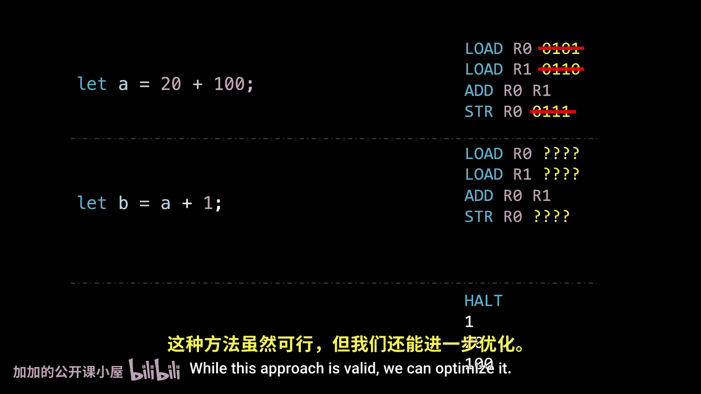

此时，程序看似完成，但CPU本身无法区分指令和数据。为了防止CPU错误地将数据当作指令来执行，我们在程序末尾添加了一条特殊的 **`HALT`** 指令，告诉CPU停止运行。

## 优化与内存布局


我们可以优化程序。例如，如果架构支持，可以使用特殊的递增指令，而无需先将数字1加载到另一个寄存器。此外，如果变量的值已经存在于某个寄存器中，则可以避免不必要的加载指令。编译器经常使用这类技巧来减少运行程序所需的指令数量。


在内存布局上，一个古老的技巧是将指令放在内存开头，数据放在末尾。这样，即使添加或删除指令，数据的相对地址也更容易管理。在我们的简化架构（仅有16个RAM位置）中，程序布局如下：

```
内存地址 0-3: 程序指令
内存地址 12-15: 程序数据 (如 20, 100, 结果)
```

现代架构以不同方式处理这个问题，但核心思想是：程序运行本质上是将数据从内存移动到CPU，以某种方式操作，然后将结果存回内存，一条接一条地执行指令。

## 引入循环：无条件跳转

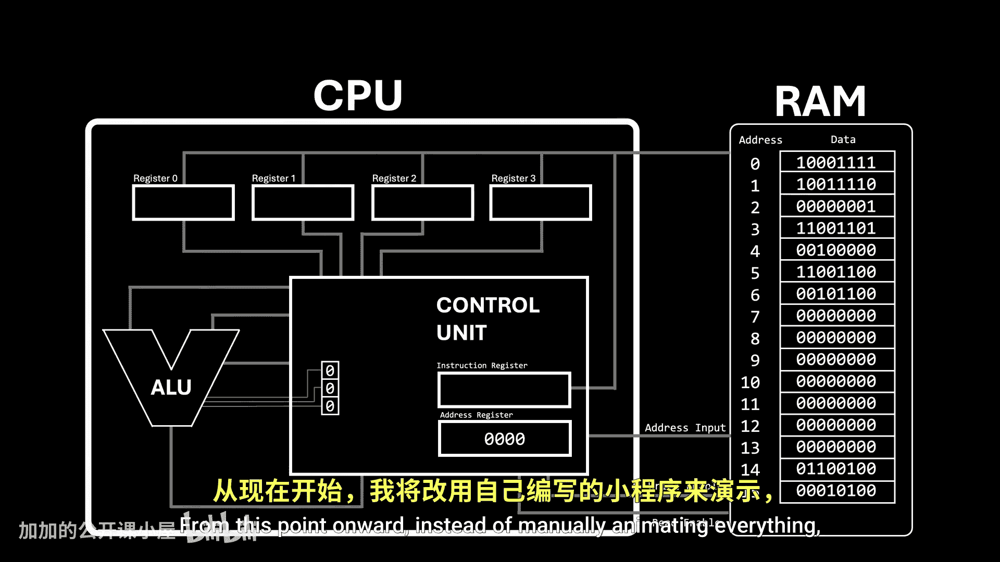

然而，我们尚未考虑条件判断和循环。根据情况执行不同操作或重复步骤的能力，比许多人意识到的更为关键。没有这些功能，计算机能执行的任务将极其有限。

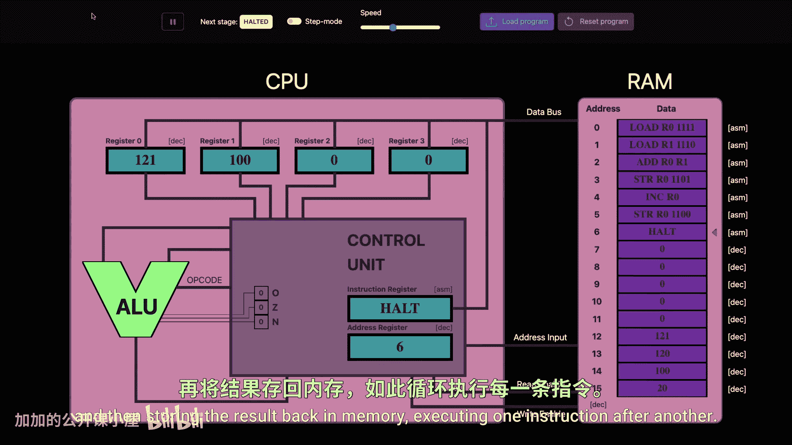

我们从一个无限循环开始。以下是其高级语言表示和对应的汇编思路：

```
A = 0
while (true) {
    A = A + 1
}
```

对应的汇编步骤：
1.  初始化变量A为0（加载0到寄存器，然后存储到A的内存位置）。
2.  循环体内对A加1（如果A的当前值已在寄存器中，可直接使用递增指令）。
3.  更新变量A的值（存储指令）。
4.  为了重复此过程，我们需要 **`JUMP`** 指令。

`JUMP` 指令带有一个内存地址。它的唯一目的是让程序“跳转”到那个地址。在硬件层面，它所做的就是告诉控制单元，用提供的值覆盖地址寄存器的内容，而不是像通常那样递增它。这样，CPU下一次取指时，获取的就不是顺序的下一条指令，从而实现了跳转效果。

通过跳转回循环开始处的指令地址，就实现了硬件层面的无限循环。

## 条件判断的核心：标志位

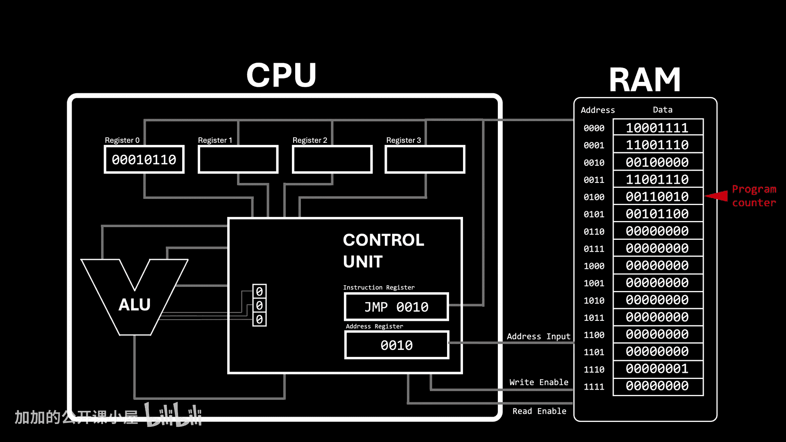

但 `JUMP` 指令总是会跳转。如果我们只想在特定条件下跳转呢？在回答这个问题之前，需要了解 **标志位**。

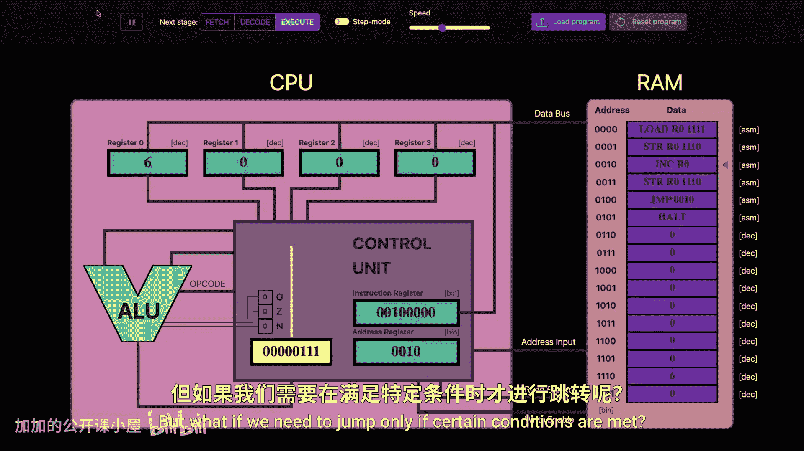

每次算术逻辑单元执行操作时，它不仅输出结果，还提供关于结果的额外信息。这些信息存储在一些单比特寄存器中，称为标志位。常见的标志位包括：
*   **零标志位**：当操作结果为零时置1。
*   **负标志位**：当操作结果为负数时置1。
*   **溢出标志位**：当操作结果超出表示范围时置1。

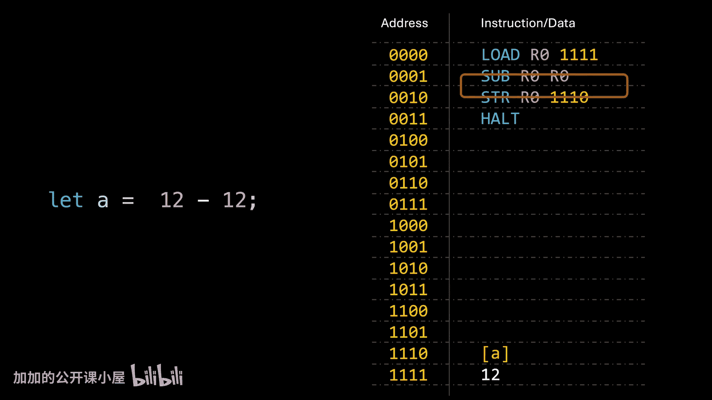

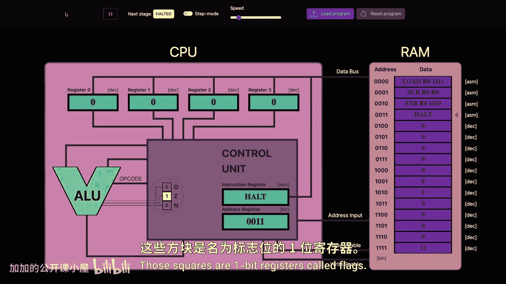

例如，执行 `12 - 12` 后，结果为零，零标志位会亮起。执行 `255 + 1`（在8位系统中）会导致溢出，溢出标志位会亮起。执行 `5 - 10` 结果为负，负标志位会亮起。


ALU之所以提供这些标志位，是为了让程序可以利用这些信息来做决策。

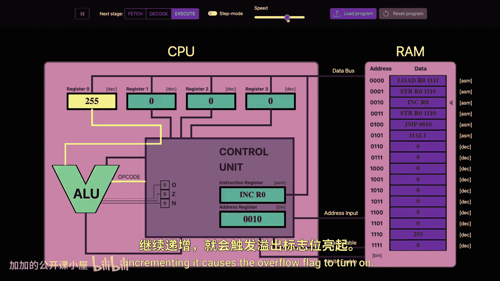

## 实现条件循环：条件跳转

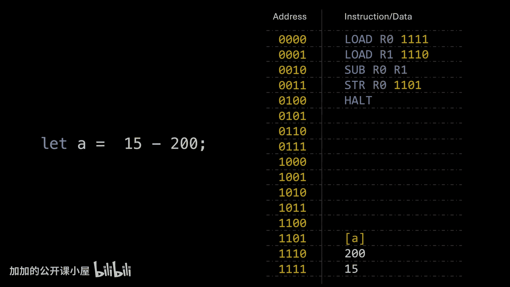

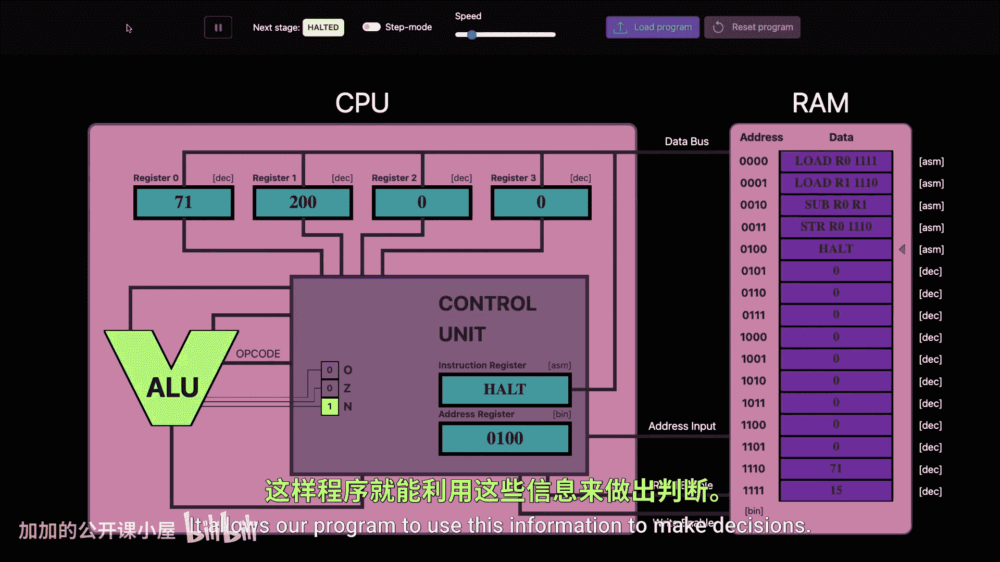

现在我们可以引入 **条件跳转** 指令。这些指令的工作方式是：仅在满足与标志位状态相关的特定条件时，才跳转到指定地址。

以下是几种常见的条件跳转指令：
*   **`JUMP_NEGATIVE`**：如果负标志位为1（结果小于0），则跳转。
*   **`JUMP_ZERO`**：如果零标志位为1（结果等于0），则跳转。
*   **`JUMP_ABOVE`**：如果零标志位和负标志位均为0（结果大于0），则跳转。

让我们用这些指令实现一个 `while` 循环：

```
A = 0
while (A < 5) {
    A = A + 1
}
```

实现思路如下：
1.  初始化 `A = 0`。
2.  循环开始：检查条件 `A < 5`。这通过减法实现：计算 `A - 5`。
3.  如果 `A - 5` 的结果为负（即 `A < 5`），负标志位置1。
4.  使用 `JUMP_NEGATIVE` 指令检测负标志位。如果置1，则跳转到循环体内部执行 `A = A + 1`。
5.  循环体执行完后，用一个无条件 `JUMP` 指令跳回第2步，重新检查条件。
6.  当 `A` 增加到5时，`A - 5` 的结果为0，负标志位为0，`JUMP_NEGATIVE` 条件不满足，程序会顺序执行下一条指令。
7.  下一条指令是一个无条件 `JUMP`，跳出循环，然后程序 `HALT`。

这样，只要条件满足，CPU就会在循环内执行；条件一旦不满足，就会退出循环。

## 实现条件判断：If语句

如果你想知道 `if` 语句是如何被CPU处理的，好消息是你已经知道了。`if` 语句与 `while` 循环非常相似，唯一的区别是：执行完 `if` 块内的代码后，我们不需要跳回去重新判断条件。

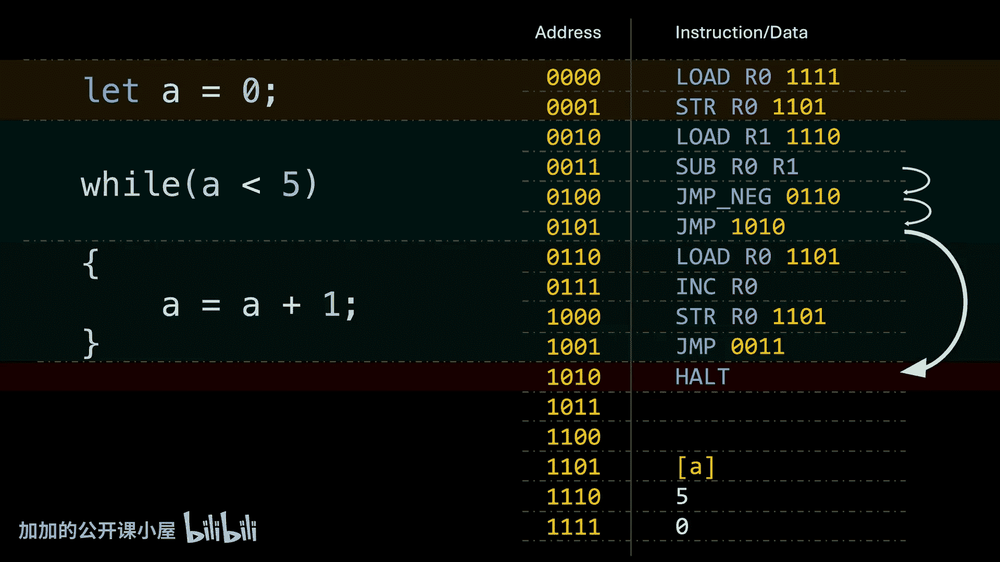

```
if (A < 5) {
    A = A + 1
}
// 后续代码
```

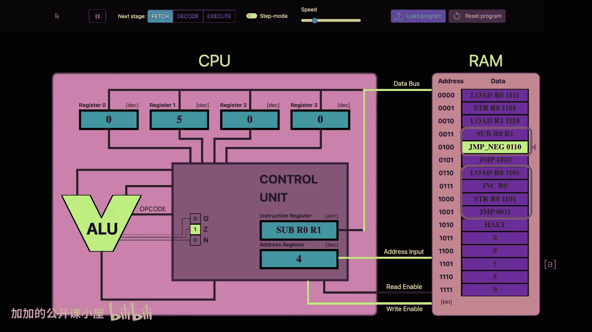

对应的汇编逻辑：
1.  计算 `A - 5`，检查负标志位。
2.  如果条件满足（负标志位为1），使用 `JUMP_NEGATIVE` 跳转到 `if` 块内执行 `A = A + 1`。
3.  `if` 块执行完后，**直接顺序执行后续代码**，无需跳回。
4.  如果条件不满足，`JUMP_NEGATIVE` 失败，CPU直接跳过 `if` 块，执行后续代码。

通过检查不同的标志位组合，我们可以实现各种比较操作：等于（检查零标志位）、大于（检查零和负标志位均为0）等。

## 总结与说明

本节课中我们一起学习了计算机处理器执行条件判断和循环的底层原理。我们了解到：
1.  程序通过加载、操作、存储数据的基本流程运行。
2.  利用 **`JUMP`** 指令可以改变执行流程，实现循环。
3.  **标志位** 为条件判断提供了依据。
4.  **条件跳转** 指令（如 `JUMP_NEGATIVE`, `JUMP_ZERO`）根据标志位状态决定是否跳转，从而实现了 `if` 和 `while` 等高级语言结构。

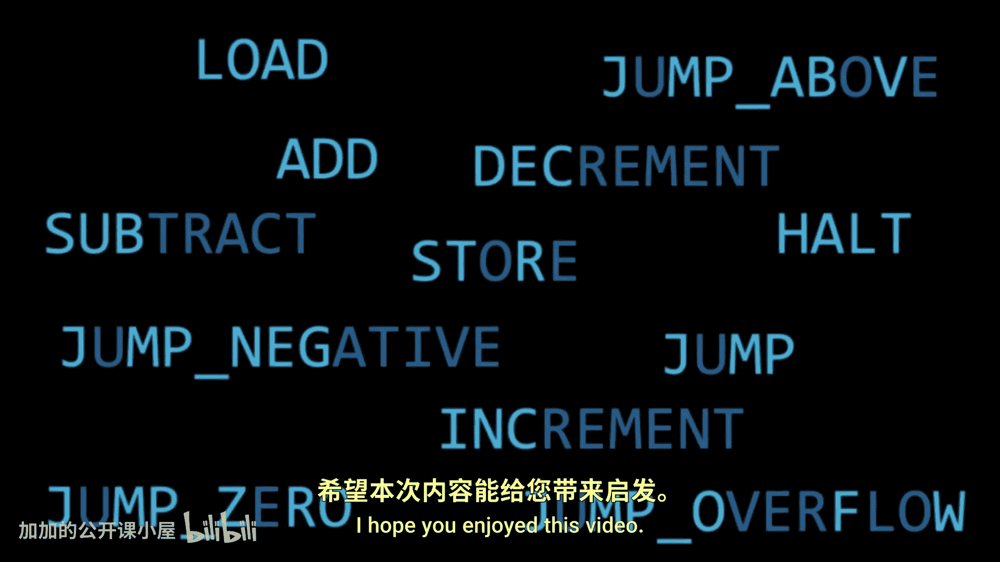


需要说明的是，本视频中使用的指令并非来自任何真实的处理器架构，而是为了便于理解而虚构的一套指令集。真实的汇编语言指令名可能更简洁（如 `JMP`, `JZ`, `JL`），但基本原理是相通的。

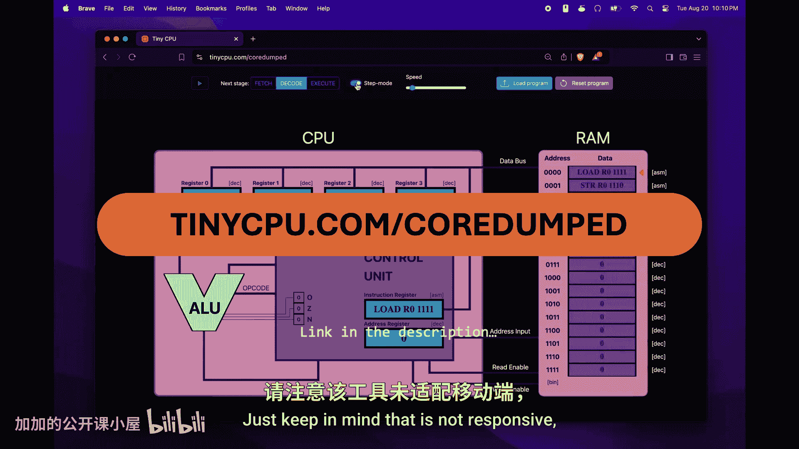


理解这些基础概念，是深入理解计算机如何工作的重要一步。从硬件的角度看待代码执行，能让我们成为更优秀的程序员。