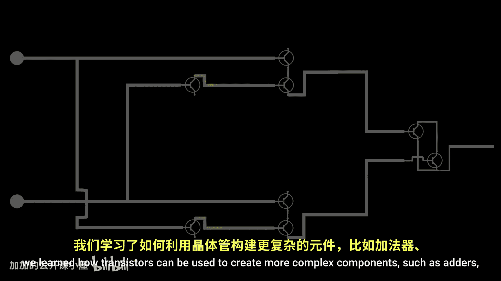
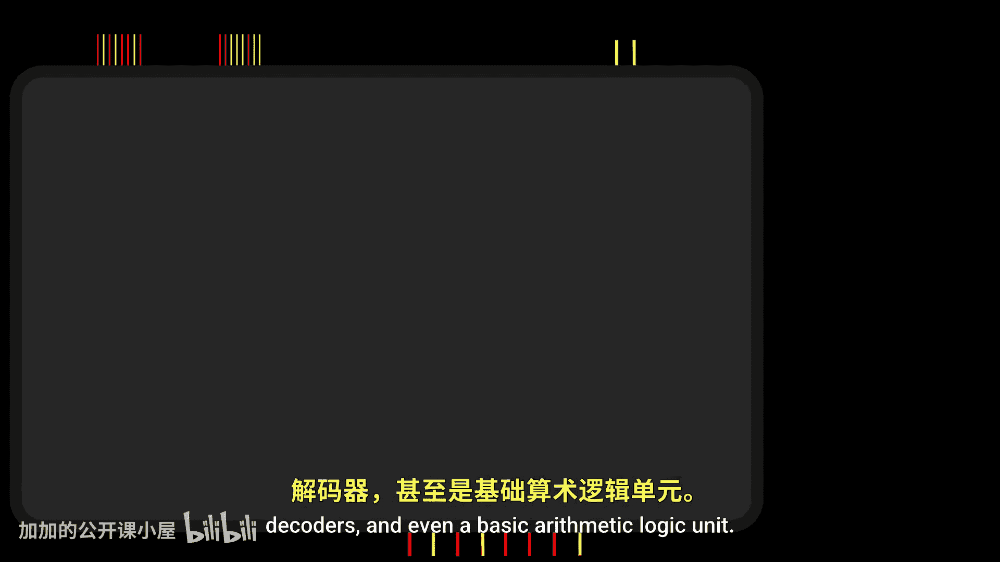
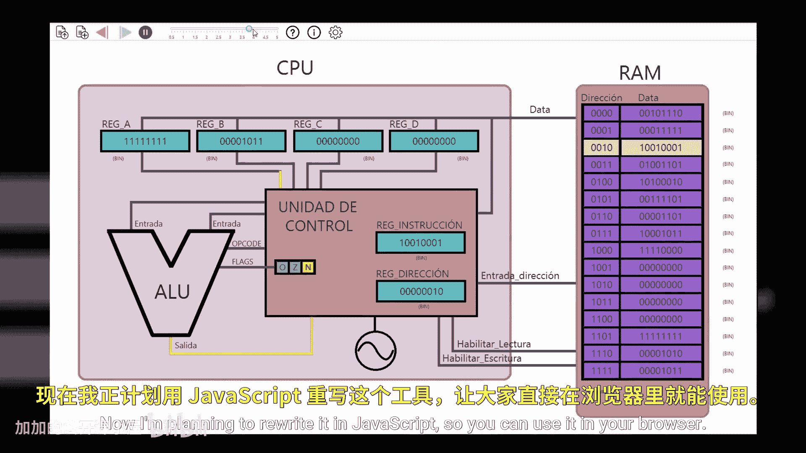

# 002：晶体管如何存储数据 💾





在本节课中，我们将学习如何使用晶体管来构建计算机的记忆单元。上一节我们介绍了如何使用晶体管构建加法器、解码器等复杂组件，但并未涉及信息如何被存储。本节中，我们将从基础逻辑门出发，一步步构建出能够存储数据的电路，并最终理解随机存取存储器（RAM）的工作原理。

## 从反馈到记忆 🔄




到目前为止，我们学习了如何使用晶体管构建逻辑门，以及如何组合逻辑门来实现更复杂的行为。这些电路的输入和输出信号通常朝同一方向流动，即信号向前传递。

但当讨论记忆时，我们指的是保留信息的能力。因此，我们可能会本能地思考：如果将电路的输出连接回其输入，会发生什么？

让我们分析一个或门（OR Gate）在这种情况下的行为。我们建立一个默认状态，所有输入都为0。记住，或门的输出为0，当且仅当它的两个输入都为0。

*   当我们把或门的第一个输入设为1时，输出会相应改变。
*   在极短的时间内（以纳秒计），电路状态如下：`输入1=1， 输入2=0， 输出=1`。
*   但由于电信号传播速度极快，这个输出值几乎瞬间就反馈到了第二个输入，将第二个输入也变为1。
*   现在，或门的第二个输入被设为1，那么无论我们将第一个输入设为何值，只要晶体管保持通电，输出都将保持为1。

换句话说，这个电路“记住”了其输出曾在某个时刻被设为1。

对于与门（AND Gate），我们可以得到类似的结果。回想一下，与门只有在两个输入都为1时才输出1。

*   如果我们从这个状态开始：`输入1=1， 输入2=1， 输出=1`，然后将第一个输入改为0。
*   输出将再次变为0。在极短时间内，电路状态为：`输入1=0， 输入2=1， 输出=0`。
*   但输出会立即反馈到第二个输入。现在，由于它的一个输入被永久设为0，无论另一个输入设为何值，该门将始终输出0。

因此，在某种意义上，我们可以说这个电路“记住”了其输出值曾被设为0。

## 构建一位存储器（AND-OR锁存器）🧩

现在我们有两个电路：一个能记住0，另一个能记住1。然而，它们单独使用并不特别有用，因为我们需要的电路是能记住1或0中的任意一个，而不仅仅是其中之一。

直观上，下一步是尝试将两个电路结合起来，观察结果。默认状态下，电路看起来是这样的：

```
输入A -> OR -> 输出
        ^      |
        |      v
输入B -> AND <- 反馈
```

电路最终保持的值取决于这个与门。为了得到输出1，我们可以将两个输入都设为1。由于输出会反馈回或门，我们可以将第一个输入重置为0而不改变输出，但不能重置第二个输入，因为它直接连接到与门。

让我们在第二个输入上添加一个反相器（NOT Gate），看看会发生什么。默认状态下，电路如下：

```
输入A -> OR -> 输出
        ^      |
        |      v
输入B -> NOT -> AND <- 反馈
```

在这种配置下：
*   如果我们将第一个输入设为1，与门的输出确实会是1，因为反相器确保了与门的另一个输入是1。即使电路的第二个输入是0，与门的输出（直接连接到或门的一个输入）确保了将第一个输入设回0后，输出仍将保持1。
*   同样，如果我们在第一个输入保持0的情况下将第二个输入设为1，反相器将导致与门输出0。同样，输出反馈到或门的输入将使电路保持0值。因为即使我们将第二个输入设回0，与门也需要它的两个输入都为1才能输出1，所以它将在输出中保持0。

换句话说，这个电路可以记住一位信息。每当我们想确定电路中当前保持的值时，只需读取这根导线上的值即可。

我们成功创建了记忆！我们可以将这个电路封装在一个盒子里，称之为**AND-OR锁存器**。

*   第一个输入允许我们将存储值设为1（Set）。
*   第二个输入允许我们将存储值重置为0（Reset）。

不幸的是，在这种设置下，当我们同时将两个输入都设为1时，情况会变得有些奇怪。简短的回答是：试图在将存储位设为1的同时将其重置为0是没有意义的。

## 门控锁存器（Gated Latch）🚪

如果我们想要一个更直观的机制，就需要额外的电路，使我们能够使用单个输入来指定要存储的值。毕竟，单根导线可以传输1或0，对吗？

是的，但有一个问题：一旦输入改变，输出值也会立即改变，因此它不再履行记忆功能；它只是简单地输出当前的输入值。

为了解决这个问题，我们引入另一个输入，可以在我们希望设置要记住的值时激活它。我们将这个新输入命名为**写使能（Write Enable）**。通过添加几个额外的逻辑门，我们可以实现更有用的行为。


*   当写使能输入设为0时，数据信号中的值被完全忽略，不会发生任何变化。
*   当写使能输入设为1时，电路将保留传递给数据输入的任何值（例如1），并且即使我们将输入设回0，该值也会持续存在。
*   稍后，如果需要覆盖电路中存储的值，我们只需激活写使能信号，同时输入我们希望存储的新值（例如0）。只要构成此门的晶体管连接着电流，该值就会被记住。

我们可以再次将这个电路抽象为一个称为**门控锁存器**的组件。需要澄清的是，创建锁存器还有其他几种方法，这里展示的并非唯一方式。

门控锁存器能够存储一位信息。如果其写使能输入设为0，则不会发生任何操作；但如果写使能输入设为1，它将保留通过数据输入传递的任何信息位。

## 从锁存器到寄存器（Register）📦

仅凭一位信息，我们可以表示基本数据，如1或0、真或假，或简单的区别如黑或白，但仅此而已，并不复杂。如果我们希望表示更广泛的数字或更大的颜色集合，单个位就不够了。

单个信息位并不真正有用，但我们可以使用多个锁存器来扩展我们可以存储的值的范围。例如，要存储一个字节（8位）的信息，我们可以使用八个锁存器，并将它们所有的写使能输入合并为一个输入，以便在我们希望同时覆盖所有单个锁存器时使用。

以这种方式互连的一组锁存器被称为**寄存器**，在这个例子中是一个8位寄存器。寄存器通常被比作直接集成到硬件电路中的变量，这是一个很好的类比，尽管有些抽象。最终，它们都由晶体管组成的逻辑门构成，并以巧妙的方式互连以保留值。

寄存器的主要挑战在于它们需要大量导线。寄存器内锁存器的数量决定了其长度，这可以变化。寄存器有不同的尺寸，然而，更大的寄存器意味着输入和输出都会增加。例如，要实现1千兆字节的存储容量，就需要一个巨大的寄存器，拥有数百万根用于数据输入和输出的导线。如果我们想记住更大量的数据，就需要另一种解决方案。

## 构建内存矩阵（Memory Matrix）🗺️

与其将锁存器线性排列，不如将它们组织成一个4x4的矩阵，总共16个锁存器。现在的任务是建立一种识别每个锁存器的方法。为此，我们将使用4根线表示列，4根线表示行。通过激活列和行中的各一根线，我们可以精确定位矩阵中的一个唯一锁存器。仔细想想，这类似于在地图上定位地址的过程，街道和大道通常都有编号。因此，我们可以说矩阵中的每个锁存器都有一个地址。

接下来，我们需要特殊的电路来按描述的方式激活这些导线。幸运的是，我们之前已经探讨过**解码器（Decoder）**。解码器在给定输入时，只激活其一个输出。例如，输入00激活输出0，输入01激活输出1，依此类推。

通过为行和列各使用一个解码器，我们可以输入一个地址来选择矩阵中的特定锁存器。例如，输入0000激活每个解码器的第一个输出，从而选择矩阵左上角的锁存器。输入0001激活列解码器的第一个输出和行解码器的第二个输出，从而选择矩阵中另一个不同的锁存器。每个锁存器都有其唯一的地址，这就产生了**内存地址**这个术语。

## 实现读写控制 📝

既然我们可以通过地址识别矩阵中的每个锁存器，下一步就是设计一种方法，用尽可能少的导线来读取和写入其值。

我们可以从为每个锁存器添加一些额外组件开始，以便我们可以使用单根导线既作为输入又作为输出。为此，我们创建一个新的输入，让我们可以在读取和写入锁存器之间切换。

*   激活**读使能（Read Enable）**信号将数据线配置为输出。有人可能会问，读取时输出信号是否会反馈到锁存器的输入？这不是问题，因为写使能信号未激活，因此会忽略任何输入。
*   当读使能输入关闭时，晶体管会阻止信号到达输出，从而允许数据线充当输入。当数据线作为输入时，我们可以将写使能设为1，覆盖锁存器中当前存储的值。

矩阵中的所有锁存器都可以以这种方式修改，但需要相应数量的数据线。与其使用32根线（16个输入和16个输出），我们只需要16根可以通过写使能和读使能输入切换的导线。

但我们还可以更进一步。通过将所有锁存器的数据线连接到一根通用的数据线，将每个锁存器的写使能输入连接到一根通用的写使能线，以及将所有锁存器的读使能输入连接到一根通用的读使能线，我们就可以在不使用16根数据输入线和16根写使能线的情况下设置矩阵中所有锁存器的值。

然而，让所有锁存器记住相同的值并不是我们想要的行为，我们需要每个锁存器记住自己的值。幸运的是，我们快成功了，因为我们已经知道如何使用解码器来激活恰好位于每个锁存器所在位置的交叉导线。

我们可以使用可靠的老朋友——与门，进行一些巧妙的修改，以确保写使能和读使能信号只到达地址输入指定的目标锁存器。

一旦地址输入改变，与门就会阻止任何输入信号通过此点。因此，在这个例子中，即使锁存器的数据输入设为0，锁存器仍将在其内存中保留值1，因为它的写使能输入是0。

当所有锁存器都以相同方式连接时，我们就得到了这个电路。很漂亮，不是吗？

让我们看看电路的实际运作：
*   将写使能输入设为1允许信号穿过矩阵，但由于与门的阻挡，它不会到达任何特定的锁存器。
*   为了让信号定位到特定的锁存器，必须提供一个地址，促使解码器为列和行各激活一根导线。唯一输出为1的与门位于解码器活动输出的交叉点，这就是为什么这个锁存器的值从1变为0，由数据线上的值（现在用作输入）决定。
*   要将此锁存器的值改回1，我们只需保持此配置，同时向数据线输入1。
*   如果地址输入改变，解码器的输出将改变，导致激活的输出在不同的位置交叉。写使能信号将专门针对那个特定的锁存器，从而用通过数据线传递的数据覆盖其值。
*   如果我们想读取特定锁存器的值，我们提供一个地址并激活读使能信号。这将使信号遍历矩阵，但专门针对地址指定的锁存器，使数据线充当输出。这就是我们读取矩阵中任何特定锁存器当前记住的值的方式。

值得注意的是，被读取锁存器的值会传播到整个矩阵，直接到达所有其他锁存器的输入。由于电路中没有其他锁存器的写使能输入被激活，这个值会被忽略，因此其他锁存器中包含的值不会被覆盖。

## 从位到字节再到内存抽象 🧠

好的，这里看到的实际上是一个过度简化的版本，即便如此，这也开始变得太复杂了。让我们用抽象来总结一下：通过地址输入，我们可以选择任何一个内部锁存器。使用读使能信号，我们使数据线输出所选锁存器的当前值。相反，如果我们使用写使能信号，我们可以使用数据线作为输入来覆盖所选锁存器中的值。

现在我们处理的仍然是单个位。你可能已经知道，计算机处理的最小数据单位是字节。为了存储字节而不是位，我们可以使用八个矩阵。所有这些矩阵将共享相同的地址输入，允许我们使用相同的地址在每个矩阵中选择对应的锁存器。读使能和写使能输入也应该共享，因为我们想要读取或写入整个字节，而不仅仅是单个位。每个矩阵将有自己的数据线，提供对字节内任何位的访问。

例如，要向内存写入一个字节：
1.  我们通过数据线输入构成字节的所有位。
2.  然后激活写使能信号。
这个操作导致字节的每个位被存储在每个矩阵中指定地址的对应锁存器中。字节现在存储在内存中。

稍后，如果我们想读取那个字节：
1.  我们输入地址。
2.  激活读使能信号。
这将导致数据线输出该地址处构成字节的每个位的值。

当我们编写程序时，不需要关心蚀刻在硬件底层的电子矩阵；相反，我们将字节视为连续存储的位序列。因此，我们进一步抽象，将内存概念化为一个字节列表。在这个抽象中，地址不是不可见矩阵中的交叉点，而是这个字节列表中的索引。

这被称为**随机存取存储器（Random Access Memory， RAM）**，因为我们可以通过提供其地址来指向列表中的任何随机字节。

为了简化，我们可以将这些导线组定义为一个**总线（Bus）**。地址总线的宽度决定了我们可以处理多少字节。例如，对于一个8位地址总线，使用两个各能控制16个不同输出的解码器，我们可以在矩阵中定位256个位中的任何一个。一般来说，如果地址总线有n个输入，则可以管理 `2^n` 个字节。例如，一个32位宽的地址总线可以寻址40亿个字节，这解释了为什么32位计算机最多只能处理4GB的RAM。

最后，请记住，我们今天学习的这种内存类型被称为**静态RAM（Static RAM， SRAM）**。这种类型的内存速度非常快，但所有这些逻辑门需要相当多的晶体管，因此生产成本较高。事实证明，矩阵中的那些小型存储单元也可以通过使用一种称为MOSFET的特殊晶体管和一个电容器来实现，生产成本更低，但比静态RAM慢。我将在后续视频中比较这些类型的内存。

## 总结 📚


本节课中我们一起学习了计算机如何存储数据。我们从简单的逻辑门反馈电路出发，构建了能存储一位信息的AND-OR锁存器，进而引入了控制信号，发展出门控锁存器。为了存储更多数据，我们将多个锁存器组合成寄存器。为了高效管理大量存储单元，我们将其组织成矩阵，并通过地址总线和解码器进行寻址，最终实现了随机存取存储器（RAM）的基本原理。我们还了解了静态RAM（SRAM）的特点。下一节，我们将把本集及之前学到的所有组件互连起来，以理解像加载、移动和存储这样的指令在硬件层面是如何工作的。