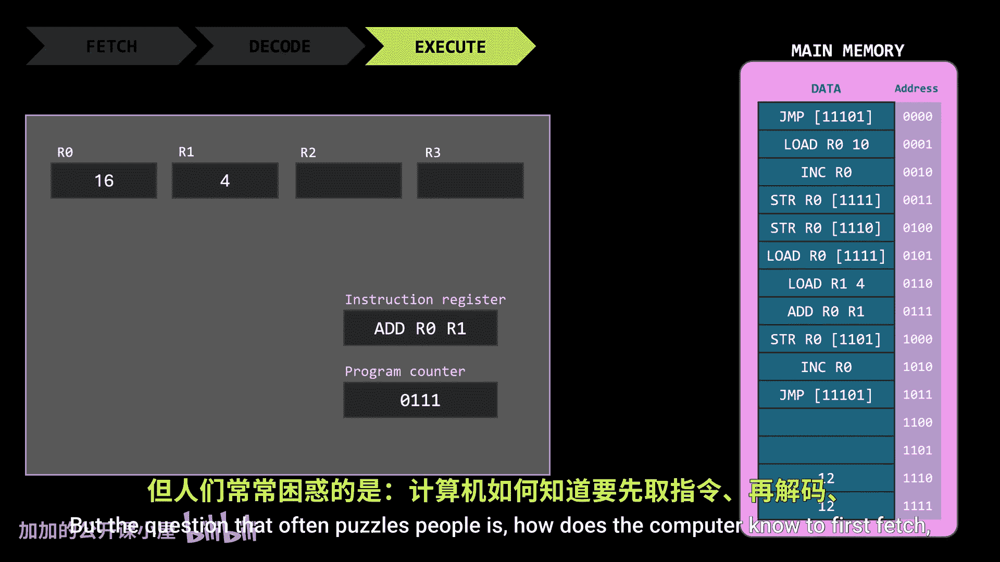
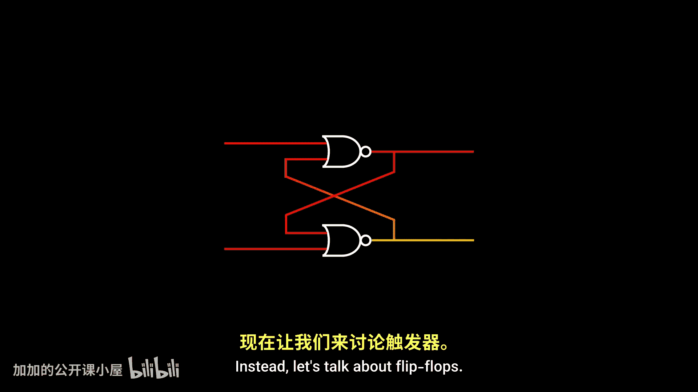
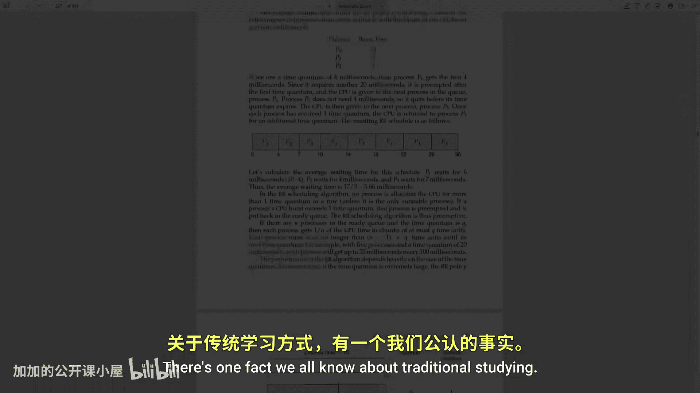
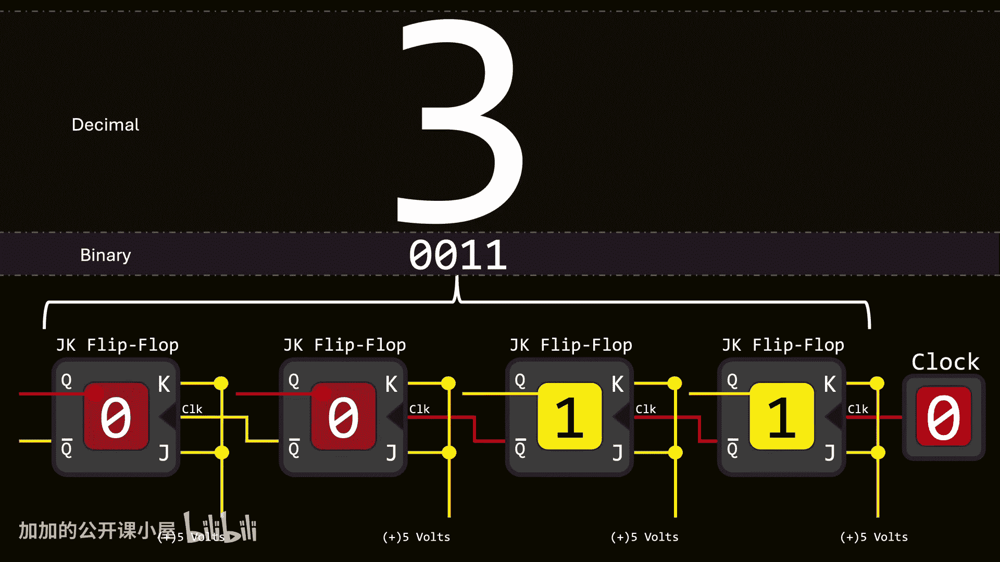

# 006：时钟如何驱动CPU“前进” ⏱️

在本节课中，我们将要学习计算机内部一个至关重要的组件——时钟。我们将探讨时钟信号如何像一个精确的节拍器，指挥CPU有条不紊地执行指令的各个步骤，例如取指、译码和执行。理解时钟是理解计算机如何实现自动化和高速运行的关键。

## 时钟的核心作用

计算机运行基于一个非常简单的原则：它们一条接一条地执行指令。执行每条指令需要几个步骤：取指、译码和执行。但一个常令人困惑的问题是：计算机如何知道先取指，再译码，然后执行，并一遍又一遍地按此顺序重复这个过程？

这个问题最简单的答案是：时钟。这是一个产生振荡信号的小设备，它与一些逻辑门协同工作，编排计算机按部就班地执行每条指令。

## 时钟信号与边沿

时钟信号可以被看作一系列脉冲。因此，很自然地认为每个脉冲都会促使处理器前进一步。我们的目标是了解这是如何实现的。实现方法有多种，我们将介绍最简单、最直观的一种。

首先分析时钟信号。时钟可以产生许多不同类型的波形，但我们关注方波，因为它只取两个值，完美匹配计算机的二进制特性。

时钟信号中一个特别重要的方面是**边沿**，即信号从一个值切换到另一个值的微小部分。
*   当信号从0变为1时，称为**上升沿**。
*   当信号从1变为0时，称为**下降沿**。

我们不关心信号值保持恒定的部分，因为在这些间隔内什么也不会发生，它们是系统无法做出反应的“死区”。但边沿则不同。

## 边沿检测器

我们可以构建用于检测边沿的电路。乍一看，你可能会认为这个电路总是输出0。一个与门（AND）只有在两个输入都为1时才输出1。但由于两个输入来自同一信号源，且其中一个被取反，似乎不可能同时为1。让我们更仔细地分析输入和输出随时间的变化。

当输入（时钟信号）为0时，电路稳定，无变化。当时钟翻转为1时，信号向左传播，但反相信号需要一点时间（以纳秒计）来更新。在这极短的瞬间，与门接收到两个1，导致它输出一个1。片刻之后，反相器更新后的输出到达与门，将其输出拉回0。当时钟翻回0时，反相器的延迟再次发生，但这次不影响输出。直到时钟再次翻转为1，才会发生重要变化。

观察该电路的输出并与时钟信号比较，可以清楚地看到：在时钟信号的每个**上升沿**都会产生一个快速脉冲。换句话说，我们创建了一个**边沿检测器**，具体是上升沿检测器。

## 从锁存器到触发器

在之前关于内存的视频中，我们讨论过锁存器（Latch），它是一种能够存储1或0的电路。这里展示的由两个或非门（NOR）构成，称为SR锁存器（置位-复位锁存器）。输出Q存储值，而Q（带横线）输出其反相值。
*   激活S输入会使Q输出1，即使将输入设回0，该值也会保持。
*   R输入将Q的值复位回0。
*   当两个输入都为0时，电路既不置位也不复位，只是记住最后一个值。

注意，将两个输入同时设为1没有意义，因为不应同时尝试置位和复位输出。如果这样做，在两者都被激活期间，Q和它的反相值都被强制为0，这不合逻辑，它们绝不应输出相同的值。不仅如此，当我们将两个输入同时设回0时，电路最终可能保持1或0，这取决于哪个输入比另一个早几纳秒改变，从而产生不确定性。

这种锁存器有一个变体，它非常相似，但增加了一个称为“使能”的输入。当使能输入为0时，其他输入无效。只有激活使能信号，才能置位或复位锁存器。这种变体称为**门控SR锁存器**。

## 触发器的诞生

你可能会问，这一切与时钟有何关系？如果我们使用时钟作为使能信号的输入，我们会得到一种行为：信号的电平（1或0）决定了锁存器是否可以被修改。但这并不新鲜，这是门控锁存器的预期行为。

然而，如果我们不直接使用时钟信号，而是在时钟和锁存器之间放置一个**边沿检测器**，事情就变得更有趣了。因为现在信号电平不再重要。例如，此时时钟信号可能为1，但边沿检测器输出为0。触发锁存器正确操作的是时钟的**上升沿**，即边沿检测器输出1的短暂瞬间。

这就是**触发器（Flip-flop）** 和**锁存器（Latch）** 之间的关键区别：两者都可用于存储一位信息，但锁存器是**电平触发**的，而触发器是**边沿触发**的。这个特定的触发器在上升沿触发，也有其他类型在下降沿触发。

但这个触发器继承了一个问题：无效状态（当我们同时尝试置位和复位时）。

## JK触发器

让我们尝试消除这个问题。为了避免过于复杂，我将从抽象内部的SR锁存器开始。我们可以给与门添加第三个输入，并确保它们永远不会接收到相同的值，这样只有复位或置位输入中的一个被允许通过，而不会同时通过两者。

仔细想想，Q和它的反相值非常适合此用途，因为它们总是相反的。在这种安排下，输入被赋予新的名称：J和K。在上升沿，J执行置位功能，而K执行复位功能。但是，如果在上升沿期间J和K同时被激活会发生什么？

这取决于当前存储的值：
*   如果值为1，只有K输入会生效，复位锁存器。
*   如果值为0，K将无效，但J会生效，置位锁存器。

换句话说，如果在上升沿期间J和K同时被激活，触发器会**翻转**其当前值。

JK触发器的操作如下：
*   当只有J被激活时，上升沿使其置位。
*   当只有K被激活时，上升沿使其复位。
*   当J和K同时被激活时，上升沿使其翻转其值。

这个翻转特性在各种场景中都有用，但我们特别关注以下应用：通过将J和K永久设置为1（例如，连接到代表1的5伏电压），时钟的自然振荡会导致值自动翻转。这会在输出Q处产生一个新的信号，该信号周期性地在两个状态之间交替，从而有效地生成了一个新的时钟信号。

仔细观察，由于翻转只发生在原始时钟的上升沿，因此产生的信号以原始时钟信号**一半的频率**振荡。

## 构建二进制计数器

有了这个，我们终于可以解决我们的主要问题了：时钟如何构造CPU以遵循这些步骤？

出于教学目的，我们假设每条指令需要四个阶段：取指、译码、执行，以及一个递增程序计数器的最终步骤，以便在下一个周期取指下一条指令。

我们需要一种电子机制，能够**停用**所有处理非当前阶段的电路。例如，在取指阶段，CPU需要激活三根线（地址寄存器的读使能、内存的读使能、指令寄存器的写使能）。在下一阶段，指令必须被译码，这意味着取指阶段使用的线不应再激活；相反，我们需要激活指令寄存器的读使能，允许其内容流向译码电路。

本质上，我们需要实现的是：**只激活当前阶段的电路**。换句话说，我们需要能够在多个选项中进行选择的电路。幸运的是，我们之前遇到过**二进制译码器**。对于不熟悉的人来说，二进制译码器是由逻辑门构成的电路，当提供二进制输入时，译码器只激活一个输出，即与二进制输入值对应的那个。

现在，我们只需要找出某种电子机制，能够周期性地递增译码器的输入，以便CPU可以顺序执行这些阶段。这正是JK触发器发挥作用的地方。

我们刚刚了解到，在这种设置中，时钟信号的每个上升沿都会触发触发器翻转，产生一个频率为原始时钟一半的新信号。如果我们把这个较慢的信号用作第二个触发器的时钟输入呢？对于我们的特定情况，我们将使用反相信号（使用Q的反相输出而非Q）。结果应该不会令人惊讶：第二个触发器以第一个触发器一半的速度振荡，或者说以时钟四分之一的速度振荡。

我们可以继续添加任意多个触发器，每个额外的触发器都会使信号振荡速度比前一个慢一倍。这种效应有许多与我们今天主要目标无关的应用，但仍然很吸引人。

这里还有另一种模式：将四个触发器的内容视为一个4位数字，仔细观察可以发现，每个时钟上升沿都会导致这个数字**加1**。当达到4位数字可表示的最大值时，下一个上升沿将使数字回到0，然后重新开始递增。

我们可以将这个电路抽象成一个单独的组件。注意，时钟不是组件的一部分，因为我们可能并不总是希望值自动递增。例如，用按钮替换时钟可以让我们控制上升沿何时发生。结果，存储的值只在我们按下按钮时递增。就这样，我们创建了一个**二进制计数器**。

## 整合所有部分

现在我们可以最终组装所有的拼图了。记住，我们需要一种机制来周期性地改变译码器的输入，以便在不同的执行过程阶段之间切换。由于我们处理四个阶段，我们需要一个2位二进制数作为输入，因此一个由两个JK触发器构成的二进制计数器就足够了。

由于我们不希望每次想让计算机前进到下一阶段时都按一下按钮，我们将二进制计数器连接到时钟，使计算机在每个上升沿前进到下一阶段。

至此，我们有了一个非常基础的概念，了解时钟如何持续指示计算机前进一步。当然，由于电子时钟可以非常快，这也解释了计算机如何能够以极高的速度执行指令。没有电子时钟，计算机就不会像我们所知的那样快，因为振荡信号将不得不以其他方式产生，很可能使用移动的机械部件，那将会慢上许多个数量级。

## 总结

本节课中，我们一起学习了时钟在计算机体系结构中的核心作用。我们从时钟信号和边沿的概念出发，探讨了如何用电路检测边沿。接着，我们回顾了锁存器，并引入了边沿触发的触发器，特别是JK触发器。通过将JK触发器连接成链，我们构建了二进制计数器，它能在时钟驱动下自动递增。最后，我们将计数器与译码器结合，展示了时钟如何通过产生有序的节拍，精确控制CPU指令执行流程（取指、译码、执行等）的逐步推进，从而实现计算机的自动化高速运行。