# CoreDumped【中英⚡图解操作系统原理｜Operating Systems Theory】 p01 P1 A PROGRAM is not a PROCESS. [BV19h48zoEeB_p1]

This video was sponsored by Brilliant。A question that arises in computer science is what to call all the activities performed by the CPU。

Early computers were batch systems that executed work units called Jobs。

As I discussed in my video about concurrency， when time sharingharing operating systems emerged。

 they were designed to share the CPU among multiple users。

 so it was said that those systems ran user programs。

Eventually the home computer market popularized the use of concurrency to allow a single user to run multiple programs at once。

But in computer science we don't refer to these entities as programs， but rather as processes。

So today， we are going to learn the difference between these two concepts。Hi friends。

 my name is George， and this is Core Dumped。For the vast majority。

 the answer to this question seems obvious。Programs。After all， that's what a CPU does right。

 it runs programs。But as I mentioned before， in computer science， the correct term is process。

Informally， a process is usually defined as a program in execution。

 even though this definition is technically correct。

 what I find frustrating is that it is not enough to help a casual reader understand what a process is。

So let's start by establishing what a process is not。Think about this。

 different programs are obviously intended for different purposes。

 but in many respects they are similar when executing。

 as they all reduce to the fundamental actions performed by the CPU。

 and here's where we can start making distinctions。

A program is a sequence of instructions and the data that the CPU needs to accomplish a specific task。

Now， if you carefully analyze this description， you'll notice that it can also describe an executable file。

 and that's because that's pretty much what a program is。

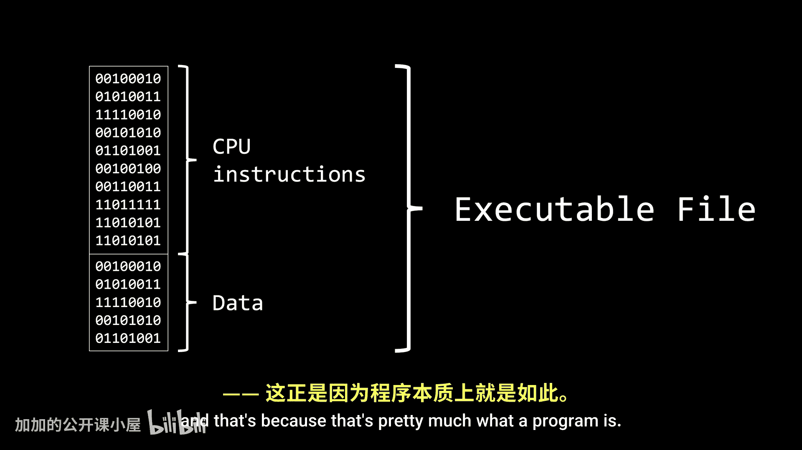

A program is that passive entity that resides in your storage。

 waiting for you to click on it to tell the computer to start running it。

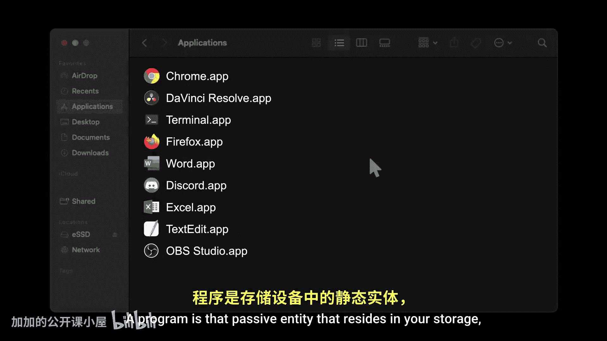

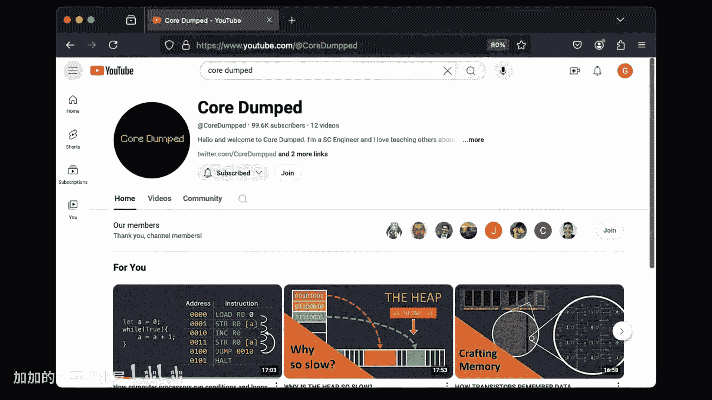

As I've mentioned many times in the past to run a program， it first needs to be loaded into memory。

 as that's where the CPU can start fetching instructions and data。When loaded into memory。

 the section containing the executable code is known as the text section。

 while data such as global variables and constant values is loaded into the data section。

But running a program requires more than these two sections。

 it also need extra space and memory to store all the data generated at runtime。

 like user input and temporary results or variables。

We already know a lot about the stack and the heap。

 such as the fact that they are growing and shrinking in size all the time。

The text section is the only one that never change， neither in size nor content。

 but we can't say the same about the data section because even though it doesn't change in size。

 its content may varies depending on what the running program is doing。As you can see。

 even though initially we loaded the program into memory， when running。

 this layout can no longer be considered as a program， of course not， it has now become a process。

And please note that this is the memory layout of the process， not the process itself。

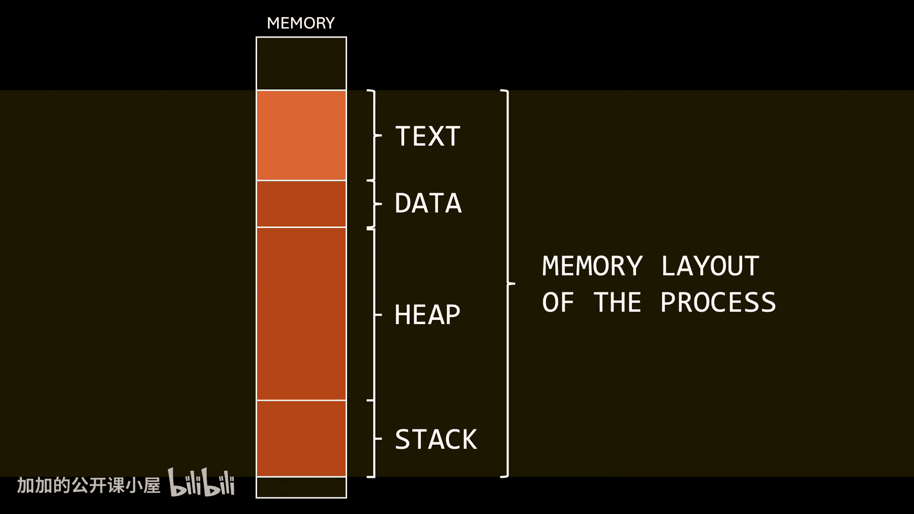

The reason this definition is often considered informal is that the notion of what a process is is far too complex to be captured in just a few words。

We're not going to go into technical details in this video because there's a video about processes already scheduled。

 but for now， let me help you get an idea of what a process is。

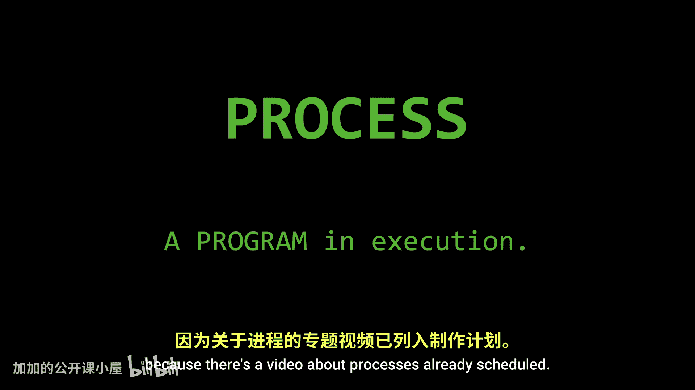

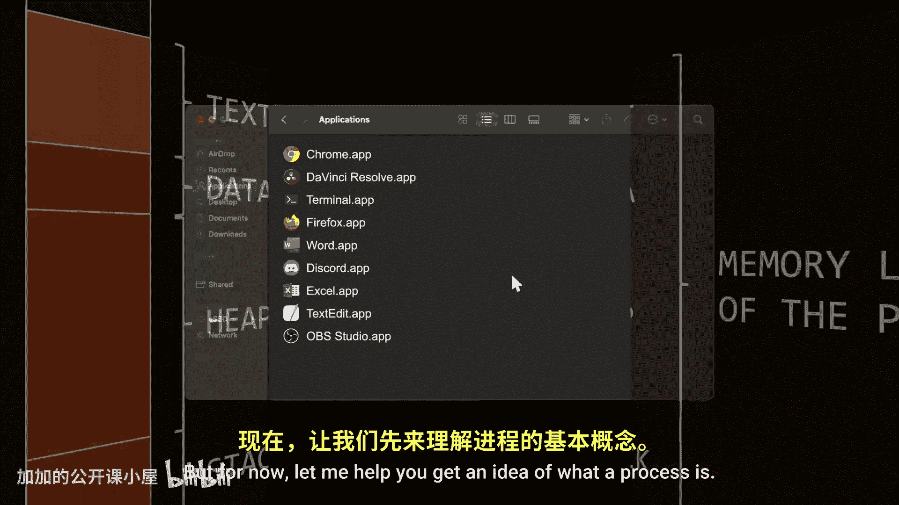

Consider that little program that comes with your operating system to open text files。

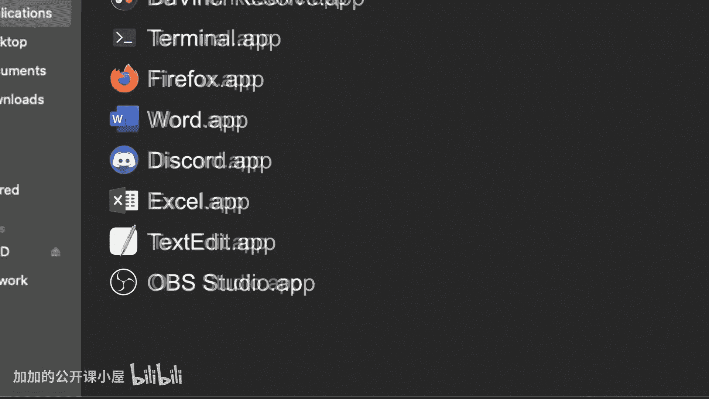

Now imagine we have two files to read if we open both files。

 the operating system will launch the text editor app twice this results in two separate windows。

 each displaying a different text file。Both are the same program。

 but two completely different processes。Each process has its own memory space。

While the content of the text section in both processes memory is identical。

 since they are the same program， the data they are working with is different。In this example。

 the first process is working with a much larger text file than the second。

 so it naturally requires more memory to manage its data。And if you're a casual viewer。

 hopefully that's everything you needed to understand the difference between a program and a process。

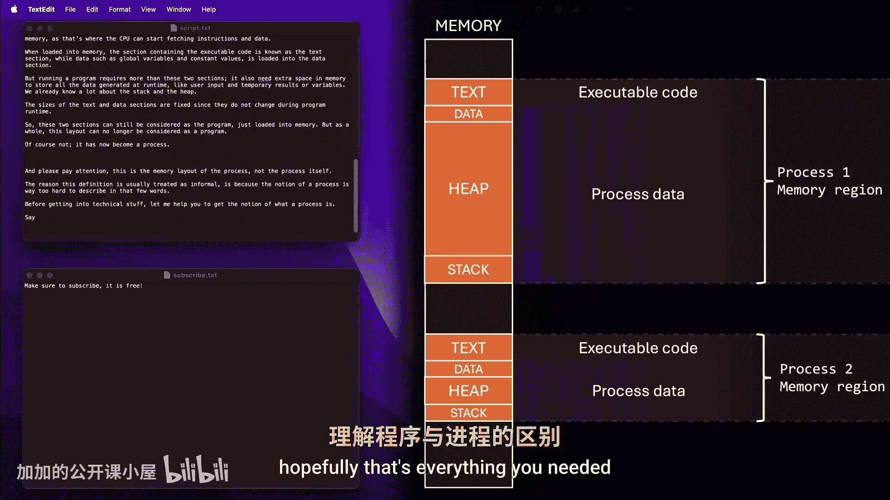

I want to send a special thanks to all of you because we finally surpassed 100。

000 subscribers I enjoy learning new things as much as you do， so if you're not already subscribed。

 I encourage you to do so。

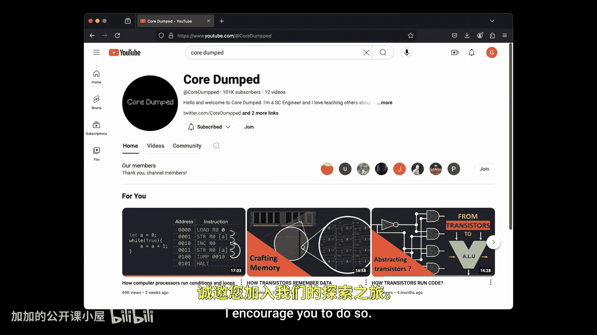

In the same way， I encourage you to check out Brilliant。

Learning is always more effective when it's done intuitively。

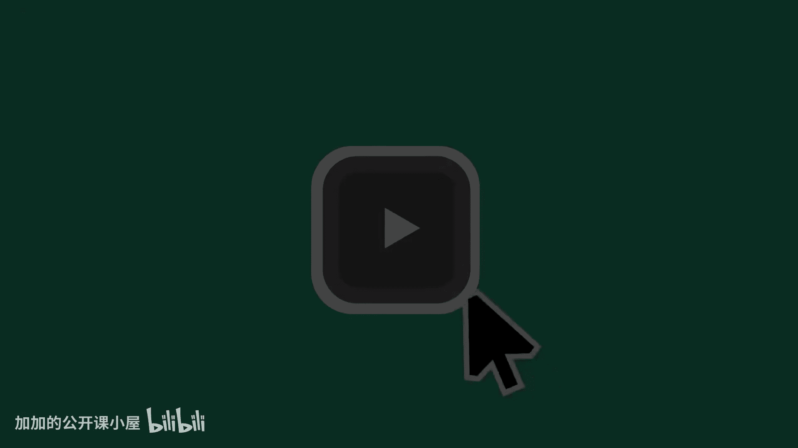

With Brilliant， you have access to a variety of courses that help you learn by doing。

 not by memorizing。Each lesson on Brilliant have been carefully crafted by professionals。

 filled with hands on problem solving that let you play with concepts。

A teaching method that helps build your critical thinking skills。Instead of reading endless PDFs。

 you can develop real knowledge by learning a little each day with fun。

 interactive lessons you can do whenever you have time。

You can choose from a wide range of courses such as thinking in code， learning Python。

 and even more advanced topics like how large language models work。

You can start your learning journey today， get one month of brilliant premium for free and enjoy a 20% discount on your annual subscription by visiting brilliant。

org/codumped， or by using the link in the description below。

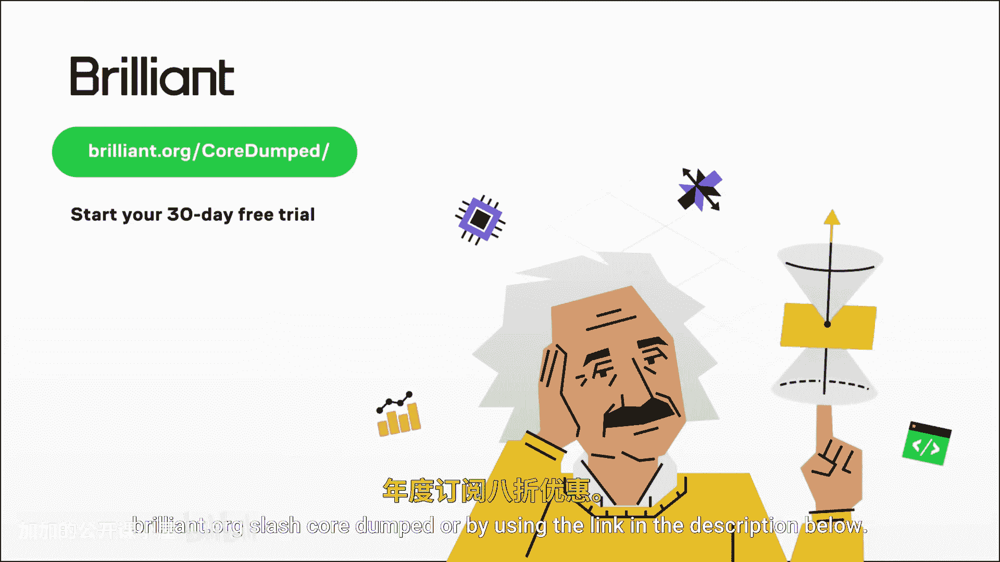

And now， back to the video， I emphasize that a program by itself is not a process。

 a program is a passive entity， whereas in contrast， a process is an active entity。

Although two processes may be associated with the same program。

 they are nevertheless considered two separate execution sequences。

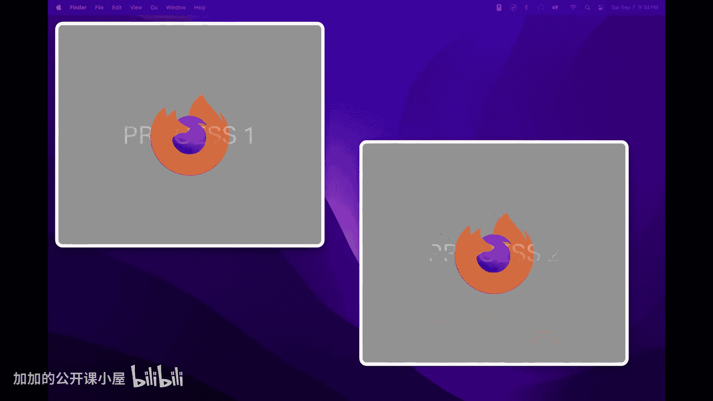

I know that having a notion of what a process is is not the same as being able to define it in technical terms。

 but as I mentioned earlier， a dedicated video on processes is coming soon。

This episode is not over though Everything I've discussed so far makes sense for compiled languages when using languages like C or rust。

 the result of the compilation is an executable file that is the program itself。

But what about interpreted languages like Python or JavaScript。

 where there is no compilation process？In Python， for example， every time we want to run code。

 we must first instruct the computer to run the interpreter and then tell the interpreter to execute our code。

In other words， there are now two passive entities involved， the Python interpreter。

 which is a program and our Python file， which is practically a text file I would like to highlight here the fact that the Python source file is not a program Remember that source code is just text that computers cannot understand and therefore cannot execute。

So in these kind of situations， the program we're actually asking the computer to run is the interpreter。

 not the Python code we wrote。Once this new process is created。

 it has its own memory region with text and data sections， as well as a stack and a heap。

 just like any other process。The key point here is that what's loaded into the text section is not our Python source code。

 but the executable code of the interpreter。Our source code is loaded by the interpreter process into one of its data sections。

 most likely the heap， because it serves as the data the interpreter will work with to read and interpret。

And let's wrap it up for now compilers and interpreters deserve their own videos since I'm committed to continue releasing quality content。

 once again， I encourage you to subscribe。If you enjoyed this video or learn something。

 please hit the like button， it's free and it really helps me out。Until the next time I'm George。

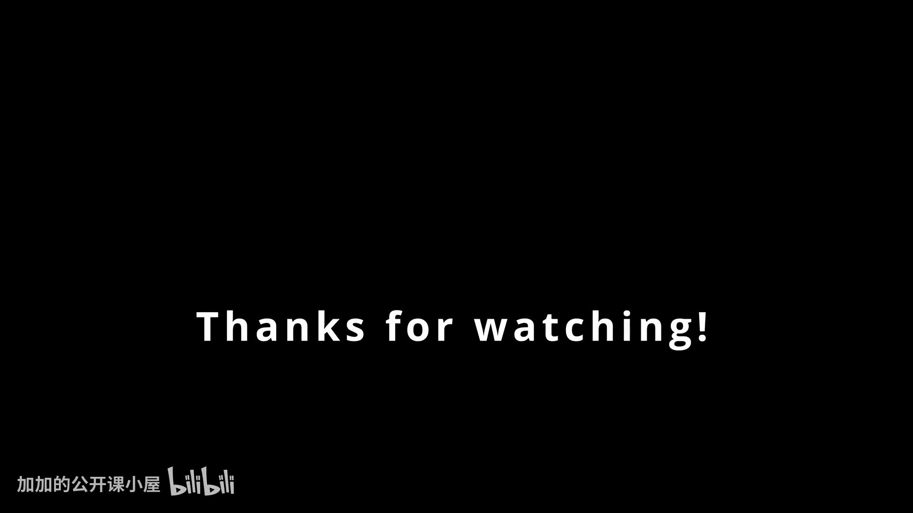