# CoreDumped【中英⚡图解操作系统原理｜Operating Systems Theory】 p02 P2 The Most Successful Idea in Computer Science [BV19h48zoEeB_p2]

This video was sponsored by Brilliant。

In a previous episode we talked about concurrency， the direction of this channel is now shifting toward lower level concepts more closely related to operating systems such as CPU scheduling。

 threads， paging， and virtual memory。

The challenge with these topics is that all of them are deeply tied to a concept we haven't yet covered in detail。

Today we're going to dive into the technical details of processes。Hi friends， my name is George。

 and this is Core Dumped。As we discussed in my previous video。

 a process is informally defined as a program in execution。

 meaning that these two concepts are not the same。A program is a passive entity。

 such as an executable file that we can launch to start running。

When we run a program， what happens internally is that its executable file is loaded into memory at this point。

 our program becomes a process。

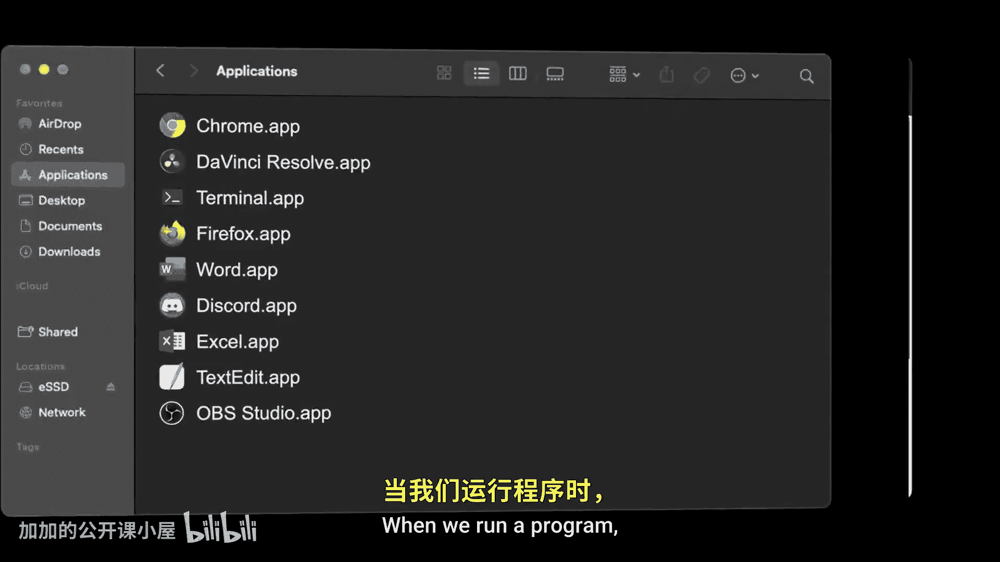

The execution of this process though might require additional memory to store user input and temporary results。

 the operating system is responsible for allocating that memory。

The memory allocated to a process receives a special name， the address space of the process。

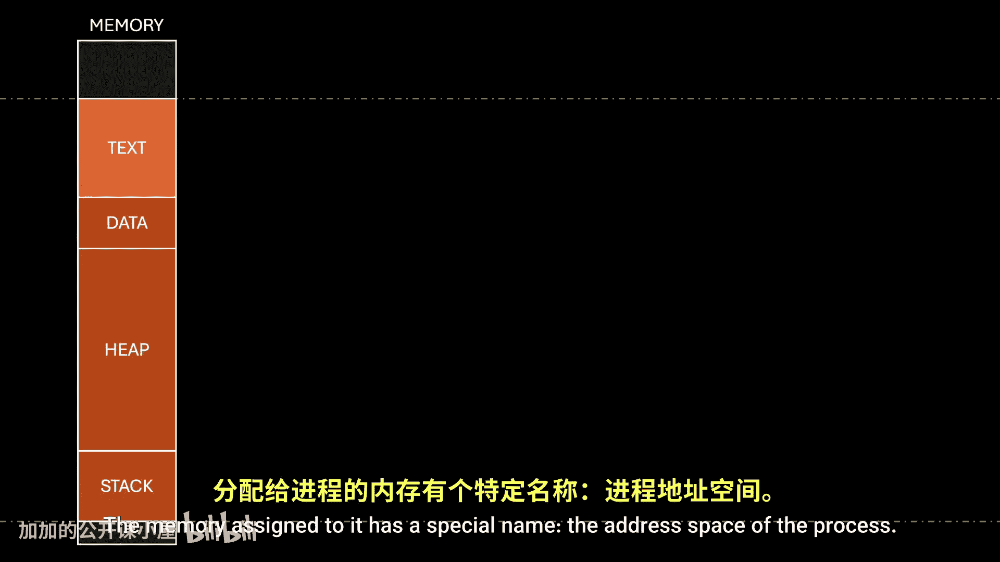

We'll return to this concept later in the video， so keep it in mind。A process， however。

 is more than just its address space。

As we know， modern operating systems use concurrency。

 allowing multiple processes to execute by alternating access to computer resources。Internally。

 alternating access to the CPU is achieved by placing processes in a queue。

 we'll understand how this work by the end of this video。

The key point now is that at any given moment， only one process can use the CPU while all others wait their turn。

Remember， the CPU has internal components like general Purse Regs， the instruction register。

 the address register also known as the program counter， the Sta pointer， and even flags。

When a process gains access to the CPUU， it uses these components to manipulate and move data。

This is what running a program essentially is， as we've covered in previous episodes。

But alternating CPU access between multiple processes is not as simple as it sounds。

If we simply switch processes， the process that gains access to the CPU would find itself in a CPU state that belongs to the previous process。

This leads to two major issues。First， this is a severe security risk since the current process could access sensitive information from the previous process。

I mean， imagine if the previous process was hashing a password。

 part of that password could still be stored in the registers。

 nothing would stop the current process from reading that information for malicious purposes。

So the first concern here is security。Now let's assume that all processes are honest and won't use the information from a previous process。

Does that solve all the problems？Well， no。Even if the current process has no intention of using that information。

 it still needs to manipulate the registers to carry out its own tasks； in doing so。

 it alters the CPU state of the previous process。So when the previous process regained CPU access later。

 the CPU state it had when it was interrupted would be lost。

So the second concern here is correctness of execution。

I know this might be a bit difficult to follow， so let me show you an example。

Let's say we want to run two programs。When compiled to assembly， they look something like this。

 of course， to be executed by the computer， the code must first be compiled into machine code。

Since binary can be hard to follow， we'll show the instructions in assembly for educational purposes let's assume that both programs are launched at the same time。

 to run them， they are loaded into memory。And for simplicity。

 let's also say the concurrency model used by the operating system allows each process to execute up to two instructions before switching CPU access to a different process。

To start executing the first process， the operating system sets the program counter so the CPU can begin fetching instructions for that process。

The first instruction tells the CPU to load the value 12 into register0， that's one instruction。

The second instruction tells the CPU to load the value 20 into register 1。

And that completes two instructions。At this point， the operating system sets the program counter so the CPU can start executing the second process。

Now that the program counter points to the executable code of the second process。

 we can say the CPU is allocated to it。Note that while the second process now has control of the CPU。

 the data the first process was working with is still present in the registers。Again。

 we assume this second process is not malicious and will mind its own business。

The first instruction of the second process tells the CPU to load the value 100 into register zero。

The next instruction tells the CPU to load the value 35 into register 1。

Now two consecutive instructions have been executed。

 so the operating system must reallocate the CPU back to the first process。

For this it needs to set the program counter to the correct address。

 so the first process can continue exactly where it left off。But first mistake。

We didn't store that address anywhere before allocating the CPU to the second process。

 so now we can't resume the first process。Here's where things start to go wrong。

Let's assume that the operating system had saved the program countervalue and is able to restore it properly。

The first process regains control of the CPU and continues execution from where it was interrupted Now the third instruction is telling the CPUU to add the values currently held in registers 0 and 1。

 which are supposed to be 12 and 20 respectively， however。

 since the second process modified the registers during its execution。

 the CPUU will now add the wrong numbers。The CPU， simply following instructions。

 has no way of knowing what happened， so it will continue executing the process using the incorrect data。

And problems keep going in this example。The first process overwrites the value and register zero during the addition so when the operating system realloccates the CPU to the second process。

 its CPU state will also be altered in a similar way， the second process will continue executing。

 but it will also end up not only adding the wrong values but also storing the wrong result。

In the end， we've managed to mess up both processes results。

Where the first process should have produced 32， it now gives us 135。

And where the second process should have produced 135， it instead gives us 170。

Perhaps the worst part here is that these wrong values are not deterministic。For example。

 if we had added a third process， or if the second program was launched even a few milliseconds later。

 we would have seen completely different wrong results。

This problem becomes a nightmare when we consider that modern computers handle hundreds of processes at once。

And to make matters worse， in practice， it is extremely difficult to predict the exact order in which processes will execute。

 as we'll learn in the CPU scheduling video。Okay， but then。

 how do operating systems ensure security and correctness when dealing with multiple processes The answer after a quick message from Brilliant。

 one thing many of you agree on is that traditional studying can be boring。

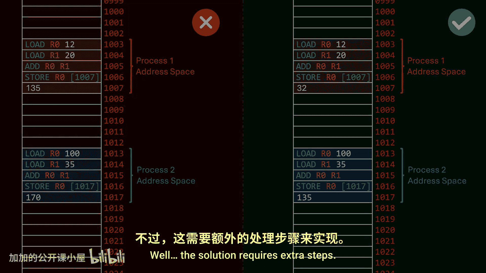

Fortunately， with brilliant， learning new things and developing new skills doesn't have to mean endlessly reading PDFs。

Brilliant is designed to offer small lessons that you can engage with whenever you find the time。

 making learning a little each day both enjoyable and convenient。

One of the best brilliant features is the interactive nature of their lessons。

 which encourage critical thinking skills through problem solving activities。

This can help you a lot if you want to become a better problem solver。

 which is what distinguishes good from average developers。Its latest course， thinkinging in Code。

 lays down the foundational principles of coding， enabling you to adopt the mindset of a programmer。

And you can pick other topics such as applied Python and C coding。

You can get for free 30 days of brilliant premium and a lifetime 20% discount when subscribing by accessing brilliant。

org/coreded， or by using the link in the description below。

And now back to the video。Remember， you can also support me by liking this video， it is free。

To ensure security and avoid conflicts while executing multiple processes。

 extra steps are required when switching access to the CPU。

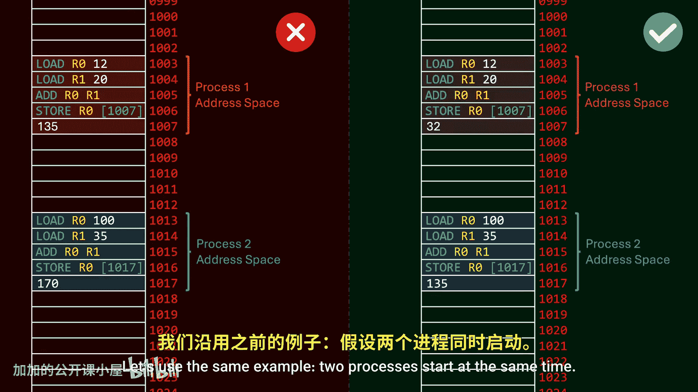

Let's use the same example two processes start at the same time we still allow each process to execute up to two instructions before interrupting them for the first process。

 it loads the value 12 into register 0 and then the value 20 into register 1。After this。

 the CPU must be allocated to the second process， but instead of simply overr the address register to make the CPU jump to the executable code of the second process。

 the operating system first runs a special routine to capture the current state of the CPU。

 this is like taking a snapshot， the purpose of this is to copy the contents of the registers。

 flags and program counter into memory so that when the process regains control of the CPU。

 the state it had when it was interrupted can be restored。

The operating system keeps a copy of the CPU state for every single process running on the computer right after the CPU state of the interrupted process is captured and safely stored。

 the CPU state of the next process is restored。In this case。

 since the second process hasn't executed any instructions yet， all of its registers are set to zero。

 except for the program counter， which points to the next instruction the process should execute at this moment that would be the first instruction at memory location 1013。

Now the second process starts executing， loading the value 100 into register0 and the value 35 into register 1。

After two instructions， it is interrupted to allow the CPU to be reallocated to the first process。

But once again， before doing that， the CPU state of the second process is captured and safely stored。

Only after storing this information does the operating system retrieve the state of the first process and copy it into the corresponding registers in the CPU。

By doing this， each time a process regains control of the CPU。

 it will find the registers exactly as they were when it was interrupted。

These extra steps resolves both problems。A process can no longer access the information the previous process was using。

 and since its own state hasn't been altered by the other process。

 it can continue execution with the confidence that it is working with the correct data。

This action of capturing the CPU state of a process and restoring the state of a different process so it can continue execution is known as a context switch。

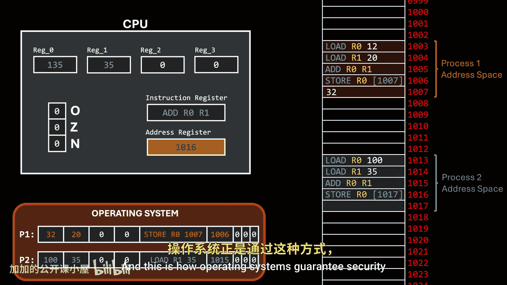

And this is how operating systems guarantee security and correctness when sharing the CPU among multiple processes。

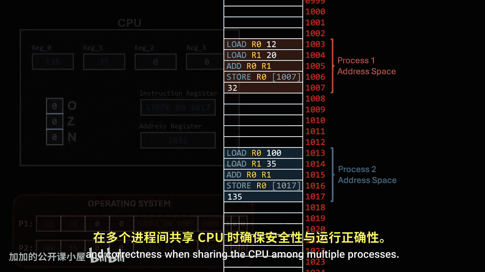

Okay， so now we already know that a process has an address space， a program counter， and registers。

 which can be informally defined as the CPU state of the process， but what else does a process have？

Well， a process might also have a list of open files， as well as IO devices allocated to it。

This is the simplest way we can visualize a process， as you can see。

 instead of being a single entity， a process is this entire context isolated from other processes。

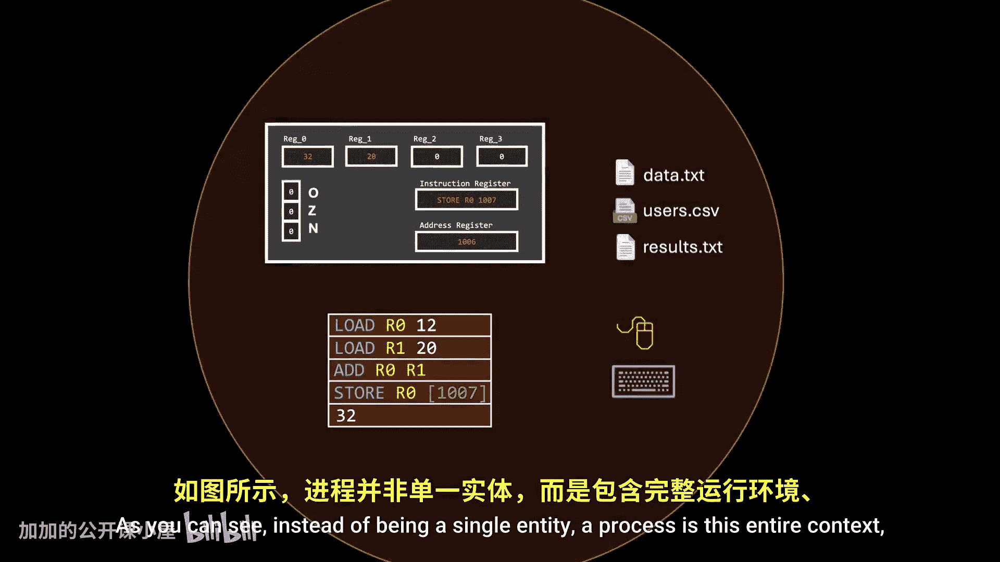

This is why the kernel routine we learned about earlier is called a context switch。

When we switch processes， we are replacing the entire context in which the system operates。

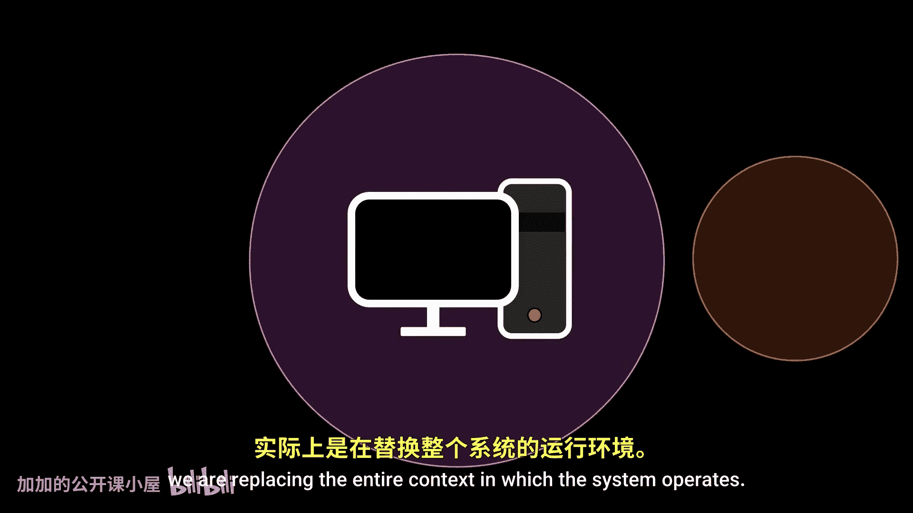

This also explains from a high level perspective， why multiple processes can have the same executable instructions。

 but still produce different results when executed， it's not only about the instructions。

 but also the context in which those instructions are executed。

And that's the best way we can describe a process with a single word， a context。

The question that arises now is， if a process is this entire context that includes from low level components like registers to higher level things like a list of files。

 how can we put them in a queue？

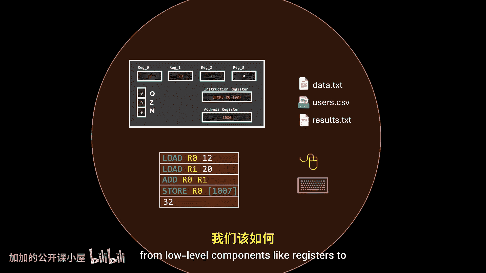

I mean， a process isn't like an object we can simply use as an element in a data structure。

 so how do we manage this？The answer is the PCB No。

 not that one In this case PCB stands for processces Control Block。

 a special structure the operating system uses to keep track of every single process。

Since every process is unique， it requires an identifier known as a process ID。

A process also has a state， which can be any of several possible statuses。

 we'll discuss this in more details in a future episode。In addition， a process has a program counter。

 a list of general purpose registers， an instruction register， and flags。Depending on the hardware。

 a process might also have a stack pointer， index registers， accumulators。

 and other components I won't list here This is what I informally refer to as the CPUU state of the process。

Do you remember that a context switch requires capturing the CPU state for each process？Well。

 this is where that data is stored。Regarding memory。

 the operating system must also track all the memory blocks allocated to each process。

Remember when we mentioned that each process has its own address space Well。

 running multiple programs concurrently introduces a new security issue because without extra precautions。

 any process could potentially read from or write to the address space of another process。

The operating system needs to be aware of these boundaries to intercept any malicious memory access。

Additionally， when a new process is created， the operating system needs to be aware of the address space of each existing process to correctly allocate an available memory region for the new process。

Therefore， the process control block should contain memory management information。

 at least including the memory limits of each process's address space。

And here we can also add other resources allocated to the process。

 such as a list of IO devices or open files。Now the structure you're seeing is just an example。

 if you want to see a real implementation， we can look at the source code of the Linux kernel under this path。

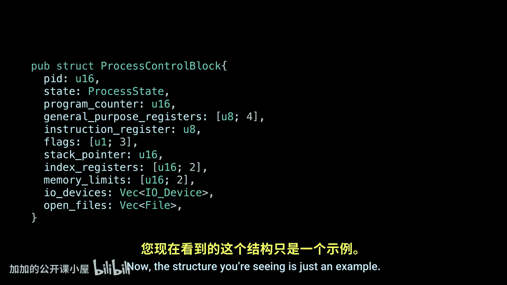

The first interesting thing to note is that the structure is called a task， not a process。

 the reason is called this way is because Linux uses the term taskask to represent the fundamental unit of execution。

 encompassing both threads and processes within a single data structure。

 effectively treating them as the same entity for scheduling purposes。

 another interesting thing I noticed when reviewing the implementation is that the process control block contains a pointer to the PCB of the parent process。

 as well as the children process， so I guess we could add that detail to our example。

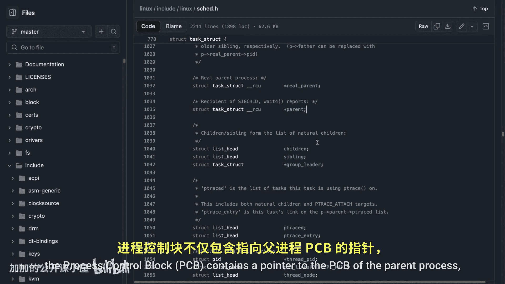

Again， I want to emphasize that the process control block is not the process itself。

 but rather a representation of the process。

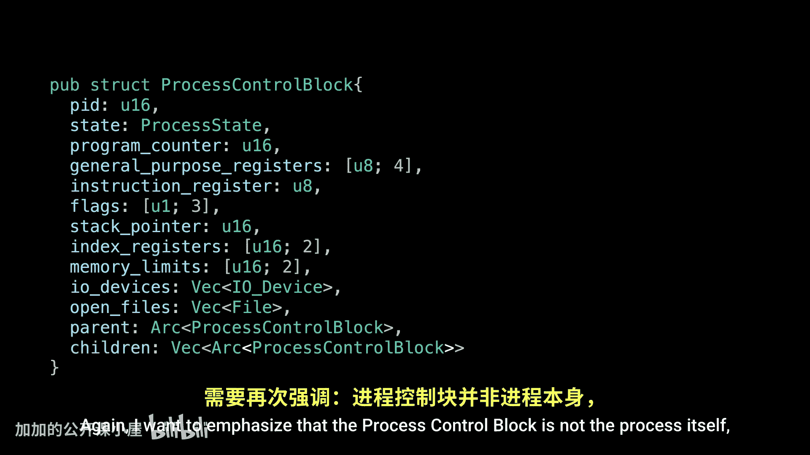

It serves as a repository for all the data needed to start or resume a process。

 along with some accounting information。

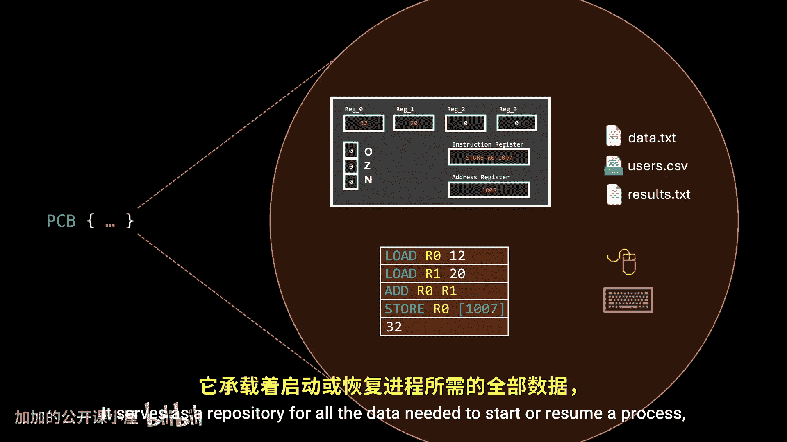

And this representation is what is actually placed in a queue。And at this point。

 we should be ready to dive into CPU scheduling， a topic for a future episode。Finally。

 keep in mind that everything we've covered in this video is valid for both single processor systems and multicore systems。

 the only difference is that multicore systems can operate with multiple contexts at the same time。

 due to each core having its own execution pipeline。If you enjoyed this video or learn something。

 please hit the like button， it is free， and that would help me a lot。

 and consider subscribing if you want to learn more， you don't want to miss future episodes。

Until the next one， I'm George。