# CoreDumped【中英⚡图解操作系统原理｜Operating Systems Theory】 p03 P3 How a Single Bit Inside Your Processor Shields Your Operating System's Integr [BV19h48zoEeB_p3]

One of the first things we learn about operating systems is that they act as intermediaries。

 sitting between hardware and user programs This means user programs cannot access hardware resources without the intervention of the operating system if we think about it。

 both operating systems and user programs are software After all。

 they are all built using programming languages but if that's the case。

 why can't user programs overpower the operating system and take control of the computer。Today。

 we're going to explore how a clever cooperation between hardware and software contributes to the robustness of modern operating systems。

Hi friends， my name is George and this is Core Dumped。Before we begin。

 I want to clarify that much of the information in this video has been simplified for easier understanding。

Neither the implementations nor the assembly code shown correspond to any real platform or architecture。

This is one of those rare occasions where software alone is not enough to solve a problem。

 so hardware support is needed， as you may know， every computer processor has a specific set of actions it can perform。

 called the instruction set of the processor。If we want to give one software more control of the system than another software。

 we can define a subset of special instructions that not all processes can use。

Many architectures define what is known as privileged instructions。To enforce this。

 the hardware must support different operational modes。

 and the common approach to do that is to use a special1 bit register that can hold either a1 or a0。

This register is called the mode bit when its value is set to one。

 the processor is said to be running in privileged mode。

 which means it can execute any instruction in the instruction set。

 including privileged instructions。When the value is set to zero。

 the processor runs in restricted mode， meaning it cannot execute privileged instructions。As we know。

 the CPU internally uses combinational logic circuits to decode incoming instructions。

The Mo bit has little to no effect on normal instructions because they can be run regardless of the operational mode。

However， when it comes to privileged instructions， the value held in the mode bit determines whether the running process is allowed to execute them。

In this way， privileged instructions can only be executed if the processor is operating in privileged mode。

And here， the question that might come to mind is， how or who can flip the value of the mode bit。

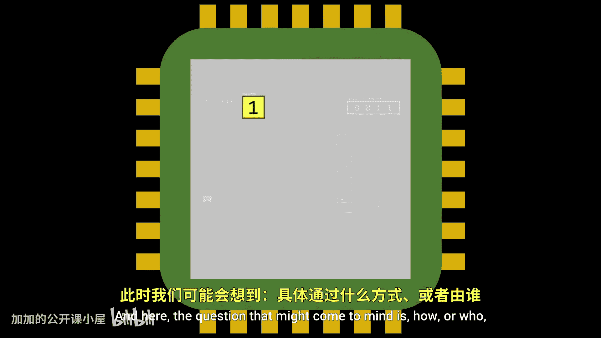

This is perhaps the most delicate part of the mechanism because if any user process could simply switch to privileged mode。

 the feature would be pointless。There might be several ways to handle it。

 but the switching mechanism is typically implemented through interrupts。

Let's set aside the mode bit for a moment to explain what an interrupt is。

When a processor runs a program， the address register points to the memory address of the next instruction to execute。

An interrupt is like a signal sent to the CPU， notifying it that an event has occurred， for example。

 if the user presses a key or moves the mouse an interrupt can be triggered to make the system react to the event。

When the signal is received， it causes the processor to pause the current process and jump to a specific memory location。

This memory location contains the executable code that the CPU will use to handle the interrupt。

This routine can be divided into four steps First， the CPUU needs code to save the state of the interrupted process。

 then there's code to handle the interrupt， for example， calling a routine to print a string。

After the interrupt is handled， the CPU executes code to restore the state of the interrupted process；

 Finally， the CPU executes a special instruction called interruptrup returnturn。

 which allows it to jump back to the interrupted process and resume its execution。

That's the basic flow of how an interrupt works， it temporarily halts the current process and transfers control to another routine。

Now， back to the bit mode， interrupts can be used not only to make the CPU's program counterju。

 but also to automatically flip the value of the mode bit to one。

 this means that whatever code resides at that memory location gains control of the CPU。

 and it does so in privileged mode。And here's something I want to make sure is very clear。

Any executable entity could be loaded into this memory region， a web browser， a text editor。

 anything。This is why we must be extremely careful once this entity gains privilege mode。

 it can do virtually anything within the computer， and that includes making sure that no other process gains privilege mode。

The modern approach is to ensure that the operating system is loaded there。

 so it can use privilege instructions to maintain complete control of the system。

Processors that support operational modes were designed specifically for this。

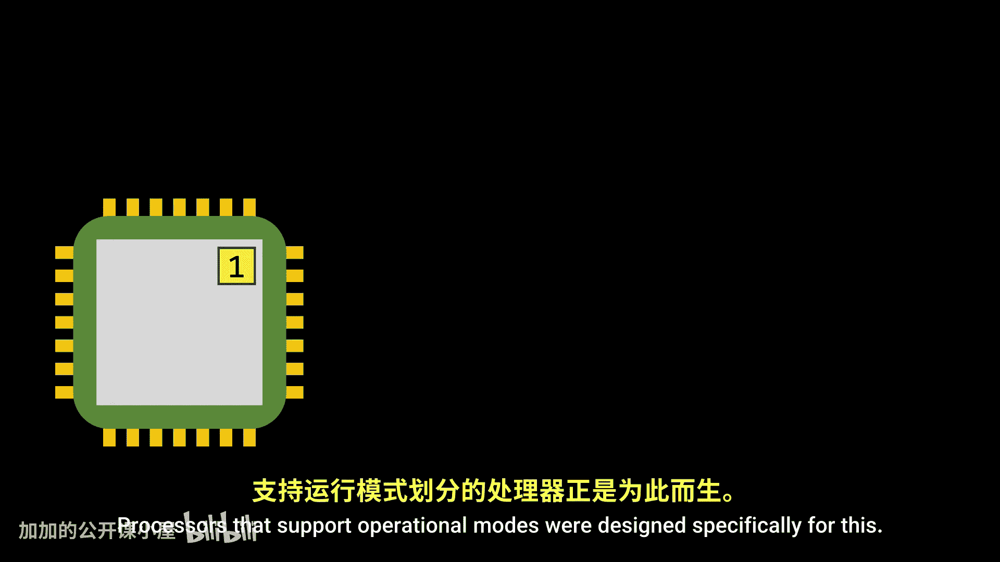

Privileged mode is meant to be used by the operating systemss kernel。

 which is why it is commonly known as kernel mode restricted mode on the other hand。

 is meant for user programs， preventing them from overpowering the operating system For this reason it is commonly referred to as user mode。

Now let's take a look at some things that kernel Mo can do， but user mode cannot。

The most obvious example is interacting with IO devices like network and graphics cards， hard drives。

 and peripherals such as monitors and keyboards。Direct manipulation of these devices requires privileged instructions。

 meaning the CPU can only do it while running in kernel mode。When it comes to memory。

 privileged instructions allow the manipulation of a special hardware component called the Memory management Uni。

This unit is responsible for limiting the physical memory regions that the CPU can access。

Having control of the MMU means having complete control over memory。

 that's why the operating system can read and write anywhere in physical memory。

 including the address space of user programs。Another thing privileged instructions allow is the ability to redefine how interrupts are handled。

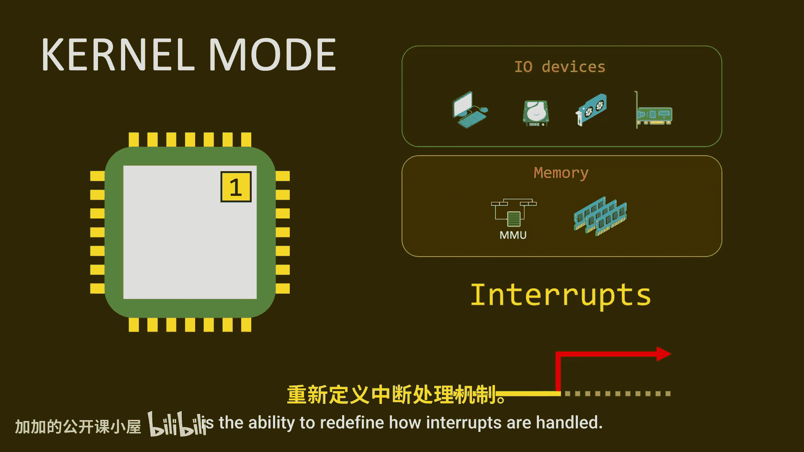

As I explained earlier， interrupt caused the CPU to jump to a specific memory location that contains the routine necessary to handle the interrupt；

 The issue is that memory isn't always used the same way and the code to handle and interrupt might not always be loaded in the same location as mentioned earlier。

 it would be dangerous if an interrupt caused the CPU to switch to kernel mode and land in the address space of a user process。

That's why privileged instructions are useful， they allow the operating system to define the exact memory location the CPU must jump to when an interrupt is triggered。

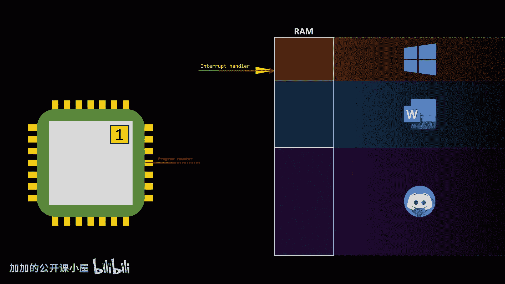

And because the memory management unit can only be manipulated through privileged instructions。

 the operating system uses it to ensure that user processes cannot access the memory locations where interrupt handlers are stored。

This prevents any malicious process from overriding the interrupt handlers and attempting to take control of the system。

In kernel mode， we have full control over the interrupt flow of the CPU。

 and by now you've likely noticed that while the hardware provides the tools。

 it's ultimately up to the software， and by this I mean the operating system to use them correctly to maintain control of the system。

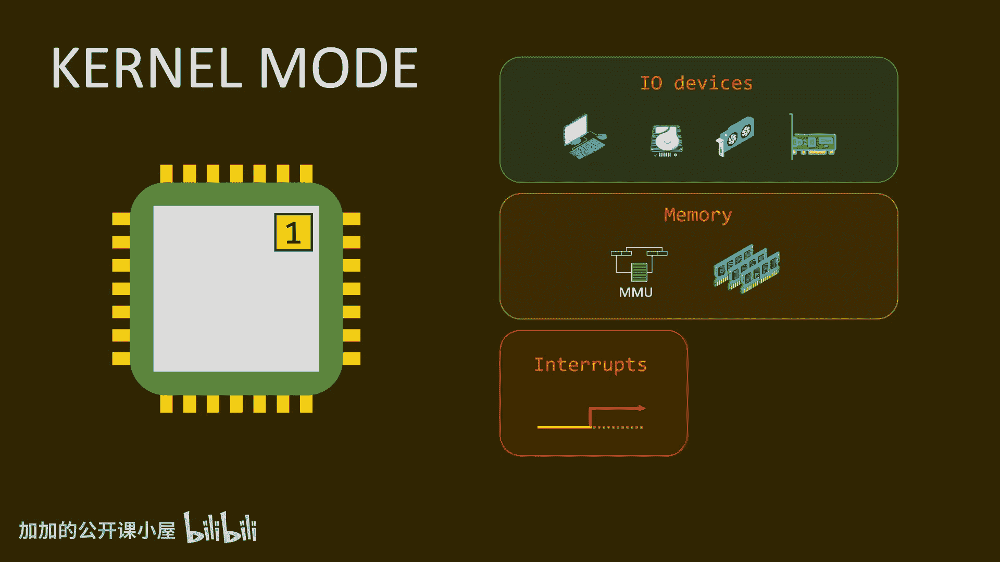

And these are just a few examples of things that programs running in user mode cannot do。

User programs are still allowed to use a wide range of instructions in user mode。

 programs can perform essential tasks like moving and copying data， executing arithmetic。

 floating point， and bitwise operations， evaluating conditions and running loops。However。

 imagine if programs couldn't do basic things like reading files， displaying text on the screen。

 or sending messages over the network。User programs still need to access hardware in some way。

 otherwise they wouldn't be very useful。So how do they manage that。

 the answer after a quick message from Ne code？

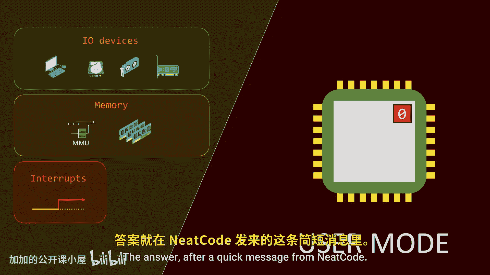

Solving endless programming problems won't get you far without proper guidance。

If you're looking to sharpen your problem solving skills and crush your next technical interview。

 Necode。Io offers structured， interactive courses on data structures and algorithms。

With a mix of videos， articles， animations， and practice problems。

 Ne code makes learning more effective。Personally， I find it way more enjoyable than other platforms。

 because each lesson builds upon the previous one， and by the time you reach more advanced topics。

 you'll have a solid foundation， rather than just a warning tag saying that you probably won't make it。

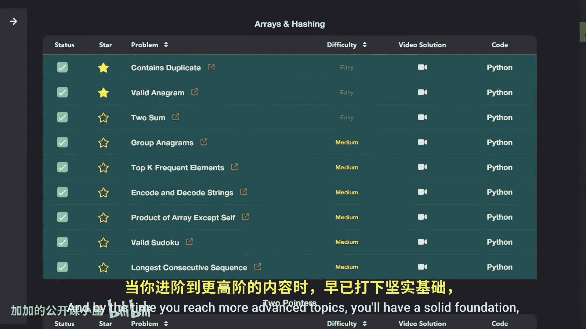

Remember， Necode。io and if you want to support me and get a discount when you sign up。

 you can use the link in the description below。

You've probably heard about APIs。To allow user programs to access hardware resources。

 operating systems provide a set of functions in the form of a library。

 these functions are known as system calls， and they are essential for user programs。For example。

 if a user program needs to work with files， it will need a system call to open the file。

 more system calls each time it wants to read or write to the file。

 and another system call to close the file when the work is done， system calls are still functions。

 which means they must have an internal implementation that is eventually compiled into machine code。

But here's where things start to seem a bit strange。Because these functions are part of a library。

 when we write user programs and use these functions， they become part of our source code。

This means they'll become part of our user program when compiled。

 but that doesn't quite add up because we just established that user programs run in user mode and therefore。

 cannot use the privileged instructions required to manipulate hardware。

So what's really going on here？If we take a closer look。

 we'll notice that at some point inside these system call functions。

 there's an instruction that triggers an interrupt； Yes。

 interrupts can be triggered not only by hardware but also through software。In this case。

 the int instruction causes the program to trigger and interrupt。

 which makes the program counter jump to a routine in the operating system's address space。Remember。

 when an interrupt occurs， the CPU switches to kernel mode。

 allowing the routine to execute all the privileged instructions necessary to manipulate hardware and fulfill the system call。

 once the required privileged instructions have been executed。

 it's necessary to return control to the interrupted process。

 and ensure that the mode bit is set back to zero so that the program resumes execution and user mode as intended。

How this is done can vary across architectures。In this example。

 it's handled by the interrupt return instruction， but in other architectures。

 a separate instruction might be required to switch the operational mode involving a dedicated instruction or explicitly overriding the mode bit。

 followed by another instruction to return control to the interrupted process。

Another way to visualize this is that part of the function resides in the address space of the user program。

 running in user mode， while another part resides in the operating systemss address space and runs in kernel mode。

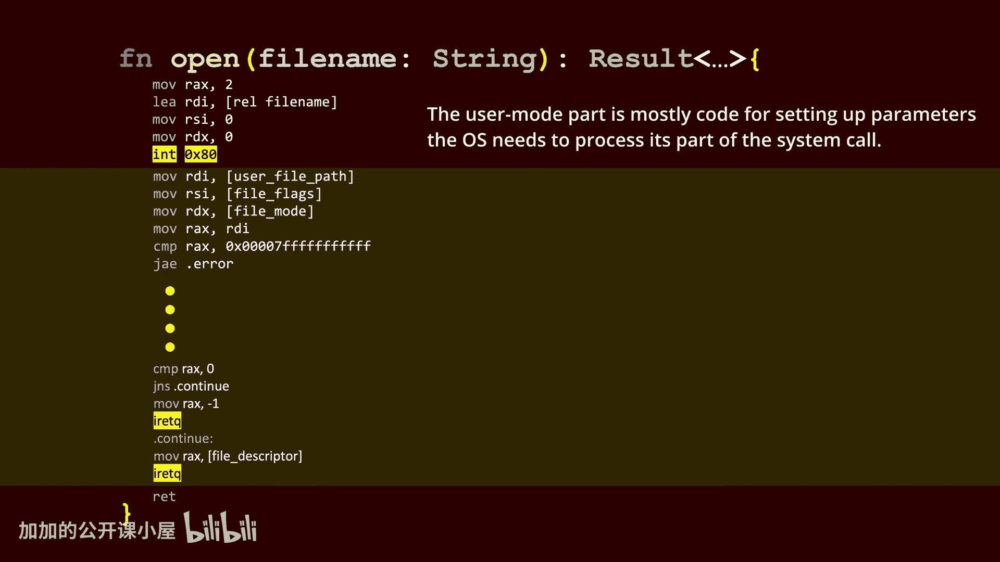

In general terms we could say that system calls provide essential services to user programs；

 I originally plan to make a separate video about system calls。

 but I think I can cover the rest here， including the pros and cons。

The most important advantage of system calls is the hardware abstraction they provide to developers。

Many people have no idea how difficult and complex it is to directly manipulate hardware。

Since system calls handle hardware interactions for us， when we require access to hardware resources。

 we as developers only need to invoke them System calls are incredibly useful because they allow us to think in terms of code。

 not transistors。Another significant advantage is security；

 this is closely tied to hardware abstraction。Directly manipulating hardware is prone to errors。

 which can lead to vulnerabilities and system malfunctions a common question from people transitioning from languages like Python or JavaScript to lowlevel programming is。

 could I fry my computer？The answer is always no， because the operating system manages hardware for us。

Even if we write a very bad C program， we won't be able to directly manipulate the hardware in a way that could damage our computer。

The third advantage is portability if multiple platforms follow certain guidelines。

 the same source code can compile in different systems。System calls have some drawbacks。

 the first one being performance overhead， this is also somewhat related to the hardware abstraction that they provide。

 interrupts which system calls rely on are not cheap in terms of performance。

 they require extra steps such as context switching and modern architectures with features like caching can further increase the performance cost。

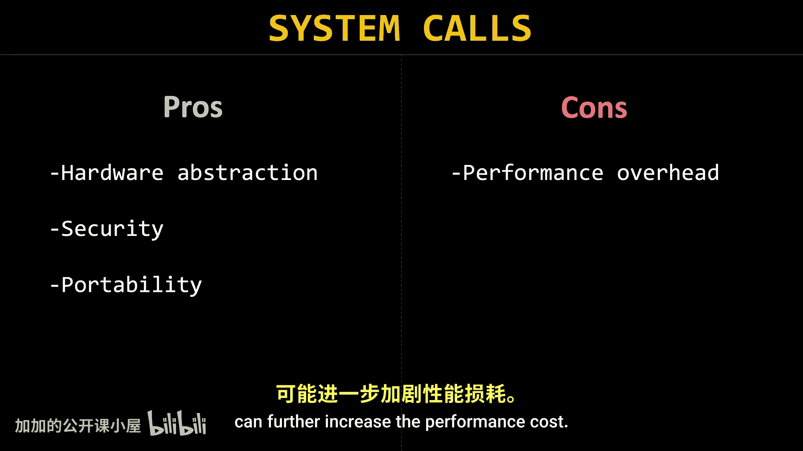

Also， when a program invokes a system call， it effectively interrupts itself to pass control to the operating system。

Once the OS gains control， there's no guarantee that it will immediately handle the system call。

The operating system may use this opportunity to perform other tasks。

 like running the CPU scheduler or managing other system resources。

Eventually the system call will be attended to， but for the user program。

 there's no guarantee it will happen quickly。

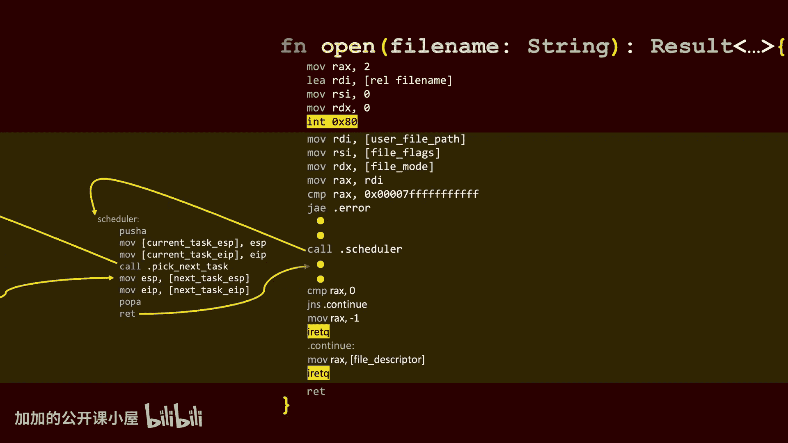

From a certain perspective， system calls can be seen as traps；

 the hardware abstraction is the bait that lures user programs into giving control back to the operating system。

Another con is Plaform dependency， which contradicts the portability Pro I mentioned earlier。

While many platforms aim for compatibility， some weird variations exist。

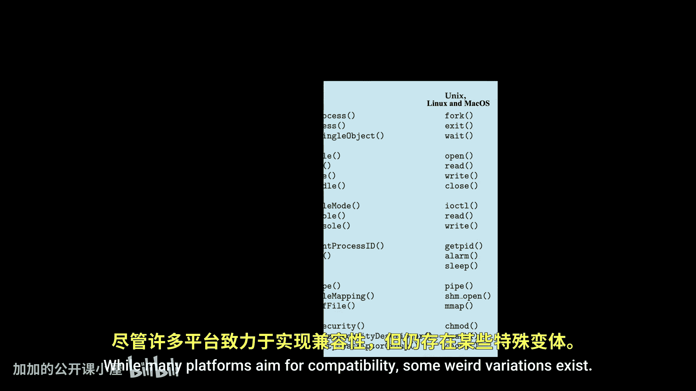

Microsoft。Okay。

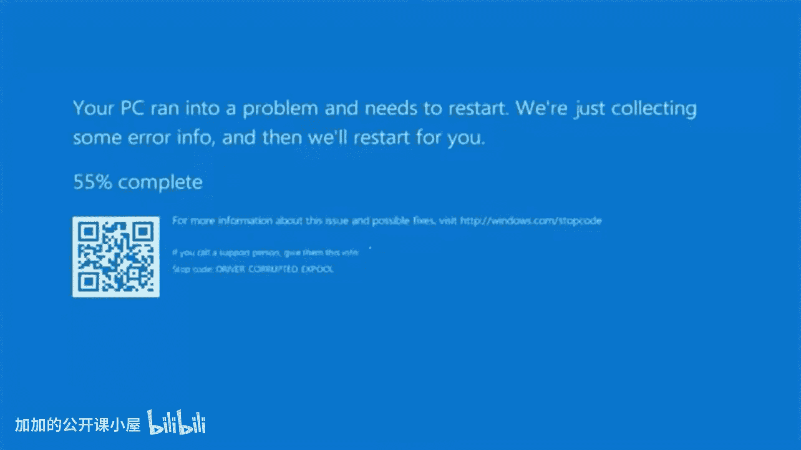

Summarizing the CPU operational modes。The mechanism is simple。

 user programs can use interrupts to make the CPU switch to kernel mode。

 but at the cost of interrupting themselves and handing control of the CPU to the operating system。

The operating system， in turn， can use a privileged instruction to resume an interrupted process。

 but forces it to continue running in user mode。The concept of system calls has been so successful that some architectures have made invoking them easier by providing dedicated instructions。

 eliminating the need to manually set up interrupts。For this reason in many architectures。

 you can find the cisca instruction and the cisret privileged instruction。

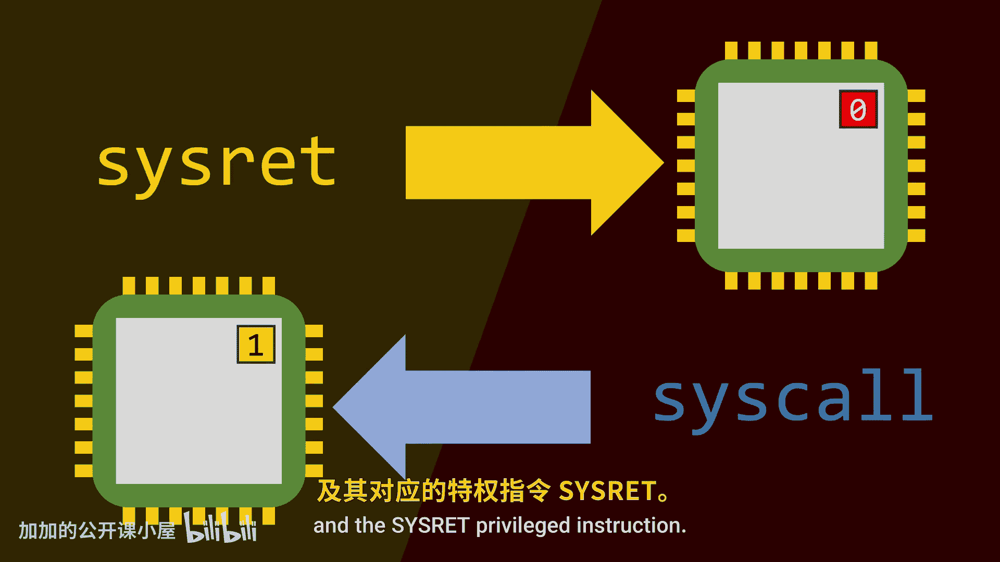

They also make assembly code more readable。When an operating system relies on the cooperation of user programs to regain control and perform management tasks。

 it is classified as a non preemptive or cooperative operating system。

This type of general purpose operating system is no longer used because there is a big problem with them。

Think about a program that contains an infinite loop without any system calls inside。

The CPU will remain stuck executing the loop indefinitely。If a process。

 intentionally or unintentionally， avoids using system calls。

 the CPU will never return control to the operating system， effectively starving all other processes。

Once again， software alone cannot solve this problem； hardware support is necessary。

The solution involves using a timer。When the timer expires， it triggers a hardware interrupt；

 This timer is built into the CPU and can only be controlled through privileged instructions。

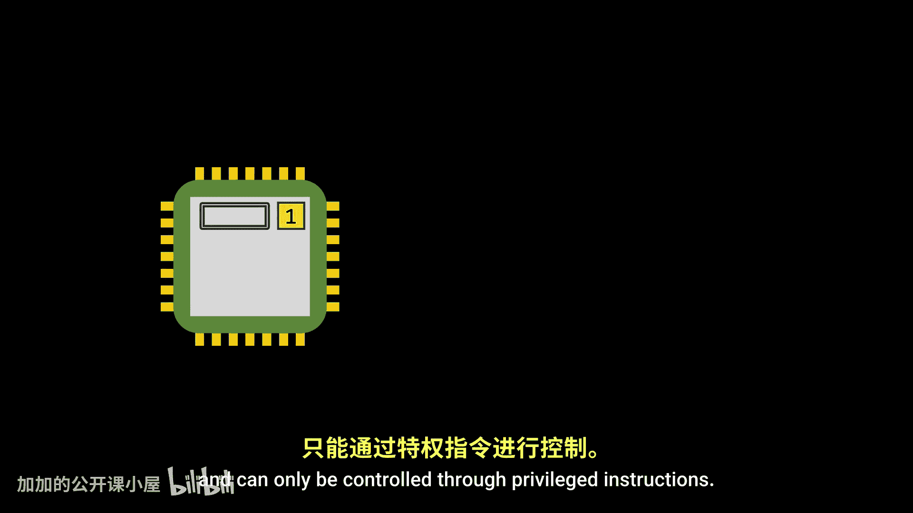

Before allocating the CPU to a user process， the operating system sets the timer。

 and while the process runs， the timer is counting down。

User processes can still voluntarily return control to the operating system via system calls。However。

 if a process takes too long to invoke a system call。

 the timer ensures that eventually an interrupt will be triggered。

 forcing the process to stop and giving control back to the operating system。

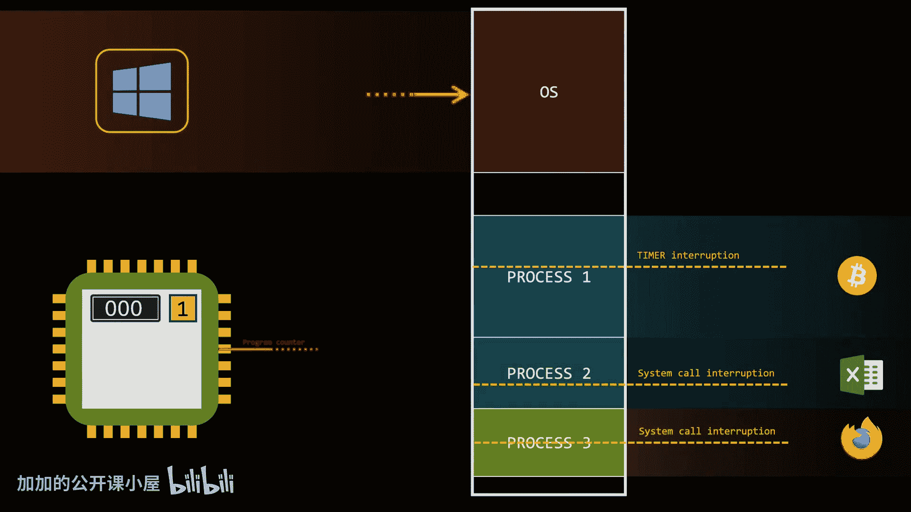

This mechanism allows kernel mode to exert complete control over how much CPU time each process is allowed to use。

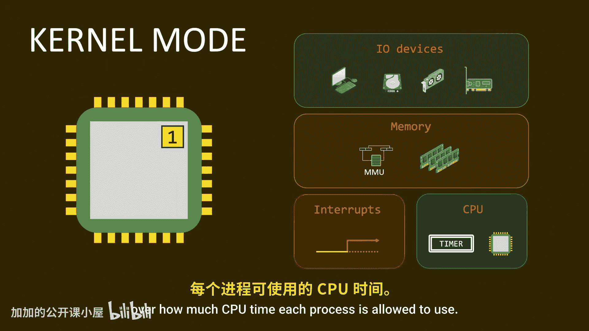

In addition， when a CPU supports operational modes。

 the hardware must be able to react if a user program attempts to directly manipulate hardware。

If the processor is running in user mode and encounters a privileged instruction。

 the hardware can be configured to trigger and interrupt。

 immediately passing control to the operating system so it can handle the suspicious behavior of the user program。

 most likely terminating its execution。

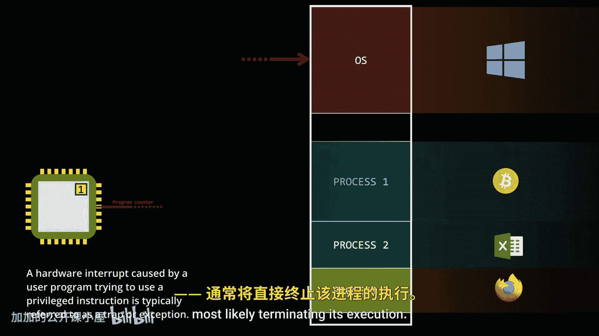

Interrupts are a fundamental feature of the CPU， so it's more accurate to say that kernel Mo grants complete control over how the CPU is used。

When the hardware architecture supports these features and the operating system leverages them。

 we are talking about preemptive operating systems。

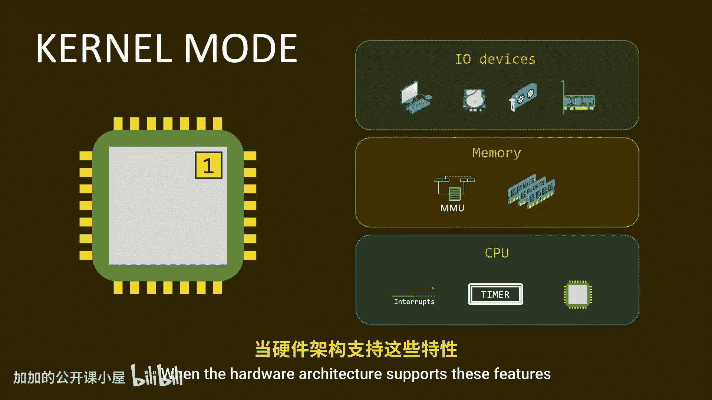

With all of that in mind， we should now understand that both user programs and the operating system are just software。

Since user programs are confined to user mode， they cannot directly interact with the hardware。

Instead， they must pass control to the operating system。

 which manipulates the hardware on their behalf。So the idea that the operating system is always in the middle is just a very high level abstraction of what's truly happening。

Many might wonder if software other than the operating system can run in kernel mode。

The answer is yes。For example， when a new graphics card is released。

 the operating system may not know how to control it as it was developed before the card even existed。

Operating system developers can't write code for every single hardware device that exists。

 so this task is usually left to the hardware manufacturers。The solution is calledD。

 software designed to control specific hardware。Since controlling hardware requires privileged instructions。

 drivers must run in kernel mode when a user program needs the hardware。

 the operating system uses the appropriate driver。However。

 this technique comes with a serious drawback， any code running in kernel mode has access to privileged instructions。

 which makes it impossible for the operating system to fully isolate it from other processes or even from itself as a result。

 all code running in kernel mode shares a single address space。

If a driver mistakenly writes to the wrong memory address。

 it could corrupt data critical to the operating system， and if a driver crashes。

 it will take the entire operating system down with it。Without the operating system。

 user programs can't function， and the whole system goes down。

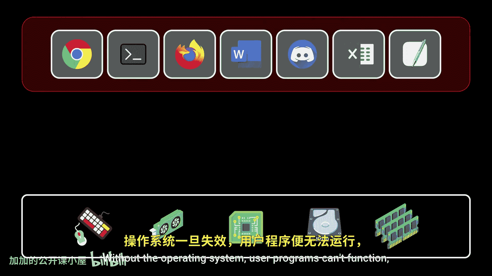

This is why drivers with bugs often cause blue screen of death in windows。

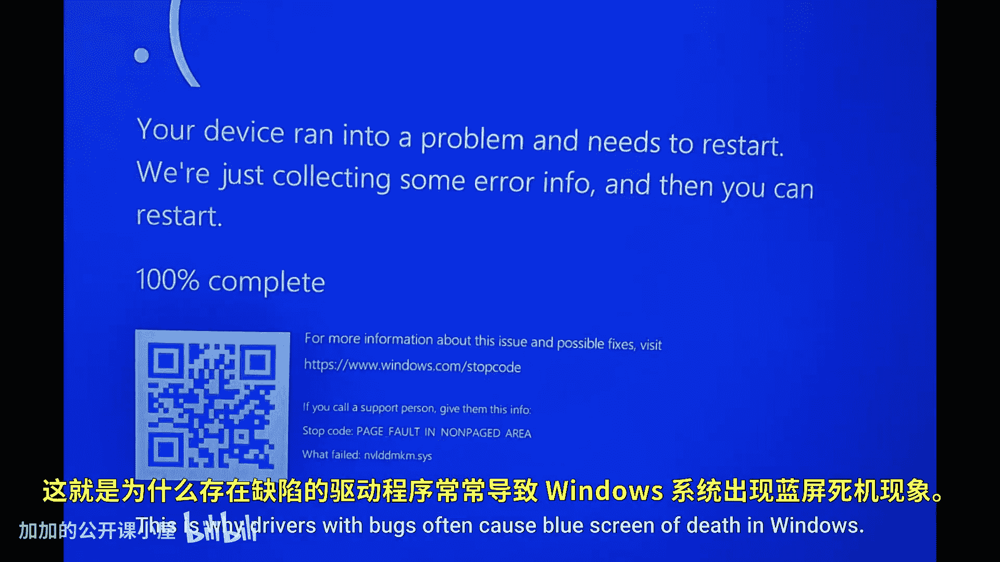

Despite the risks， allowing code to run in kernel mode is necessary because drivers are essential。

 again， it's virtually impossible for OS developers to write code for every single hardware device out there。

But the fact that third party code can run in kernel mode has led to its use for purposes beyond just device drivers。

 this includes things like video game anti cheating systems and malware detection software。

Let me quickly explain why this happens First， software running in kernel mode doesn't rely on system calls。

 which allows it to run considerably faster than if it were running in user mode。

Imagine a game that bans controllers to prevent unfair advantages over mouse and keyboard players。

A player might cheat by using a controller mapped to keyboard inputs via a third party program。

Since the game runs in user mode， it can't tell whether the input is truly from a keyboard； however。

 anticheing software in kernel mode can directly monitor hardware activity。

 detecting if input is actually coming from a controller。For malware detection。

 kernelonnal Mode allows software to scan devices like network cards， monitoring network traffic。

 and inspect the address space of running processes to check for suspicious activity。

 such as monitoring private data and sending it to an untrusted endpoint。

Now it makes sense why this kind of software must run in kernel mode， if it ran in user mode。

 they wouldn't be able to do what they do。Using kernel mode for everything isn't always a good idea though。

Take， for example， Crowstrtriike， a malware detection software installed on millions of business devices worldwide。

In September， an update corrupted a configuration file， filling it with zeros。With the file damaged。

 the software crashed， causing operating systems to crash as well。The result， worldwide chaos。

Thousands of devices showing the blue screen of death and billions of dollars in business losses。

Another example is Vanguard， an anticheing software from Ri Game。

 used in popular games like League of Legends and Valerant， when first released。

 it caused blue screens of death for hundreds of players。

 but the scarier part is its connection to Tencent， a Chinese company that owns Ri Games。

It turns out you can't play riot games without installing Vanguard。

 which makes sense for anticheing purposes The annoying part is that Vanguard runs in kernel mode。

 even when you're not playing， meaning it could monitor everything you do on your computer。

While there's no evidence it does， the fact that Ten0centent is a Chinese company。

 likely subject to government oversight， raises privacy concerns。

Considering Vanguard runs on millions of computers worldwide， this becomes quite unsettling。

And that wraps it up for now。If you want to learn more about this whole kernel level software situation from a cybersecurity expert。

 I highly recommend checking out this videos from low level， one of my favorite channels。

A huge thanks to Neate Code for sponsoring this video， don't forget to check it out。

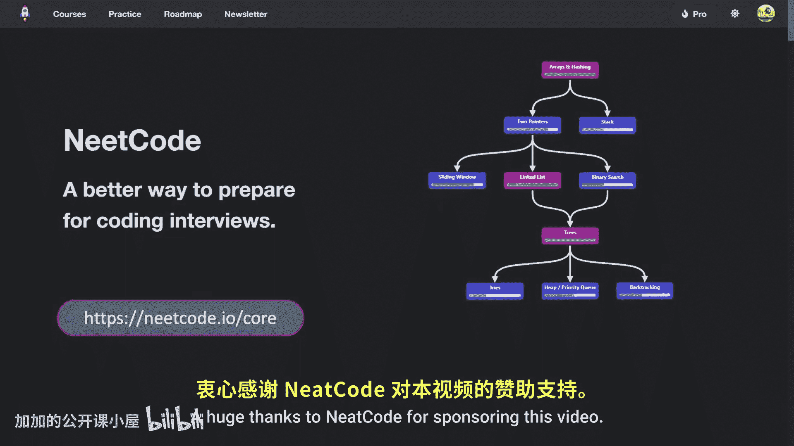

And if you learned something today， don't forget to like and subscribe。

Until next time， I'm George。