# 操作系统原理：P4：进程间通信 - 共享内存与消息传递 🚀

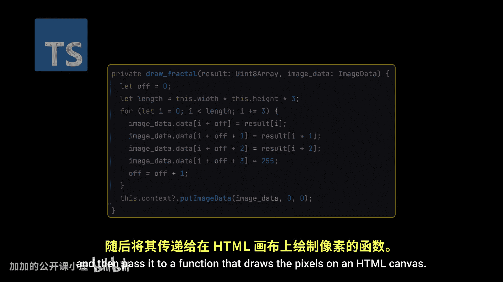

在本节课中，我们将要学习进程间通信的两种基本模型：共享内存和消息传递。我们将探讨它们的工作原理、各自的优缺点，以及在现代操作系统和应用程序中的实际应用。

## 概述

进程是程序执行的实例，它包含了代码、CPU状态、内存区域、打开的文件列表等资源。操作系统默认会隔离各个进程，以确保安全性和稳定性。然而，在许多场景下，进程需要相互协作以完成任务。因此，进程可以分为独立进程和协作进程。协作进程需要一种机制来交换数据和协调活动，这就是进程间通信。

## 进程的分类与协作需求

上一节我们介绍了进程的基本概念，本节中我们来看看进程为何以及如何协作。

进程可以根据是否与其他进程共享数据来分类。共享数据的进程显然是协作进程。但进程协作还有其他原因：
*   **计算加速**：在支持并行的系统中，复杂任务可以被分解成更小的子任务同时执行，从而减少总完成时间。
*   **模块化**：以模块化方式构建系统，可以将系统功能划分到独立的进程中。

请注意，在上述两种情况下，进程都需要一种方式来协调彼此的活动以确保正确运行。协作进程需要一种进程间通信机制来实现数据交换。

## 进程间通信的两种基本模型 🧩

协作进程需要一种进程间通信机制来交换数据。以下是两种基本模型：

1.  **共享内存**
2.  **消息传递**

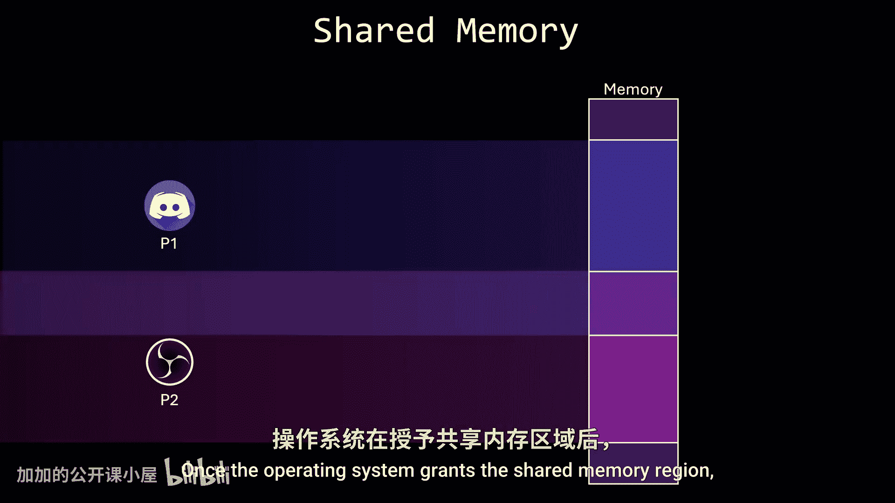

接下来，我们将详细讨论这两种机制的工作原理，并举例说明它们在现代操作系统中的应用。

### 共享内存模型

共享内存机制，顾名思义，允许进程直接共享一个内存区域。

当多个进程在系统上运行时，操作系统会为每个进程分配一个独立的内存块，这被称为进程的地址空间。通过特权指令机制，操作系统强制执行隔离，防止进程访问彼此的内存。如果一个进程试图读写另一个进程的地址空间，操作系统会立即中断并终止该进程，以强制执行隔离策略，确保数据安全。

因此，为了让两个或多个进程共享一个内存区域，操作系统要求它们同意移除这一限制。通常，共享内存区域通过系统调用创建，并位于创建它的进程的地址空间中。任何希望通过该区域进行通信的进程，也必须通过系统调用将其附加到自己的地址空间。

一旦建立了共享内存区域，两个进程就可以通过读写这个共享区域来进行通信。

这里有一个重要的细节：一旦操作系统授予了共享内存区域，它就不再管理进程如何使用它。我的意思是，数据的结构以及数据在共享区域内写入的具体位置完全由进程决定，而不是操作系统。

例如，考虑一个生产者-消费者模型，其中一个进程（生产者）生成数据，另一个进程（消费者）读取数据。假设共享区域包含一个数组，生产者向其中写入8位有符号整数。如果消费者将这些数据作为无符号8位整数读取，它将解释完全相同的比特位，但含义不同。同样，如果消费者期望不同的数据类型（如无符号32位整数）或从错误的地址读取，就会发生误解。

由此可见，这里有很多可能出错的地方。消费者必须确切知道数据的结构以及数据被写入的位置。不遵循这些约定可能导致一个或两个进程失败，或者更糟，导致未定义行为。进程还负责确保它们不会同时写入同一位置，否则可能会遇到竞态条件，这个问题我们将在未来关于线程同步的章节中讨论。

#### 共享内存的应用实例

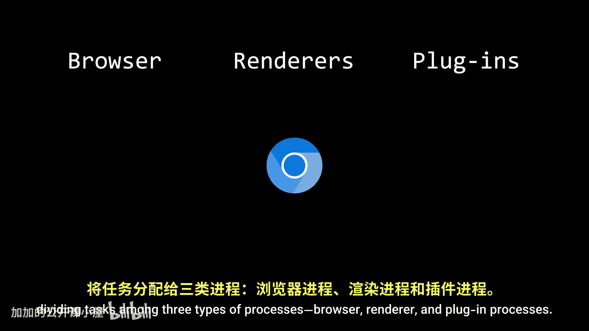

以下是使用共享内存的流行程序示例：

*   **Chrome浏览器**：任何基于Chromium的浏览器都是模块化系统的完美例子，它依赖于进程间通信。Chromium使用共享内存方法，将任务分配给三种类型的进程：浏览器进程、渲染器进程和插件进程。这种隔离确保如果一个标签页崩溃，只有其渲染器进程失败，其他标签页不受影响。
*   **其他系统**：使用共享内存的系统还包括仿真软件、游戏引擎、数据库管理系统和深度学习框架。

### 消息传递模型

共享内存并不总是进程间通信的最佳方式，因为它容易出错，并且可能给程序员带来更多他们不愿承担的责任。

另一种方法是让操作系统提供一种机制，允许进程在不共享相同地址空间的情况下进行通信和同步操作。地址空间可以保持隔离，进程通过发送消息进行通信，而不是写入内存。

流行的消息传递机制包括管道、套接字和远程过程调用。虽然这些机制的具体实现超出了本视频的范围，但其基本概念如下：

消息传递设施提供一组基本操作。假设我们有两个进程A和B。如果进程A想向进程B发送消息，它必须调用一个系统调用，请求操作系统与进程B建立一个链接。这个链接充当消息发送的逻辑路径。

请注意，我说的是逻辑路径。实际发生的是，操作系统内核在其自己的地址空间中创建一个队列，这个队列将充当一个邮箱，进程A可以向其中发送消息，进程B可以从中接收消息。

这个队列的行为可以根据通信需求而变化。例如，我们可能需要异步通信而不是同步通信，或者如果希望限制邮箱可以容纳的消息数量，可以使用缓冲队列。对于全双工通信，可以实现一个带有两个队列的邮箱，允许两个进程同时相互发送消息而不会冲突。

但你们中的一些人可能已经注意到这里有些奇怪。既然邮箱位于操作系统的地址空间，进程应该无法访问它。是的，这是真的，进程不能直接读写邮箱。因此，操作系统必须为至少两个操作提供系统调用：发送和接收。

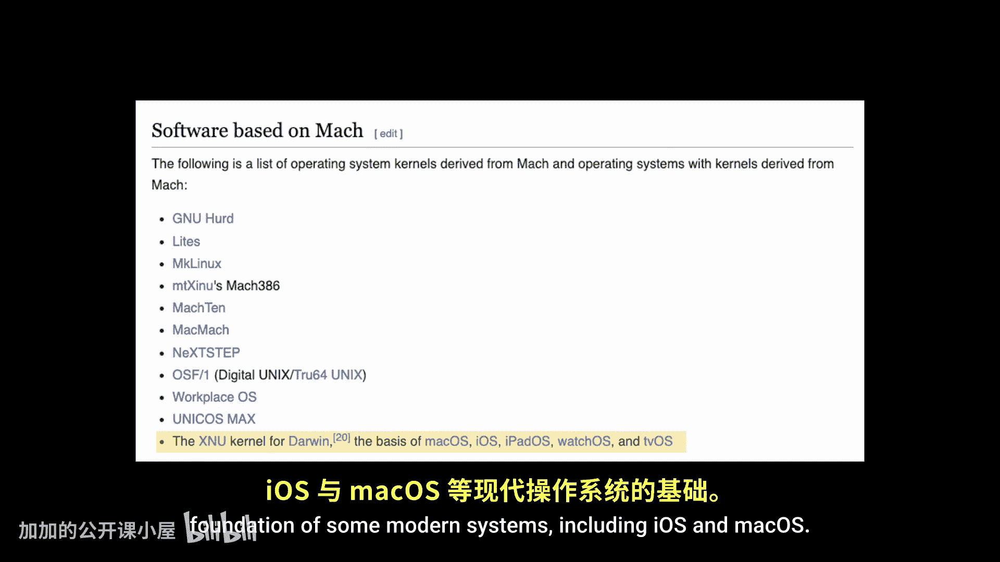

当进程A需要向进程B发送消息时，它使用系统调用指示操作系统：“我需要将这条消息放入与进程B共享的邮箱中，但我无法直接访问它，所以请为我处理。”由于邮箱存在于内核地址空间，操作系统可以将消息复制到邮箱中。类似地，当进程B想要检查消息时，它使用相应的系统调用询问操作系统：“我无法直接读取与进程A共享的邮箱，你能帮我检查一下是否有给我的消息吗？”如果有消息，操作系统可以将其作为函数的返回值返回。

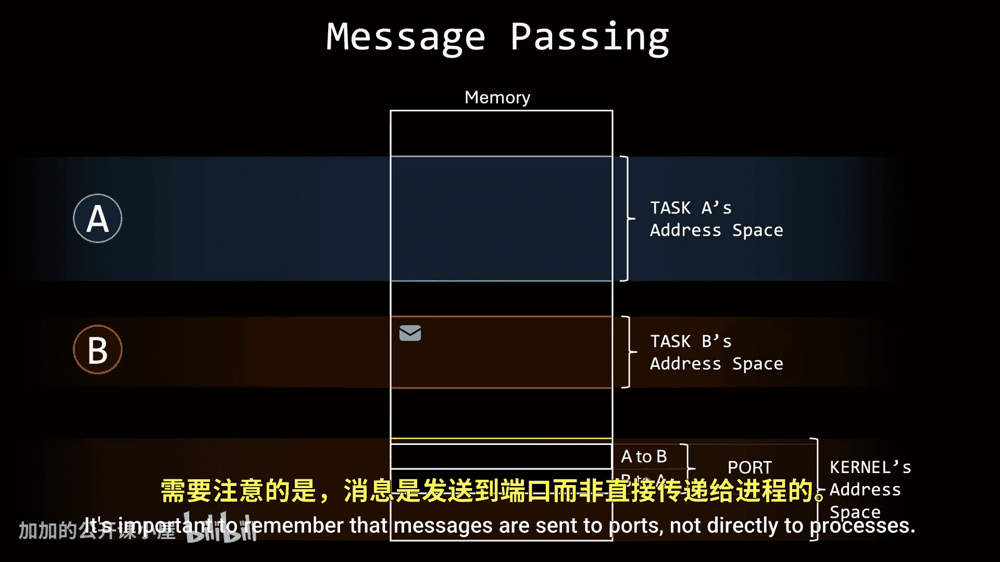

这就是消息传递通信背后的基本思想。

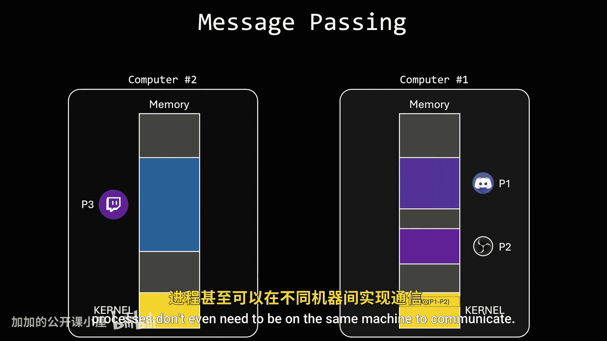

#### 消息传递的应用与优势

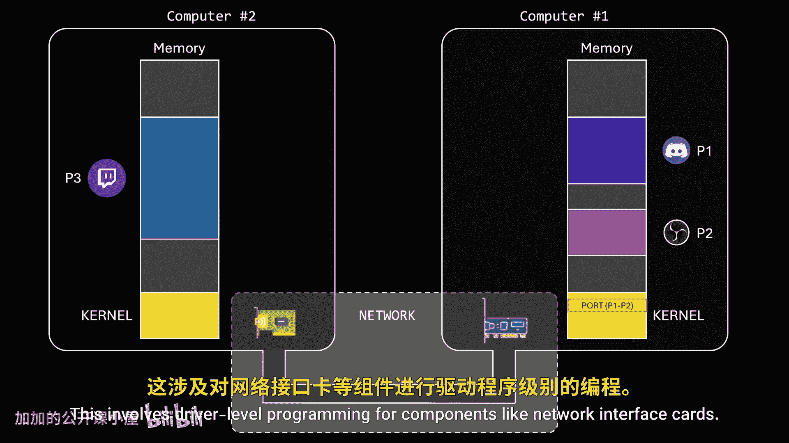

最早引入共享邮箱概念的操作系统之一是Mach，其衍生系统构成了包括iOS和macOS在内的一些现代系统的基础。Mach将进程视为任务，并为邮箱起了一个非常具体的名字：端口。重要的是要记住，消息是发送到端口，而不是直接发送到进程。这种区别很重要，因为两个进程可以拥有多个通信链接，并且并非所有端口都只与两个进程相关联；一个进程可能保持一个开放端口以接收来自任何其他进程的消息。这种类型的端口称为监听端口，其目的是处理称为连接请求的特殊消息，以在进程之间建立新的私有通信链接。

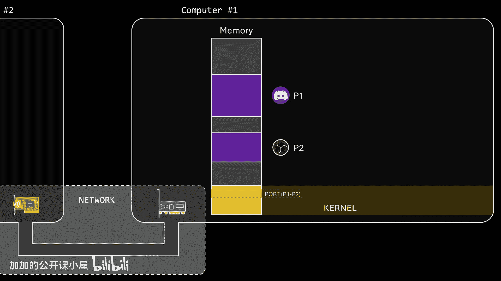

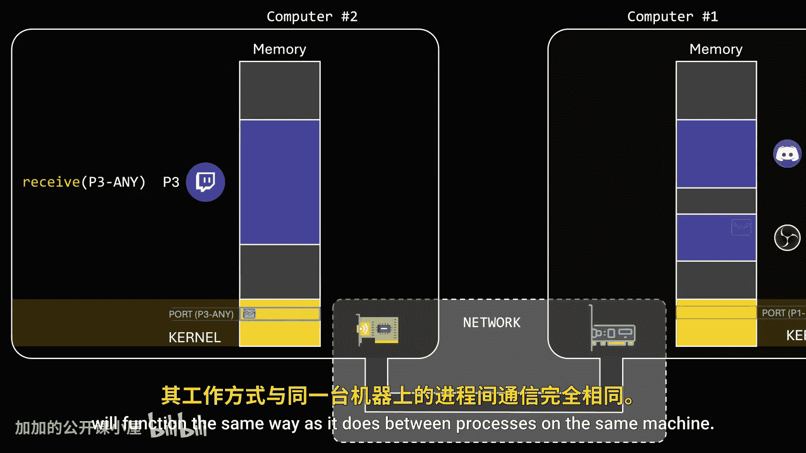

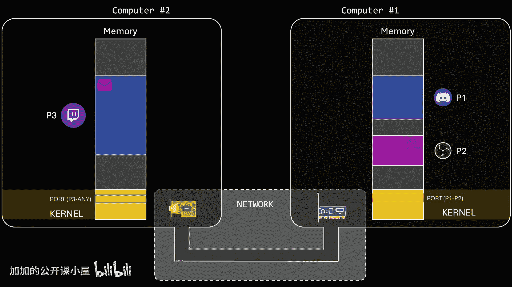

消息传递有一个巨大的优势：由于它不要求两个进程共享它们的地址空间，进程甚至不需要在同一台机器上就可以通信。当然，这需要一个更复杂的底层实现，例如网络功能以在计算机之间建立连接，这涉及网络接口卡等组件的驱动程序级编程。但如果操作系统层面正确实现，对于开发者来说这个过程应该是无缝的——在不同机器上的进程之间传递消息将与在同一台机器上的进程之间传递消息以相同的方式工作。

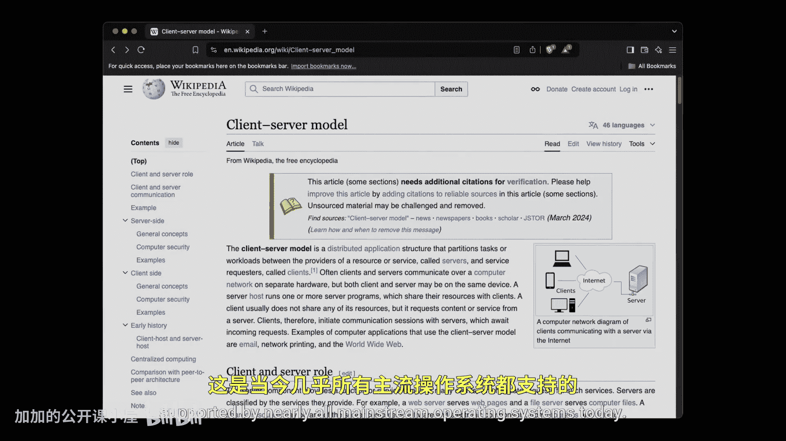

客户端-服务器架构通常使用套接字接口实现，这是当今几乎所有主流操作系统都支持的消息传递机制的一个例子。当客户端向服务器发送请求时，IP地址标识托管服务器进程的机器，而端口代表服务器进程接收请求的邮箱。提供HTTP、FTP或SSH等特定服务的服务器依赖于套接字接口。

#### 消息传递的缺点

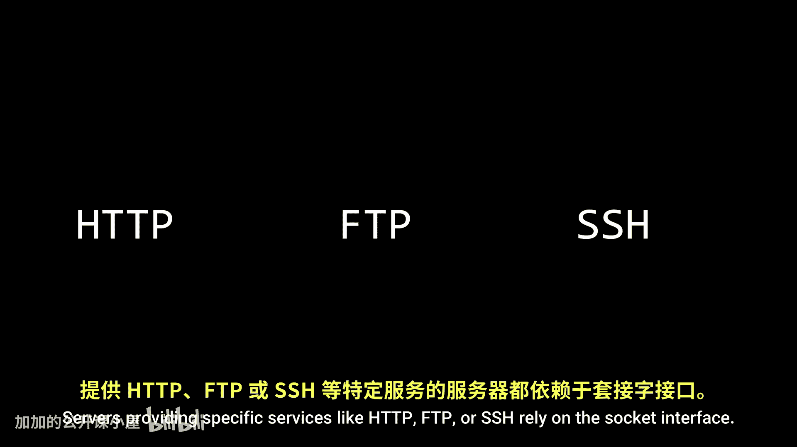

不幸的是，消息传递系统确实有缺点。因为端口位于内核地址空间，进程每次想要发送或接收消息时都必须使用系统调用；这在性能方面可能相当昂贵。这个限制不适用于共享内存方法。对于共享内存，系统调用仅在创建共享区域和将进程附加到该区域时是必需的。一旦这些步骤完成，进程就可以像读写自己地址空间的一部分一样读写共享区域，而无需进一步的系统调用。这导致通信速度极快，基本上与直接内存访问一样快。

需要澄清的是，我并不是说消息传递慢，共享内存只是更快。在99%的情况下，消息传递是完全足够的。

## 总结

本节课中我们一起学习了进程间通信的两种核心模型。我们了解到，**共享内存**允许进程直接读写一个公共内存区域，速度极快，但需要进程自行管理数据格式和同步，容易出错。而**消息传递**则通过操作系统内核作为中介（如端口或套接字）来转发消息，虽然涉及系统调用开销，但提供了更好的隔离性、灵活性，并能轻松支持跨机器通信。两种模型各有适用场景，是构建现代模块化、分布式或高性能应用的基础。