# 操作系统原理：P5：为什么单核处理器也需要线程？⚙️

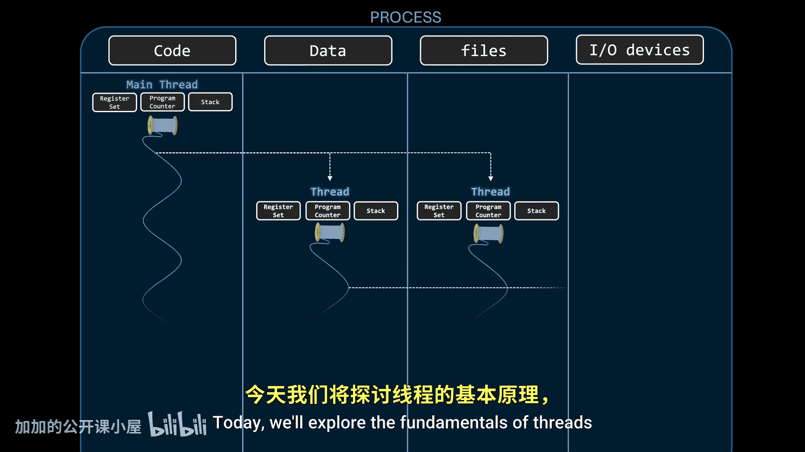

在本节课中，我们将学习线程的基本概念。我们将探讨线程如何利用并发来优化计算机资源的使用，特别是在单核处理器上。理解线程是理解现代操作系统如何高效管理任务的关键。

## 并发与资源利用

上一节我们介绍了进程的概念。本节中我们来看看操作系统如何通过并发来管理多个进程。

在单CPU的多进程系统中，操作系统通过让进程**交替访问**CPU来实现资源共享。这个过程发生得非常快，以至于用户感觉所有进程都在同时运行。这种技术被称为**并发**。

但并发的目的不仅仅是实现多任务。它还有一个更重要的目的：**最大化计算机资源的使用**。一个进程即使被分配了CPU，也可能因为等待I/O资源而无法执行指令。在这种情况下，将CPU分配给另一个**准备就绪**的进程是更高效的做法。因此，并发可以填补进程无法使用CPU时的空闲时间。

## 进程内部的并发需求

到目前为止，我们将进程视为执行的基本单位。这意味着在传统的进程方法下，**同一个进程内的任务无法异步运行**。这是因为每个进程只有一个程序计数器，无法同时跟踪两个函数的中断点。

那么，为什么我们需要在进程内部实现并发呢？虽然我们可以将代码放在不同的进程中并使用**进程间通信**来协调，但这并不总是直观的。有时，为实现同一目标而紧密相关的代码片段，将它们拆分到不同进程中会显得不合理。

以下是进程内部并发非常有用的一个典型场景：

设想一个在3000端口接收请求的服务器，其唯一目的是返回与每个客户端关联的个人资料图片。当客户端发送请求时，服务器接受请求，从磁盘搜索并读取图片进行处理，然后将图片加载到内存中，最后将图片发送回客户端。

因为图片作为文件存储在磁盘上，查找和加载图片是一个**非常耗时的I/O操作**。因此，处理一个请求的时间可能远长于简单地接受或响应请求。

这些步骤是**顺序执行**的。对于单个客户端来说，这没有问题。但当多个客户端同时发送请求时，问题就出现了。如果五个请求几乎同时到达，服务器会快速接受第一个请求，但需要花费大量时间处理它。第二个请求只有在第一个完成后才会被处理，依此类推。这就造成了**瓶颈**，后面的请求需要等待很长时间才能得到处理。

这里我们可以看到真正的问题：时间线上的**灰色间隙**代表了CPU**空闲**、无所事事的时期。这是被浪费的计算时间，本可以用来接受并开始处理其他客户端的请求。当一个任务因为另一个任务正在运行而无法执行时，尽管两者是独立的，我们称之为**阻塞效应**。

## 多进程解决方案及其局限性

长期以来，这个问题的解决方案如下：有一个监听请求的**主进程**（监听进程）。每当客户端发送请求时，监听进程不是直接处理它，而是创建一个全新的进程来服务该特定客户端。

这种方法允许利用并发来**尽可能多地使用CPU**。然而，这种方法并不完美。每个进程都是一个自包含的上下文，拥有自己的属性，包括地址空间。为每个客户端创建一个完整的进程，对于几百个客户端可能有效，但当扩展到数千个时，在内存使用方面会变得低效。此外，生成一个新进程并非微不足道的操作，它会消耗处理时间。而且，如果服务器需要处理某种全局状态，所有子进程必须同步以跟踪它，这需要某种形式的IPC，使实现复杂化。

## 线程：轻量级的解决方案

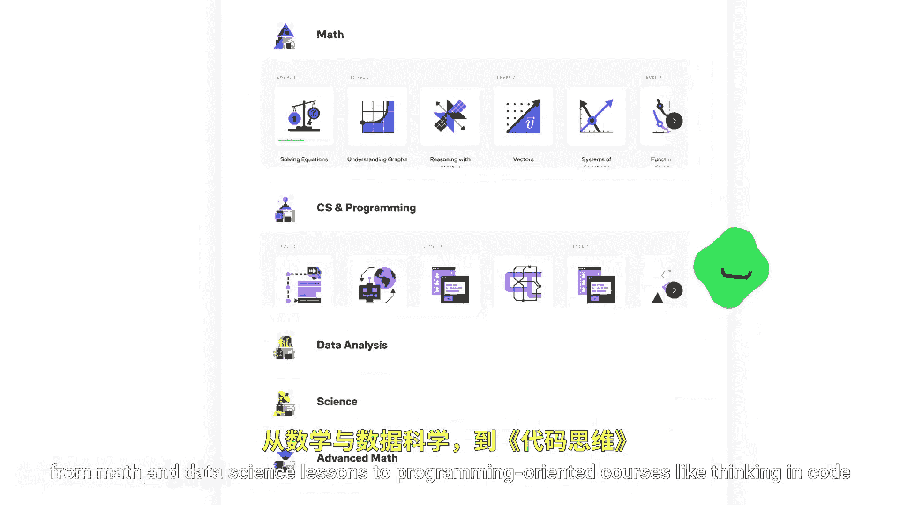

既然进程的概念非常有用，我们不能直接丢弃它，但我们可以稍微修改它以允许在单个进程的可执行代码内部实现并发。

一般来说，一个进程包含一个ID、一个程序计数器、一组寄存器、一个地址空间以及其他资源（如打开的文件和I/O设备）。主要限制在于，单个程序计数器不允许**进程控制块**（操作系统用来表示进程的结构）同时跟踪多个任务。

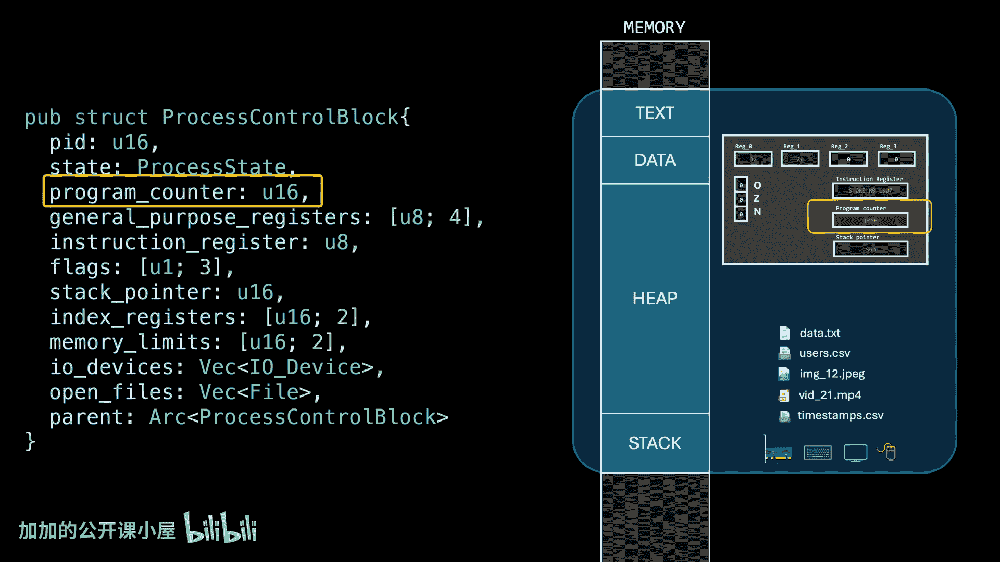

解决方案是**不再将程序计数器直接与进程关联**，而是为我们希望在进程内并发运行的每个内部可执行实体分配一个程序计数器。这些内部实体就是我们所说的**线程**。通过不再限制每个进程只有一个程序计数器，我们现在可以在需要同一进程内的代码并发运行时创建一个新线程。

这解决了阻塞问题，而无需创建新进程。如果一个线程需要I/O资源（例如将文件内容加载到数组中），其他线程可以继续执行而不会被阻塞。

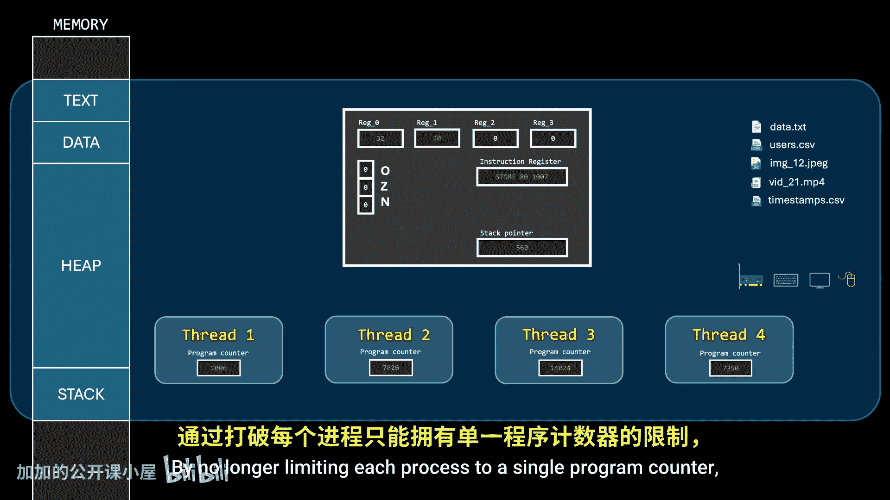

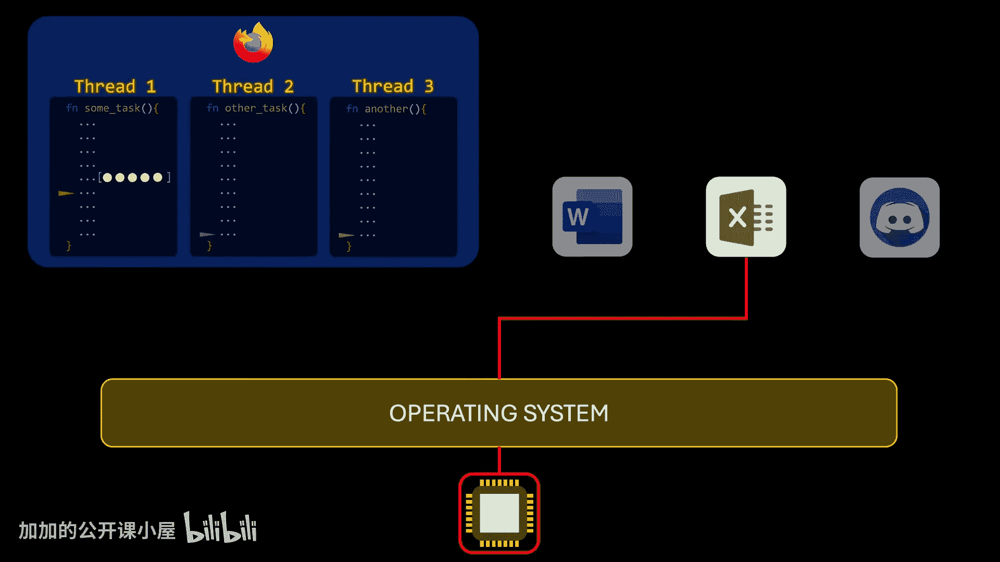

## 线程的组成与内存管理

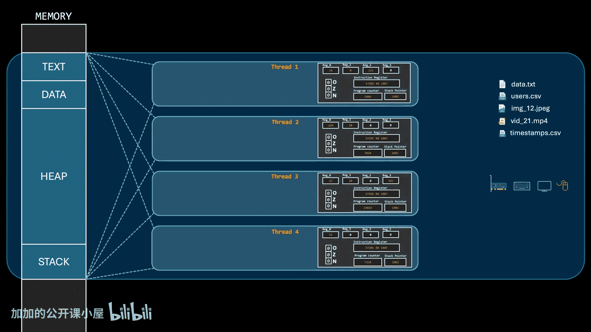

虽然线程共享其所属进程的整个地址空间，但它们**不能共享CPU状态**。因为线程会被中断以便将CPU分配给其他线程，我们需要捕获每个线程的状态，以便在CPU重新分配时恢复其状态。因此，如果每个线程都有自己的程序计数器，它也必须有自己的寄存器集、标志位、累加器等，本质上是它自己的CPU状态。

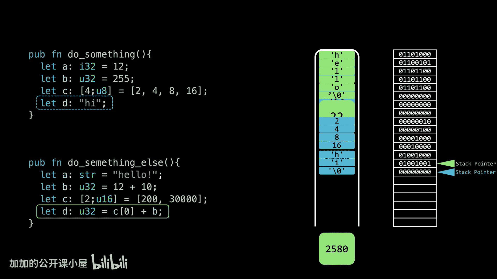

这包括一个**独立的栈指针**。栈是在内存中组织和访问局部变量的一种快速有效的方式。如果同一进程中的两个函数并发运行并共享同一个栈，它们很容易覆盖彼此的数据。因此，每个线程必须有自己的栈。

需要明确的是，每个线程都有自己的栈并不意味着它们不能读取或写入彼此的栈。如果我们把地址空间看作是进程的属性而不是线程的属性，这就完全说得通了。由于栈位于共享的地址空间内，没有什么能阻止一个线程访问另一个线程的栈。但通常，除非你确切知道自己在做什么，否则最好避免直接访问其他线程的栈。

如果同一进程内的线程需要通过共享内存进行通信，**堆**更适合于此目的，因为堆中存储的数据本身就不是以可预测的方式组织的。但即使使用堆，仍然需要谨慎。如果一个线程正在从一块内存读取，而另一个线程正在向它写入，结果可能是灾难性的。同步并发任务至关重要，以至于硬件直接实现了相关机制。

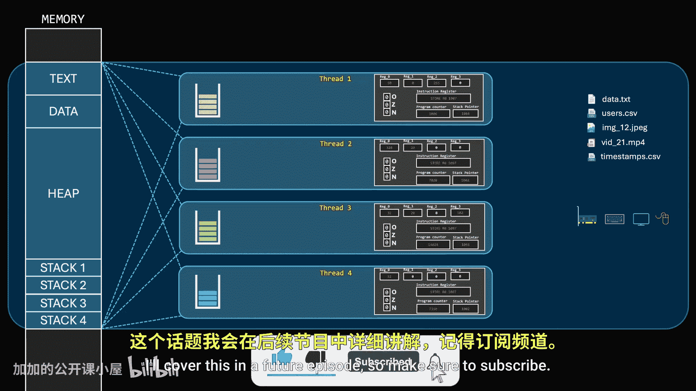

## 进程控制块与线程实现

用多线程方法取代传统的多进程方法需要重新实现进程控制块。最明显的路径是使用第二个结构来表示线程。虽然实现细节可能因平台而异，但最常见的方法是Linux内核中使用的方法，其中进程和线程都由同一个称为**任务**的结构表示。这是一个良好命名和编程的完美例子，因为它抽象了进程和线程之间的区别。因此，我们可以简单地将并发描述为在任务之间交替CPU访问，而不是在进程、线程或两者之间交替。

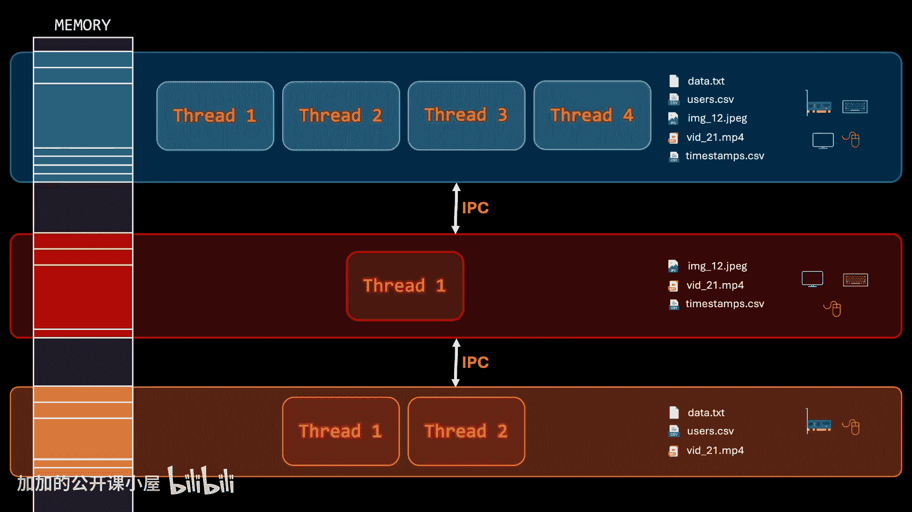

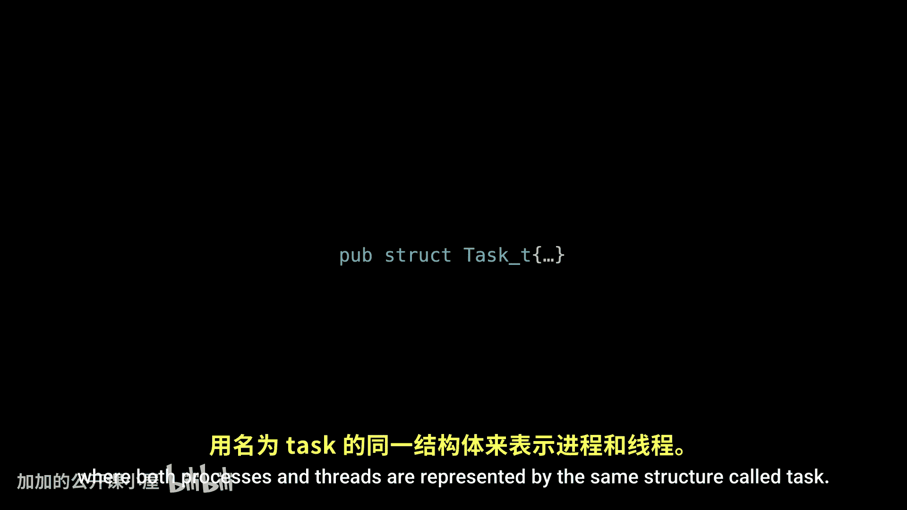

无论采用哪种方法，都需要每个进程至少有一个称为**主线程**的线程。每当创建一个新进程时，操作系统会自动创建这个线程。因此，即使一个进程不依赖多线程，操作系统也可以通过调度其主线程来为其分配CPU。

一个进程是以固定数量的附加线程开始，还是可以动态生成线程，取决于操作系统的实现。大多数主流操作系统更喜欢动态方法，即每个进程开始时都是单线程进程，如果需要，在运行时创建额外的线程。这当然增加了操作系统内部实现的复杂性，因为它必须为动态线程创建提供系统调用，但这是首选方法，因为在许多情况下，在编译时无法知道运行时需要多少线程。

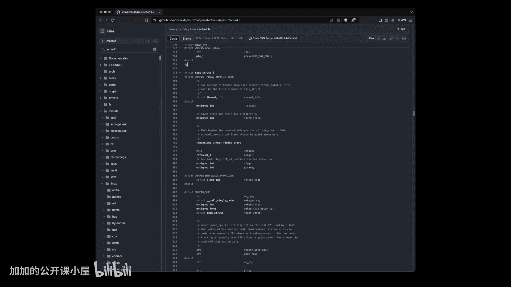

在许多实现中，因为主线程标识了它所属的进程，如果其他线程被生成而主线程终止执行，所有其他线程的执行将立即终止。有多种方法可以处理这个问题。

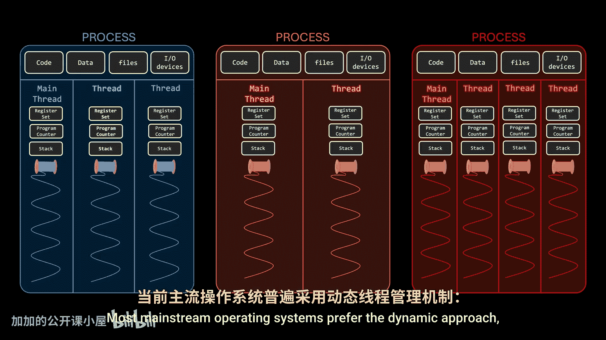

## 回顾服务器示例

回到我们的服务器示例，使用多线程方法，我们可以为每个传入的客户端生成一个新线程，实现与多进程方法类似的效果，但**内存消耗要少得多**。此外，使用线程时可能会有性能提升，因为用于创建线程的系统调用通常比用于创建新进程的系统调用完成得快得多。原因现在应该很明显了。

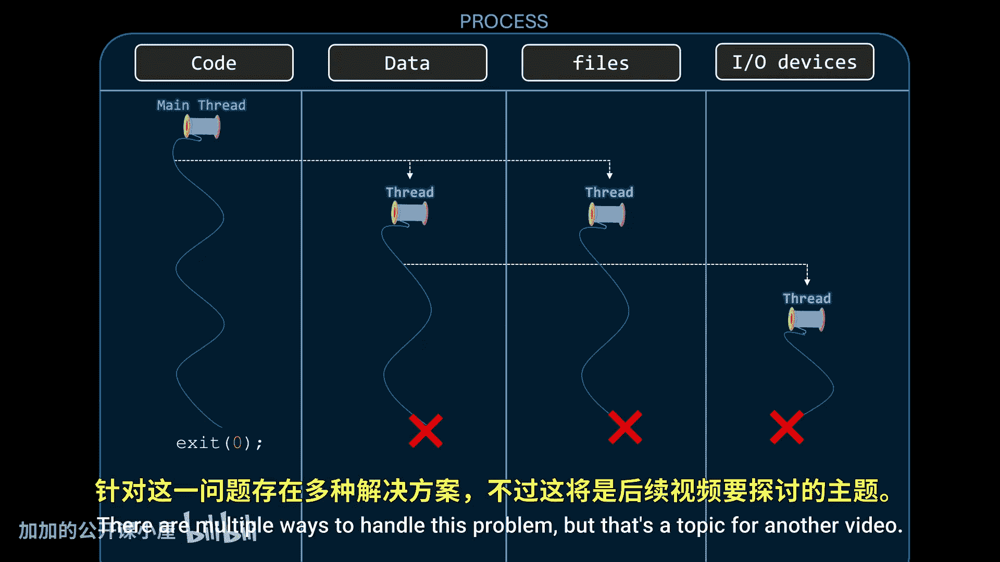

## 线程的定义

现在我们应该定义什么是线程，但首先，我们定义什么不是线程。

**线程不是函数**。线程执行的任何代码都位于进程内存布局的**文本段**中。线程不包含代码，它通过其程序计数器指向代码。这意味着多个线程可以指向完全相同的可执行代码。这正是我们服务器示例中发生的情况，因为所有请求都需要以相同的方式处理，所有处理程序线程不包含函数，而是指向内存中的同一个函数。如果你想知道线程同时访问这个内存区域是否危险，答案是不危险，因为可执行代码和常量驻留在文本段和数据段，这两个区域是**只读**的。

在运行时生成的与特定线程相关的所有信息都驻留在**栈**或**堆**上，因此线程并发访问相同的可执行代码是完全安全的。也许最后这部分能帮助你理解为什么在像C这样的低级语言中，生成线程需要我们传递一个指向函数的指针作为参数。我们实际上传递的是线程将要执行的代码开始的内存地址。

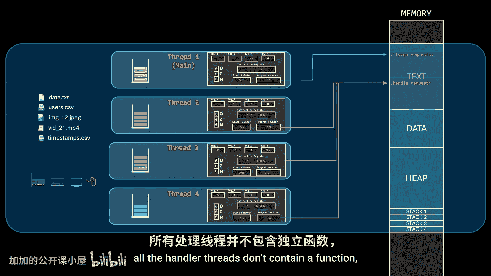

从操作系统的角度来看，线程是我们上一集中进程的角色：**最基本的执行单位**。从开发人员的角度来看，线程是一种机制，用于告诉操作系统我们程序中的某些代码片段可以并发执行。另一个有趣的定义是，线程可以被视为**轻量级进程**，更容易、更快地创建。

请记住，我在本视频中所说的一切甚至适用于**单核处理器**系统。

## 总结

本节课中我们一起学习了线程的基本概念。我们了解到，即使在单核处理器上，线程也是实现进程内部并发、优化CPU资源利用（特别是填补I/O等待时间造成的空闲）的关键机制。线程共享进程的地址空间，但拥有独立的程序计数器、寄存器集和栈，这使得它们比进程更轻量级、创建更快。通过将服务器示例从多进程模型转换为多线程模型，我们看到了线程在减少内存开销和提高响应能力方面的优势。在下一集中，我们将探讨线程在多核处理器系统中的另一个重要目的：并行计算的基础。