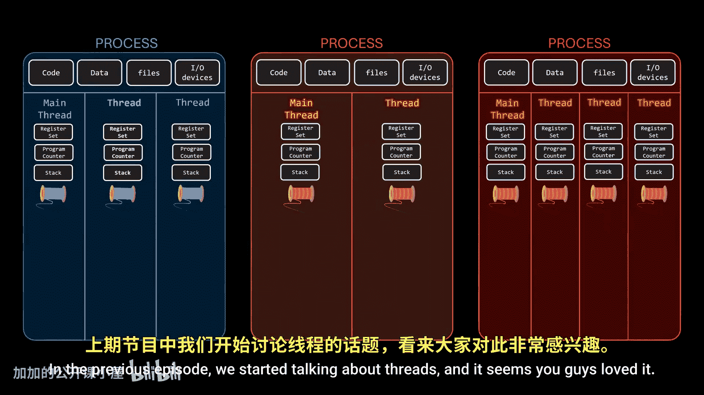
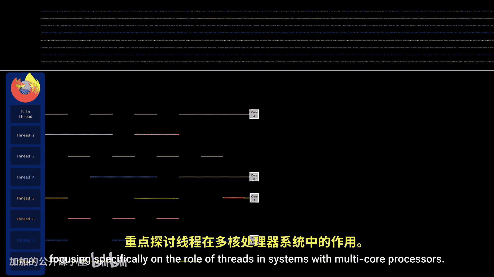
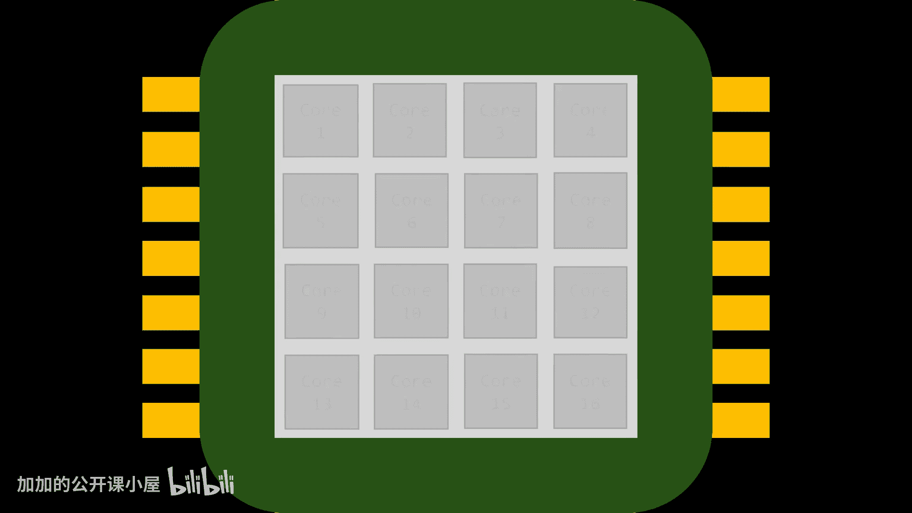
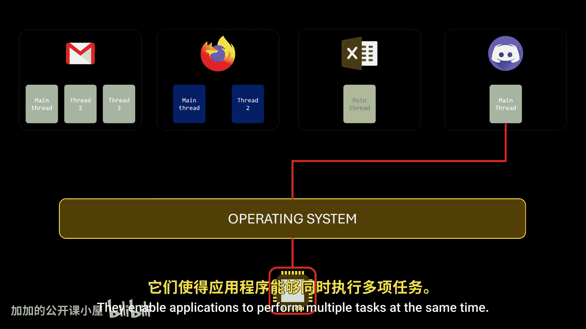
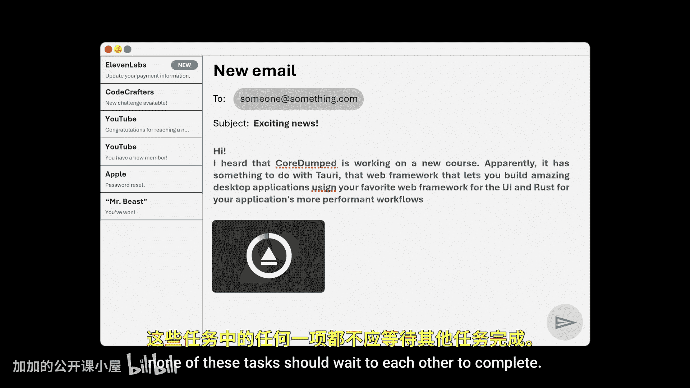
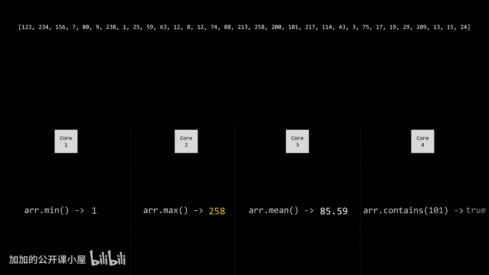
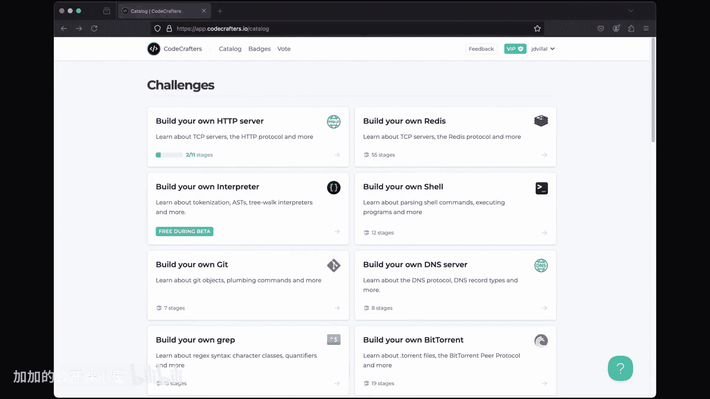
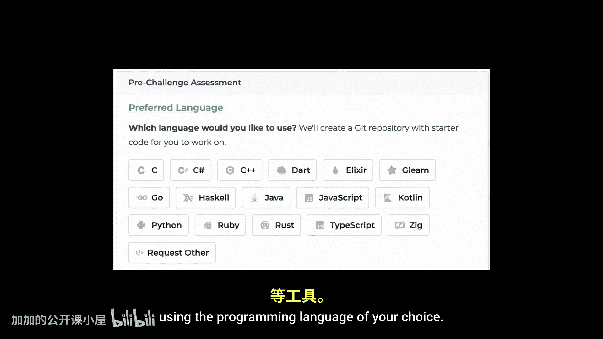

操作系统原理：P6：多核系统中的线程 🧵

在本节课中，我们将学习线程在多核处理器系统中的作用。上一节我们介绍了线程的基本概念，本节中我们来看看当系统拥有多个计算核心时，线程如何实现真正的并行执行，以及这对程序性能意味着什么。

---

在深入探讨之前，我们需要先了解一个重要的概念：**并发**。

当系统有多个进程但只有一个CPU时，操作系统可以通过在进程间以极快的速度交替分配CPU访问权，让用户感觉所有进程都在同时运行。

上一节我们学习了线程。在编写程序时，线程非常有用，主要有两个关键原因：
*   如果同一程序中的一个任务需要很长时间才能完成，而另一个任务只需几毫秒，并发可以确保较短的任务无需等待很长时间即可开始运行。
*   如果一个任务正在等待IO资源（例如文件读取或网络响应），那么在此期间它无法使用CPU。操作系统可以将这些未使用的CPU时间分配给另一个准备就绪的任务，而不是让CPU闲置。

因此，线程只是告诉操作系统同一进程内的多个任务可以并发运行的一种方式，它使应用程序能够同时执行多个任务。

例如，在一个电子邮件客户端应用中，我们需要：
*   在屏幕上显示用户界面。
*   同时监听用户的键盘输入。
*   同时从文件系统上传附件（如照片）。
*   同时进行语法检查。
*   同时监控新邮件的到达。

为了提供良好的用户体验，这些任务中的任何一个都不应等待其他任务完成。

然而，实现并发也面临一些挑战。如果并发任务的数量增加太多，在某个时刻，系统将不再感觉流畅。即使CPU在任务间切换得极快，当任务过多时，每个任务重新获得CPU访问权所需的时间也会变得过长。

为了解决这个问题，有三种可能的方案：
1.  **让CPU更快**：如果CPU能在相同时间内处理更多工作，任务就能更快地重新获得访问权。但这个方案并不完美，因为如果我们不断增加任务数量，最终还是会回到原点——过多的任务导致延迟。此外，在过去十年中，让CPU变得更快已变得越来越困难。
2.  **以更聪明的方式调度CPU访问**：这是一个更复杂的解决方案，值得单独用一期视频来讲解。
3.  **增加更多处理器**：如果单个处理器无法处理太多任务，无论它有多快，只需增加处理器即可。这可以通过几种方式实现：
    *   在同一主板上添加更多CPU插槽，允许多个物理CPU。
    *   在单个封装或芯片内包含多个处理单元，即**多核处理器**。
    *   或者，将两者结合：在同一主板上使用多个多核芯片（虽然不太常见）。

关于处理器的术语可能有些模糊。“CPU”一词通常指整个封装或芯片；然而，封装内的每个核心都作为一个独立的处理单元工作，本质上是一个与其他核心共享缓存等组件的CPU。无论如何，每个核心在操作系统看来都是一个独立的处理器。所以，如果你在本视频中多次听到“核心”这个词，你就知道我的意思了。

---

考虑一个拥有八个线程的应用程序。

在只有一个计算核心的系统上，并发仅仅意味着线程的执行会随着时间的推移而交错进行，因为处理核心一次只能执行一个线程。

但在拥有多个核心的系统上，并发有了新的含义。在这里，一些线程可以真正同时运行，因为系统可以将每个线程分配给一个独立的核心。换句话说，有了多个核心，我们处理的不仅仅是并发，而是**并行**。

请注意这里**并发**与**并行**的区别：
*   一个**并发**系统通过允许所有任务都取得一些进展来支持多个任务。
*   一个**并行**系统可以真正同时执行多个任务。

因此，**可以有不并行的并发**。

并行系统的主要优势之一是，多任务处理的流畅性不再那么依赖于快速交错所产生的“错觉”。现在，为什么几乎所有现代操作系统都将线程（而非进程）视为基本的执行单元，就更有道理了。随着多核处理器成为标准，同一进程内的线程可以充分利用并行性。

对于我们程序员来说，这意味着如果我们想并行运行任务，我们只需要使用线程将这些任务声明为并发即可。操作系统会处理剩下的事情：如果没有额外的核心可用，就在线程间交错分配CPU；如果系统运行在多核处理器上，则为每个线程分配一个核心。这使得我们的程序更具可移植性，因为我们不必为特定数量的核心进行编译。

但请务必始终考虑两件重要的事情：
1.  核心数量是固定的，因此创建一千个线程并不意味着会有一千个任务并行运行。相反，如果系统有 **N** 个核心，那么在任意给定时刻，最多可以有 **N** 个线程并行执行。
2.  请注意“**最多 N 个**”。因为线程会竞争资源。即使我们创建的线程数量与可用核心数完全相同，其他进程的线程也需要CPU时间。由于操作系统的主要目标之一是确保所有线程间CPU资源的公平分配，它会限制我们自己的线程有多少可以并行运行。

---

说到这里，让我们讨论一下程序中可能需要并行的另一个原因：**性能**。

这一点很明显：如果我们能真正同时运行多个任务，与在单核系统上顺序运行它们相比，我们可以显著减少完成这些任务所需的总时间。

一般来说，有两种类型的并行：**数据并行**和**任务并行**。

*   **数据并行**侧重于将同一数据的子集分布在多个计算核心上，并在每个核心上执行相同的操作。
*   **任务并行**涉及的不是分布数据，而是将任务或线程分布在多个计算核心上；换句话说，每个线程执行一个独特的操作。但这里存在多种情况：不同的线程可能操作相同的数据，也可能操作不同的数据。

---

让我们看一些并行的动画示例。

假设我们有一个存储在数组中的大型数字数据集，我们的任务是找出该数组中的所有质数。这个问题需要我们遍历整个数组，检查每个数字是否为质数。这里的关键是理解检查一个数字是否为质数的结果，不依赖于数组中任何其他数字的检查结果。如果我们想检查数组中的最后一个数字是否为质数，我们不需要等待前面的数字被检查完，每个数字都可以独立处理。

现在，如果我们有一个四核处理器，我们可以将数据分成四个相等的部分，并将每个部分分配给一个不同的核心。这是一个**数据并行**的例子，因为所有核心都在对分布的数据子集执行相同的操作。

然而，请记住，将工作分配到四个核心上并不一定意味着我们会获得四倍的性能。例如，我在电脑上测试了同样的例子超过1000万次，以下是计算每个子集所需的平均时间。我们能从并行操作中获得多少性能提升超出了本视频的范围。

---

现在让我们调整一下问题。假设我们得到相同的数据集，但这次的任务是：找出数组中的最小值、找出最大值、计算所有元素的算术平均值，以及检查数组是否包含数字101。

在这种情况下，将数据分成子集没有意义，因为这些操作中的每一个都需要访问整个数据集来计算其结果。但我们可以这样做：将每个操作分配给一个不同的核心。这是一个**任务并行**的例子：不同的线程处理相同的数据集，但执行不同的操作。同样，使用四个核心并不意味着处理速度会快四倍，但这仍然是一个显著的改进。在单核系统上，我们必须一个接一个地执行这四个操作；而在四核系统上，我们可以同时执行它们，从而减少总时间。

---

本节课中我们一起学习了线程在多核系统中的作用，理解了并发与并行的区别，并探讨了数据并行和任务并行两种模式。通过利用多核处理器的并行能力，我们可以显著提升程序的执行效率和响应速度。关于线程的更多内容即将到来，请确保订阅以免错过。