操作系统原理：P7：为什么应用程序是操作系统特定的 🖥️

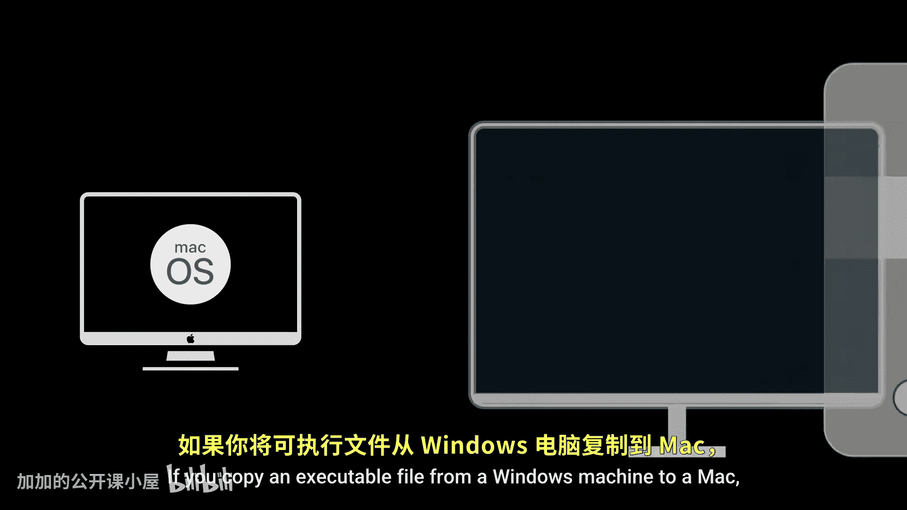


在本节课中，我们将探讨一个常见现象：为什么一个在Windows上编译的程序无法在Mac或Linux上运行。我们将深入分析其背后的核心原因，而不仅仅是“CPU架构不同”这个表面答案。

---

### 为什么跨操作系统程序无法运行？🤔

如果你将一个可执行文件从Windows电脑复制到Mac，会立刻发现该程序无法在Mac上运行。


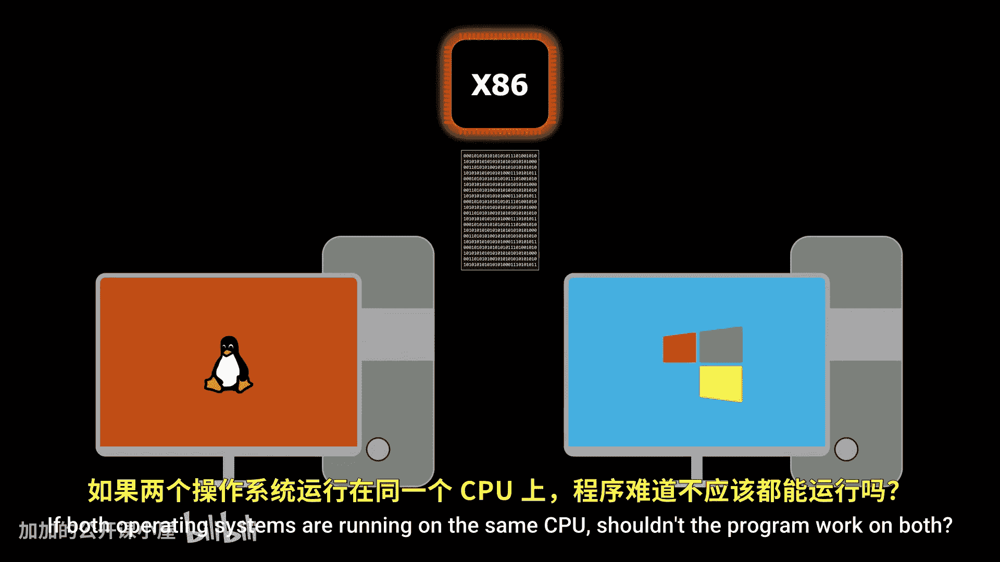

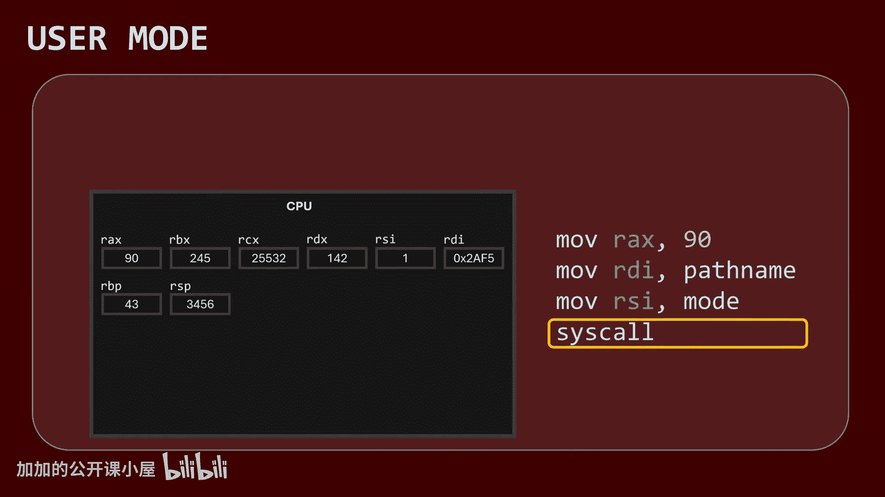

如果问及原因，你可能会说是因为Mac使用ARM CPU，而大多数Windows电脑使用Intel x86 CPU。这个回答合理，但并非全部真相。因为在2019年，几乎所有Mac仍在使用Intel CPU时，你也会遇到同样的问题。实际上，你可以在同一台硬件上运行多个操作系统，例如在同一台电脑上同时使用Linux和Windows。但这并不意味着我可以在Linux上运行Windows程序，尽管两者使用相同的CPU。

但这是为什么呢？编译后的代码不是应该直接翻译成硬件可以执行的机器指令吗？如果两个操作系统运行在相同的CPU上，程序不应该在两者上都能工作吗？


这是一个复杂的问题，而这正是我们将在本视频中探讨的内容。

---

### 应用程序的双重限制：架构与操作系统 🔒

事实证明，应用程序不仅是**架构特定**的，也是**操作系统特定**的。如果向计算机科学专业的毕业生提出这个问题，他们很可能会回答：**系统调用**。

通用操作系统被设计为同时运行多个进程，这意味着它们必须共享硬件资源，其中最重要的资源之一就是CPU。CPU是任何计算机的核心，控制着几乎所有部件。这带来了潜在的安全风险，因为理论上任何进程都可能利用CPU来控制系统，绕过操作系统并执行恶意操作。

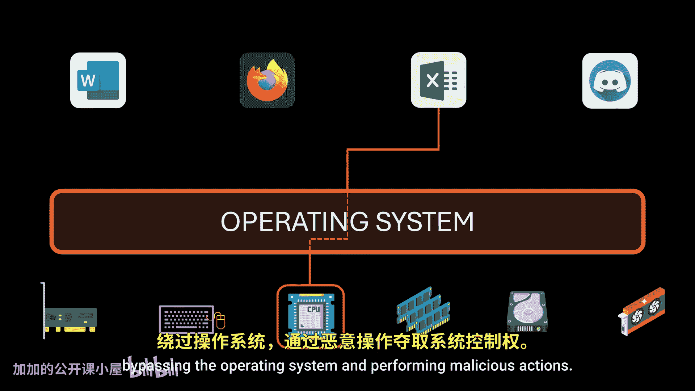

为了防止这种情况，CPU在两种基本模式下运行：**用户模式**和**内核模式**。

*   **内核模式**（也称为特权模式）：CPU可以执行其指令集中的任何指令，拥有对系统的完全控制权。这包括操作I/O设备和硬件组件（如CPU计时器或内存管理单元）的能力。
    
*   **用户模式**：CPU被限制在有限的指令子集中。这个子集允许它执行诸如移动和复制数据、执行数学运算、评估条件和运行循环等任务。虽然这些指令仍然非常有用，但在此模式下，CPU无法执行直接控制硬件所需的特权指令。

正如你所猜测的，用户程序在用户模式下运行，而操作系统在内核模式下运行。操作系统使用特权指令来确保没有用户程序能够未经授权地进入内核模式。这种分离对安全至关重要，但也引入了一个问题。

---

### 系统调用：用户程序与硬件的桥梁 🌉

即使对于像读取文件这样简单的任务，或像通过网络发送消息这样更复杂的任务，用户程序也需要一种访问硬件的方式。解决方案是：如果一个用户程序无法操作硬件，它可以请求操作系统代其完成。

例如，如果一个程序需要打开一个文件并写入，它会调用一个相应的系统函数，请求操作系统处理诸如在磁盘上定位文件和写入等任务。

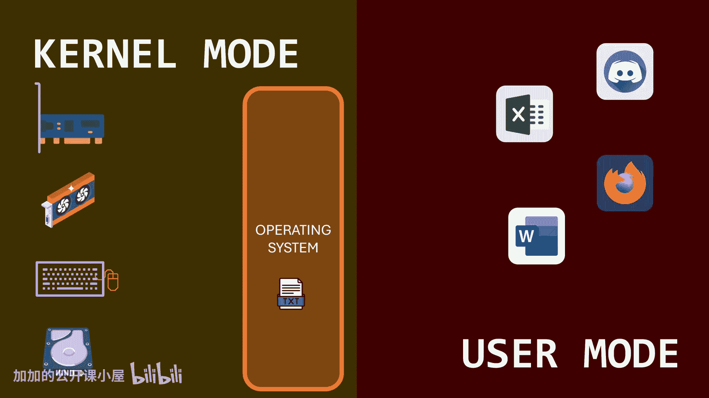


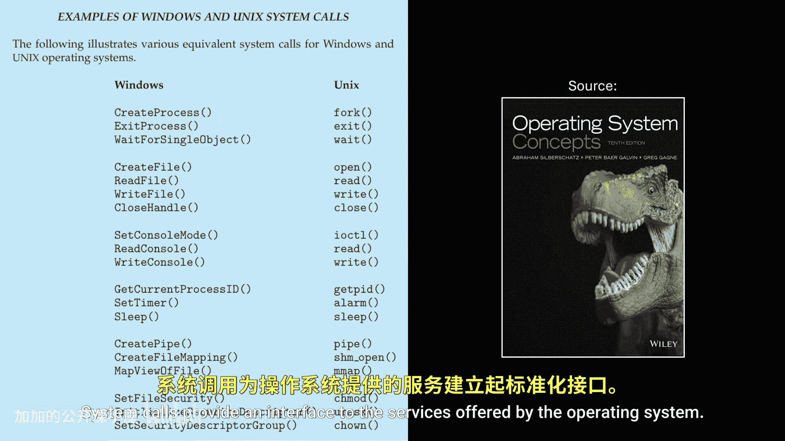

这正是**系统调用**的作用。系统调用提供了访问操作系统所提供服务的接口。


系统调用通常以C或C++编写的函数形式提供，可以大致分为六大类。**每个操作系统都提供自己独特的系统调用集合，这就是兼容性问题的开始**。

在实践中，大多数程序严重依赖系统调用。即使是你现在用来观看此视频的程序，也在不断调用操作系统，每分钟提出数千次各种服务请求。

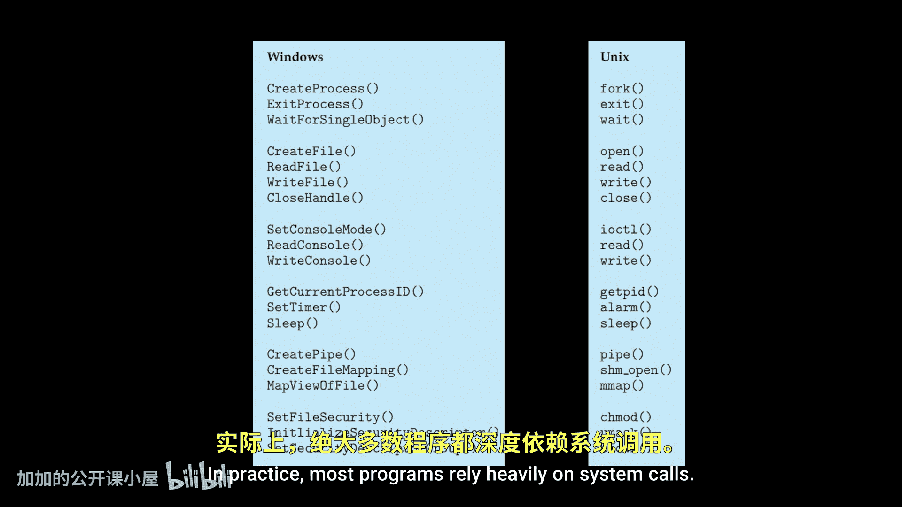


你可以在Linux上通过以下命令自行检查，将数字替换为你感兴趣的进程ID：
```bash
cat /proc/<PID>/status | grep voluntary_ctxt_switches
```
这将显示你的进程信息，你会找到一个名为`voluntary_ctxt_switches`的字段。这个值代表进程使用系统调用请求操作系统服务的次数。注意，这个数字并不小。

这凸显了核心问题：用户程序如此依赖系统调用，以至于如果另一个操作系统没有以完全相同的方式实现它们，程序就根本无法工作。

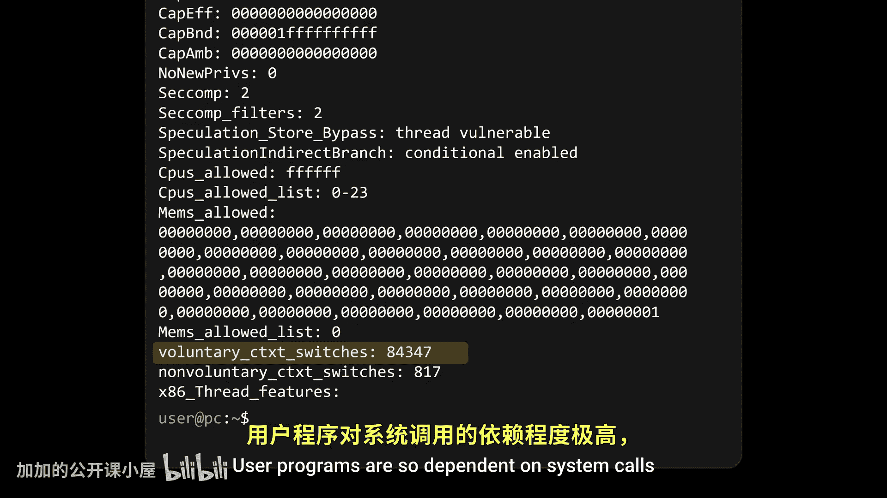


---

### 系统调用的差异与设计决策 ⚙️

问题不仅仅是命名差异。即使系统调用在不同操作系统间有对应物，它们的功能也可能大相径庭。

例如，在Windows上，你可以使用`CreateProcess`系统调用来创建一个新进程，它接收要运行的程序的可执行文件路径。这很直接。

而在Unix系统上，对应的`fork`系统调用也会创建一个新进程，但它创建的是调用进程的**克隆**，唯一的区别是新进程拥有唯一的进程ID。因此，在Unix系统上，运行一个特定程序需要额外的步骤：在使用`fork`之后，子进程必须调用另一个系统调用（如`exec`），将其代码段替换为需要运行的可执行文件的内容。

这类设计决策在操作系统之间造成了显著差异。在一个平台上，一项任务可能只需要一个系统调用，而在另一个平台上可能需要多个。因此，当编译成机器码时，不同平台会生成不同的指令来实现相同的结果。即使两个程序都为相同的CPU架构编译，那些额外的指令在另一个操作系统上也会缺乏意义，导致未定义行为并最终崩溃。

---

### 系统调用的底层机制：中断与调用约定 🧠

当一个程序需要向操作系统请求某些东西时，它会触发一个**中断**。

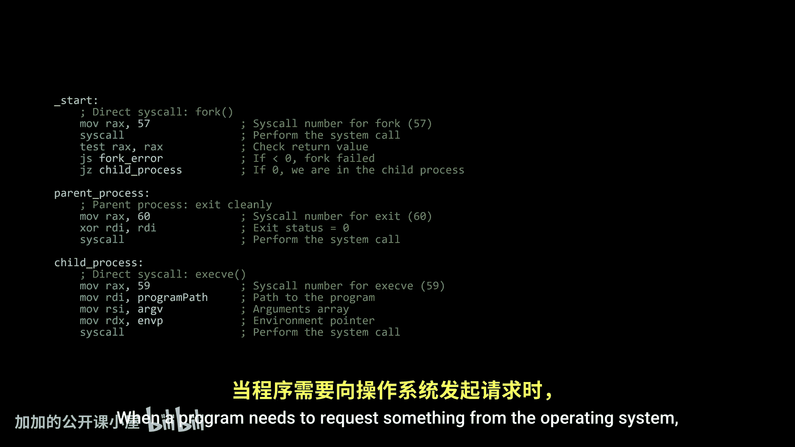

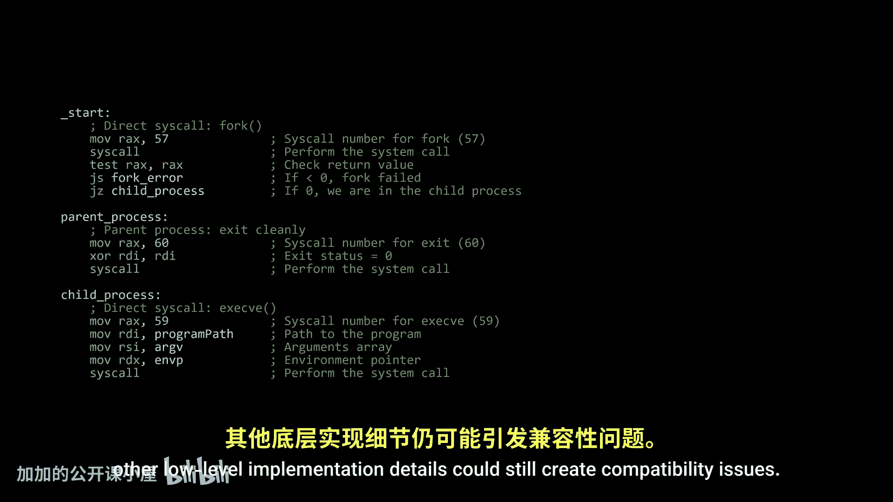

这个中断导致CPU切换到内核模式，并将控制权交给操作系统。

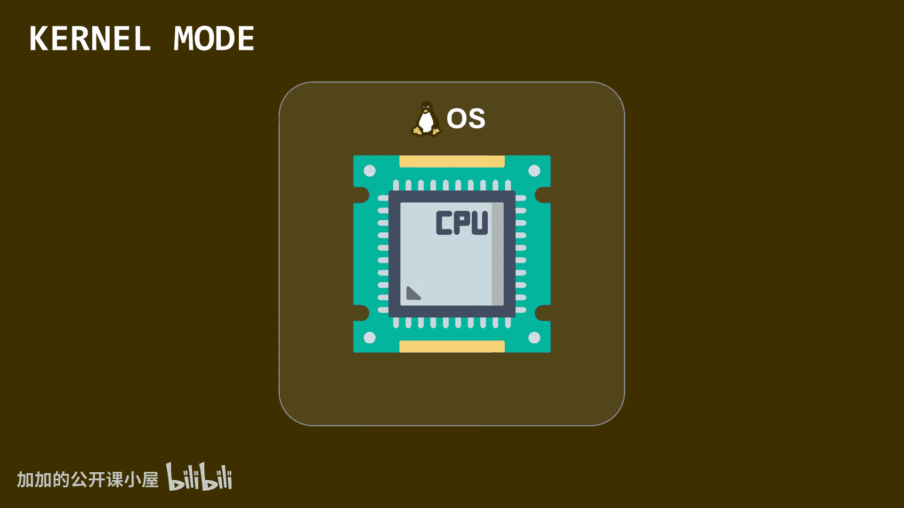

在像x86-64这样的架构上，使用一个名为`syscall`的特殊指令来实现此目的。

但一旦操作系统获得控制权，它如何知道请求了哪个系统调用？如果系统调用需要参数，这些参数如何从用户程序传递给操作系统？

识别系统调用的常见方法是为每个系统调用关联一个唯一的**编号**。

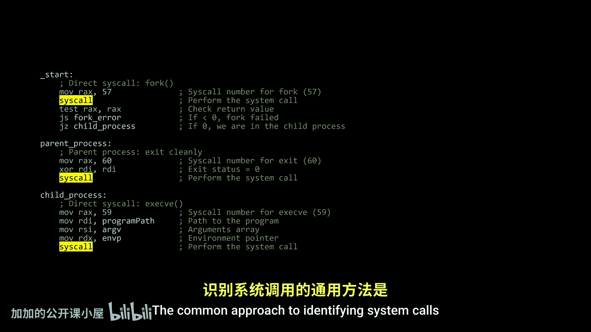


在硬件层面调用系统调用之前，程序将相应的编号写入一个**寄存器**。当操作系统获得控制权时，它读取该寄存器中的值，并查阅**系统调用表**来确定请求的系统调用。


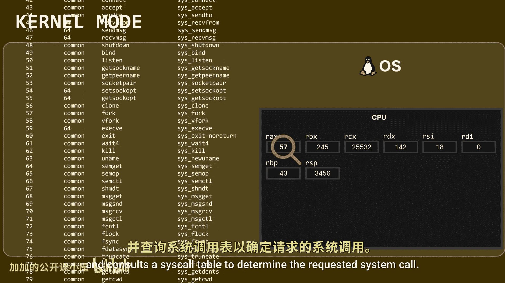


在Linux内核的源代码中，你可以通过查看特定架构的文件来查找每个系统调用关联的编号。这也揭示了Linux支持的系统调用数量之多，我们讨论过的只是最常用的部分。

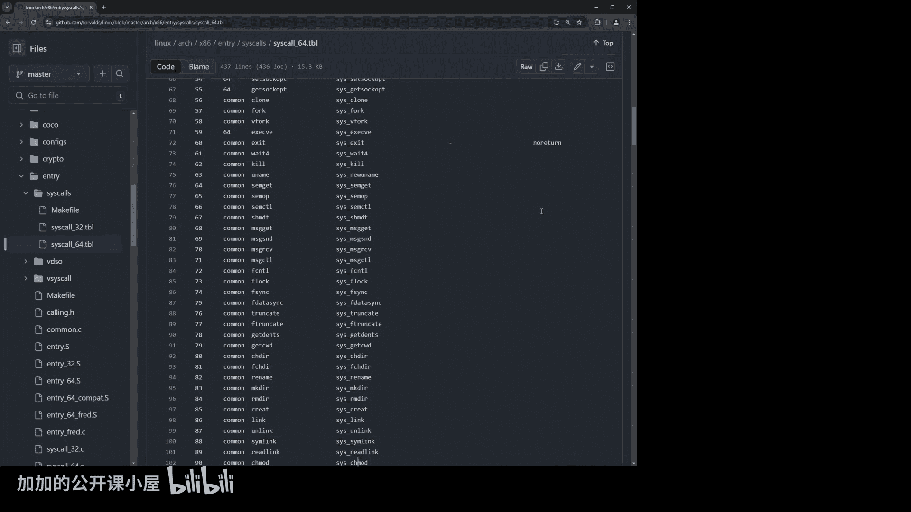

再次强调，如果两个操作系统没有使用完全相同的表来提供相同的系统调用，相同的机器码可能会根据操作系统请求完全不同的服务。


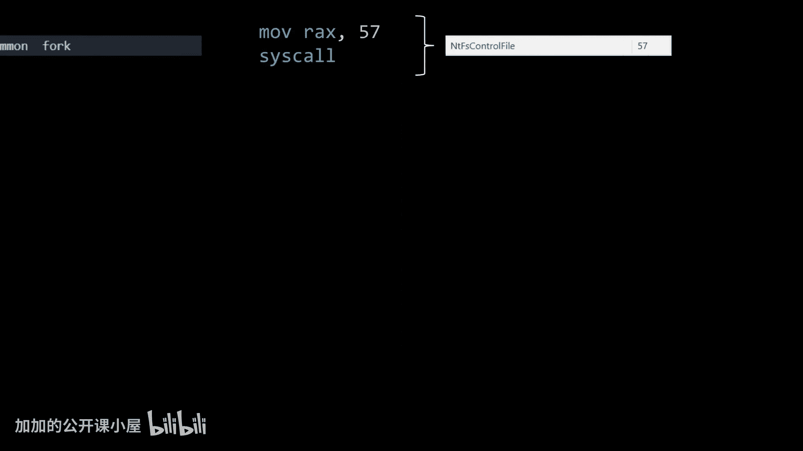


---

### 应用程序二进制接口：更深层的兼容性障碍 🔧


假设两个操作系统使用完全相同的系统调用表。

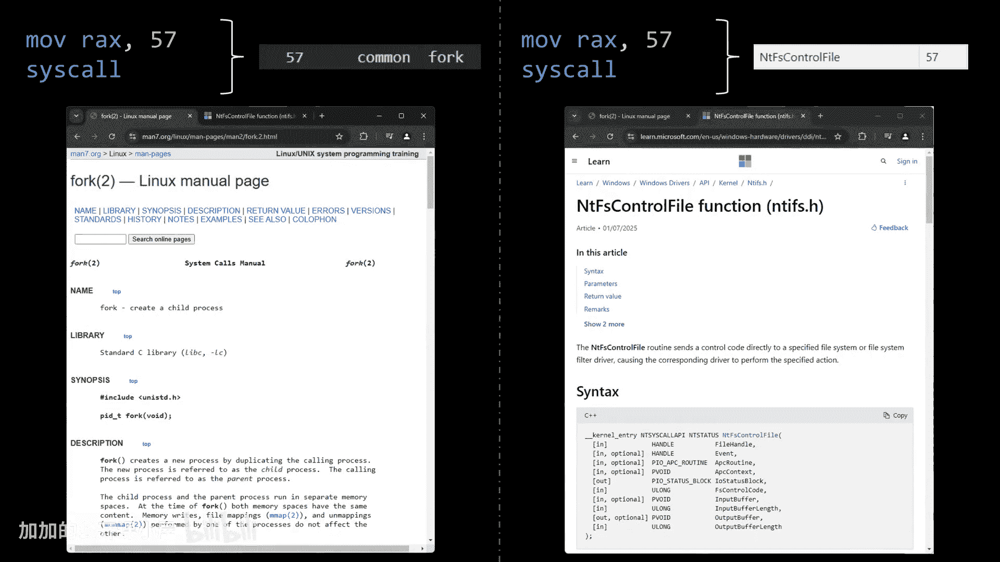


这能保证兼容性吗？不幸的是，不能。如果其中一个操作系统使用不同的寄存器来指定系统调用编号，那么程序在该操作系统上运行就会崩溃，因为它会读取错误的寄存器，从而识别错误的系统调用，导致未定义行为。

那么，如果两个系统都从同一个寄存器读取呢？这能解决问题吗？仍然不能。许多系统调用还需要参数，而这些参数的传递方式取决于操作系统。

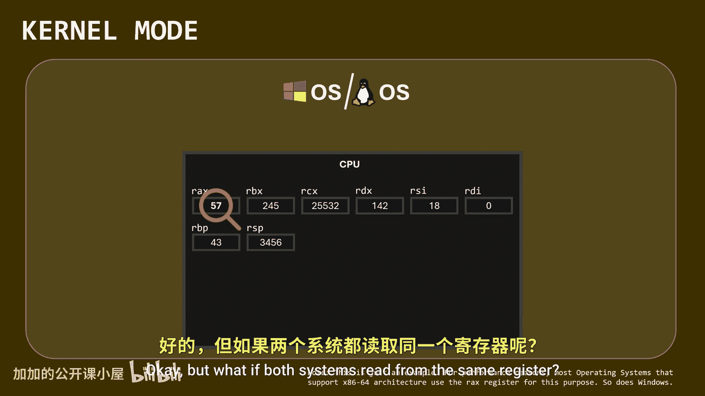


有些系统要求参数存储在寄存器中，而另一些则要求写入特定的内存区域，或者两者结合。例如，在Linux上，如果一个系统调用接受少于六个参数，它们必须存储在寄存器中。如果需要超过六个参数，则剩余的参数写入内存。这些看似微小的细节至关重要。

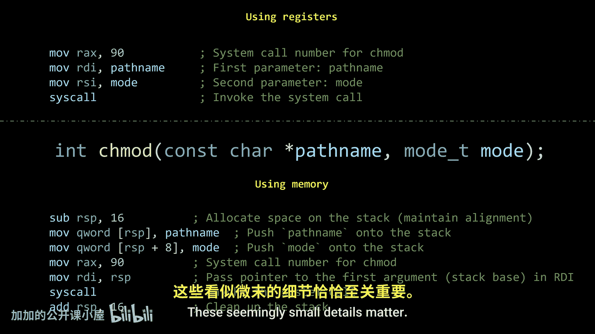


这又是一个例子，说明为一个操作系统设计的程序，技术上可能在运行相同CPU的另一个操作系统上执行，但行为不可预测。例如，操作系统可能期望参数在内存中，而程序却将它们存储在寄存器中，反之亦然。

如果参数存储在内存中，方法也很重要：程序是使用栈，还是有特定的内存位置用于此目的？

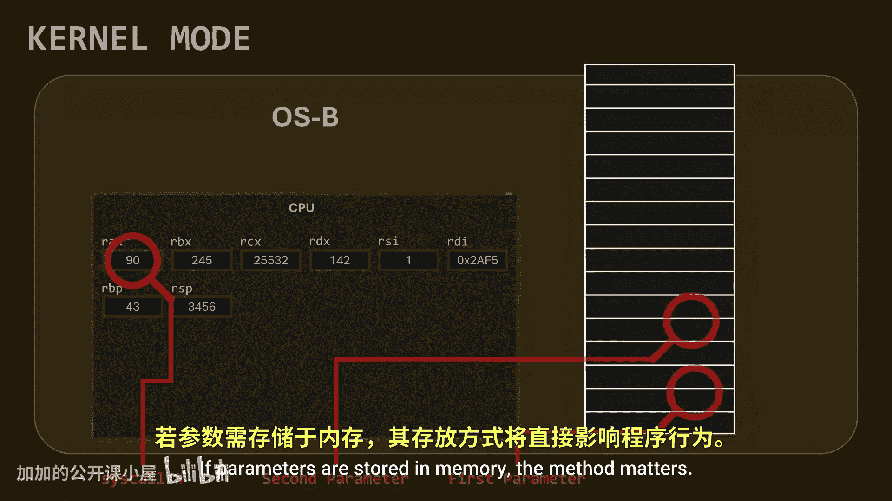


如果参数包含指针，地址宽度就变得重要。这些只是需要对齐的众多底层细节中的几个。这组约定被称为**应用程序二进制接口**。

正如API在应用程序级别定义函数一样，ABI定义了二进制代码的不同组件在特定操作系统和架构上如何交互。而这还只是关于系统调用方面的问题。

---

### 其他兼容性因素：可执行文件格式与运行时环境 📦

即使我们讨论的所有问题都得到解决，其他底层细节仍可能导致兼容性问题。最重要的因素之一是**可执行文件格式**。

我们知道，可执行文件是编译器翻译源代码后产生的，但这个文件不仅包含指令，还包括允许操作系统加载和执行程序的**数据和元数据**。在这一系列0和1中，程序的每个部分位于哪里？它看起来是这样，还是那样，或者可能是这样？


每个操作系统对此都有特定的规则。这种结构确保可执行文件可以被操作系统正确加载和运行，同时支持各种功能，如链接、调试和动态库使用。如果你对这个主题感兴趣，建议研究一下Linux上使用的**可执行与可链接格式**和Windows上使用的**可移植可执行格式**。

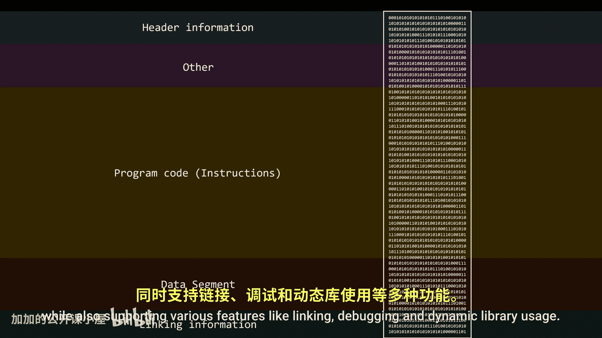


另一个原因是**运行时环境**。有些编程语言不直接编译成机器码，而是在虚拟机或解释器上运行。这意味着只要系统上安装了虚拟机，相同的代码就可以跨多个平台运行。具有讽刺意味的是，虚拟机和解释器的设计初衷就是为了绕过我们在本视频中讨论的许多兼容性问题。

然而，现代应用程序通常以模块化方式构建。如果所有模块都编译成机器码，那很好。但如果即使一个模块依赖于运行时环境，而该运行时环境没有安装在机器上，整个应用程序可能无法运行。

---

### 总结 📝

本节课中，我们一起学习了为什么应用程序是操作系统特定的。核心原因在于：

1.  **系统调用差异**：不同操作系统提供不同功能、命名和调用方式的系统调用集合。
2.  **应用程序二进制接口不匹配**：包括系统调用编号、参数传递方式（寄存器/内存）、调用约定等底层细节在不同操作系统间不一致。
3.  **可执行文件格式不同**：操作系统加载和执行程序所需的文件内部结构各异。
4.  **运行时环境依赖**：某些语言需要特定的虚拟机或解释器，如果目标系统缺失，程序将无法运行。


这些因素共同作用，使得为一个平台编译的程序无法在另一个平台上直接运行，即使它们使用相同的CPU硬件。理解这些原理有助于我们更好地认识软件与操作系统之间的紧密关系。