操作系统原理：P8：硬件如何辅助软件实现多任务处理 🖥️


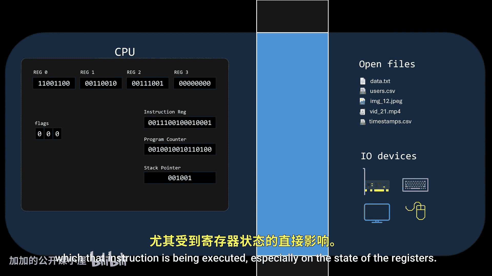

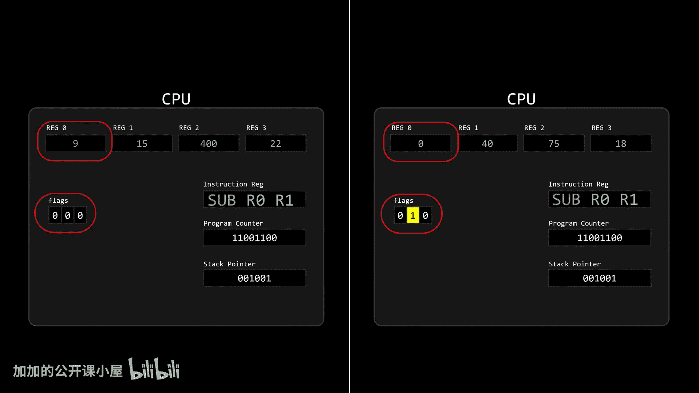

在本节课中，我们将要学习操作系统进行多任务处理时，硬件如何提供关键支持，特别是如何在不破坏被中断进程状态的情况下，安全地保存和恢复CPU的上下文。

当一个进程运行时，它会持续使用CPU来顺序执行指令。在此过程中，指令的执行结果取决于其执行的整个上下文环境，尤其是寄存器的状态。


相同的指令，根据寄存器中保存的不同值，可能会产生不同的结果。

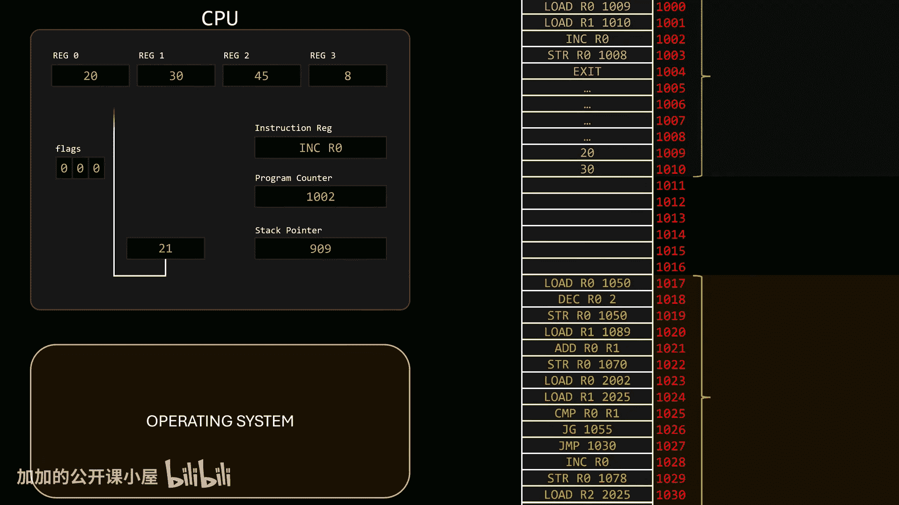


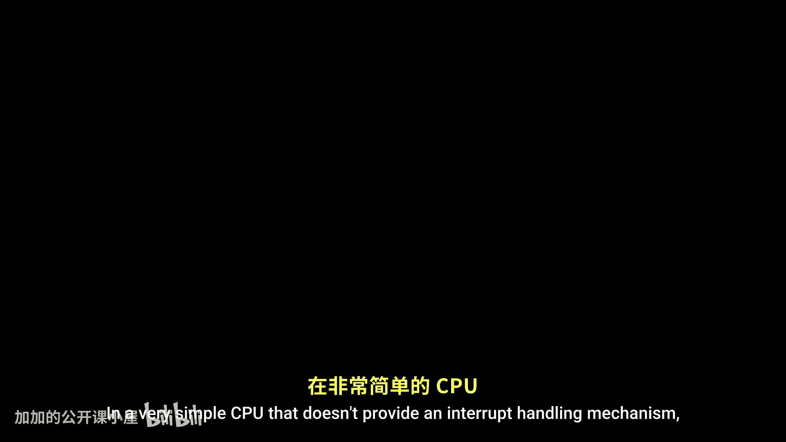

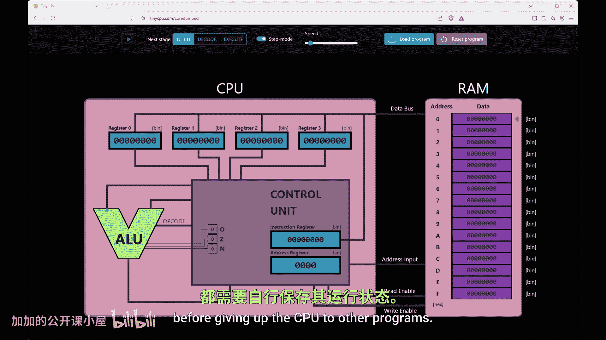

在讨论并发时，如果一个进程被中断，CPU不能简单地交给下一个进程，因为此时寄存器中存储的数据属于被中断的进程。如果新进程在没有正确处理的情况下恢复执行，它将在错误的上下文中使用错误的数据进行操作。


因此，每次中断一个进程以将CPU分配给另一个进程时，都必须捕获寄存器的状态并将其存储在内存中，同时必须加载新进程的状态，以便它能正确继续执行。这被称为**上下文切换**，之所以这样命名，是因为我们正在改变CPU运行的上下文。

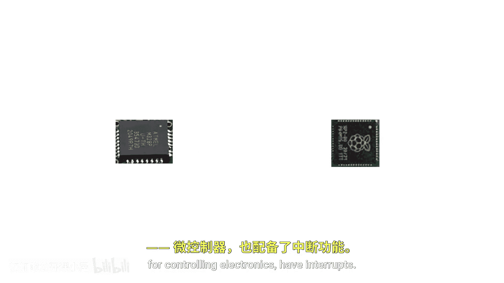

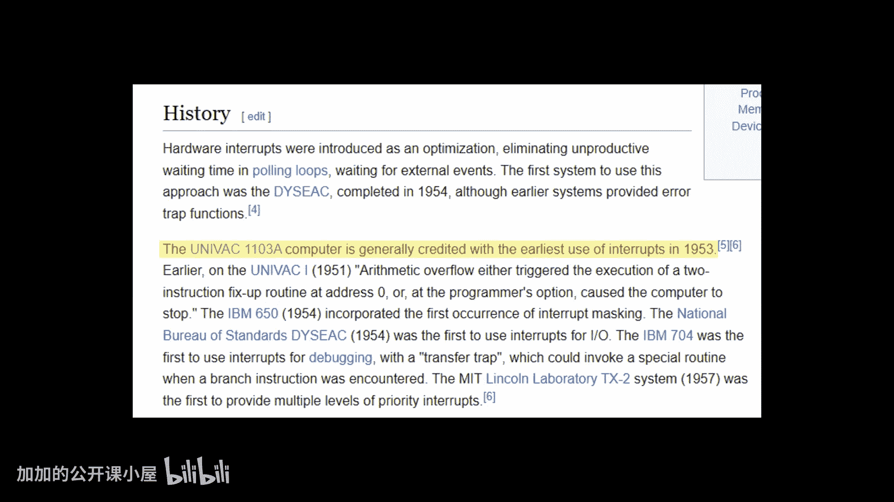

问题是，这不会像动画中展示的那样神奇地发生。操作系统实际上需要运行一些代码来完成这个任务。在我之前的视频中每次提到这个概念时，评论区都有人问，这个过程是如何在不改变被中断进程状态的情况下实现的。今天，我们将回答这个问题。


需要注意的是，我们将在一个非常简单的、不提供中断处理机制的CPU中讨论基于中断的切换，就像我们前几集构建的那个一样。在这样的系统中，上下文切换完全依赖于软件，每个程序在将CPU让给其他程序之前，都有责任存储自己的状态。


幸运的是，这类CPU相当罕见，因为它们既不安全，也不是特别有用。


中断，有时也称为陷阱，是计算机的一项基本功能。


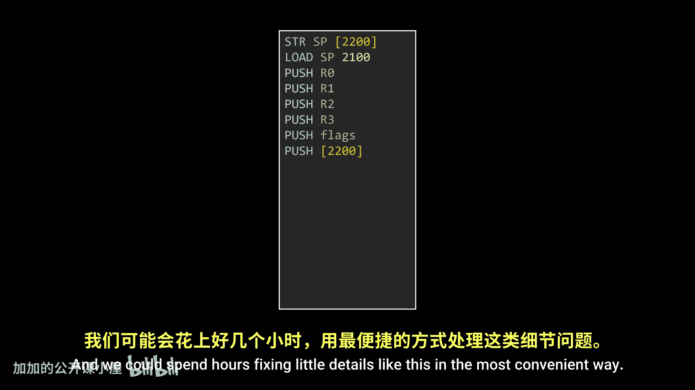

具有中断机制的计算机已经伴随我们超过70年了。

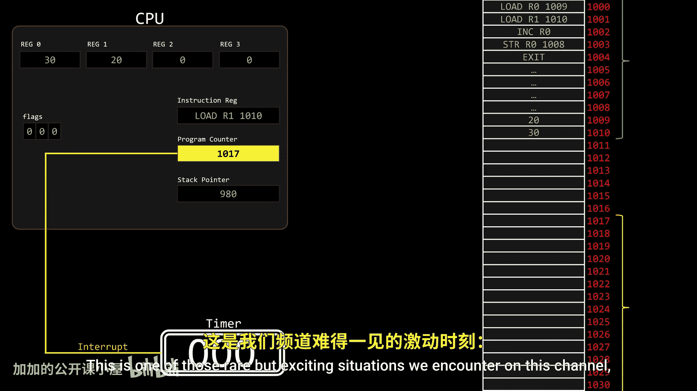


是的，没有中断，计算机将大不相同。正如我们所知，一个进程可以通过两种方式被中断。它可以自愿中断自己，通过触发软件中断或执行特殊指令向操作系统请求资源。或者，它可能被来自硬件组件（如定时器或IO设备）的信号中断，例如占用CPU时间过长。在这两种情况下，中断的效果是相同的：CPU完成当前指令的执行以防止不一致，然后程序计数器立即被覆盖，使其跳转到特定的内存位置。这个内存位置包含处理中断所需的可执行代码，包括捕获被中断进程状态所需的代码。

请注意，甚至在获取这些指令之前，程序计数器已经被中断覆盖了，这意味着我们不再知道进程是在哪里被中断的。不幸的是，我们无法避免这个问题，稍后我们会看到。但在此之前，让我们思考一下捕获被中断进程CPU状态所需的代码。为了简单起见，我们用代码来写。首先，我们需要捕获通用寄存器中的值，因此中断处理程序例程可以以如下指令开始：


```assembly
MOV [SAVE_R0], R0
MOV [SAVE_R1], R1
...
```

这需要处理为此目的保留的特定内存位置，这可能很繁琐。为了避免这种情况，更容易的做法是将值压入栈中。标志寄存器也很重要，所以我们把它们也压入栈，栈指针本身也是如此。


但是等等，栈指针当前正指向用户程序栈。这是一个巨大的问题，因为这些指令将由操作系统执行，而操作系统有自己的栈。是的，没错，记住操作系统也是软件，所以它有自己的栈。执行这些指令会修改被中断进程的栈。

也许我们可以通过修改栈指针来开始处理中断，以便将寄存器状态压入内核栈。但现在我们在保存其值之前就覆盖了栈指针。为了避免这种情况，我们可以在修改栈指针之前将栈指针值存储到一个内存位置，然后简单地从该内存区域压入值。

我们可以花几个小时以最方便的方式修复这样的小细节。事实上，我确信你们中的一些人已经在思考其他方法了。但最终，程序计数器被中断本身覆盖的问题，使得这个问题无法解决，至少无法通过软件解决。


因为没有任何指令可以在最开始就保存那个值。当然没有，当CPU运行第一条指令时，那个值已经丢失了。这是我们在这个频道遇到的罕见但令人兴奋的情况之一：硬件需要支持软件，而不是反过来。在Skillshare的简短信息之后，我们将继续讨论这个问题。


任何支持中断的体系结构都应该提供一种机制来防止丢失被中断进程的状态；换句话说，它应该提供至少最低限度的硬件支持，以确保软件能够保存被中断进程的程序计数器。

处理中断主要有两种解决方案。请记住，每种体系结构都有自己的实现方式，这里只是两种通用方法。

**第一种方法**最容易理解：CPU不依赖单一的寄存器组，而是可以提供多个寄存器组。多个寄存器组可以分配给不同的进程。这样，当一个进程被中断时，下一个进程可以简单地切换到另一个寄存器组，从而避免对前一个进程状态的任何修改。

然而，进程数量可能多于可用的寄存器组，并且由于寄存器是硬件的一部分，我们无法在运行时增加它们。但关键是，我们不需要无限多的寄存器组。如果CPU支持操作模式，2个就足够了：其中一个寄存器组可以由多个用户程序共享，而另一个只能在核心态下由操作系统访问。记住，当CPU在核心态下运行时，它几乎可以做任何事情。在这种情况下，这意味着操作系统可以为了便利而操作和访问额外的寄存器组。为了方便起见，我们称这些为**通用寄存器组**和**特权寄存器组**。

当中断发生时，CPU切换到核心态，停用通用寄存器组，并开始使用特权寄存器组，确保被中断进程的状态保持不变。这样，中断就不会覆盖通用寄存器组上的程序计数器，而是覆盖特权寄存器组上的。特殊的特权指令允许操作系统访问被禁用的寄存器，并将其值复制到当前启用的寄存器中。

在这些指令中的每一条之后，一条普通指令将刚从禁用寄存器获取的值移动到内存位置。这可以是我们在视频第一部分尝试的栈，但最终它会被复制到被中断进程的**进程控制块**中。当然，这涉及到额外的指令（此处未显示）来查找PCB存储在内存中的位置。

接下来，读取另一个进程的PCB，并执行相反的过程。普通指令将值从内存复制到活动寄存器组，然后特权指令将这些数据传输到禁用的寄存器中。最后，如果使用抢占式调度，则使用特权指令设置定时器，然后执行`CISRET`特权指令。在这种体系结构中，`CISRET`做两件事：交换活动寄存器组（将用户程序锁定为使用其中一个），并切换回用户模式。由于现在指令在通用寄存器组上执行，在下一个周期，CPU恢复执行选定的进程。相当简单，对吧？

不幸的是，这种方法并不十分流行，尤其是在现代体系结构中。我不是硬件专家，所以不能给出确切的原因，但我最好的猜测是，在CPU芯片上复制完全相同的电路并不值得，特别是现代体系结构有数百个寄存器，甚至更复杂的组件如SIMD寄存器。此外，正如你们中的一些人可能已经注意到的，复制整个寄存器组并不是真正必要的。只对关键寄存器（如栈指针和程序计数器）拥有独立的寄存器组就足够了，正如我们在本视频第一部分讨论的那样。让我们探索其他选项。

**第二种方法**是：如果我们可以将部分过程在硬件中自动化，从而最小化所需的软件量呢？由于每种体系结构的实现方式不同，这里不会深入细节，但通常有两种方式。硬件不是复制寄存器组，而是可以自动化某些步骤，这些步骤就像直接内置在CPU中的硬连线指令。就像我们有时在源代码中硬编码数据库URL或私钥，而不是从环境文件中获取一样，指令和数据也可以硬连线到CPU电路中。这允许它们在中断生效之前立即执行。

一种方法是确保操作系统的栈指针始终可以被CPU访问，无论是通过硬连线到CPU的内存位置还是通过特殊寄存器。当中断发生时，关键寄存器（如程序计数器和栈指针）会在程序计数器被覆盖以跳转到中断处理程序之前，自动压入操作系统栈。从这时起，保存其余寄存器的责任就交给了软件。我们必须小心，在将寄存器内容复制到内存之前，不要写入任何寄存器，这正是我们在视频第一部分尝试做的事情，只不过现在被中断进程的程序计数器和栈指针由于硬件支持而安全了。

然后，还有一些更激进的体系结构，它们在硬件中完成了大部分的上下文切换。这通常是通过一个指向操作系统管理的内存区域的段寄存器来实现的，该区域存放着一个特殊的数据结构。在一些体系结构中，这个数据结构被称为**任务状态段**，相应的寄存器称为任务寄存器。简单来说，当中断发生时，CPU会自动将所有寄存器的全部内容复制并粘贴到任务状态段中。

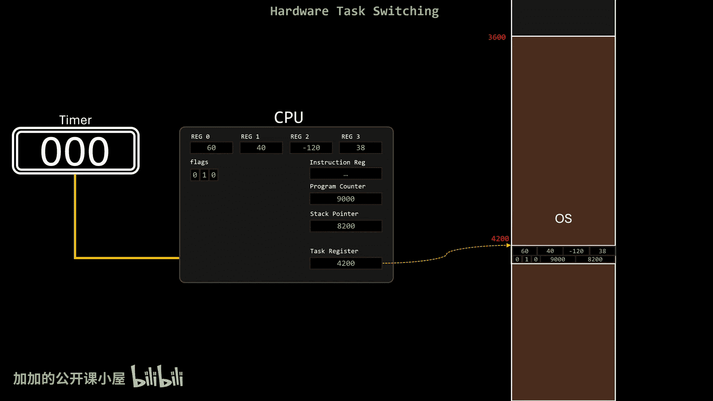


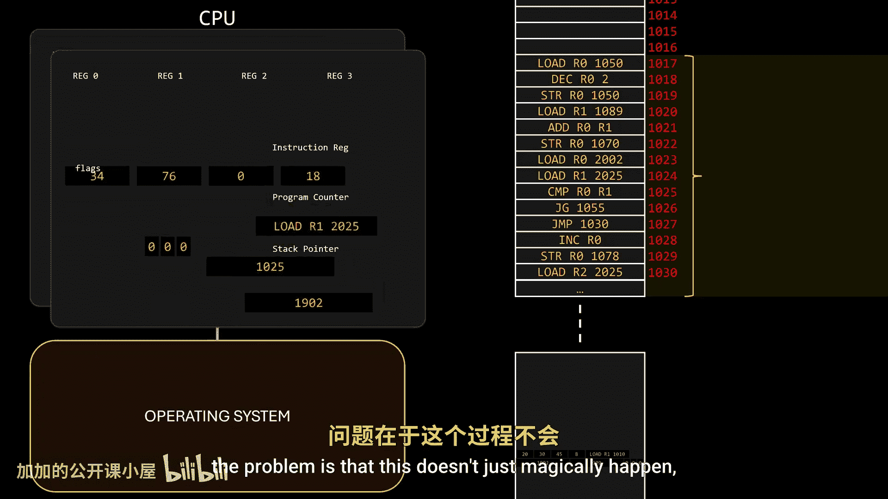

让我引用本视频开头的话：“问题是，这不会像动画中展示的那样神奇地发生。”


事实证明，它可以神奇地发生，至少从软件的角度来看是这样。这非常了不起，因为它使得整个视频变得有点多余，除了出于某种原因，主流操作系统避免使用这个功能。当然，实际情况比我描述的更复杂，所以如果你们希望我介绍像x86-64或ARM这样的特定体系结构，请在评论中告诉我。


在本节课中，我们一起学习了硬件如何辅助操作系统进行上下文切换。我们探讨了在没有硬件支持时，仅靠软件保存进程状态（尤其是程序计数器）所面临的固有难题。接着，我们分析了两种主要的硬件辅助方案：一是通过提供多组寄存器来物理隔离不同进程的上下文；二是由硬件自动执行关键步骤，例如在中断发生时自动将程序计数器和栈指针保存到内核栈，从而为软件处理剩余部分奠定基础。这些机制是操作系统实现高效、安全多任务处理的基石。