# CoreDumped【中英⚡图解操作系统原理｜Operating Systems Theory】 p10 P10 The Weirdest Bug in Programming - Race Conditions -BV19h48zoEeB_p10-

This video was sponsored by FlexxiSpot。Concurrency is a recurring topic on this channel；

 it's the technique alongside CPU scheduling that distributes computing resources among multiple executable entities。

The system switches the CPU between them so quickly that it creates the illusion they are all running at once。

When these processes operate independently， everything tends to work smoothly。

But the moment concurrent entities need to interact， things can get tricky。

 and if not handled carefully， the consequences can be disastrous。Today。

 we're going to talk about race conditions， one of the most bizarre and elusive bugs you can encounter in systems programming。

Hi friends， my name is George and this is Core Dumped。When we first learn programming。

 many of us are told we're simply writing instructions。

 defining one step after another for the computer to follow to reach a goal。

What most beginners aren't told is that each line of code doesn't necessarily correspond to a single CPU instruction；

 in practice some lines might compile down to just one instruction， while others require many。

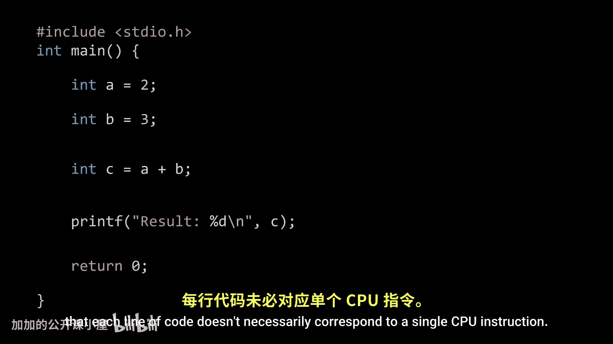

Adding two numbers， for example， require several instructions。

 one to fetch each operant from memory into CPU registers。

 another to tell the CPU to add the values in those registers。

 and a final instruction to store the result back into memory so the value can be accessed later as good systems programmers。

 we must keep in mind that most operations we write in source code require multiple CPU steps to accomplish what we intend them to do。

And this is the first critical concept to know if you want to understand race conditions。

 most operations are not atomic。

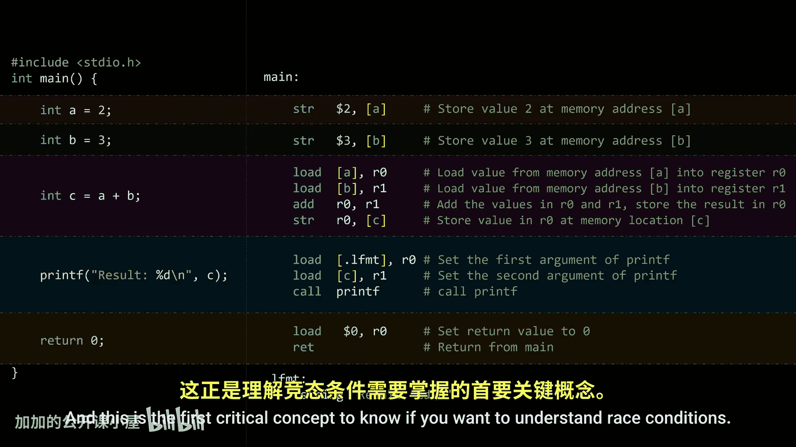

Now let's refresh some concepts we've covered before。

We've previously discussed that threads are usually created through system calls。In C， for example。

 the most common way to create threads is with the P thread C function available on Poic's complianceliant systems。

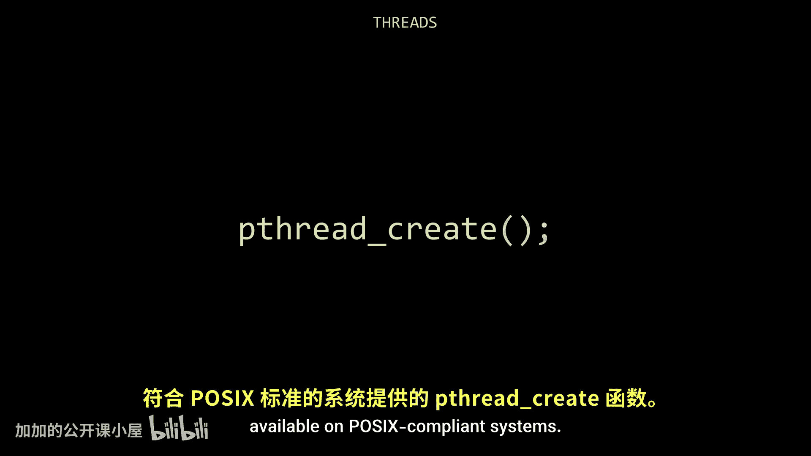

This function receives a pointer to another function。

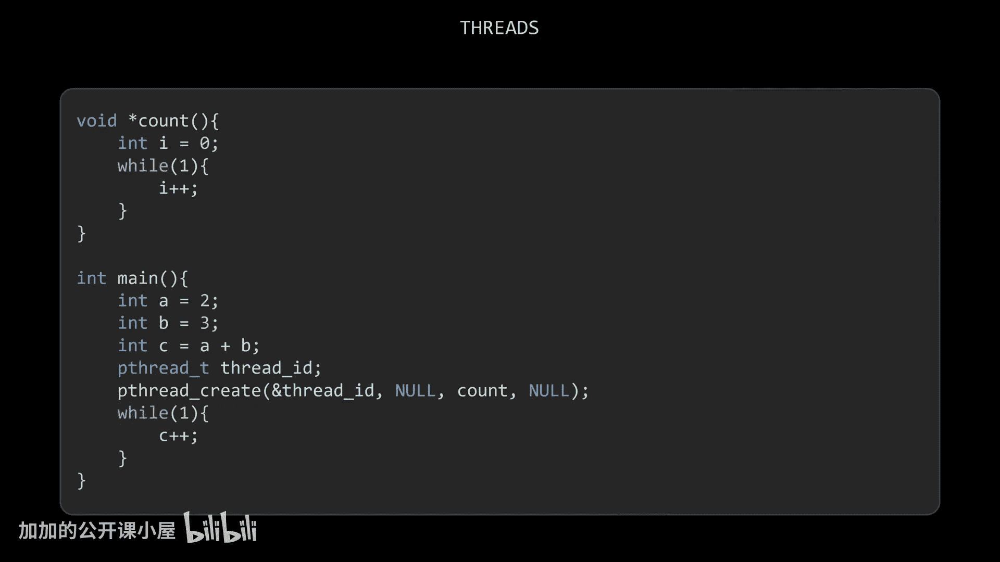

When we call P thread Cate， a lot happens under the hood。

The inner systemtem call informs the operating system that the function passed as a parameter can start running as a separate executable entity。

 running concurrently with the thread that made the call， so in our example， after the system call。

 the main function continues running without waiting for the newly created thread to finish。

Also remember， concurrency does not imply parallelism in a multi corere system。

 concurrent functions may execute in parallel， but on a single core system， the CPU core is shared。

 each thread takes turns。The switching happens so quickly that it appears as if they're running simultaneously。

There are many use cases where threads and concurrency are incredibly useful； for example。

 modern HTTP servers rely heavily on threads to handle multiple client requests at the same time。

Without concurrency， the main function would have to serve each client request before even accepting another client's request；

 you can imagine how inefficient that would be。With concurrency。

 the main thread listens for incoming requests， and as soon as one arrives。

 it spawns a new thread to handle it。Since that thread operates independently。

 the main thread can go back to listening for new requests。But despite how useful concurrency is。

 it must be used with caution。Let's say the server returns the name of the client。

 sent in the body of the request In this case， each thread only deals with its own client and doesn't interact with others。

 since there's no shared data， not much can go wrong。

But what if threads need to share and modify the same data？

Imagine that instead of replying with the client's name。

 the server returns a string shared by all threads。

 one that's periodically updated from a list of sentences by another thread。In this scenario。

 threads need some way to communicate。But almost everyone new to concurrency will fail at implementing this correctly；

 many will define a global variable to store the current string。

 create a function that periodically updates it， and spawn a thread that runs this function。

The writer thread simply modifies this variable as needed while the handler threads read from it whenever they need to respond to a client。

 and this is exactly what I tried on my own machine。 I defined a shared variable。

 hard coded a list of sentences， and the writer thread cycles through that list。

 updating the shared variable。

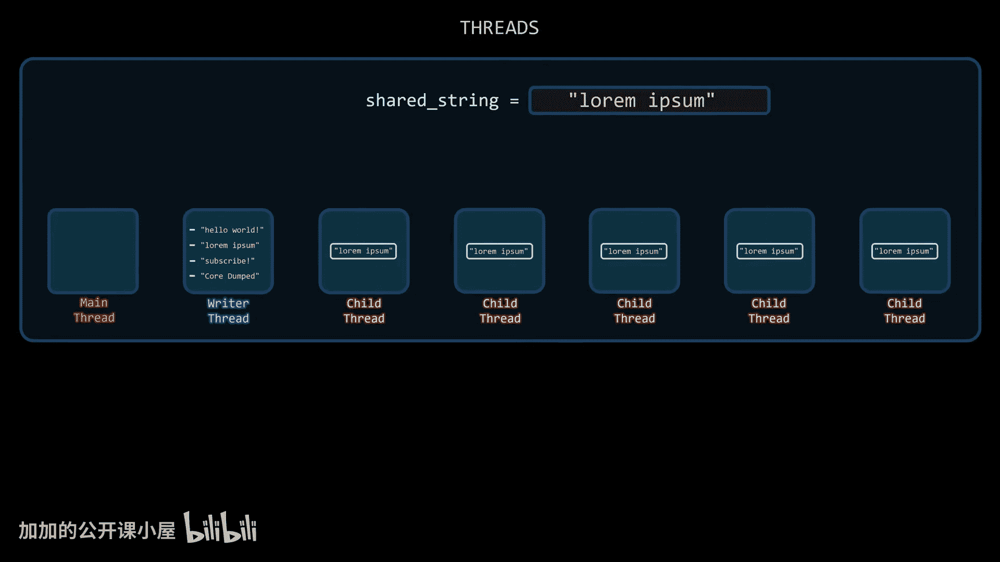

To observe the behavior， I logged every response that the handler thread sent back to clients into a text file。

At first glance， everything looked fine； the writer thread appeared to update the string periodically。

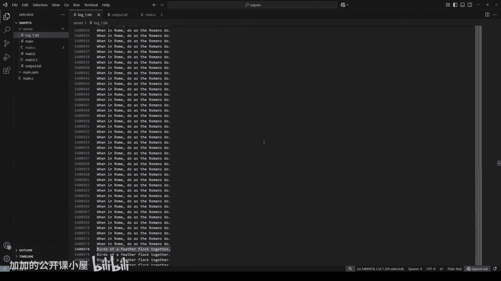

But then I found this。One response returned a string that was not in the list I hard coded。

For some reason， the last letter was different， something had clearly gone wrong。

Now just looking at this single instance isn't enough to draw conclusions。

 it happened once in over 9 million requests。

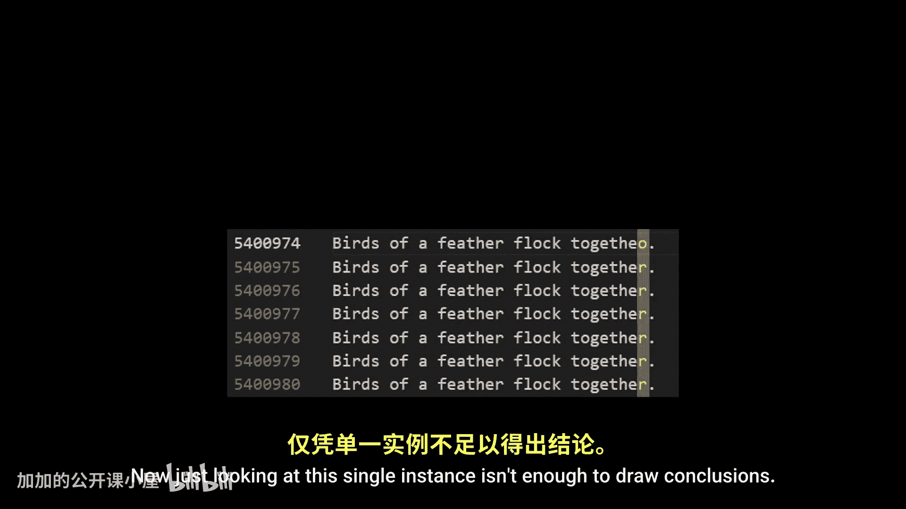

In fact， it would have been nearly impossible to notice by scrolling through the logs。

 I only found it because I knew exactly what I was looking for and wrote a program to search for anomalies。

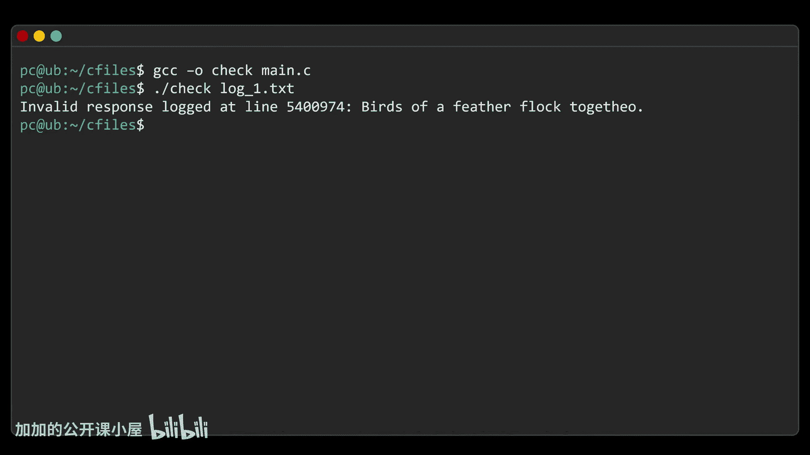

So I ran the test again， this time for much longer， and analyzed the results with the same program。

 after nearly 85 million requests， I found more suspicious outputs。

 and this time the issue was a little more obvious。To make it clearer。

 I'll assign a different color to each sentence from the list so you can see exactly what's happening。

It turns out that in some responses， the server was sending combinations of different sentences。

So what's going on here？This is one of those rare cases where the program misbehaves not because our logic is flawed。

 but because we ignored how the system works underneath。

We'll cover the source of this error after a quick message from today's sponsor， FlleexxiSpot。

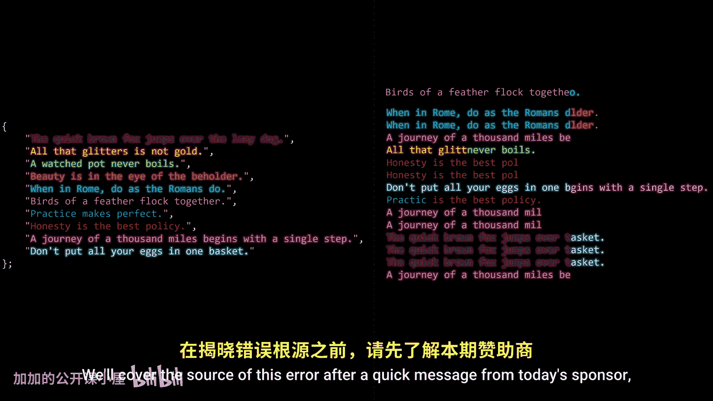

As developers， most of us spend long hours in front of a screen， and while a good chair helps。

 eventually， your body just needs to move。Being uncomfortable kills productivity， I felt it too。

 getting up， walking away from work just to shake off the stiffness。

Today's workspace demands flexibility， and the Flexypot E7 Pro Standing De delivers just that。

The intuitive keypad lets you save up to four custom heights。

 so switching between sitting and standing is effortless。And check this out。

 the lift is incredibly smooth and surprisingly rock solid， no wobble at all。

Its frame is made from automotive grade steel， and the thickened legs support up to 440 pounds。

 enough for dual monitors， a full rig， even me sitting on it。

And if you want to stay active without leaving your setup。

 FlexxiSpot also offers this auto incline walking treadmill。

 it fits perfectly under the desk and lets you work， watch， or just move while staying focused。

It comes with this useful remote control so you set the speed， the incline angle。

 and of course safely stop it while using it。If you are ready to elevate your workday。

 visit Flexypot。com to learn more about the E7 Pro standing desk and this treadmill。

 both come with a solid warranty and a 30 day free return policy。

 making them a smart investment in your health and productivity I'll leave a link in the description below and now back to the video。

To understand why our program is behaving so strangely， we need to look at how strings work。

Believe it or not， the string data type deserves its own dedicated video。

 but for simplicity we're going to focus on C style strings In summary。

 in C strings are represented in memory as a sequence of characters terminated by a special null character。

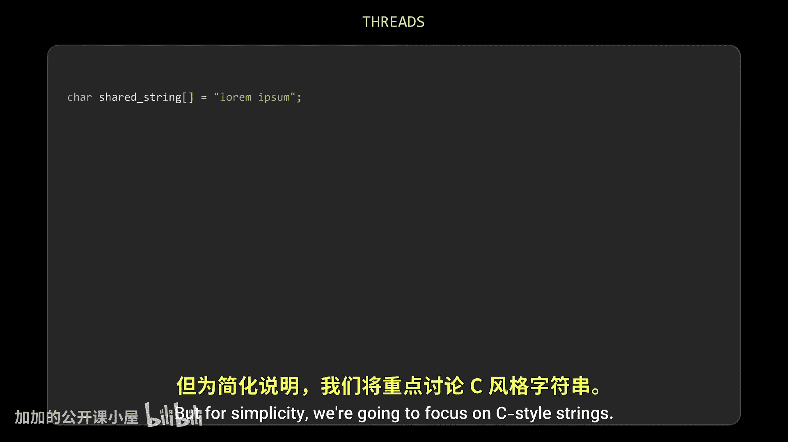

This null character is convenient because it eliminates the need to store both a pointer and the string's length。

 as is done in some object oriented languages。What's pertinent to us right now is that most string operations are not atomic；

 For example， when printing a string， the function iterates through the characters one by one。

 outputting them to the console until it encounters the null character。Similarly。

 copying a string is a multistep operation If the string is long enough。

 the computer can't simply copy the entire array of characters from one memory location to another in a single step。

 instead it has to loop through each character， copying them one by one until it reaches the null Terinator。

Now， to speed up this process， some architectures copy data in chunks， but even then。

 those chunks have a maximum size， and depending on the length of the string。

 the operation may still require multiple steps。For simplicity。

 let's stick to the character by character approach。

The reason I chose this example is that it clearly demonstrates what's happening under the hood。

Just think about it， if one thread is reading from the shared string while another is writing to it。

 concurrency can cause the operating system to interrupt the writer midcopy to give the CPU to another process。

When this happens， the shared string is said to be in an invalid state。

 because its current value is something we never intended it to be。

 and if the scheduler decides to allocate the CPU to a thread that reads this shared data before the writer thread resumes and completes its update。

 that thread will end up copying inconsistent data。And that's exactly what happened in our example。

While modifying the string， the writer thread was interrupted。

 and the threads handling client requests ended up copying the string while it was still incomplete。

That's why all the errors show strings composed of fragments from different valid sentences in the list。

A race condition is a software bug that occurs when the outcome of a program depends on the unpredictable order in which multiple threads or processes access and modify shared resources。

Race conditions are typically side effects of preemptive operating systems；

 there lies the unpredictable requirement for this kind of bug to occur。For those unfamiliar。

 a preemptive operating system is one that forcibly interrupts running processes from time to time so that other processes can gain access to the CPU。

This is how the system distributes computing resources fairly among all active programs。

When we talked about CPU scheduling， we mentioned the time quantum。

 a fixed amount of time that defines how long a process or thread can use the CPU before it may be interrupted。

Through system calls， processes and threads can voluntarily yield control of the CPU to allow others to run。

But if a thread or process doesn't finish its current task before its quantum expires。

 a hardware timer triggers an interrupt that preempts the process。

 meaning the OS pauses it and reallocs the CPU to something else。

So if a data modification takes longer than one time quantum。

 the data will inevitably enter an invalid state， because at least one interruption is guaranteed。

However， that doesn't mean shorter operations are safe。

 even if a data modification completes in less than one time quantum。

 race conditions can still occur。Why？Well， for starters。

 if the operation begins near the end of a time quantum， it's highly likely to be interrupted。

But beyond timing issues， the CPU can be interrupted by many other events that aren't tied to the scheduler。

Timers set by other processes。A user pressing a button in a UI， an incoming network packet。

They're all kind of events that trigger interrupts and interrupts， regardless of their origin。

 can preempt the currently running thread， even if its time quantum hasn't expired。

 and unfortunately， we can't prevent those events from occurring。

 at least not without making the system less responsive to the very events those interrupts are meant to handle。

But can we at least try to prevent them from corrupting our data？

Let's go back to our example and try before continuing， consider giving this video a like。

 it helps others discover my content， which by the way， is completely free。

What if we introduce a control variable， a flag that indicates whether the shared data is currently being modified？

For example， one means writing zero means not writing。With this setup。

 threads that want to read from the shared string can first check the flag to see if the writerer thread is currently modifying it。

Now， while this might sound like a good idea， we need to be cautious because the moment this control variable is shared between threads。

 it becomes shared data， and is therefore also vulnerable to race conditions。

Setting or checking a variable's value is not always atomic。On some architectures。

 writing to a variable may be atomic， but reading and comparing its value almost never is；

 this typically involves loading the variable's value from memory into a register。

 comparing that registers value to some constant or expected value。

Then acting on the result of that comparison。Imagine this situation， a reader thread checks the flag。

 it loads the value into a register， but right after the comparison， it gets interrupted。

Then the writerer thread sets the flag to one and starts modifying the shared string。

 but it also gets interrupted before finishing。Then， when the reader thread is dispatched again。

 its state is restored so it continues right where it left off。

 still holding the old value of the flag in its register。

Since this thread fetch the value of the flag before the writer thread modifies it。

 the comparison is now based on an outdated value， as a result。

 the thread mistakenly believes it's safe to read the shared string。

 even though the data is in an invalid state。And our variable didn't really help that much。

So unless we really know what we're doing， using regular variables as flags to control access to shared data should be avoided。

 the reason I bring this up is because there are some classic software based solutions like this one called the Peterson solution that rely on many subtle assumptions to work correctly in very specific situations。

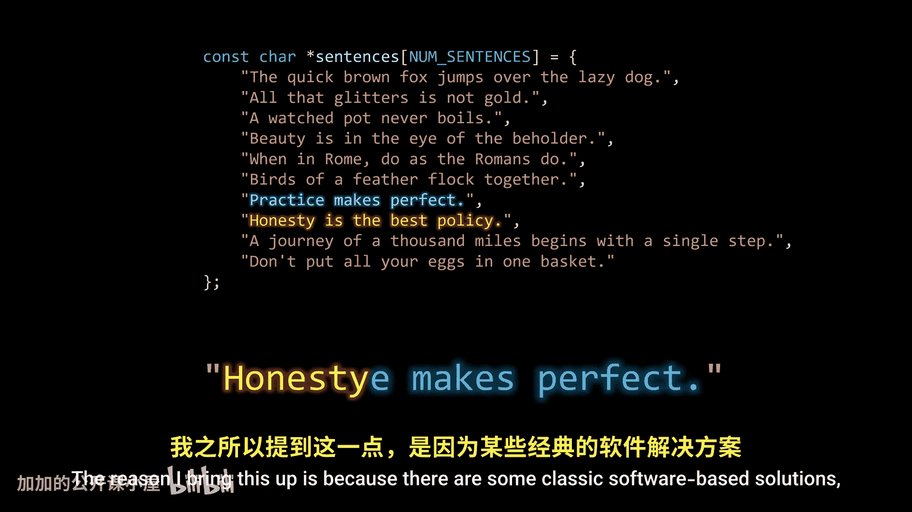

These include details like software behavior， compiler optimizations， and even hardware architecture。

I'll talk about this with more details in my video about thread synchronization for now。

 let's keep talking about race conditions。

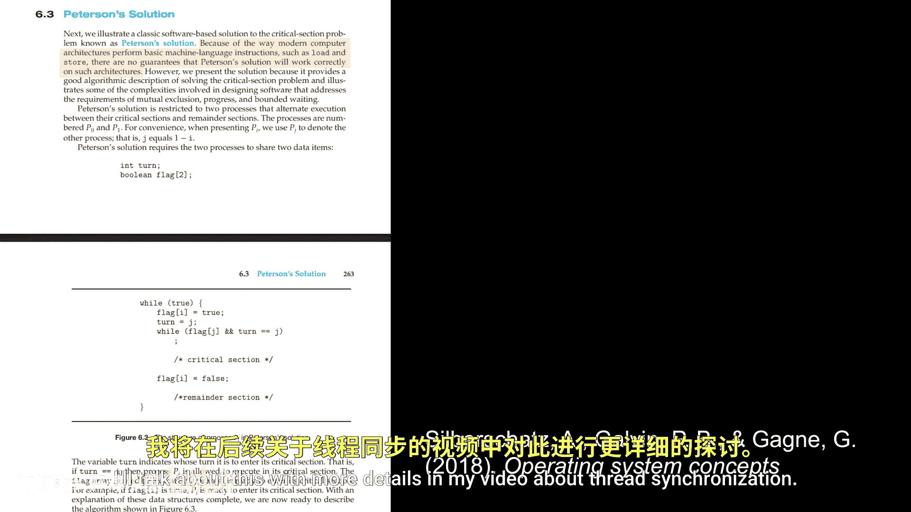

So far， we've looked at the case where one thread writes to share data。

 while other threads only read from it。But there are also cases where multiple threads need to write to the shared data at the same time。

In these cases， race conditions are just as dangerous。

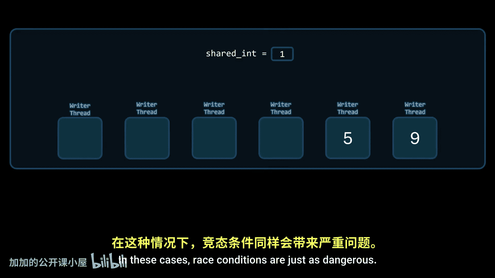

Think about a program that receives a number and finds how many prime numbers exist between zero and that number。

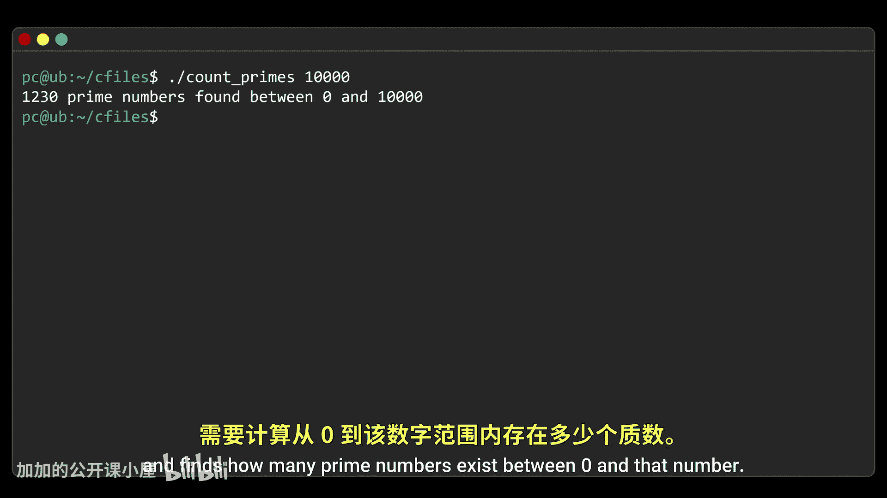

Parallelism is used to make the process faster， so each thread can run in a separate CPU core。

To do this， the threads use a shared counter， an integer that gets incremented each time a thread finds a prime number。

The problem is that in many architectures， incrementing a value is not an atomic operation。

If two threads in this example find prime numbers at nearly the same time。

 we expect the count to increase to 459。But since they are running in parallel。

 they might both fetch the same value。Increment it independently， and write the result back。

 resulting in the counter only increasing by one， even though two primes were found。

And no interrupt took part here。 the race condition happened because of the parallel access to the shared variable。

But that doesn't mean things would have gone better without parallelism。 Here's a simple scenario。

 Let's say the program has already found 10 prime numbers。

 Suddenly five threads all find prime numbers at roughly the same time。

The expected count afterwards should be 15。But watch what might happen。

Suppose the first thread fetches the count and increments it。

 but is interrupted right before writing the result back to memory。

And then the other four threads run without interruption， each successfully incrementing the count。

 so the counter reaches 14。Then the first thread resumes， exactly where it left off。

 right before the instruction to store the incremented value back to memory。

 but since that value was calculated before the other four threads incremented the counter。

 it overwrites the updated result， causing the count to drop from 14 back down to 11。

And just like that， four correctly detected prime numbers are lost。

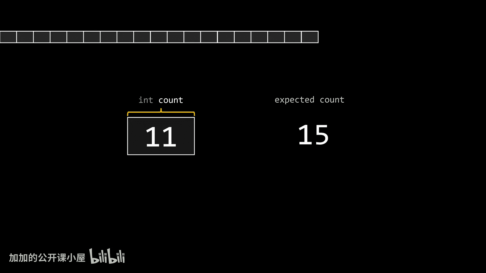

This kind of behavior feels bizarre。 People usually think of computers as being amazing at math。

 fast， smart， sophisticated， but in truth， computers are dumb。They don't recognize these situations。

 they blindly follow instructions， even when those instructions cause problems。

And if that's not bizarre enough， check this out If I run the same program multiple times。

 I get a different result almost every single time。Sometimes even getting the right result。Why。

 because the behavior of the program depends on the timing and sequence of uncontrollable events。

There's no way to predict when those events will occur。

 that's what makes race conditions so dangerous。

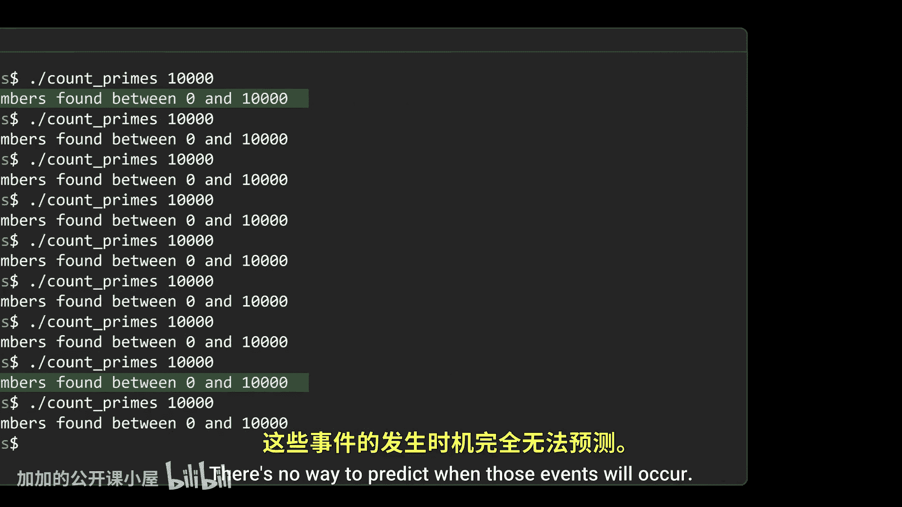

It's called a race condition because multiple operations race to access or modify shared data。

 and the final result depends on which one finishes first。Finally。

 I want to emphasize something that might seem counterintuitive。

The most dangerous thing about race conditions is how rare they are。In my server example。

 only 14 incidents occurred out of 85 million requests， that's an incredibly small probability。

And that's what makes them so hard to reproduce and debug。So。

 the next time your project uses concurrency， remember， if you're not careful。

 every thread you spawn might be starting the countdown on a time bomb。In the best case scenario。

 your program will crash， in the worst case， there's no telling what it might end up doing。

Fortunately， computers provide tools to help us prevent race conditions。

 but that's a topic for a future episode。

So make sure to subscribe， you don't want to miss it。Thanks to Flexypot for sponsoring this video。

 don't forget to check out the E7 Pro standingding Dek and the T treadmill。

 both are linked in the description below， see you in the next one。

