# 操作系统原理：P11：为什么程序不能访问彼此的内存？ 🔒

在本节课中，我们将要学习操作系统如何通过硬件支持，确保运行在同一个系统上的不同程序（进程）无法访问彼此的内存空间。这是现代操作系统安全性的基石，能防止恶意软件窃取或篡改其他程序的数据。

## 内存基础回顾

上一节我们介绍了CPU如何直接访问内存。本节中，我们来看看内存的基本工作原理。

内存是计算机中仅次于CPU的重要部件。从物理角度看，内存是一个由微小存储单元（如晶体管或电容器构成）组成的巨大网格。每个单元可以存储一个二进制值（1或0）。每个单元在网格中都有一个唯一的位置，通过一个称为**地址**的二进制值来访问。

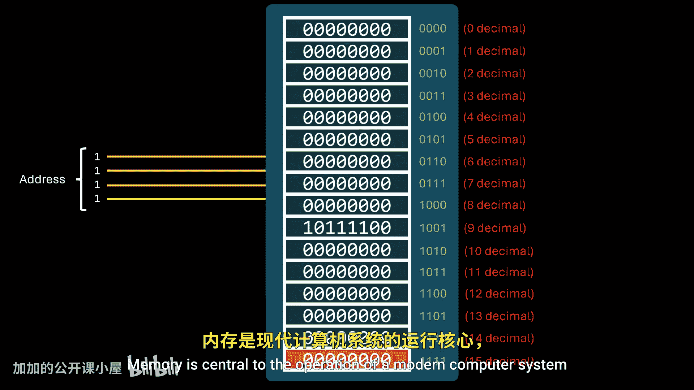

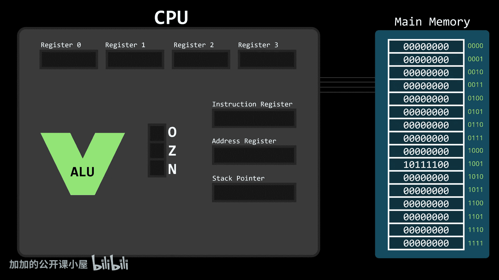

单个比特（bit）只能表示两种状态（如真/假）。为了表示更复杂的数据，我们需要更多比特。因此，计算机通常将地址与一组比特（称为**字节**）关联起来。一个字节通常由8个比特组成，可以表示多达256种不同的状态。

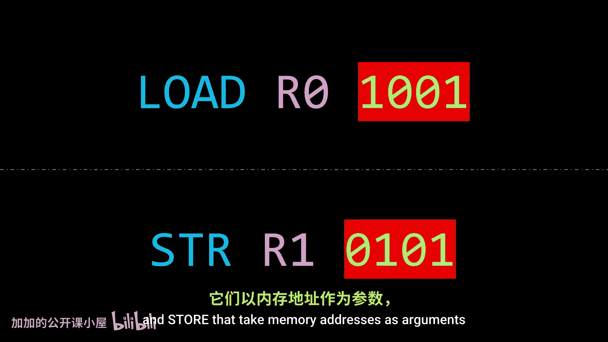

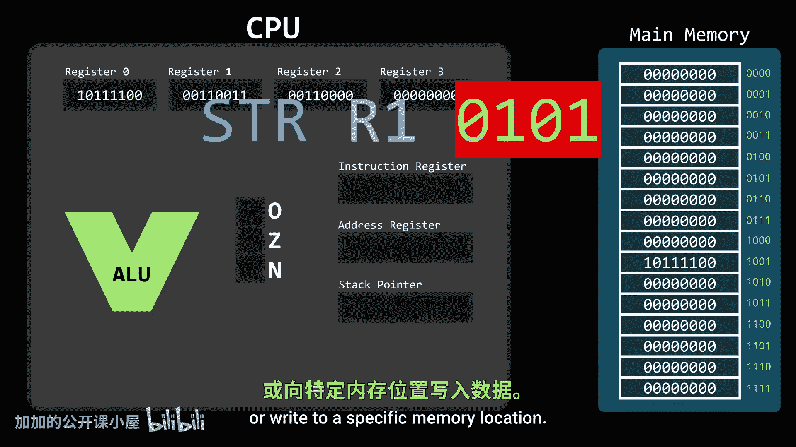

从开发者的视角看，内存表现为一个巨大的字节数组，每个字节都有其唯一的地址。主内存和每个CPU核心内置的寄存器是CPU可以直接访问的通用存储设备。

CPU通过特定的机器指令（如 `load` 和 `store`）来读写内存，这些指令以内存地址作为参数。任何需要CPU执行的指令或操作的数据，都必须位于这些可直接访问的存储设备中。

## 并发带来的挑战

之前我们讨论了程序如何在同一个系统上并发运行。并发不仅影响CPU时间的分配，也影响内存的使用。

程序通常存储在磁盘上，但CPU没有直接使用磁盘地址的指令。因此，当我们启动一个程序时，它必须被加载到内存中，成为一个**进程**。每个进程都需要内存来存放其变量、临时值和其他数据。分配给一个进程的总内存被称为其**地址空间**。

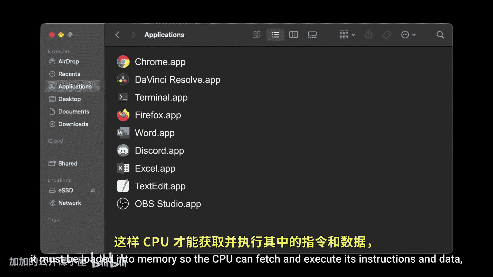

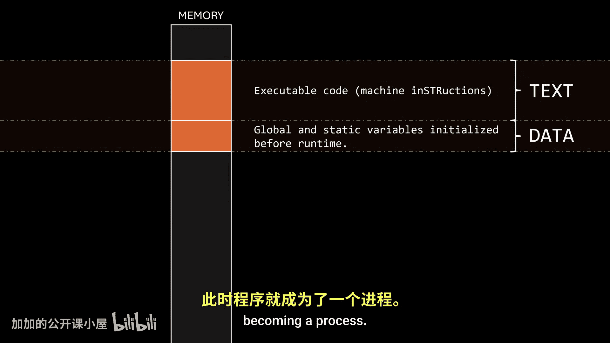

我们希望建立一条默认规则：**一个进程绝不应该能够访问另一个进程的地址空间**。

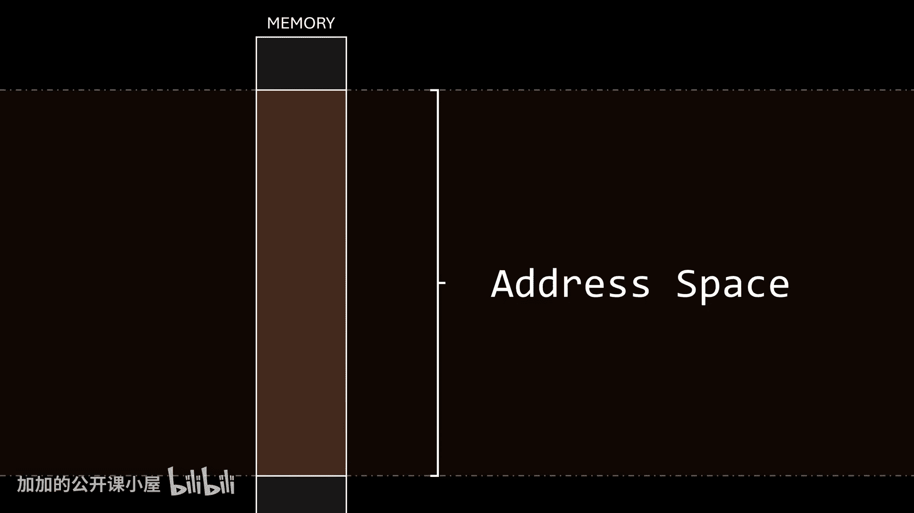

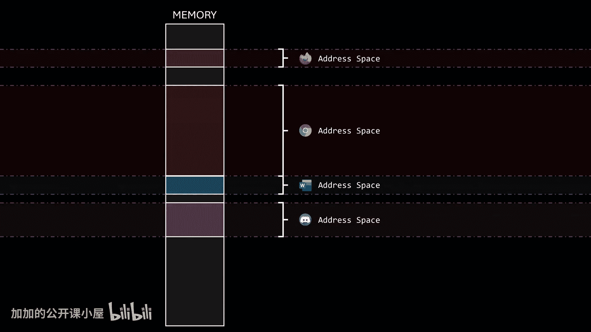

## 为什么需要内存保护？

以下是几个关键原因，说明了为什么必须强制执行内存访问限制：

*   **数据窃取**：想象一个进程正在显示一个支付表单，用户输入的数据存储在该进程地址空间的某个缓冲区中。如果没有内存保护，另一个恶意进程可以简单地执行一小段代码，使用 `load` 指令从第一个进程的地址空间读取支付数据，然后通过网络发送给攻击者。
*   **数据篡改**：恶意进程不仅可以读取，还可以写入。它可以修改另一个进程缓冲区中的数据，例如更改支付金额或收款人，而用户毫不知情。
*   **代码注入**：更危险的是，没有内存保护，一个进程甚至可以修改另一个进程（或操作系统本身）的代码，注入恶意指令，使其执行任意操作。

因此，进程的地址空间是神圣不可侵犯的；一个进程绝不应该能够读取或写入另一个进程的内存。

## 硬件支持的必要性

在计算机科学中，有多种方法可以强制执行这条规则，但完全依靠软件实现并不可行。

内存操作在进程运行时频繁发生。如果操作系统必须为每个使用CPU的进程手动检查每一次非法内存访问，它就需要在用户进程执行的每一次内存操作上运行额外的验证代码。这会引入巨大的性能开销。

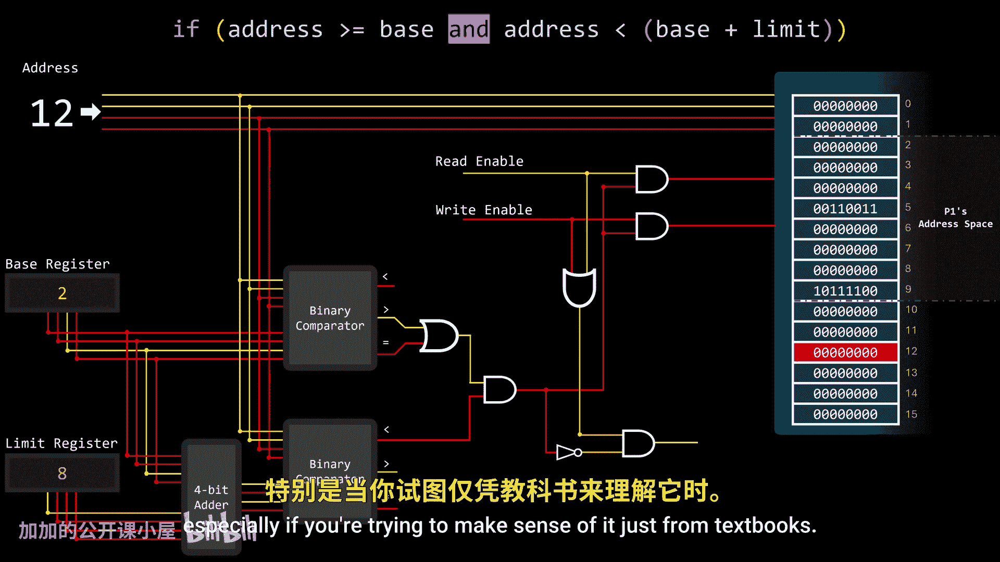

因此，我们需要**硬件支持**来实现高效的内存保护。

## 实现内存保护：基址与界限寄存器

你可能会认为我们需要修改内存本身，但实际上，内存单元保持不变。当进程运行时，内存单元看到的只是通过**地址总线**从CPU传来的一串内存地址。内存本身不知道这些地址是如何生成的或用于什么目的。

因此，直接在内存中处理这个问题并非最佳方式。我们将使用两个特殊的CPU寄存器来强制执行内存边界：

1.  **基址寄存器**：指向进程合法的物理内存地址的起始位置。
2.  **界限寄存器**：定义该进程可寻址范围的大小。

利用这两个寄存器，我们可以检查进程试图访问的任何地址是否落在它自己的地址空间内。

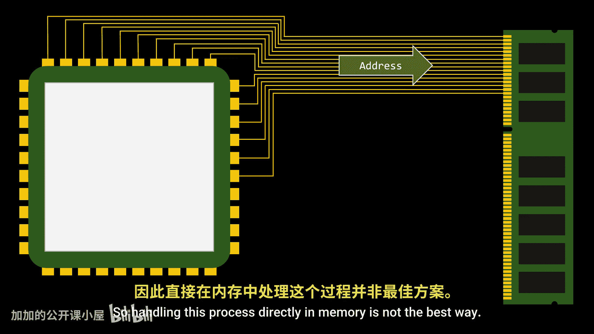

用代码逻辑表示，即检查地址是否满足以下条件：
`地址 >= 基址` 且 `地址 < (基址 + 界限)`

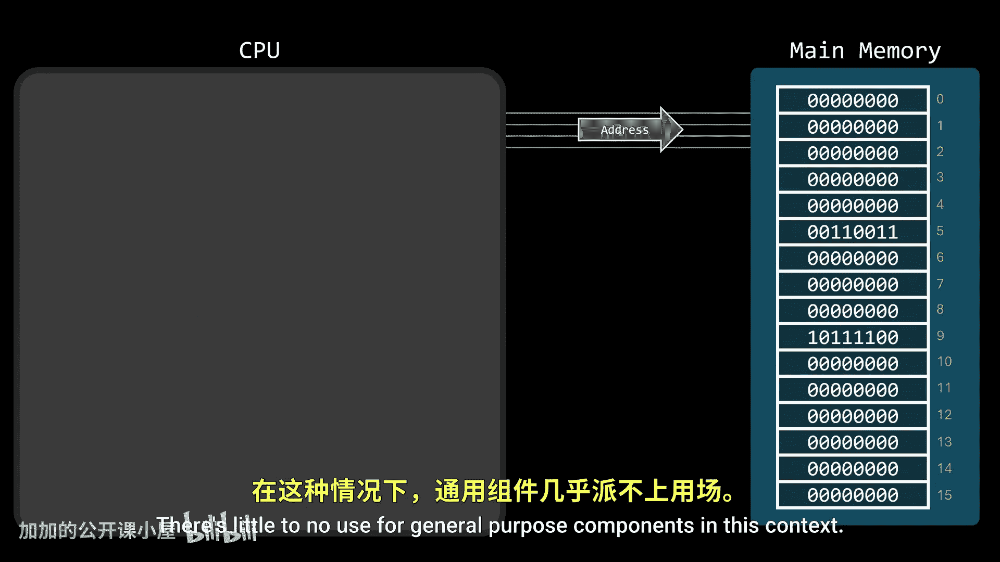

这里，`(基址 + 界限)` 给出了地址空间的上限，但这个上限是**不包含**的，所以我们检查地址是否**小于**（而不是等于）这个上限。

## 硬件验证电路

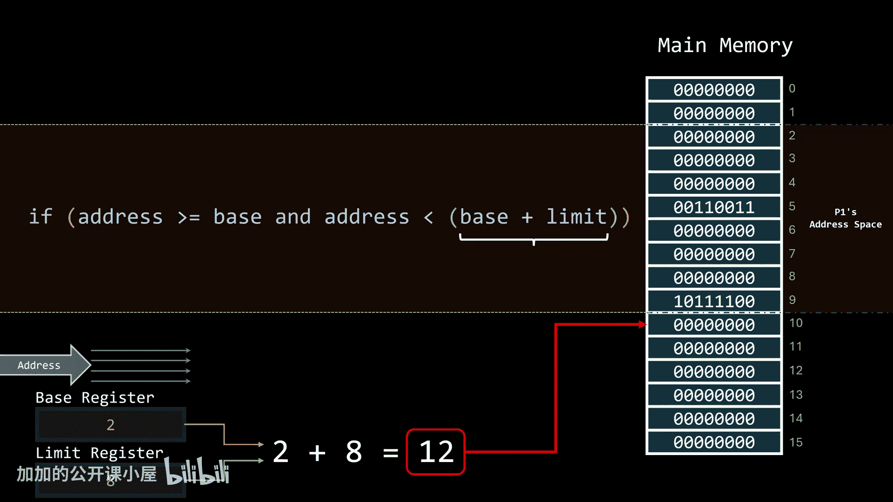

好消息是，计算这个上限就像使用二进制加法器将基址和界限寄存器的内容相加一样简单。由于每个内存操作的地址都会通过地址总线，我们可以在此处拦截地址进行验证。

为了将地址与边界进行比较，我们使用**二进制比较器**。我们使用一个比较器检查地址是否大于或等于基址，用另一个检查地址是否小于上限。两个条件必须同时为真，地址才有效，因此我们使用一个**与门**来组合这两个比较器的输出。

我们电路的最终输出线只有在传递给内存的地址落在由基址和界限寄存器定义的地址空间内时才会被激活。

## 如何阻止非法访问？

简单地通过地址总线发送地址并不会自动触发内存操作。要实际执行内存操作，我们必须指定是要读取还是写入该地址，这是通过激活**读使能**或**写使能**信号来完成的。

阻止非法内存访问的最简单方法是，使用我们地址验证器电路的输出来“门控”读和写信号。这样，如果一条指令试图访问进程地址空间之外的地址，硬件就会阻止读或写信号到达内存模块。换句话说，只有当地址在当前进程地址空间边界内时，内存才会接收到读或写使能信号。

另一个好主意是添加一些额外的逻辑门来检测进程何时试图访问非法地址。这样，电路不仅能阻止内存操作，还能向CPU触发一个硬件信号，立即中断正在运行的进程并调用操作系统。操作系统随后处理此违规行为，很可能是终止该进程。

在类Unix系统上，当操作系统捕获到此信号时，它会终止进程并显示错误信息：**段错误**，意味着进程试图访问它不被允许访问的内存。

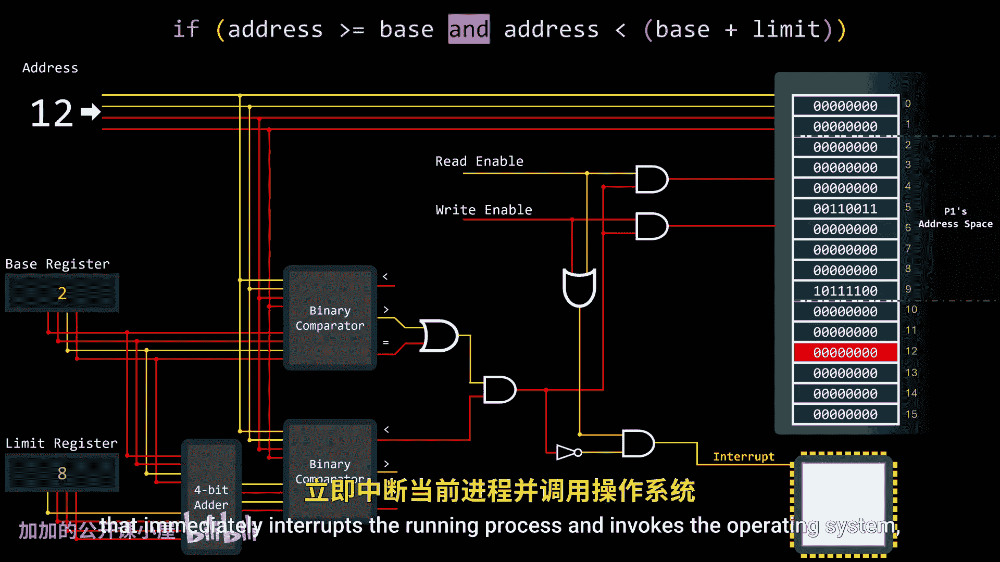

## 操作系统的角色

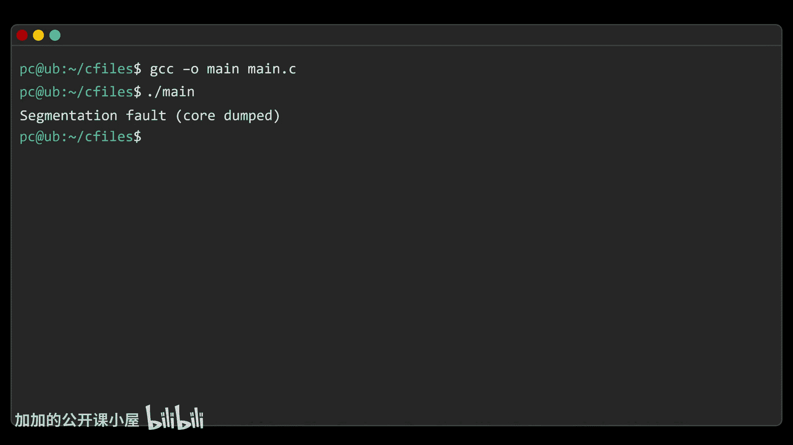

需要明确的是，操作系统不需要执行任何额外的指令来使该电路工作。由于所有线路的连接方式，电路会自动拦截任何内存操作，无论其目的如何，并立即执行验证。

操作系统的唯一责任是在将CPU调度给用户进程运行之前，在基址和界限寄存器中设置正确的值。这些内存管理寄存器必须实现为**特权寄存器**，只能由操作系统修改。

这成为操作系统在**上下文切换**时的另一项职责。当CPU从一个进程重新分配给另一个进程时，操作系统不仅保存被中断进程的状态并恢复新进程的状态，还会更新内存边界（基址和界限寄存器）以匹配即将运行的进程的地址空间。

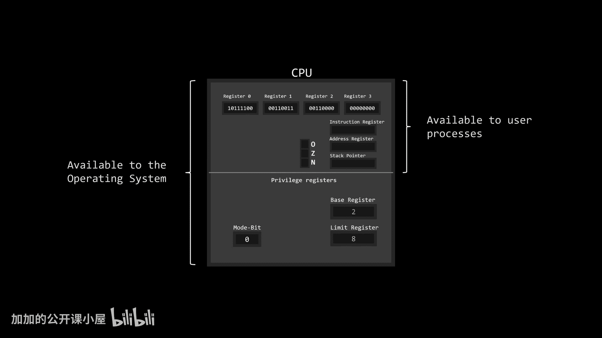

一切设置妥当后，操作系统将CPU切换到**用户模式**，允许用户进程运行。但在这种模式下，CPU无法修改特权寄存器。因此，进程被限制只能使用操作系统明确分配给它的内存。

## 总结

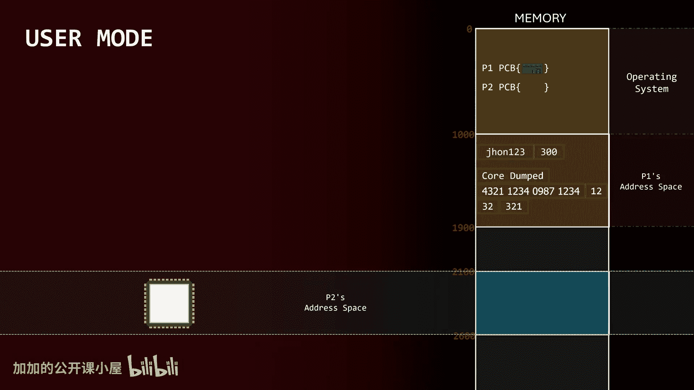

本节课中我们一起学习了操作系统如何与硬件协同工作，防止用户进程访问彼此的内存。核心机制是使用**基址和界限寄存器**在硬件层面定义每个进程的合法地址空间，并通过验证电路在每次内存访问时自动进行检查。操作系统负责在进程切换时正确设置这些寄存器。这种保护是系统安全性和稳定性的基础。

我们关于内存的讨论尚未结束。目前我们实现了对并发运行进程的保护，但当多个进程运行且没有更多内存可供新进程使用时会发生什么？这将是未来探讨**分页**——一种允许计算机使用超过物理可用内存的内存管理技术——的主题。