# 009：让电脑更流畅的调度算法

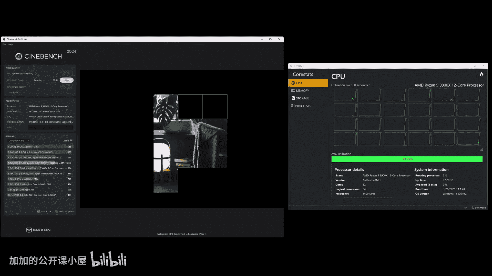

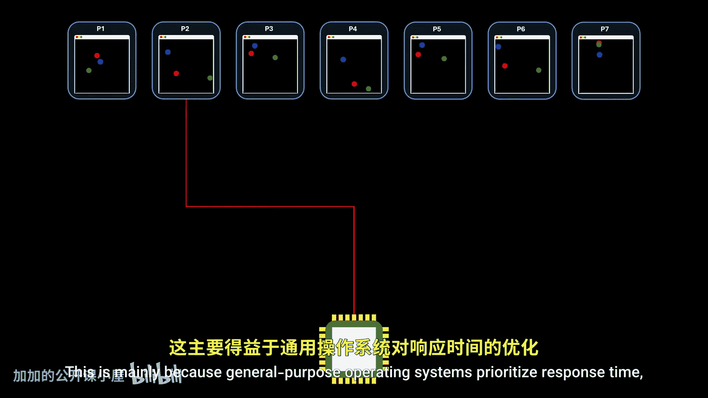

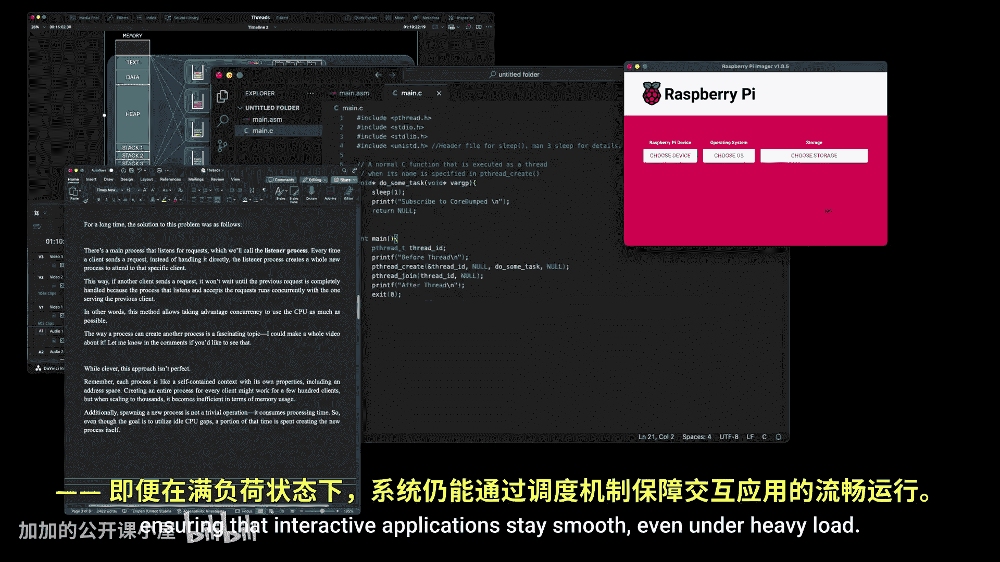

在本节课中，我们将要学习操作系统中最核心的组件之一：CPU调度器。我们将探讨操作系统如何决定哪个进程在何时使用CPU，以及不同的调度算法如何影响系统的响应速度、效率和用户体验。我们会从最简单的算法开始，逐步深入到现代操作系统使用的复杂策略。

## 调度基础与FCFS算法

上一节我们介绍了CPU调度的基本概念，本节中我们来看看最基础的调度算法。

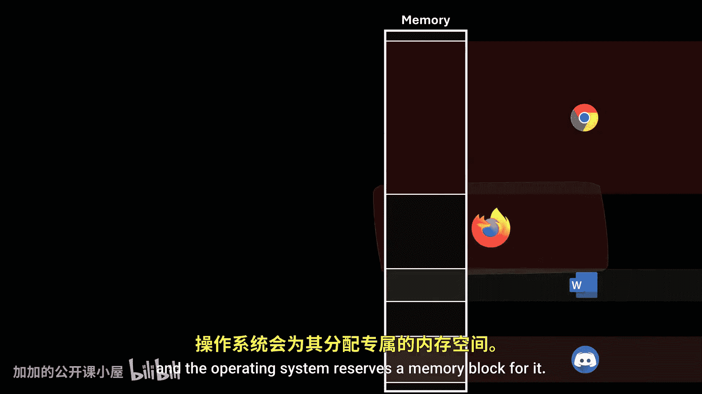

CPU调度是操作系统用来根据特定标准决定在给定时间哪个任务或进程可以使用CPU的技术。一个重要标准是响应时间。根据系统不同，其他标准也可能很重要，例如CPU利用率、吞吐量、周转时间和等待时间。

最简单的CPU调度算法是**先来先服务**调度算法。在这种方案下，CPU被分配给第一个请求它的进程。

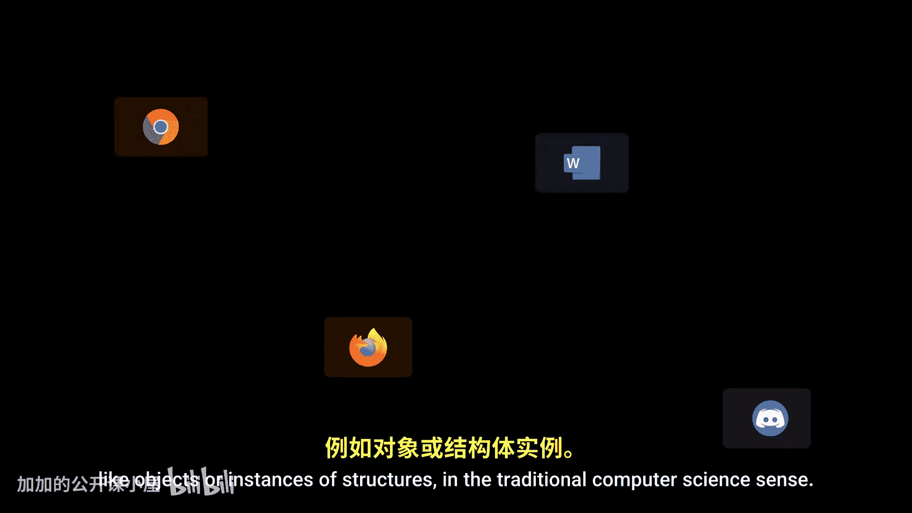

首先，我们必须清楚将CPU分配给一个进程意味着什么。当一个程序被执行时，它成为一个进程，操作系统为其保留一个内存块。在这个块中，有一个称为**文本段**的内存段，它包含程序的可执行代码。每个进程都有自己的专用文本段。

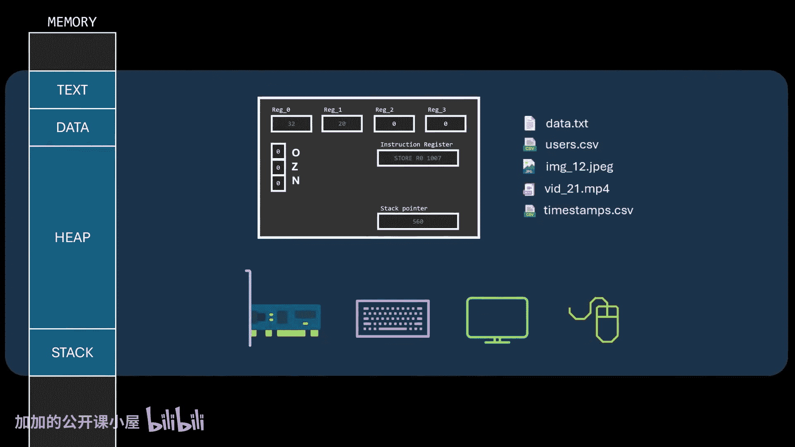

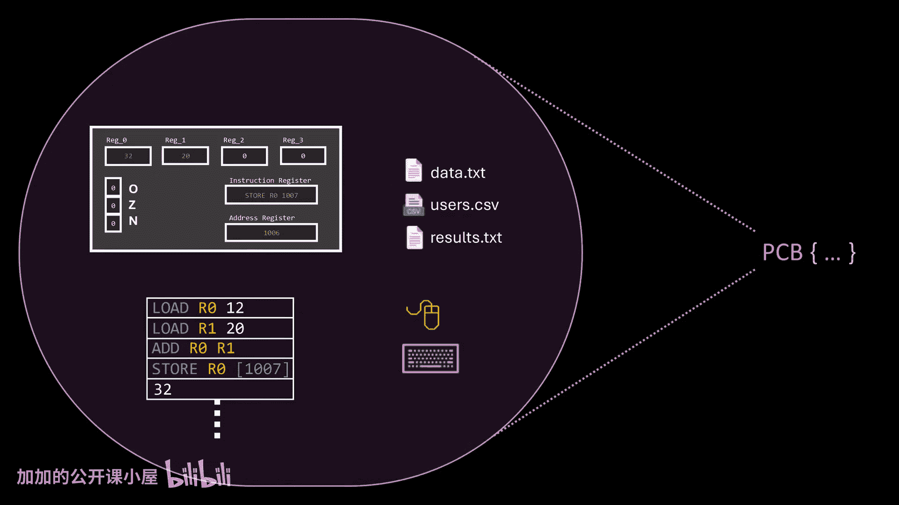

从计算机架构知识中我们知道，CPU包含一个称为地址寄存器（也称为程序计数器）的特殊寄存器。这个寄存器指向要执行的下一条指令。当我们说CPU被分配给一个进程时，意味着这个寄存器指向该进程的文本段，使CPU能够执行其中的指令。当CPU被重新分配给另一个进程时，操作系统修改地址寄存器，使其指向新进程的可执行代码。这涉及到一个更复杂的操作，称为**上下文切换**。

另一个需要理解的重要概念是，进程不是计算机科学传统意义上的具体实体（如对象或结构实例）。相反，进程是计算机运行所处的上下文。为了管理这些进程，操作系统使用一种称为**进程控制块**的特殊结构。这个结构不是进程本身，而是它的表示，包含有关进程的所有必要信息，如其状态、程序计数器、寄存器和其他管理数据。每次创建进程时，操作系统都会生成一个进程控制块来跟踪这个新进程。

先来先服务策略的实现很容易用**FIFO队列**来管理。这是合理的，因为它遵循的原则是：第一个添加到队列的元素是第一个被移除的元素。但我们不能直接将进程推入这个队列，因为进程是抽象的上下文，不能被视为任何数据结构中的离散元素。相反，操作系统所做的是将每个进程的进程控制块推入队列。

在先来先服务中，当一个进程被创建时，它的进程控制块被推送到队列的尾部。当CPU空闲时，它被分配给队列头部的进程。

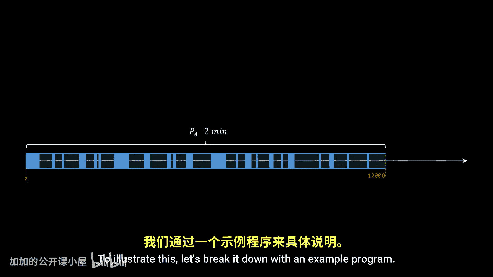

这听起来很简单，但我们忽略了很多东西。首先，我们假设一个进程只有在之前的进程完成执行后才能获得CPU。这会导致很多问题。第一，并非所有进程都会终止；许多应用程序（如服务器或后台服务）被设计为无限期运行。如果我们把CPU分配给一个永不结束的进程，所有后续进程将无限期地在队列中等待。第二，如果我们假设一个进程只有在之前的进程完成执行后才能获得CPU，我们就忽略了一个重要事实：程序和执行并不会持续使用CPU。如果一个任务需要两分钟执行，并不意味着它让CPU忙了整整两分钟。在执行过程中，经常有程序在等待其他事情的时期。

为了说明这一点，让我们用一个示例程序来分解。

## CPU与I/O突发

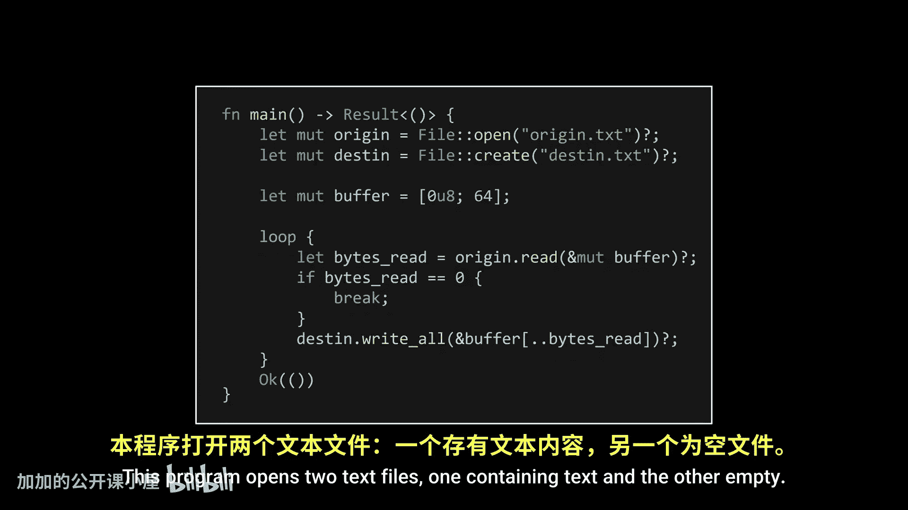

上一节我们指出了进程执行并非连续占用CPU，本节中我们来看看这背后的具体模式。

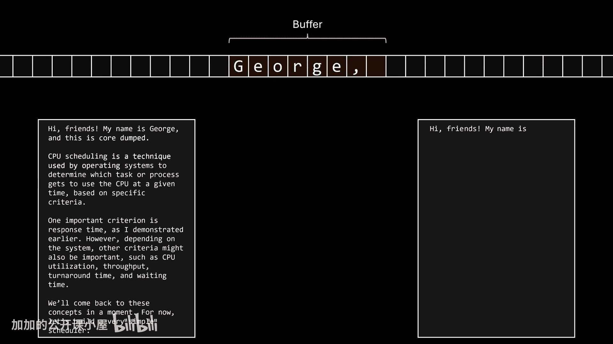

这个程序打开两个文本文件，一个包含文本，另一个为空。它的目的是将一个文件的内容复制到另一个文件，但为了避免使用大量内存，它分块复制数据，比如每次8个字节。我们特别关注程序中发生复制的部分。如果我们观察计算机执行的指令，它看起来像这样。但如果我们更准确地表示它，它会看起来相当不同，更像这样。

从文件读取和写入文件需要程序调用操作系统，因为文件操作涉及与硬件（这里是磁盘）的交互。换句话说，读写涉及**I/O操作**。这里的真正问题是，I/O操作在性能方面通常成本很高，它们可能需要很长时间才能完成。这些指令不能在前一条指令之后立即执行，直到由系统调用管理的I/O操作完成为止，而这完全取决于I/O硬件的能力，而不是CPU。因此，程序不会连续使用CPU。如果我们绘制程序随时间的CPU使用情况图，我们会看到CPU保持空闲的间隙，等待I/O操作完成后再继续执行。

这些间隙不是例外，而是常态。至少在基于冯·诺依曼架构的系统中是如此，这代表了超过99%的现代计算机。事实上，这种行为非常普遍，以至于几十年来一直被持续研究。

当一个程序使用CPU时，这些时间间隔称为**CPU突发**。而当程序等待I/O操作完成时，这些时间间隔称为**I/O突发**。每个进程的执行都以一个CPU突发开始，随后是一个I/O突发，然后是另一个CPU突发，接着是另一个I/O突发，依此类推。最终，最后的CPU突发以终止执行的系统请求结束。

这种行为已经被研究了几十年，因为CPU调度的成功在很大程度上取决于它。CPU突发的持续时间已被广泛测量，虽然它们在进程和系统之间有所不同，但它们倾向于遵循一个可预测的分布。

图表显示，大多数进程有大量短CPU突发，只有少量长CPU突发。这是设计CPU调度算法的一个关键观察，因为它强调了进程经常花费大量时间等待I/O操作。如果一个调度算法不考虑这种行为，大量的CPU时间将被浪费。

因此，当一个进程进入I/O突发时，理想情况下，CPU应该被分配给另一个不也在等待I/O操作的进程。CPU调度的主要目标之一是尽可能保持CPU繁忙，允许进程在共享CPU的同时尽可能快地运行。

请注意，一个进程的CPU突发永远不会在前一个结束后立即开始。中间总是有一个小的额外过程。调度算法必须考虑到这一点。调度程序不应将CPU分配给一个进程直到它完全终止，而应只分配给该进程直到其当前CPU突发结束。

当然，实现这种行为使我们的调度程序实现变得稍微复杂一些，因为现在我们需要考虑进程可能处于不同的状态。

## 进程状态与调度队列

上一节我们了解了进程执行中的突发模式，本节中我们来看看进程在其生命周期中经历的不同状态。

每个进程都从**新建**状态开始。新进程是刚刚启动但可执行文件仍在加载到内存中的程序。一旦程序完全加载并且所有必要的资源都已分配，进程就进入**就绪**状态，这意味着它已准备好执行但正在等待CPU时间。当CPU分配给一个进程时，它进入**运行**状态。在某个时刻，进程可能会发出系统调用，例如I/O请求，这会自愿将CPU的控制权返回给操作系统。请记住，I/O调用不仅是为了请求某些资源（如操作文件或分配内存），也可能只是为了等待某些事件发生，例如用户击键或传入的网络请求。在这两种情况下，进程都会进入**等待**状态，直到事件发生或I/O操作完成。一旦请求完成，进程再次变为就绪状态，等待调度程序分配CPU时间。请注意，即使I/O操作完成，进程也不会立即恢复执行。这是因为当进程在等待时，CPU很可能已被分配给另一个进程，所以即使它现在已准备好继续运行，也必须等待轮到它。

在它们的大部分生命周期中，进程在这三个状态之间循环：就绪、运行和等待。某些进程（如Web服务器）被设计为永不终止，并无限期地保持在这个循环中。但对于大多数用户程序，进程最终会进入**终止**状态。这些名称是任意的，它们在不同的操作系统中有所不同，但它们所代表的状态在所有系统中都存在。某些操作系统还会更精细地划分进程状态。例如，一个终止的进程可能并非真正终止；在发出退出系统调用后，操作系统必须释放所有已分配的资源，包括内存。一些操作系统明确区分了已完全终止的进程和仍在终止过程中的进程。

这种状态模型解释了为什么队列是CPU调度中使用的基本数据结构。尽管有一个特定的等待状态，但处于其他状态（运行状态除外）的进程也在等待。考虑到在任何时刻可能有数百个进程在等待，使用队列来管理它们的执行顺序既合乎逻辑又高效。

重要的是要认识到，在任何给定时间，一个处理器核心上只能有一个进程在运行。这意味着虽然队列对于等待进程有意义，但它不适用于正在运行的进程。在研究CPU调度算法时，有必要了解操作系统的另一个组件：**分派器**。

当一个正在运行的进程进入I/O等待状态并且CPU变得可用时，分派器介入，其唯一目的是将CPU分配给就绪队列头部的进程。换句话说，执行上下文切换。虽然正在运行的进程不存储在任何队列中，但始终维护对其进程控制块的引用。这允许分派器在发生中断时将CPU状态保存到PCB中。这个保存的状态使进程能够在以后恢复执行。然后，分派器将PCB放入等待队列。接下来，在处理完被中断的进程后，分派器从就绪队列头部检索下一个进程的PCB，将其标识为新的运行进程，恢复其先前的CPU状态（包括寄存器和程序计数器），并重新分配CPU，允许进程从中断处恢复执行。如果处理器支持，分派器还负责在将控制权交给进程之前切换到用户模式。

换句话说，**调度程序**通过根据特定的调度策略管理就绪队列来决定哪个进程应该接下来使用CPU，而**分派器**负责执行调度程序做出的决定。

由分派器引起的这些额外的CPU突发是不可避免的，因为CPU本身需要执行上下文切换。这种延迟称为**分派延迟**，即分派器停止一个进程并启动另一个进程所需的时间。由于分派器在每次上下文切换时都会被调用，因此它必须尽可能快。因此，分派器是操作系统中优化程度最高的组件之一。由于它是隐含的，分派延迟通常不会在进程之间说明。

顺便说一下，这是一种称为**甘特图**的变体，这是一种条形图，说明了特定的调度，显示了每个参与进程的开始和结束时间。

在先来先服务调度中，此策略使用FIFO队列作为就绪队列来实现。一旦一个进程发出I/O请求，CPU会立即分配给队列头部的进程。请注意，“先来先服务”这个名称可能有些模糊，因为调度程序实际上并不是管理整个进程，而是管理它们的下一个CPU突发。一个更精确的名称应该是“第一个CPU突发先服务”。也就是说，由于许多书籍和资源继续将其称为先来先服务，我们将坚持这个惯例。

这样，我们就有了最简单的CPU调度算法。但是，虽然它确实考虑了CPU利用率，但这并不意味着它能有效地优化它。

## 最短作业优先调度

上一节我们看到了FCFS的局限性，本节中我们来看看一种旨在优化平均等待时间的算法。

让我们回到CPU突发频率图。请注意，虽然非常长的CPU突发很少见，但它们的概率永远不会为零。最常见的进程，那些具有大量短CPU突发的进程，被称为**I/O密集型进程**。这些进程严重依赖I/O操作，这意味着如果I/O子系统更快，它们的性能会提高。但也有可能存在表现出大量长CPU突发的进程。与I/O密集型进程不同，这些进程不会从更快的I/O子系统中显著受益，而是依赖于更快的CPU速度。因此，这些被称为**CPU密集型进程**。

CPU密集型进程和先来先服务调度算法的问题在于，它们会对CPU利用率产生负面影响。想象一下，我们有一个CPU密集型进程和一些I/O密集型进程。CPU密集型进程将获得并持有CPU相对较长的时间。在此期间，所有其他进程将完成它们的I/O并移动到就绪队列，等待CPU。当进程在就绪队列中等待时，I/O设备是空闲的。最终，CPU密集型进程完成其CPU突发并移动到I/O设备，所有具有短CPU突发的I/O密集型进程快速执行并移回I/O队列。此时，没有进程可以分派，CPU处于空闲状态。然后，CPU密集型进程将移回就绪队列并被分配CPU。同样，所有I/O进程最终都在就绪队列中等待，直到CPU密集型进程完成。看到这里的问题了吗？存在一个**护航效应**，因为所有其他进程都在等待那个大进程离开CPU。这种效应导致CPU和设备利用率低于如果允许较短进程先运行可能达到的水平。

是的，**最短作业优先**调度算法存在，它是我们要学习的下一个算法。最短作业优先将CPU分配给具有最短下一个CPU突发的进程。如果两个进程具有相同的突发长度，则使用先来先服务作为平局决胜。再次注意，一个更精确的名称应该是“最短下一个CPU突发优先调度”，因为它优先考虑下一个CPU突发而不是总进程长度。大多数人和书籍都将其称为最短作业优先，所以让我们再次坚持这个惯例。

该算法可以使用**优先队列**来实现，其中优先级由等待进程的下一个CPU突发的长度决定。这允许那些短CPU突发进程超越那些CPU占用大的进程，从而减少护航效应。该算法也被证明是最优的，因为它为给定的一组进程提供了最小的平均等待时间。

想象一下，我们有四个几乎同时到达的进程，第一个进程的下一个CPU突发需要两分钟完成，而其他进程每个只需要几毫秒。在先来先服务中，如果那些较短的CPU突发在长CPU突发之后到达，它们将经历显著的延迟，因为它们必须等待较长的完成。另一方面，如果允许具有短CPU突发的进程先运行，它们的等待时间将是最小的，而具有较长CPU突发的进程几乎不会受到影响，它只会晚几毫秒开始，这对它来说几乎没有区别。将一个短进程移到长进程之前，减少短进程等待时间的程度大于增加长进程等待时间的程度；因此，平均等待时间减少。

最小化系统中的平均等待时间至关重要，因为它代表了进程已准备好运行但由于等待轮到使用CPU而无法执行的时间。

每当调度程序依赖优先队列时，都需要牢记重要的注意事项。但最短作业优先有一个主要问题：它不可能完美实现。因为除非我们能预见未来，否则无法知道进程下一个CPU突发的确切长度。您可能认为我们可以使用程序计数器来确定下一个系统调用发生的位置以及进程在下一次I/O突发之前将使用CPU多长时间。然而，这种方法不可靠，因为在当前指令和下一个系统调用之间，可能存在循环或函数调用，从而改变执行时间。程序的执行路径可能取决于外部输入，如用户输入，这使得预测更加困难。

由于我们无法知道确切的下一个CPU突发，我们能做的最好的事情就是根据过去的CPU突来来估计它，并假设下一个CPU突发的长度可能与之前的相似。为了近似这个值，我们使用先前测量的CPU突发的指数平均值来计算一个估计值。

首先，重要的是要理解每个进程的CPU突发预测仅取决于其自身的历史；其他进程不影响其预测。每个进程的CPU突发形成一系列随时间观察到的持续时间。`T_n` 是最近的CPU突发。`T_{n-1}` 是前一个CPU突发。`T_{n-2}` 是再前一个，依此类推。`T_{n+1}` 是下一个CPU突发，即我们想要预测的那个。在公式中，`τ_n` 是最近一次迭代中进程的预测突发时间，而 `T_n` 是观察到的实际突发时间。所以 `τ_{n+1}` 是下一次迭代的估计CPU突发持续时间。

由于 `τ_n` 代表先前的预测，我们可以递归地展开公式。由于 `τ_{n-1}` 是之前的预测，我们可以再次展开它。然后是 `τ_{n-2}`，依此类推。这表明这一项保留了进程的过去历史。因此，我们不需要存储可能包含数千个CPU突发持续时间的整个列表；我们只需要保留最近的预测。那么参数 `α` 呢？如果 `α` 等于0，则最近的CPU突发被完全忽略，预测仅依赖于过去的历史。如果 `α` 等于1，则预测仅基于最近的CPU突发，忽略所有过去的历史。因此，`α` 控制了我们预测中近期历史和过去历史的相对权重。一个常见的选择是 `α` 等于1/2，这给近期和过去历史赋予相等的权重。

请注意，这并不意味着历史中所有观察到的CPU突发都具有相同的权重。通过展开公式，我们可以看到每个CPU突发持续时间都乘以 `α` 乘以 `(1-α)` 的幂次方。由于 `α` 在0和1之间，项 `(1-α)` 呈指数下降，这意味着较早的CPU突发对预测的影响较小。这是合理的，因为较早的执行模式在预测未来CPU突发时相关性较低。此外，当一个进程首次创建时，没有历史数据。在这种情况下，初始预测通常设置为操作系统定义的常量值或基于系统范围内的平均值。

这是一个图表，比较了较长时间内预测与观察到的CPU突发。虽然不完美，但这种方法提供了一个不错的近似。

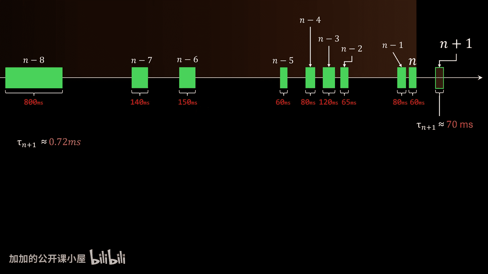

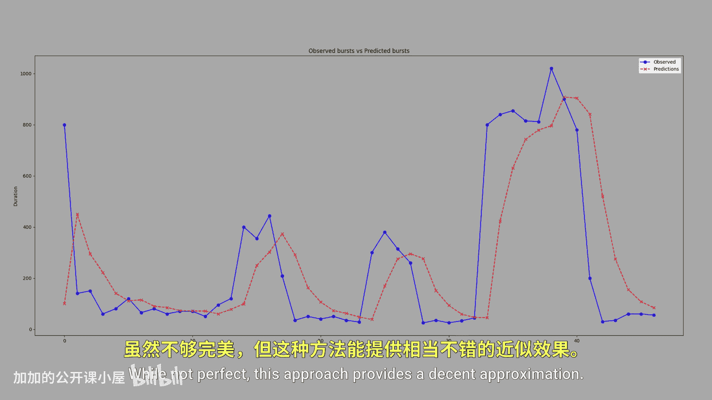

但分派器必须做出一个我们尚未讨论的重要决定。想象一下，进程A以特定的下一个CPU突发进入就绪队列，并最终被允许运行；然后一瞬间之后，进程B进入就绪队列，但进程A仍在运行。问题是，如果进程A剩余的CPU突发比进程B的下一个CPU突发长，是否应该中断进程A以优先处理进程B？

这个决定取决于调度程序。如果一个调度程序允许中断正在运行的进程，我们处理的是**抢占式**调度算法，其中操作系统可以抢占当前正在执行的进程。相反，一个**非抢占式**调度程序永远不会抢占一个正在运行的进程。即使一个具有较短CPU突发的进程到达就绪队列，它也必须等待正在运行的进程完成其CPU突发并释放CPU。

这不是一个微不足道的决定，因为进程的执行顺序可能会改变，取决于最短作业优先算法是抢占式还是非抢占式。

## 抢占式调度与轮转调度

上一节我们了解了抢占的概念，本节中我们来看看为什么它是现代系统中的默认选择。

考虑一个非抢占式系统，其中一个具有极长下一个CPU突发的进程到达就绪队列头部并被选中。由于系统是非抢占式的，无法中断此进程，直到它自愿释放CPU。但如果它从不释放呢？无限循环在计算机科学中并不少见；如果循环内部没有使用系统调用，进程将永远不会将CPU的控制权返回给操作系统。这在通用系统中是有问题的，因为并发性是一个关键特性。请记住，并发是一种允许CPU在进程之间非常快速地交替执行的技术，创造出所有进程都在同时运行的错觉。然而，在非抢占式系统中，如果一个CPU密集型进程无限期地或长时间持有CPU，从用户的角度来看，所有其他进程都会冻结。这是一个主要问题，因为非抢占式系统依赖于进程行为正确并在合理的时间内返回控制权。恶意软件可能会利用这一点，故意避免系统调用以垄断CPU时间。

每当调度策略导致一个进程在就绪队列中无限期等待时，这称为**饥饿**，因为该进程正在“饥饿”地等待CPU时间。即使是CPU密集型进程也可能遭受饥饿。例如，在最短作业优先中，一个具有长估计CPU突发的进程可能会被迫无限期地留在队列中，如果许多较短的CPU突发持续到达。这个进程获得CPU时间的唯一方式是如果没有其他进程在就绪队列中。在现实世界的系统中，这不太可能，因为数百个进程竞争CPU时间。就并发性而言，那看起来会像这样。因此，饥饿不仅仅是关于进程突发长度，而是调度策略本身的结果。

虽然最短作业先在CPU利用率和等待时间方面是高效的，但通用操作系统还需要其他调度标准。

抢占式调度的一个很好的例子是**轮转**算法。轮转调度算法类似于先来先服务调度；使用FIFO队列作为就绪队列，但添加了抢占以使系统能够在进程之间切换。定义了一个称为**时间片**的小时间单位。新进程被添加到就绪队列的尾部。CPU调度程序从就绪队列中挑选第一个进程，设置一个计时器在一个时间片后中断，并分派该进程。然后会发生两件事之一。进程的CPU突发可能少于一个时间片。在这种情况下，进程本身将自愿释放CPU。然后，调度程序将继续处理就绪队列中的下一个进程。如果当前运行进程的CPU突发长于一个时间片，计时器将触发并导致操作系统中断，强制执行上下文切换，并且该进程将被放在就绪队列的尾部。然后，分派器选择就绪队列中的下一个进程。这个例程一致地应用于每个被分派的进程，确保没有任何单个进程能够长时间或无限期地持有CPU，从而防止其他进程因缺乏CPU时间而饥饿。

需要提到非常重要的一点是，计时器是一个物理设备，通常嵌入在CPU电路中，这意味着抢占式调度只有在硬件提供支持的情况下才能实现。

请注意，当一个进程被抢占时，它不会进入等待状态，因为它没有请求I/O；相反，它直接进入就绪状态，等待其下一个时间片。如果我们需要一个公平分配CPU时间的调度策略，轮转是理想的；如果队列中有 `n` 个进程且时间片为 `Q`，则每个进程最多以 `Q` 个时间单位块的形式获得 `1/n` 的CPU时间。这确保了一个进程一旦进入就绪队列，在下一轮之前最多等待 `(n-1) * Q` 个时间单位。

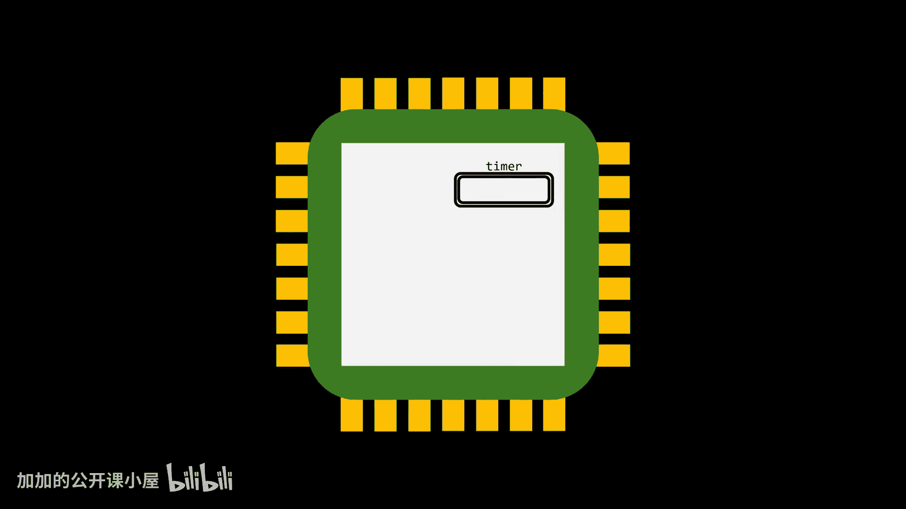

但是，虽然轮转确保了公平的CPU分配，但等待时间并不总是最优的。如果时间片太大，大多数进程将在被抢占之前进入I/O突发，导致轮转的行为类似于先来先服务。起初，显而易见的解决方案似乎是简单地减少时间片。但如果时间片太小，进程将被过于频繁地中断，导致大量的上下文切换。请记住，上下文切换时间是纯粹的开销，因为系统在切换时不执行任何有用的工作。因此，由于过多的中断，进程将需要更长的时间来完成。CPU将花费更多时间在进程之间切换，而不是实际执行它们。

这里我们需要开始讨论另一个调度标准：**周转时间**，定义为从进程创建到完成所需的总时间。数学上，它是在就绪队列中等待的时间、在CPU上执行的时间以及执行I/O操作的时间的总和。另一个用作调度标准的有用指标是**吞吐量**，定义为每单位时间完成的进程数。

同样，如果时间片小于平均上下文切换时间，CPU将很忙，但会不断在进程之间切换，而不是执行它们。如果CPU没有做有用的工作，最大化CPU利用率是没有意义的。一个设计良好的调度算法必须平衡CPU分配和开销，以优化周转时间和吞吐量。

一组进程的平均周转时间并不一定随着时间片的增加而改善。一般来说，如果大多数进程在单个时间片内完成其下一个CPU突发，平均周转时间可以得到改善，以确保上下文切换仅在必要时发生。

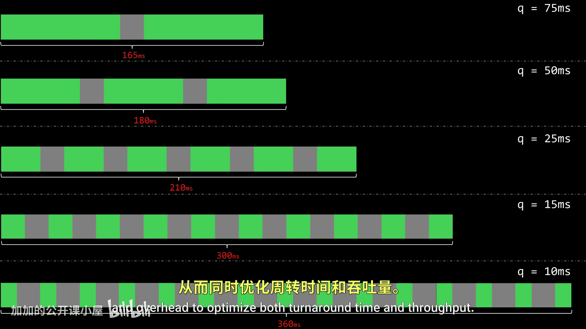

然而，周转时间并不总是衡量调度效果的最佳标准；通常，一个进程可以在完成执行之前开始产生输出，并且正如我们之前所述，某些进程甚至可能永远不会终止。因此，另一个重要的指标是**响应时间**，定义为从提交请求到产生第一个响应的时间。这不是完成进程执行所需的总时间，而是它开始响应的速度。响应时间至关重要，因为它直接影响用户期望从交互式系统（尤其是在多任务处理时）获得的流畅感。

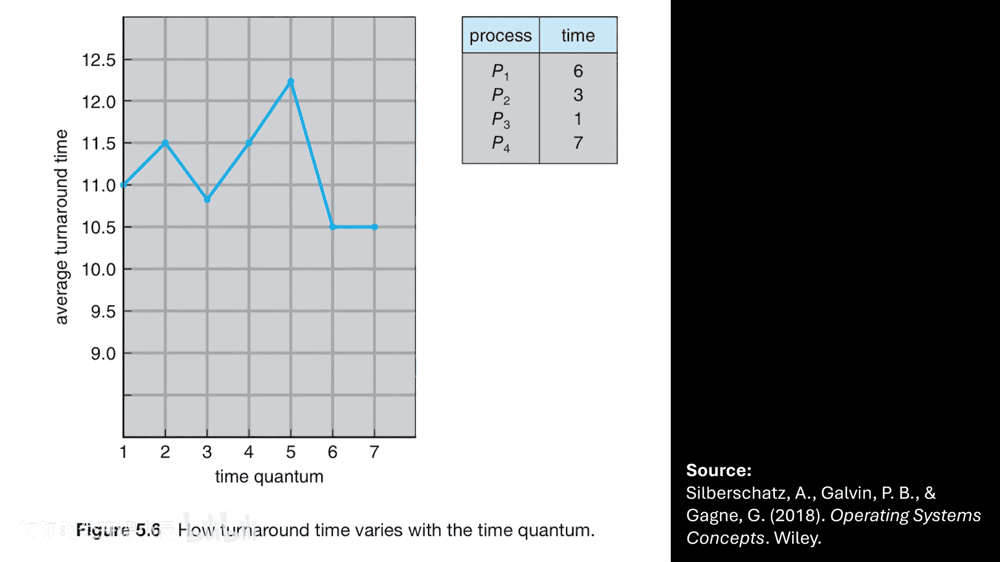

轮转是实现并发的最简单方法之一；每个进程以轮转方式获得固定的时间片。一旦一个进程完成其时间片，下一个进程就被允许运行。如果这种轮转发生得足够快，系统看起来像是在同时执行所有进程。唯一的问题是，所有计算机处理器都有速度限制。随着并发进程数量的增加，轮转难以保持响应性；在某个时刻，进程数量会非常高，以至于每个进程在获得CPU时间之前要等待更长的时间。随着平均响应时间的增加，同时执行的错觉就会破灭。

减少时间片似乎是一个解决方案；毕竟，它可以使进程看起来更频繁地重新获得CPU时间。但正如我们已经讨论过的，将时间片减少太多会导致过多的上下文切换，这同样有问题。为了解决这个问题，有三种可能的解决方案：提高处理器速度，允许上下文切换更快发生，这样我们就可以使用更小的时间片而不会对周转时间产生负面影响；或者使用多个处理器，允许进程并行运行并分担工作负载。然而，这两种方法都需要硬件升级，这并不总是可行的。但第三种解决方案可以通过软件单独实现，即使用更智能的CPU调度程序。

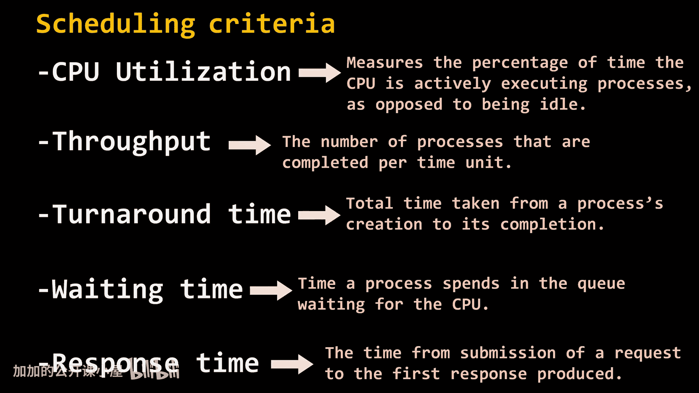

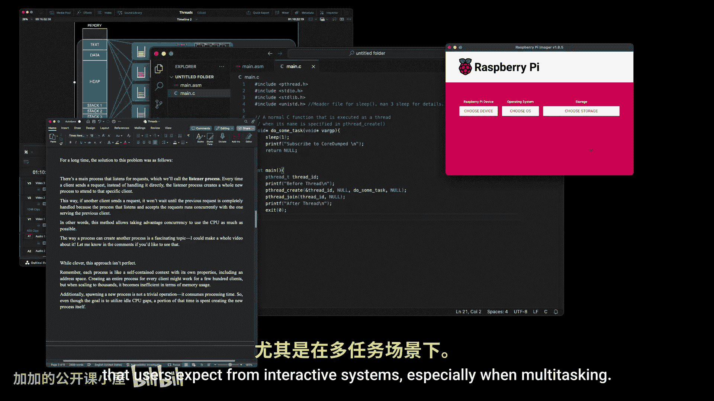

想想您计算机上运行的进程：您可能在玩游戏的同时进行流媒体播放，还有Outlook、Gmail客户端、文件资源管理器和其他后台应用程序都在同时运行。这么多东西，以至于轮转导致您的游戏有点卡顿。这里的问题是，所有这些进程真的需要相同数量的CPU时间吗？可能不是。如果我们为正确的进程分配更高的优先级，我们可以增加它们的响应时间，从用户的角度使它们再次感觉流畅和响应迅速。是的，后台进程会更少地获得CPU，但想想看，您的电子邮件通知延迟半秒真的很重要吗？也就是说，并非所有后台进程都是无关紧要的，有些（如操作系统服务）是关键的。关键是：如果我们能够正确识别哪些进程需要更高的优先级，我们就可以在不升级CPU或添加更多核心的情况下显著提高整体系统的响应性。

## 优先级调度与多级队列

上一节我们探讨了提高响应性的需求，本节中我们来看看如何通过优先级来管理进程。

优先级调度使用**优先队列**实现，其中每个进程被分配一个代表其优先级的整数值。在这个例子中，我使用1和0来区分高优先级和低优先级，但优先级值的实际范围取决于操作系统。有些系统可能使用从0到255的范围，其他系统可能从0到32,000，特别是当需要更细粒度的优先级级别时。较低的数字代表较高还是较低的优先级也取决于系统。在这个动画中，较低的值表示较高的优先级。

结合多种调度策略也很常见；例如，优先级调度可以与轮转结合，以确保具有相同优先级的进程之间的公平性。

优先级调度的一个固有问题是饥饿。在负载沉重的系统中，持续不断的高优先级进程流可能会阻止低优先级进程获得CPU。如果这听起来很熟悉，那是因为最短作业优先算法本质上是一种优先级调度，其中优先级基于预测的下一个CPU突发的倒数。这里有一个有趣的故事：IBM 7094是一台强大的大型计算机，被NASA和美国空军用于科学和军事应用，于1962年推出。据传闻，当他们在1973年关闭它时，发现了一个低优先级进程，该进程早在1967年就已提交，但尚未运行。

解决低优先级进程无限期阻塞问题的一种方法是**老化**。老化涉及逐渐提高在系统中等待很长时间的进程的优先级。例如，如果优先级范围从127（低）到0（高），我们可以定期（比如每秒）将等待进程的优先级提高1。最终，即使初始优先级为127的进程也会拥有系统中的最高优先级并被执行。

对于优先级和轮转调度，所有进程都可以放在一个队列中。但根据队列的管理方式，可能需要 `O(n)` 搜索来确定最高优先级的进程。实际上，通常更容易为每个不同的优先级设置单独的队列。这被称为**多级队列调度**。这里必须在队列之间进行调度。一种方式是屏幕上现在显示的方式。每个队列对较低优先级的队列具有绝对优先级。调度只是分派最高优先级非空队列中的进程。但为了避免较低优先级队列饥饿，我们可以以另一种方式调度队列。我们可以以轮转方式轮转就绪队列，但根据队列的优先级分派不同数量的连续进程，以便在队列之间进行时间片划分。

多级队列调度通常用于根据进程类型将进程划分为几个独立的队列，从而更好地调度具有多种响应时间要求的进程。它甚至允许我们为每个队列使用不同的调度算法。例如，前台队列可能由轮转算法调度，而后台队列由先来先服务算法调度。

这基本上是我们对通用CPU调度程序的期望：优先处理交互式进程，但不要到让低优先级进程饥饿的程度。

## 多级反馈队列

上一节我们介绍了静态的多级队列，本节中我们来看看能够动态适应进程行为变化的更高级算法。

在一个典型的多级队列调度算法中，还有一个问题需要解决：进程在进入系统时被永久分配到一个队列。这具有开销低的优点，但也不灵活，因为进程在其整个生命周期中的行为并不相同。以您的电子邮件客户端为例。大多数时候它在后台安静地运行，偶尔检查新消息。但一旦您将其切换到前台，您期望它快速响应，菜单、按钮、表单都需要立即反应。一个进程的CPU使用模式以及其响应时间要求可以动态变化。

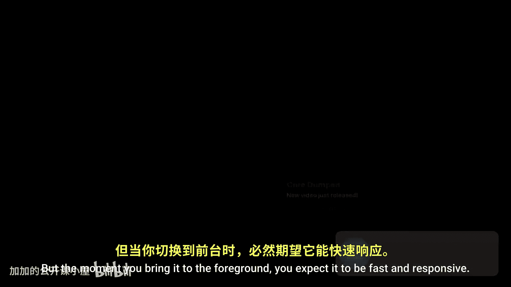

**多级反馈队列**算法旨在适应这些行为的动态变化。它的工作原理如下：每个进程从最高优先级队列开始。如果一个进程在单个时间片内完成其CPU突发，它可以在完成I/O后返回到该队列。如果一个进程需要的CPU时间超过时间片允许的时间，它将被移动到较低优先级的队列。较低优先级的队列具有较大的时间片，并且行为更像I/O密集型任务的进程如果它们在比分配给较高优先级队列的时间片更短的时间内完成其CPU突发，则可以被移回较高队列。随着时间的推移，具有短CPU突发的进程将倾向于留在较高优先级队列中；相反，CPU密集型进程将逐渐下沉到较低优先级队列。这就是系统如何根据行为自动调整进程优先级的方式。

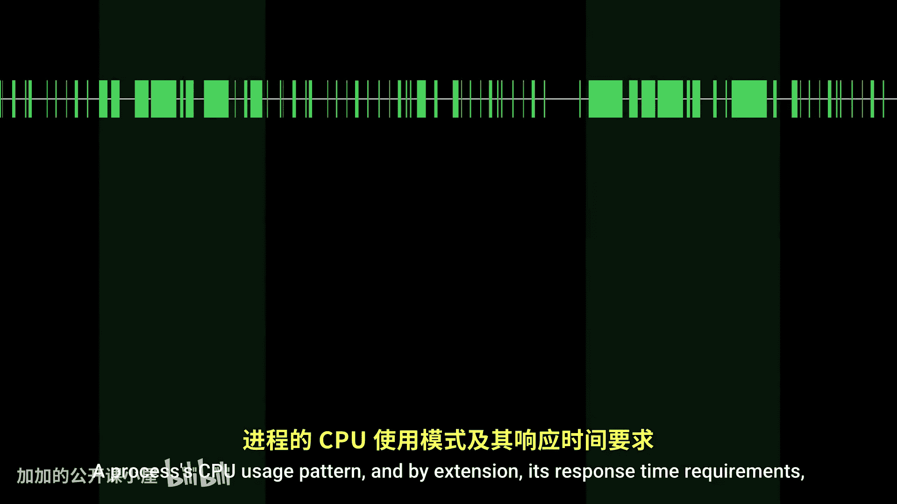

请记住，这只是多级反馈队列调度的一个例子；它有许多变体。不仅每个队列应用的调度算法可以不同，而且用于决定进程何时应在队列之间升级或降级的标准也可以不同。例如，系统可以不依赖最近观察到的CPU突来来调整进程的优先级，而是使用基于历史数据的预测，这可能有助于避免因孤立或不寻常的突发（无论是极短还是意外长）而导致不必要的队列切换。

如果您一直在注意，您可能会想，等等，我们不是在惩罚CPU密集型进程仅仅因为它们需要更多CPU吗？似乎我们现在违背了优先处理更重要进程的初衷。老化确实可以防止饥饿，但一旦一个进程被识别为CPU密集型，它最终会被降级。这是怎么回事？

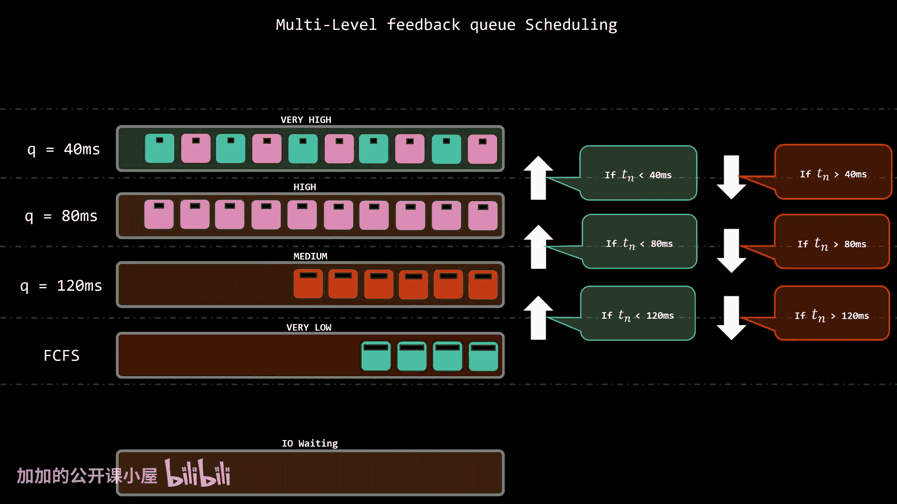

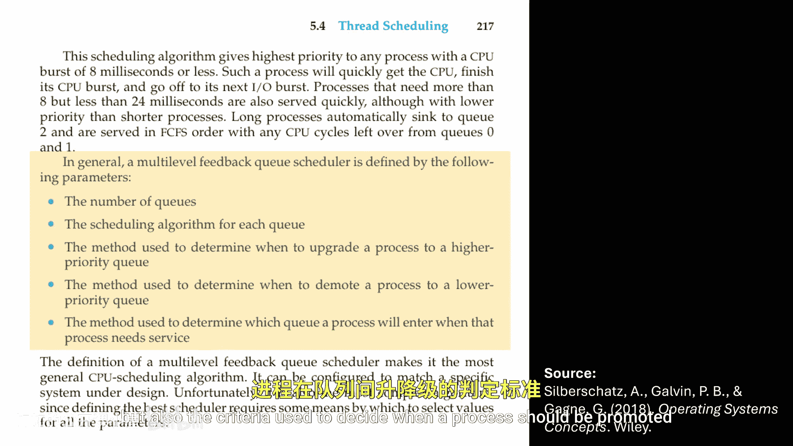

虽然在没有40分钟关于进程分析的大师课的情况下很难解释这一点，但我现在能做的最好的就是强调两个重要事实：I/O密集型和交互式进程不一定是同一回事，但两者都以非常短的CPU突发为特征。其次，现代处理器速度极快。如果您现在打开任务管理器，您会看到数百个进程在运行，但如果您打开资源监视器，您会注意到它们加起来使用的总CPU时间不到10%。这两个事实表明，大多数时候较高优先级的队列实际上是空的，所以当一个进程下沉到最低优先级队列时，它并不像听起来那样注定失败。在没有老化的情况下被分派实际上比我们想象的可能性更大。

想想当您的系统负载很重时，例如渲染视频或运行基准测试时。CPU使用率达到100%，但您的桌面保持流畅，音乐继续播放，浏览器保持响应。这是因为调度程序优先处理日常交互任务，而较少出现的CPU密集型进程则从高优先级进程剩余的CPU周期中获得服务。

如果我们将多级队列和多级反馈队列并排放置，哪一个听起来更通用？许多操作系统过去使用多级反馈队列的某种变体，但现代系统面临新的挑战，这些因素引入了额外的复杂性，并开发了更先进的调度策略来处理它们。在未来的剧集中，我们将更仔细地研究现代操作系统如何处理CPU调度，探索Linux、Windows和BSD的调度策略，以及它们如何管理所有这些现代变量。

## 总结与展望

本节课中我们一起学习了CPU调度的核心概念和各种算法。

现在就这样，一个直观的CPU调度介绍。在我们结束之前，做一些最后的澄清。现代系统调度**线程**，而不是进程。这允许在单个应用程序内实现并发；例如，一个线程处理用户界面，而另一个执行后台计算。使用多级反馈队列，CPU密集型进程的用户界面可以保持流畅，因为管理UI的线程可以独立于执行繁重计算的线程保持高优先级。

本视频中显示的I/O队列是简化的；为了清晰起见，我们将其显示为FIFO队列。实际上，I/O子系统更复杂。进入I/O队列的进程可能以与到达顺序不同的顺序完成。就像先来先服务对CPU调度效率低下一样，它对I/O设备也不理想。例如，需要使用图形卡的进程不应该必须等待当前正在使用磁盘的另一个进程。然而，所有这些细节都涉及操作系统的另一个组件：**I/O调度程序**。

让我们现在结束，还有更多令人兴奋的主题即将到来，比如竞态条件和线程同步，所以请务必订阅，您不会想错过的。

如果您喜欢这个视频或学到新东西，请点击点赞按钮，这是免费的，对我有很大帮助，下期见。