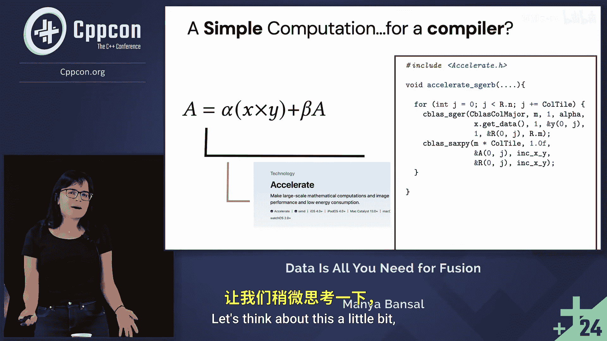

# CppCon【中英⚡CppCon 2024】 p05 P5 Lightweight Operator Fusion Using Data-Centric Function Interfaces in C++ - M -BV1NHEEzdE92_p5-

It's just super cool being able to talk to so many people and make connections with people throughout the industry and like minded people in general。

I'm Mania。 I just wrapped up my first year as a PhD student at M I T。 And today。

 I'm going to be talking to you about high performance code。

 I'm not going to be teaching you how to write high performance code。 Rather。

 are we going to be talking about using high performance code。😊。

So let's start with a quintinsent example， say for example， I want to do a matrix multiply。

 and I find a high performance implementation of a matrix multiply in some implementation of that C+ interface so that C+ S gemm is doing that matrix multiply for me。

😊，That implementation is going to look nothing like the naive Chily nested dupe you may have written in your first C or C plus plus class。

 It is going to give you the correct answer， though。

The actual implementation is going to be thousands of lines of extremely hairy and involved code。

 and this complexity is a direct function of wanting to take advantage of your hardware to the maximum。

 You can't write high performance code If you don't understand your hardware。 So in my case。

 this implementation is going to dial its inputs so that the next time you read your input。

 it's going to exist in the cache。 It's going to use vectorized instructions。 So SSE， A V X， neon。

 you name it。😊，It's going to parallellyze your code in the case that you have access to a multi core environment。

It's going to utilize cache blocking。 So of course。

 it's going to tie its inputs to take advantage of the cache。

 but it's also going to make sure that the instruction stream fits nicely within the instruction cache also and also behaves nicely with the branch predictor。

Finally， it's going to exploit some sort of software pipelineing。

 hardware today can run instructions out of order。 They can take sort of advantage of parallelalism within instruction streams。

 And this implementation is going to exploit all of those properties to get you really good performance。

😊，The point I want to make with this is that compilers cannot divine these implementations。

 Even a Herculean instruction selector cannot take that chiply nested loop and lower it into these thousands of lines of extremely involved code using some nice compositional set of rewrites on your ASD。

 You need to handwrite this code。And the hardware is evolving。

 so even if you were able to sort of take these patterns and retrofit them into monolithic machinery like a compiler。

 hardware is going to change and if your computation doesn't fit within these patterns or the hardware itself evolves。

 you're stuck。😡，In practice，s what ends up happening is that these high performance implementations often get provided through function interfaces。

 So essentially， you find a library the way that I did with CBs and use that function interface to use a fast and efficient sort of implementation of whatever computation you'd like to do。

😊，And this is extremely powerful because these function interfaces are opaque。

 They hide that complexity underneath， and I， as a programmer， don't need to reinvent the wheel。

 that is a fast matrix multiply anytime I want to use it。😊，A lot of libraries do this。

 So Intels one DN N library， the N K L Library， the Good news Sc Library。

 all of these sort of provide high performance implementations through function interfaces。

 precisely because you cannot rely on a compiler like machinery to auto generate that implementation for you。

😊，So let's actually try doing this together。I have a simple computationation up on the screen。

 I'm going to try to multiply two vectors。 I'm multiplying a vector with the transpose of another vector。

 so that's going to produce a matrix。 I'm going to scale that matrix with some alpha。

 going to accumulate into some result。 And during my accumulation。

 I will also scale with some scalar beva。😊，Simple computation， very straightforward。

I told you high performance is all about hardware， and here's the machine I'm running on。

 I'm going to be using the Apple M1。 It has the arm 64 instructions at architecture。

 And turns out the best implementations were this linear algebras style computation that I have live in two libraries。

 First， the arm performance libraries。 So these are implemented by the folks at Ar themselves and the aated libraries implemented by the folks at Apple。

😊，Let's start off with the armed performance libraries。 Turns out with the armed library。

 I'm super lucky。 I find an interface that can do my exact computation。

 I just need to understand how to work with it， and I'm good to go。😊，For the Aated library， however。

 the story is a little bit different。So for the aate library， I actually need two functions。

 one function to do that vector to vector multiply and another to do that data and that is like accumulate into the final result。

 So the acc library does not have that nice sort of single function。

 but I can get by with two functions。 I mean， I mean。

 is it really that different from understanding one interface， not not really。😊。

But there's a curious case that happens with the performance of these two implementations。

 The arm performance library is 30% faster than the A rate library。😊，The Y axis there is real time。

 so lower is better， so the unform performanceance library is beating out the Aid library。

The question one might reasonably ask is， why is this happening。A good first guess is going to be。

 hey， maybe the a rate vector to vector multiply isn't really that optimized。 In fact， it's。

 it's the most computationally intensive part of our application。 If you screw that computation up。

 you're not going to get good performance。😊，So I went ahead and implemented just the vector to vector multiply and tried to see whether the accelerate implementation is actually worse than the arm implementation。

That's not the case。 Barring some noise， they basically sort of match each other quite tightly。

 And this is honestly what I'd expect。 Both these libraries have been optimized over decades by several talented engineers。

 not they're not going to lose that performance on a vector to vector multiply。

Another good guess would be that there's something interesting happening with the fact that we're actually composing two interfaces together instead of one。

 it's not really the insides of these functions that make them slow， but in fact。

 that composition that leads to that performance loss。

 And what I mean by that is that by the time you're ready to do that beta plus a addition the first element of the intermediate you produced is already out of the cache。

 So you're going to experience a cache miss and that's going to be problematic for you。😊。

So let's actually test out this theory。You might say， hey。

 like that beta and that a is actually quite trivial， it's an element wise operation。

 why don't you just go and edit the A rate implementation to do it for you？

The problem is that the A interface is proprietary。 I don't have source code access to it。

 So it's close source， but unfortunately， it's also extremely important because it's one of the only ways you can target specialized undocumented accelerators like the neural engine or the AMX instruction set on your Apple machine。

 So if you want to take advantage of that hardware， you're bound to this library。😡。

Another idea would be if if really the problem with my function is the fact that I'm going to lose performance because of that cache miss。

 What if I just process my data in chunks， So I just compute little parts of my data。

 hope that they live in the cache and by the time that I'm ready to compute that data in a just on that little part。

 I'm going to get a cache hit instead of cache miss。😡。

This is actually quite a simple transformation to implement。 And I just have it on the screen here。

 So first， we're going to go over column tiles of our inputs。

 just going to compute that vector to vector multiplication on that tile going to do that little sax pre operation。

 the beta and the addition with the matrix A。 and then keep doing this until we actually finish the entire output。

 So that's what I mean by let's process our data in chunks。😊，I want to flag this idea here。

 as fusion。So this is a very old and traditional optimization。And if you've heard of fusion before。

 you might be used to seeing it sort of in like L L VM M L IR style where you basically have one outer loop。

 And you you and you have computations in lined into that outer loop。

 I don't have in line computations。 But the fundamental idea is the same。

 Let's compute independent subsets of our output so as to exploit locality。

 So this is what I'm gonna mean by fusion。And turns out。

 this chunky accelerate is going to get my performance back to me。

 So locality was actually the problem in our case。 and without understanding the source code or without sort of editing it in any way。

 I was able to get this to work。😊，So the other observation I want you to keep in mind is that even though these functions are awesome and they hide incredibly very complicated code for us。

 if we naively compose them， we're going to experience losses in locality。😊。

And I just showed you how this was bad for performance， right， We just saw the 30% difference。

 But more importantly， this is going to be bad for energy。

 So data movement in current chips today dominates energy cost。

 The cost of moving some data from a local astram like a cache is almost 500 x。

 then computing something using that data。 So we really need to care about locality and data movement If we want to write fast and efficient code。

😊，Okay， I mean， we've been doing these simple computations， and I did this transformation。

 I also told you， it's not possible for compilers to sort of do this high performance code for you。

 But I want to ask a different question now。Was this a simple computation for a compiler。

 Could we have expected a compiler to come in and rewrite our code so that it can take advantage of this locality。

Let's see。

