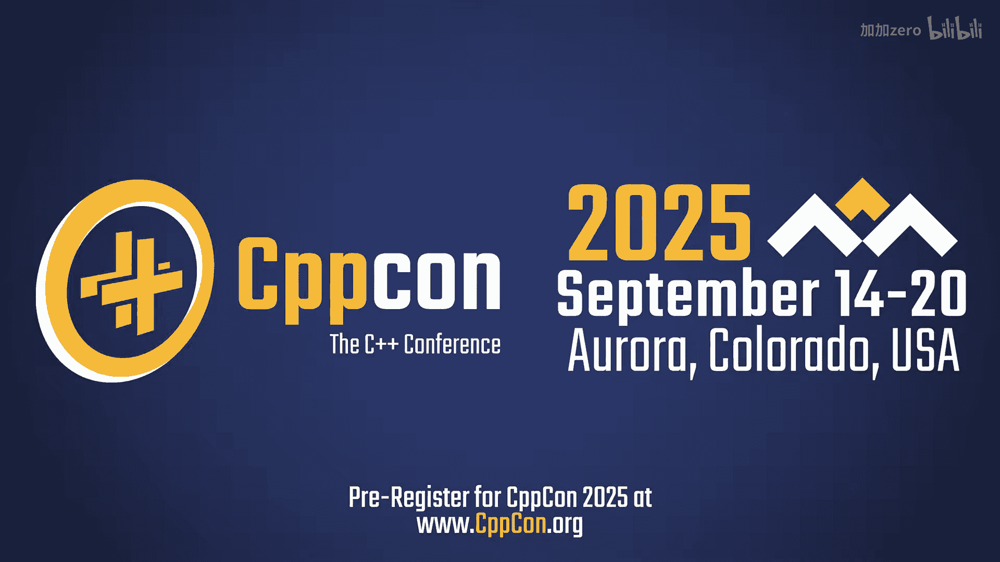
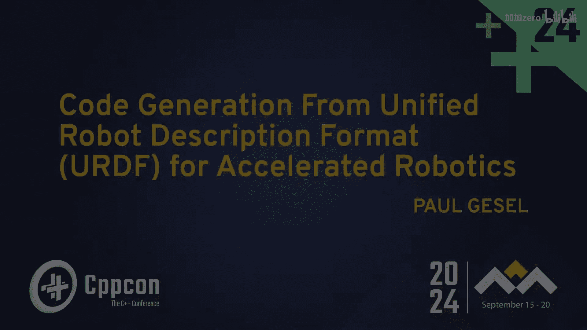
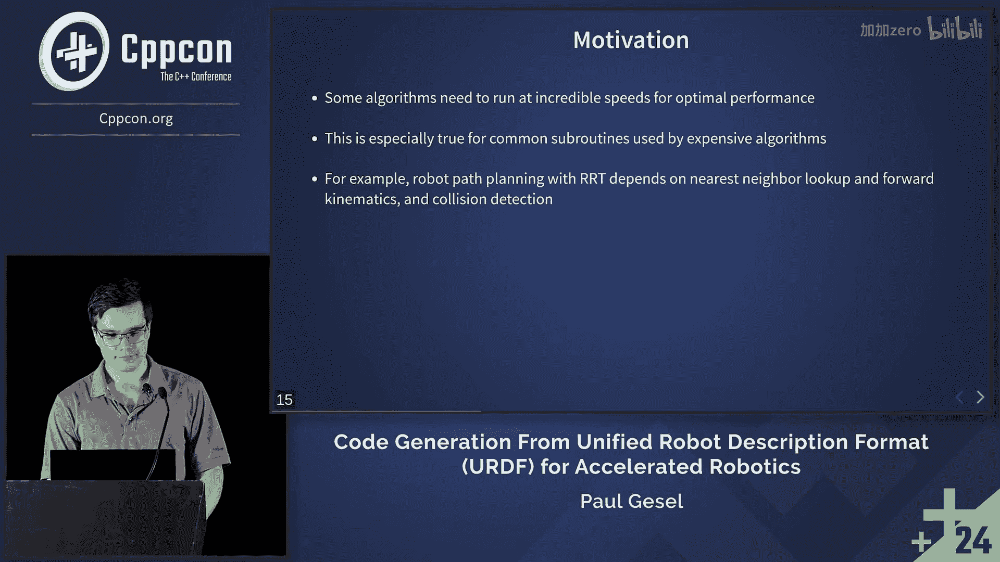

# CppCon【中英⚡CppCon 2024】 p09 P10 Code Generation from Unified Robot Description Format (URDF) for Accelerated -BV1NHEEzdE92_p9-

🎼This is the conference force， the C++ community here we get to discuss with the standards community and with all of the innovators that are building C++ now and for the future。

 the innovations and opportunities that we have in our company。

 as well as the opportunities that they're exploring as an industry。

🎼The。🎼。

Okay， I think it's time to get started。So first off， good afternoon everyone。

 thank you for coming to my talk my name is Paul Gessel today I'll be discussing co generation from Unified robot descriptionscript format known as URDF for Acce robototics。

Before we get started， just a few things about myself。For one。

 this is my first time attending CPPCon， so I'm glad to be here and to make it even more special。

 of course it's my first time presenting at CPPCon。About me。

 I'm a robotics research scientist at picnicnic robototicics。On my day to day work。

 I often use C++ for robotics algorithms。And additionally。

 I earned my PhD in computer science from the University of New Hampshire in the area of robot learning。

So this is a concept slide of what I'm trying to present here。First on the left， we have this URDF。

 which is an XM based file format， and essentially the URDF is a declarative syntax to describe the kine structure of your robot。

 including the number of joints， the links in their geometries。In the joint types。

 and with this information， you can do forward kinematics， you can do collision checking。

And this is sort of the standard format to describe robots。 And with this well formed syntax。

 we can actually run it through。Cogeneration process to translate this into C++ code into optimize C++ code that can be compiled on the user's CPU for certain performance enhancements。

So this is the overall outline of my presentation， I'm going to start with some background。

 just background in general of robotics。And including some of these commonly reoccurring subroutines like Ford kinematics。

 inverse kinematics。And then I'll move on to motivate the problem。

 so the question is why would you need code generationeration or what situation are you really going to get benefits from it in？

Then I'll move on to the actual implementation detail of a library I've been working on called fast For fast。

Ford kinematics。And this is a GitHub repository， I'll have a link at the end of the presentation where you can check it out。

I'll discuss the build process for this library and then also discuss some code implementation details and some design decisions I made to try to get the best result out of the Forinematic and inverse kinematics implementations。

And lastly， I'll discuss some results， so I made a few simple benchmark programs and I'll show the perf results for my co-generated Ford kinematics compared to an existing library called KDL。

 which is a fairly popular robotics kinematics library that's open source。Lastly。

 summarize with just a few points on lessons learned。Okay。

 so moving on to the background and robotics。Sort of a fundamental skill of an autonomous system is to do motion planning。

 so that's what this slide is trying to show on the left is some arbitrary start state and then we have a goal which says。

 oh the robot is supposed to move through some scene with obstacles and make some final position to reach the cube and this problem of finding a space in this scene without collaiding with the obstacle that's robot motion planning。

And then just a high level overview， we can sort of describe this motion planning problem。

As thinking about all the possible states the robot can be in。

 and the robot state is fully defined by its joint angles。And for any given set of joint angles。

 we have like the start set in the top left， there's the goal set in the top right， but there's many。

 many intermediate possibilities， for example， if we take a straight line through the joint space。

 in this case there would be a collision with the obstacle shown in the top image。And then。

 you know if we find the right path through the joint space。

 we'll be able to navigate the robot arm around the obstacle。And this is a simplified example。

 in general， we might wind up sampling this space thousands of times for a simple problem or tens of thousands or hundreds of thousands of times for more complex problems。

And each one of these points in this graph。Often requires calculating forward kinematics。

 collision checking， nearest neighbor lookup。 So these are these commonly reoccurring algorithms and robotics that。

Ultimately wind up being the bottleneck for motion planning problems。

This is just a brief summary on Ford kinematics。 So the problem of For kinematics has given a set of robot joint angles。

 calculate the 3D positions of the robot length in space。And there's really two components to this。

 One is the。Calculate these transformation matrices， which are a function of the joint angles。

And then step two is to multiply all of these values。

 and that's enough to calculate the link positions。And then there's inverse kinematics。

There's a few ways to do inverse kinematics， oftentimes it requires calculating the Jacobian of the robot model。

And just brief note on what inverse kinematics is， you see in the animation on the right。

 I'm able to specify a position in 3D space that I want the end effector to go to and the robot will go there and then I can serveroid around in 3D space。

 so it's a very useful problem。To achieve this， we often have to calculate the Jacobian。

 and this is a matrix which you can fill in like this。So each column of the matrix。

Is going to be related to the joints and the joint axes， so in this case I'm looking at joint1。

And if I'm rotating about joint1， it has some effect on the end effector position。

 it would rotate around this purple circle， and there's this black arrow showing like the direction it moves when you change that joint a bit。

And that direction is going to be used to fill in the Jacobian matrix。

 so you can calculate this by taking distances between these joints and using like a cross product。

 and then you loop through all the joints in the robot model and you can fill in this matrix。

 So that's one way to go about calculating the Jacobian。

 which is often used inverse kinematics algorithms。So moving on to some motivation。

 like this is sort of the goal， so I was saying the motion planning approaches。

 they're computationally inefficient， that they may have 10，000 expansions。

And you're not going to be able to do it in real time。

 but if you can optimize the algorithms and maybe do some shortcuts in other places。

 this is the result we want， a real time motion planning and a fully dynamic scene。

 and you can see in this case。Like when the object is moved up。

 the robot will swing its arm underneath。 And when it's moved down， the robot will plan over。

 So this is the capability that we want。 And we don't want the implementation on the code side to get in the way of this。

This is just repeating a few of the points I made before one thing to note is that the library I'll be discussing for Cogen I'm not specifically doing collision detection or nearest neighbor lookup。

 but collision detection nearest neighbor and Ford kinematic。

 those are all going to be crucial to do planning like that with a sampling based algorithm。

And I got interested by this idea and was first exposed to it when I saw this paper from researchers at Rice University that they call motions and microcroseconds via vectorized planning。

 and basically what they did is took a yourDF format and developed a novel compiler to translate that format into C++ code。

And in some cases， they were able to beat the state of the art by 500 times。

 which is obviously a huge improvement and they're able to do real time motion planning。And again。

 there's some caveats。Their approach essentially was optimizing the actual generated code。

 the layout of this memory so they could do Cindy instructions。

 and they could do many forward kinematics in parallel and collision checks in parallel。

 And then there's also some information that if you have at compile time。

 you can you can like unroll loops， you can skip calculations of fixed joints and things like that。

 So yeah， once I saw this， I got interested by this idea。 and I started investigating。😊。

This project and like I said， I made sort of my own version， which does some of the things they。

And this slide is just some。More just general detail on cogen。In the ideal case。

 I guess we would have an engineer develop a customized and optimized kinematics per robot。

 but that's not really scalable， so。And。Co generations。It's sort of a。

Trade off between these two things， so we get to use a little bit of domain knowledge。Like the URDF。

The number of joints can be fixed， for example， and any redundant calculation can be eliminated。

 so we have some of this domain knowledge， but we're automating the process so we kind of get a middle ground。

And then additionally， if we can。Sort of show that the code generator。

