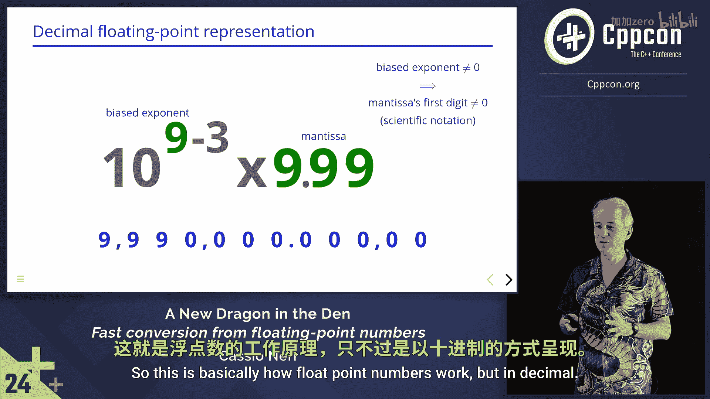

# C++浮点数转换：第1章：概述与背景 🧮


在本教程中，我们将学习如何在C++中快速且可靠地将浮点数转换为字符串。这是一个看似复杂，但通过理解其底层原理，可以变得简单明了的问题。

## C++浮点数转换：第2章：问题的复杂性 🐉

上一节我们概述了本教程的目标，本节中我们来看看为什么浮点数转换会成为一个“棘手”的问题。

在标准C++中，有多种方法可以将浮点数转换为字符串，但它们的输出并不总是一致。这是因为没有一种“一刀切”的解决方案。有时我们需要更多的自定义能力，有时则需要更高的性能或更可靠的结果。

以下是几种标准C++转换方法及其不同输出：
```cpp
// 示例：不同转换方法的输出可能不同
std::to_string(0.1);
std::ostringstream{} << 0.1;
std::format("{}", 0.1);
std::println("{}", 0.1);
```

## C++浮点数转换：第3章：核心挑战——二进制到十进制 🔄

上一节我们看到了转换方法的不一致性，本节我们来探讨其根本挑战：将计算机存储的二进制数转换为我们阅读的十进制数。

我们都知道计算机以二进制存储数字，而我们希望看到十进制表示。将整数从二进制转换为十进制是直接的，可以通过一系列的除法和取模操作完成，每一步得到一个数字。

```cpp
// 整数转换的教科书式代码（非最优）
std::string int_to_string(int n) {
    if (n == 0) return "0";
    std::string result;
    while (n > 0) {
        result = char('0' + n % 10) + result;
        n /= 10;
    }
    return result;
}
```

然而，浮点数带来了新的问题。考虑数字 `float x = 2e-126`。它有126位小数。如果使用上述循环计算126位数字，然后丢弃大部分，这将非常低效且浪费。因此，我们需要更聪明的方法。

## C++浮点数转换：第4章：浮点数的内部表示 🧠

上一节我们明确了整数与浮点数转换的不同，本节中我们来深入了解浮点数在计算机中是如何表示的。

为了理解高效的转换算法，我们必须先理解浮点数的工作原理。让我们从一个简单的模型开始：一个只能存储和显示4位数字的CPU。

我们首先遇到的问题是希望看到分数，而不仅仅是整数。一个廉价的解决方案是在数字之间插入一个小数点。但这个点只是概念上的，CPU并不存储它。

通过这种存储方式，我们可以从0.01开始，以0.01为步长，计数到接近10。但这范围太小了。为了扩大范围而不增加成本，我们可以重新利用第一个数字，将其视为科学计数法中的指数，而其他数字则构成尾数。

同样，指数和科学计数法也只是我们用于理解的概念，并非CPU的存储格式。引入一条规则：当指数不为零时，尾数的第一位数字不能为零（即规范化的科学计数法）。这样，数字范围可以扩大到接近100亿。

如果我们想要更高的精度（更小的步长），可以牺牲一些范围。例如，将所有内容重新缩放（相当于给指数加一个偏置）。这样，步长可以变得更精细，但最大范围会相应减小。

这基本上就是浮点数（如IEEE 754标准）的工作方式：通过一个指数和一个尾数，在精度和范围之间进行权衡。

## C++浮点数转换：第5章：高效转换的关键思路 💡

上一节我们解释了浮点数的表示，本节我们来看看如何利用这种表示进行高效转换。

核心思路是避免为那些最终会被四舍五入或格式化掉的数字进行冗长的计算。对于像 `2e-126` 这样的数字，我们不需要精确计算出全部126位小数，而是直接计算出其最短的十进制表示，该表示在转换回二进制时能唯一确定原值。

高效的算法（如Dragonbox、Ryu）正是基于这一原则。它们直接操作浮点数的二进制位（指数和尾数），通过数学方法快速确定所需的十进制数字的数量和值，从而避免了低效的循环。

## C++浮点数转换：第6章：总结 🎯

在本教程中，我们一起学习了C++中浮点数到字符串转换的复杂性及其解决方案。

我们了解到：
1.  标准C++提供了多种转换方法，其输出和性能特性各不相同。
2.  浮点数转换的核心挑战在于将二进制表示高效、准确地转换为十进制字符串，特别是对于具有很多小数位的数字。
3.  浮点数内部使用科学计数法（指数+尾数）表示，以在数值范围和精度之间取得平衡。
4.  高效转换算法的关键在于直接操作浮点数的二进制表示，避免计算不必要的精度位数。



因此，虽然浮点数转换问题初看可能像“九头蛇”一样复杂，但通过理解其底层表示并采用正确的算法，它并非“火箭科学”。对于追求性能和可靠性的场景，应当选择像 `std::to_chars` 这样设计精良的专用函数。