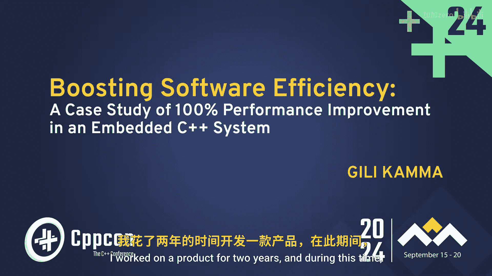

# C++软件效率提升：第1章：问题诊断与内存分析 🧠

在本章中，我们将学习如何诊断一个C++软件系统的性能问题，特别是与内存管理相关的不稳定性和数据丢失问题。我们将从一个真实案例入手，了解问题背景，并学习如何使用内存分析工具来定位根本原因。

## 概述

本次分享的主题是软件开发。我花费两年时间改进一个产品，并显著提升了它的能力。我希望分享这段经历，为大家提供有用的思路和灵感，以改进自己的产品。

我的名字是Gilicma，拥有20年行业经验。我拥有电子工程学士学位，但更偏爱软件。我热衷于改进事物和解决问题，目前是Right Priority Software的团队负责人。

## 项目背景

我的故事始于几年前。我举家搬到丹麦，并开始在Camp Stop工作。Camp Stop的业务是计量，这里指的不是距离，而是水、热和电的计量，具体来说是智能计量。

智能计量是一种使用数字设备自动将公用事业数据发送给供应商的系统。这是一个端到端的系统。在一端，我们有水表。它们安装在房屋内，测量用水量，并持续通过无线方式传输测量数据。频率可以是每16秒、一分钟或两分钟，取决于配置。

在另一端，我们有读数管理器。读数管理器是信标，也就是计费系统。他们负责在月底向用户发送账单。在中间，是中间人。这就是我负责的产品——读数集中器。它的工作是无线收集来自水表的测量数据，并通过蜂窝网络、调制解调器或以太网将其发送到云端。

需要理解的关键点是，业务的核心是数据。因此，数据丢失意味着金钱损失。总的来说，我们有两个接口：一个面向持续提交数据的水表，另一个面向读数管理器。

## 面临的问题

最初，该系统设计用于处理少于1000个水表，并且运行良好。但几年后，它被期望能处理7500个水表。一些工程师经过计算，认为这是可能的，于是就这样卖给了客户。

然而，当我们尝试用7500个水表运行时，产品变得不稳定。产品不稳定意味着客户不满意，当然，开发人员也不满意。

具体到技术问题，我们遇到了内存问题。系统没有足够的内存，并且出现了一些无法解释的崩溃。有时，在网络出现问题时，我们还会丢失数据，尽管只是偶尔发生。当然，这些问题在实验室环境中都没有出现。

## 技术栈分析

系统基于Linux内核和Yocto发行版构建。整个镜像是预编译的，没有源代码。它运行得很好，但我们无法修改它。系统拥有32MB RAM，这个数字很重要，我稍后会谈到。代码风格是C++，但更像是C++11甚至更早的风格，完全没有使用智能指针。

此外，系统大量使用了Qt。Qt是一个应用程序框架，它降低了底层编程的门槛。Qt的好处是它用起来像C#，所以即使你不是嵌入式专家，也可以在嵌入式设备上编写代码。但Qt的坏消息是，它用起来像C#，却没有垃圾回收器，因此性能不佳。它鼓励你不断动态创建对象，却不鼓励你删除它们。

## 明确目标

我的目标是：**将数据丢失降为零，并创建一个稳定的产品**。听起来很简单，对吧？那么问题来了：我该如何实现？

## 初步代码审查

对我来说，这是一个新公司、新产品。我开始查看代码，当然，没有文档是常态。看了几天代码后，我的第一印象是：我看到了大量的 `new` 和 `delete`。我当时想：他们在一个嵌入式系统里到底想做什么？我对此感到非常震惊，以前从未见过这种情况。

但随后我恍然大悟。这说得通，因为正如我所说，有大量的 `new` 和 `delete`，很可能意味着存在内存泄漏（即我忘记释放分配的所有内存）。同时，很可能存在内存碎片化。

## 理解内存碎片化

让我们花20秒理解内存碎片化。假设我们有100字节的内存。现在我分配40字节，然后20字节，再40字节。接着我释放了40字节和40字节。现在我想分配50字节，这就出问题了，对吧？即使我有足够的内存。想象一下你的整个内存都是这种情况，这就是内存碎片化。

这解释了为什么我没有足够的内存，也解释了为什么分配会失败。当然，我并没有在任何地方检查分配是否成功。所以我访问了空指针，然后导致了不受控制的重启。问题解决了，对吧？不对，在这个案例中，这个思路是错的。

## 深入调查

经过调查，我发现并没有很多内存泄漏，所以这不是我的问题。我也没有内存碎片化。但在当时，我确信这就是问题所在。我以为只需要清理内存泄漏，找到内存碎片化的问题，一切就都解决了。

无论如何，我需要测试我的假设。为此，我开发了一个内存分析器。这个内存分析器让我很好地理解了分配的大小和数量。需要说明的是，由于Linux内核版本非常旧，我无法使用标准的内存分析器。

## 内存分析原理

一般来说，当有分配和释放时，内存使用情况应该如下图所示。内存使用量会达到某个最大值，然后在某个点后，我期望它能稳定下来。

但当存在内存泄漏时，情况会像这样。内存使用量会持续上升，因为我并没有释放所有分配的内存。

## 关键测量指标

使用内存分析器时，有几个有趣的测量指标。

首先是**每秒分配次数**。假设我每秒只有两次动态分配。我不喜欢这样，但我们明白这不是问题，系统可以承受每秒两次动态分配。现在考虑另一种情况，假设我每秒有2000次分配。这时，我认为系统根本无法工作。所以这真的取决于具体情况。

其次是**当前和最大分配数量**。因为如果存在内存泄漏，最大分配数量应该会持续不断地越来越高。如果一切正常，它应该在某个点后稳定并保持不变。

观察当前值与最大值之间的差距，以及这个差距如何随时间变化和破裂，也非常有趣。

关于分配的字节数也是如此。分配次数和字节数本身是相似的指标，但不完全相同。

我认为最有趣的是**按大小分类的当前和最大分配数量**。这意味着有多少次100字节的分配，有多少次1000字节的分配。为什么这如此有趣？有两个原因。

## 按大小分析的优势

第一，这非常容易发现内存泄漏。当你有了这些数值，因为如果一切正常，分配模式应该是稳定的。但如果存在泄漏，你会看到特定大小的分配数量持续增长。

第二，这有助于识别内存碎片化的模式。如果大量的小块分配和释放交织在一起，即使总内存足够，也可能无法满足一个稍大的连续内存请求，这就是碎片化的典型表现。

---

在本章中，我们一起学习了如何为一个不稳定的C++嵌入式系统进行初步问题诊断。我们了解了项目背景、面临的技术挑战，并重点介绍了通过自定义内存分析器来量化内存行为的方法。我们探讨了内存泄漏和内存碎片化的概念，并学习了如何通过分析分配频率、分配数量以及按大小分类的分配模式来定位问题。下一章，我们将深入探讨具体的优化策略和代码层面的改进。