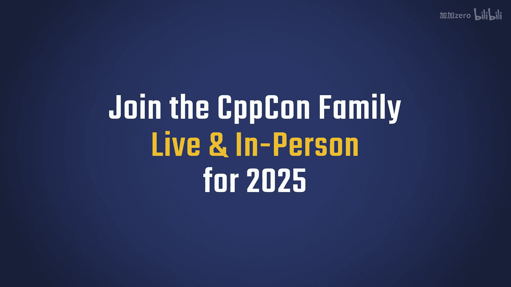
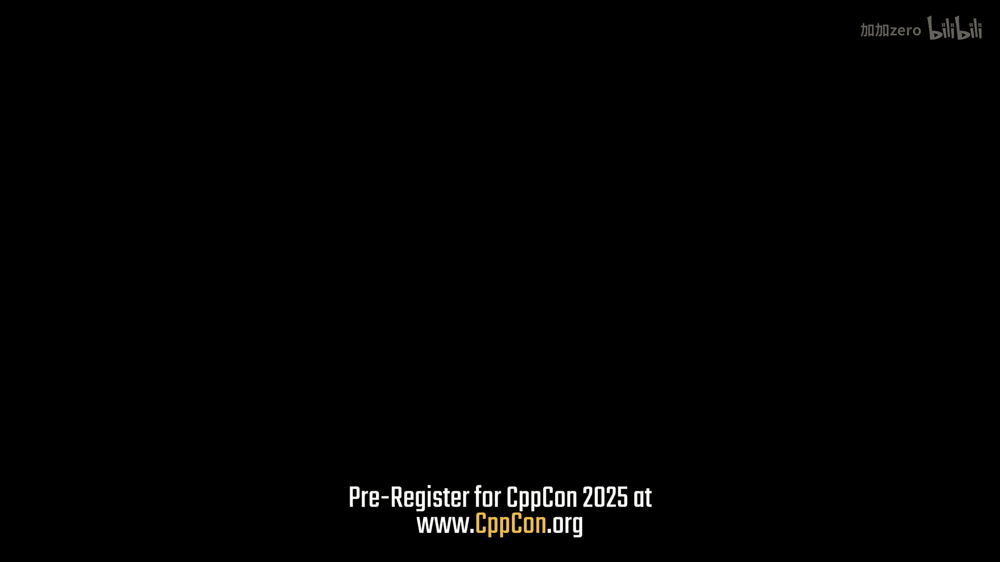
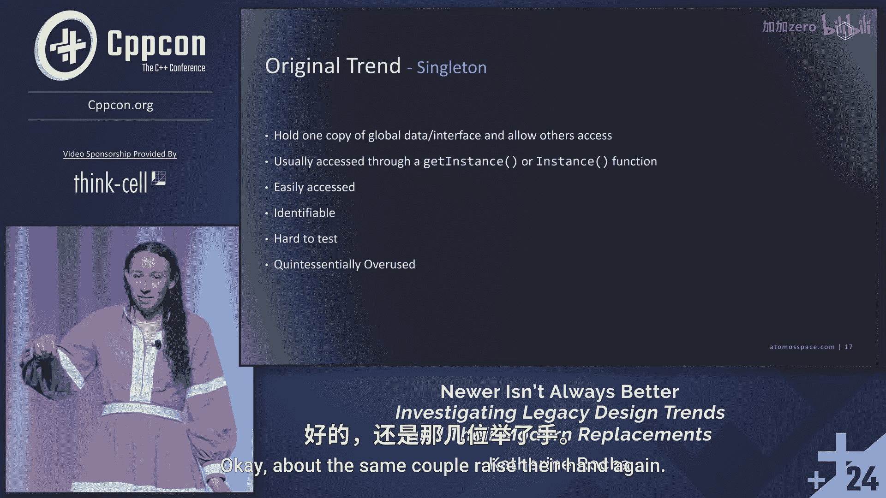

# CppCon【中英⚡CppCon 2024】 p13 P14 Investigating C++ Legacy Design Trends： Newer Isn’t Always Better! - Katheri -BV1NHEEzdE92_p13-

I would say the best of the best in this field， the CPP field are here， why not come here， meet them。

 learn from them， do it in person as we know that's a lot better than getting to do things virtually so where else can you come somewhere where all the experts are？

Hello everyone， my name is Katherine Rocha and today we're going to be talking some about some design trends and we're going to be looking at legacy design trends and then the current design trends that have replaced them and kind of try and figure out is the newer thing better or is the older thing better。

Go。So here's just a little bit about me。 I'm a software engineer at At Tamo space。

 It's a really small startup in Broomfield， Colorado。

 and I'm currently working on a four yearold codebase and it's running C+ plus 23。

 which is super cool for space and super unique and it also only has around 100000 lines of code So very small We're able to make a lot more changes that you weren't able to typically make and these really massive legacy code bases However。

 I previously worked in a 20 plus year old codebase that was running modern C+ plus however。

 because it it existed for 20 plus years。 you still had macros and all the other things that made it really difficult in order to actually revolutionize and write new code So you still had all those issues of things have been done for so long and so how do we change things and this is kind of what inspired that this talk is figuring out we've written all these things and we have all this legacy code how do we end up moving forward and how do we end up writing new code and is the newer thing better is the older thing better and I'm kind of a self-proclaimed software historian or genealogists If you've seen any of my other talks I tend to focus on。

😊，How we can write code better and how we can understand why we're doing the things that we're doing。

Cool，So as I said， I work at a small company called At Tamo space。

 We work on orbital transfer vehicles。 So these are spacecraft that attach to other spacecraft and move them around in space so we can relocate a spacecraft to where it needs to be allowing it to extend its life。

 So we don't have to send up a new spacecraft。 which is a really cool mission。

 So if this is something that you end up becoming interested in。

 we do have some positions coming up in the future。😊。

Cool so I was really interested in trying to understand the past。

 understand why we're doing the things that we're doing and investigating these new patterns with the same scrutiny as the old I noticed that we tend to have two camps of people we have the people who have been working in industry for forever have been using these design patterns for forever and they're convinced that just because we've done it for years this is the way we need to keep doing it and then you have your software engineer that just graduated college comes in has all these bright new ideas and they end up telling you。

 hey， we should do it this way because I saw it this way and this looks really cool and both of those end up clashing a lot and you end up usually having the senior engineer say。

 well we've done it this way and this is what I'm used to and this is what the codebase does and so this is what we should keep doing and so we need to figure out kind of a middleground and understand both perspectives in order to be able to make the best decision for codebases while still incorporating some of that legacy and still trying to keep consistency across our entire codebase。

And this is one of these things that we don't just see in software。

 we also see in real life you look at things like water bottles a few years ago everybody had a hydro flss water bottle and that was the cool thing and you had to go out and buy your own and now that's not the cool new water bottle and if you're using that it's like should I keep using the old water bottle that's still functional or should I upgrade to this new water bottle just because it's new and that's something that we we don't quite have the answer for in the rest of life but maybe we can analyze and figure out a better way to do it in software engineering。

CoSo here's kind of the process we're gonna go through to figure out how we're gonna like what these design trends have going for us。

 So first we're gonna look at a timeline。 we're gonna kind look at the original， look at the news。

 so kind when each of these things happened and then we're gonna look at the original trend and try and understand why was it used and what was it and then we're gonna do the same for the new trend' also at why did we replace it and why are we not why did we replace the original and why are we not using it anymore and then we're gonna also look at the source code for each and try and understand how elegant isn't what are the problems with it。

 what makes us happy about this code and what doesn't make us happy about this code and we're doing a code review And this this is all code that I've written and the idea is it's not perfect The idea is is that we can talk about it as a group and do a little bit of a code review and understand what's good and what's bad about this code because I don't have all the answers and neither do all of us And so if we all pull our mindsets together will'll end up coming up with an answer that works for everybody and then we'll end up knowing a little bit more。

About some of these patterns。And then we're going to kind of do a little bit of analysis and understand what's good and what's bad about each of these trends。

Cool， so this is going to be a little bit interactive and we'll see how it goes as we go along。Cool。

 so our first one we're gonna do is gonna be really easy， really quick， just kind of。

Do a little bit of research and look at how we're gonna be doing this for the future。

 Our first is the index for loop versus a range based for loop。 Now。

 who here uses range based for loops on a regular basis。 Okay， most of the hands went up。Awesome。

Cool， so we have our index for loop and then range based for loops came into effect in Z++ 11。Cool。

So the cool thing about our index for loops is we have an index that can be used to access an individual element and we can also use that index for other side effects。

 the idea being that this index isn't just for accessing the element。

 but we can do whatever we want with it if we want to use that number for another calculation or do something else we can do that it also doesn't really require a group of items。

 However， the access operations can be a little bit more dangerous so here's an example of the code。

 if you notice there are two different ways that we can access each of those elements。

 you can access it via the braces with the index inside of it or you can use dot at and one of those will throw an exception and the other one。

 if you send in an invalid index， you're gonna to have a lot of issues And so these are both cases that you may not want in your code or may not be able to deal with because some code you don't really want to throw an exception because you know what's going to happen in this function and you don't want to happen and some code you don't want to accept the risk that there may be an issue and so this can lead to a lot of issues and。

Cause problems with all these other side effects。Cool， and then here's our new trend。

 which is the range based for loop。 This tends to be a little bit more data oriented。

 and it's also a lot more readable。 So you look at a range based for loop。 and you're like。

 I know exactly what we're doing。 I know what we're looking into。

And so if you notice on the top line， we have our different different objects that are in space。

 We have our sun， our Earth， our moon and Jupiter。 And then we can say， okay， well。

 we're pulling an object out of this vector。 and then we're gonna output our output our object。

 And this is really nice because we can visually see what we're doing and kind of understand what's going on。

 And it's a lot more readable。 And we aren't worried about that index being used for anything else。

 because we don't actually have access to it。😊，So here's kind of our comparison as you can see for the index for loop。

 we can add a lot of these side effects which are really great for doing math operations。

 However it can be difficult to have some of these complicated checks and understand exactly what's going on because when you look at it visually you actually have to look at the loop and see what's going on and make sure that we are doing our indices correctly and then for rangebased for loops they're really easy to read really easy to access but if I'm trying to do something sneaky with some side effects I'm going to run into some problems although if you are running into issues where you're trying to do things with side effects maybe you need to do a rearchitecture to avoid having that happen。

😊，Cool， so that's a little preview into kind of what we're going to be doing to walk through all these different examples and understand what are the pros and cons of each of these design patterns。

 So we're going to start with the old one， kind of do a little analysis and then move on to the new one。

Go。So up' next is kind of our globals that we have to deal with in our codebase and unfortunately a lot of code has globals that we need to deal with in some way。

 shape or form， so we have our global interface and our global data。

 also if there are any questions or anyone has anything。

 feel free to raise your hand or add it in while we're going along。😡。

So we have our global interface in our global data。

 our global interfaces are things like external IO， things we're trying to access。

 and we only want one copy of that we're gonna reach out for。

 and then we have global data and these are things like our parameters。

 So a good example since I work in space is we have our X。

 Y and Z or our position velocity and acceleration。

 These are things that maybe passed around across the entire software stack of the current position but we don't actually we may only have two people updating it。

 So we want everyone to be able to access these parameters。

 but only a couple people to be able to write to those parameters and we want to make sure everyone has the most updated data。

So here's kind of our timeline of how we dealt with it。

 we have our traditional global variables that get passed around everywhere。

 and then we have our Ging of four design patterns Singleton。

 which is the Ging of four book is a book that was really revolutionary and talked about was one of the original books talking about design patterns and some of these things that we can do for object oriented programming。

 and then we transition into the Myers Singleton， and then we're going to look at Mon State and Independency injection。

Cool， so our original trend is Singleton， the idea being we're going to hold all of our global data in one copy and everyone can access it。

 Who here has used a singleingleton。Cool， this is most of the room， who here likes using singletons。

There's a couple。Okay。Who here would want would be willing to write a singleton in their code today。

Okay， about the same couple raise their hand again So what's nice about a singleton is you access your code via a get instance or an instance function。

 So this is really recognizable because as I'm going through my code base I'm going to look through and I'm gonna to see an instance function I'm going go oh。

 we're looking at a singleton here and that's really recognizable for anyone working。😊。

