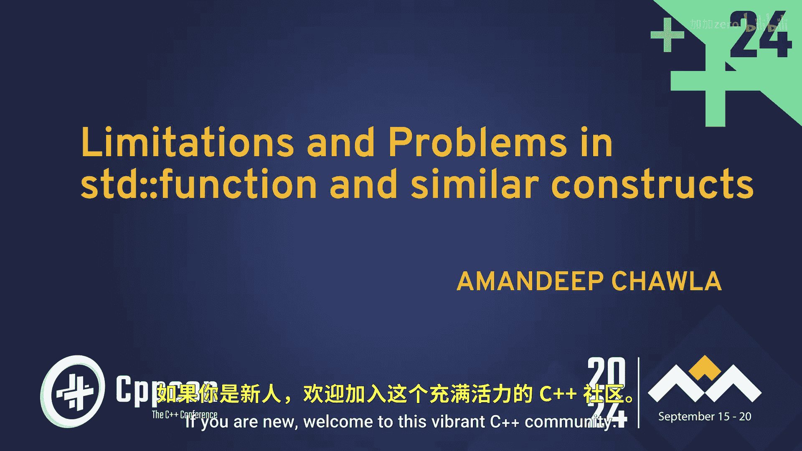
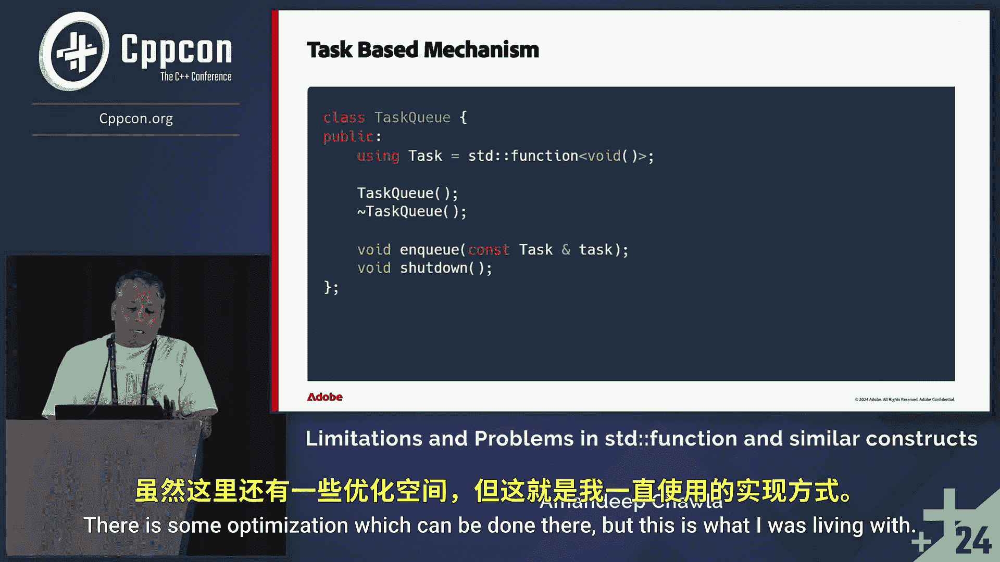

# C++开发教程：第1章：std::function的局限性与问题 🧠




在本节课中，我们将探讨C++标准库中`std::function`及其类似构造的局限性。我们将从实际开发场景出发，分析其潜在的性能开销，并了解如何识别和解决这些问题。课程内容基于大型跨平台应用开发的经验，旨在帮助初学者理解这些高级概念。


## 概述

`std::function`是C++中用于包装可调用对象的强大工具，广泛应用于任务队列、回调机制等场景。然而，它在提供灵活性的同时，也带来了某些不易察觉的开销。本节将深入分析这些局限性。

## Lambda表达式基础

在深入`std::function`之前，我们需要理解Lambda表达式。Lambda是匿名函数，可以在使用点定义，使代码更简洁可靠。

以下是Lambda的基本示例：
```cpp
auto lambda = []() { /* 函数体 */ };
```

### 捕获方式与影响

Lambda可以捕获外部变量，捕获方式（按值或按引用）会影响其行为和大小。

我们使用一个工具类来观察背后的操作：
```cpp
class Instrumented {
    // ... 省略具体实现
    // 移动构造会改变ID，拷贝构造会记录拷贝
};
```

#### 按引用捕获

以下代码演示了按引用捕获：
```cpp
Instrumented a(“A”), b(“B”);
auto lambda = [&a, &b]() { /* 使用a和b */ };
lambda();
```
**输出结果**：无拷贝或移动操作发生。Lambda的大小为两个指针的大小（在64位系统上为16字节）。

#### 按值捕获

如果将捕获方式改为按值：
```cpp
auto lambda = [a, b]() { /* 使用a和b的副本 */ };
lambda();
```
**输出结果**：会发生两次拷贝操作（分别对`a`和`b`）。Lambda的大小变为两个`Instrumented`对象的大小之和（例如64字节）。

## Lambda的局限性

尽管Lambda非常有用，但它存在一个关键限制：每个Lambda表达式的类型都是唯一的、未命名的闭包类型。

这意味着：
*   它们**不能**直接作为类的数据成员。
*   它们**不能**直接存储在标准容器（如`std::vector`或`std::queue`）中。
*   在需要统一类型的任务调度框架中，无法直接传递Lambda。

为了解决这个问题，我们需要一个类型擦除的包装器，这就是`std::function`的用武之地。

## 引入 std::function

`std::function`是一个多态的函数包装器，它可以存储、复制和调用任何可调用目标（如函数、Lambda、绑定表达式等）。

其基本声明如下：
```cpp
std::function<返回类型(参数类型列表)> func;
```

### std::function 的开销

上一节我们介绍了使用`std::function`的必要性，本节中我们来看看它可能带来的开销。主要开销来自以下几个方面：

以下是使用`std::function`时需要注意的关键点：

1.  **内存分配**：如果捕获的可调用对象大于某个阈值（通常是一个或两个指针的大小），`std::function`可能会在堆上分配内存来存储它。这会导致动态内存分配的开销。
2.  **类型擦除**：为了实现多态性，`std::function`使用了类型擦除技术。这通常涉及通过虚函数表进行间接调用，比直接调用函数或Lambda有额外的开销。
3.  **拷贝成本**：拷贝一个`std::function`对象可能意味着拷贝其内部状态，如果状态在堆上，则可能涉及深拷贝。

### 实际场景中的影响

在一个跨平台的应用架构中（例如包含主机应用、服务提供者和核心模块），任务队列被广泛用于线程间通信。服务模块不被允许自行创建线程，而是由主机应用提供任务队列。

典型的任务队列接口可能如下：
```cpp
void postTask(std::function<void()> task);
```
当大量的小任务被提交时，`std::function`潜在的内存分配和拷贝开销可能会在资源受限的平台（如移动设备）上成为性能瓶颈。

## 解决方案与模式

认识到问题后，我们可以探索一些解决方案和优化模式。

### 1. 使用小缓冲区优化

一些实现（或自定义的函数包装器）会采用“小缓冲区优化”技术。它在`std::function`对象内部预留一小块内存，如果可调用对象能放入这块内存，则直接存储在其中，避免堆分配。

### 2. 传递轻量级可调用对象

尽可能设计捕获状态很少的Lambda，使其尺寸小于`std::function`内部缓冲区的大小。

### 3. 使用模板接受任意可调用对象

对于性能关键的代码路径，可以考虑使用模板来接受任意类型的可调用对象，从而避免类型擦除。但这会牺牲一些接口的通用性。
```cpp
template<typename Callable>
void postTaskTemplated(Callable&& task) {
    // 直接转发调用，无类型擦除
    std::forward<Callable>(task)();
}
```

### 4. 自定义函数包装器

在极端情况下，可以针对特定用例设计自定义的、开销更低的函数包装器。

## 总结

本节课中我们一起学习了`std::function`在C++开发中的角色及其局限性。我们了解到：
*   Lambda表达式虽然灵活，但其独特类型限制了在容器和类成员中的直接使用。
*   `std::function`通过类型擦除提供了统一的包装接口，但引入了潜在的内存分配、间接调用和拷贝开销。
*   在构建高性能、跨平台的应用时，特别是在资源受限的环境中，需要警惕这些开销。
*   通过采用小缓冲区优化、设计轻量级捕获、使用模板或自定义包装器等模式，可以有效缓解这些问题。



理解这些底层细节有助于我们做出更明智的编码决策，编写出既高效又健壮的C++代码。