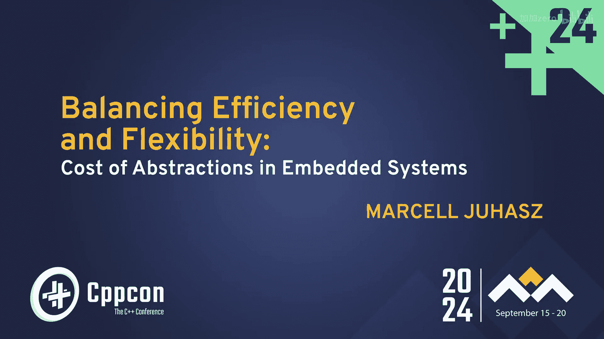
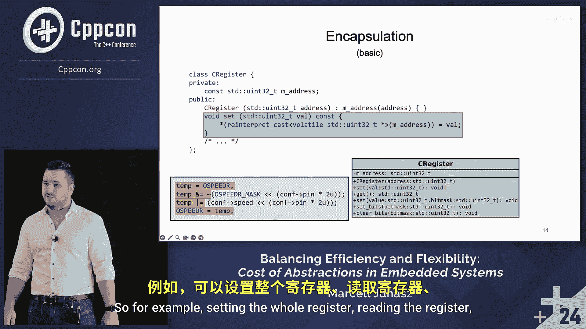

# CppCon【中英⚡CppCon 2024】 p16 P17 Cost of C++ Abstractions in C++ Embedded Systems - Marcell Juhasz - CppCon 2 -BV1NHEEzdE92_p16-

Okay， I think we can start。 So hello， everyone。 I am Mar Sauas。

 Welcome to my presentation about the cost of abstractions in embedded systems。

Let's start with a brief introduction about myself。 So earlier this year。

 I graduated with a master's degree from the Vienna University of Technology。

And I have been working with C plus+ for over six years now with the main focus on embedded systems in the last couple of years。

 My primary interest lies in applying C plus plus in resource constrained environment。And。

Here you can see my contact information。 And if you find this presentation interesting。

 then the whole project that LED to it is available on my Github。 so feel free to check it out。

I work at T engineering as an embedded software developer。

 We are a global innovative service provider。 We transform the ideas of our clients into business models and products。

 So if you need help with any project， or if you're just simply interested in collaboration。

 then here is some contact information as well， feel free to contact us。

So that was my motivation for doing this research and for preparing this talk。

 Since this is a C plus plus conference， most of you will probably agree with me when I say that C plus plus offers a lot of powerful numbers that I features。

There are some that we， as embedded developers， could not really live without。

 There are others that we are not really allowed to use。

 and then there are a bunch of other features， some of which are often debated in the community。

Everybody has their own opinion and some people say that C is as efficient as it gets。

 and that C plus+ comes with inherent run time overhead caused by the abstractstructions。

And there are people that say the exact opposite。 So sometimes it is hard to decide which features we。

We are allowed to use and which ones we should avoid。 So to clear up the misconceptions。

 I went ahead and investigated the topic。And I gained valuable insights by doing this research。

 and I hope that this presentation will provide you with some valuable knowledge as well。

If we are talking about embedded systems， then one thing is clear that one of the most important factors is overhead overhead in terms of memory usage and runtime performance is both the available memory and execution times can be limited resources。

So first and foremost， it is imp important to clarify that the topic will be discussed from an emed systems point of view。

 So I want it to go as low level with C plus plus as possible。

 and I want to analyze the effects of abstractions as close to the hardware as possible。

 So for that reason， I will primarily be focusing on the hardware abstraction layer as this is the layer that interacts directly with the microcontroller。

We will see how a traditional hardware obstruction layer is implemented。

 We will find suitable places for the obstructions to be integrated in the code base。

 and then we will analyze their effects at the lowest level possible。

 We will primarily look at encapsulation， inheritance and polymorphism。

But we will also identify the inefficiencies present in the current hardware abstraction layer implementations。

 and we will see methods that can help us to deal with these inefficiencies by leveraging some of C plus plus's more advanced features。

I would also like to talk to you a little bit about the methodology。 So the setup。

 the workflow and the metrics of the measurements that I used to put together this presentation。

It's probably not a surprise to that I started out with the source code。

 I implemented some functionality in C using the provided hardware abstraction layer。

 And then I introduced C plus plus abstractions to the code base。By keeping the functionality。

 of course， I cross compile the projects for an STM 32 microcontroller。 I optimized four size。

 as it is often a limited resource。In this step， I could also measure the compilation time as well。

 And assessing the size of the binary of acomped project is pretty straightforward。Then on one hand。

 I went ahead and I analyzed the disassembled binary。

 I wanted to see what actually gets executed on the microcontroller。 And this way。

 I could assess the runtime performance in an analytical way。And forget gettinging empirical results。

 I flged the target。 I executed the firmware， and I measured the execution time on the target。Now。

 I will be primarily focusing combine size and runtime performance。

 as these are the two resources that are often limited for certain embedded systems applications。

There are devices with as low as 16 kB of flash memory or probably even lower。

 and as for runtime performance。There might exist some real time constraints for certain projects。

 but even if such requirements are not explicitly stated。The still， very often。

 the shortest possible reaction time is still required。So before we jump into the main topic。

 I'd like to。Just briefly introduce the concept of the base firmware。

 which will serve as a basis for comparison for both the binary size and the disassembled binary。

 So I simply defined the base firmware as the absolute minimal embedded project consisting of nothing but main function with an empty infinite loop。

But embeddedbody developers probably know that the main function is not really the entry point of a firmware application。

 So the first thing that gets executed is the startup script。 This is usually written in assembly。

 and it is responsible for defining the vector table for setting the stack pointer。

 copying data between flash and Drm， Iizing global and variables， calling static constructors。

 and then eventually calling the main function。The third important。

Piece of the puzzle for a base firm where is the in script。

 which basically just specifies the memory layout of the application。Now， as you can see。

 there are a couple of things that are happening even before the main function is called。

 And even so with an empty main function that basically does nothing。

 we are already around 2 kB in binary size for both C and C plus plus。

So before we can start and build layers of abstractions。

 we need to find a suitable place for the abstractions to be meaningfully integrated in the code base。

For that， I would like to just briefly introduce you how the current hardware obstruction layer is implemented。

 So just to summarize it briefly， the hardware abstractstruction layer provides data structures。

 and we as developers can instant and populate these data structures according to the necessary configurations that we want to apply。

And then we can use these use these populated data structures to call the functions of the hardware obstruction layer。

 and these functions take our input parameter parameters。 They do some validation。

 and then they branch off the to execute the necessary。Computs。

 and one of the most important things that the hardware abstractstruction layer does for us is that it abstracts the complexity of the required。

Register operations。 So as you can see， a hardware obstruction layer is full of such register operations。

 And for every register operation， the hardware abstractstruction layer calculates some kind of a bit mask to clear or set bits in the registers。

So now that we have an idea of what we are dealing with。

 let's jump right into the main topic of the presentation， building layers of abstractions。

Now as we have seen before， the heard abstractstruction layer is full of such register operations。

 and if you look at this registered operation， we can identify at least two places where obstructions can be meaningfully integrated。

If you look at this part of the register operation， we can see that this is the the generic part。

 It simply handles the bit manipulation of every register。Independent of its type。

 And then if we look at this second part of the register operation。

 this is the register specific part。 This is the one that handles。

 the bitmask calculation for the register operations。

 and this part must know the meaning of every bit in the register。

And it also must should provide meaningful member functions to interact with the underlying register。

So if you want to analyze the effects of an obstruction。One key factor is that we want to。

Modify as little as of the original code base as possible。

 So keep the original code base untouched and then introduce。

And the abstractstructions in as little code change as possible。So let's start with encapsulation。

 meaning classes we have seen in the previous slide with the register operations that there are the generic register operation part and the register specific part。

 which both of which we can meaningfully encapsulate。 So represented it as a UL diagram。

 the class hierarchy would look something like this。

 It's just an overview there is these C register class which implement the common generic register behaviors。

 and then there are these register specific classes which implement the unique register specific behaviors。

Now， I want to show you just。AndSwiftly an implementation。

 it's a simple example implementation so that we all understand what I'm in here。

 Let's start with the C register class。 As I have said。

 this is the class for the basic register operations。

 Every register is mapped into memory so every register must have an addressing memory so that they can be accessed via a simple memory access operation。

In this case， this is told with a private member where able to an unc integer。

So this is the class that implements the generic register behavior。

 So this provides member functions that allow us to interact with every register in a common way。 So。

 for example， setting the whole register。

