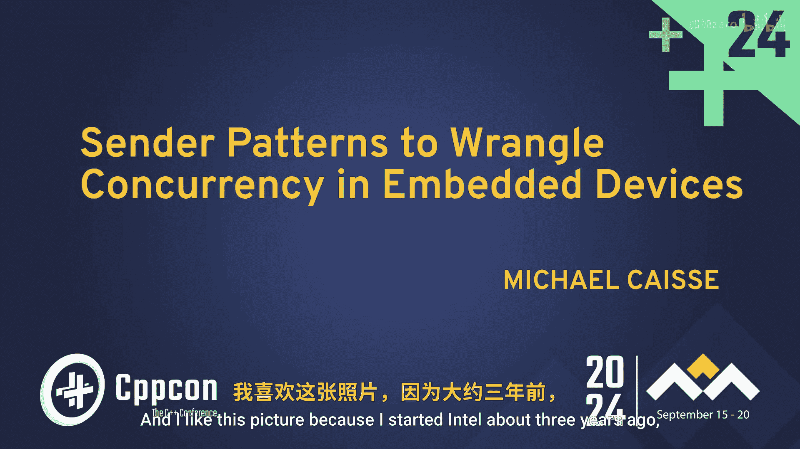
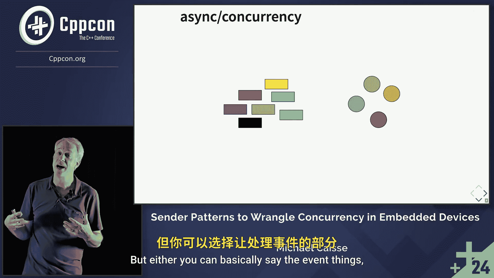

# CppCon【中英⚡CppCon 2024】 p18 P19 C++ Sender Patterns to Wrangle C++ Concurrency in Embedded Devices - Michael -BV1NHEEzdE92_p18-

My name is Michael Case。 I work at Intel， and I like this picture。

Because I started it until about three years ago。 just under three years ago。

 This is a lunar Lake wafer。 It's the first device that I got to work on。

 And so in semiconductor world， you work on something and then like five years later。

 it shows up So the public sees it。 And I'm very excited about this。

 because it also is running software that I wrote。 So let's talk a little bit about some of the constraints and problems inside of embedded world。

 I work in a group that deals with power management。

 So getting the device up or the first thing to boot up。 Nothing else is up or running。

 There are hundreds and hundreds and hundreds of things on on the chip。

 many of which you know about many more that you don't。

 And they all have to be sequenced and brought up at a certain particular time。

 And then during runtime， it'd be nice if your YouTube video continued to run for a long period of time。

 You got to finish your movies。 And so we handle power management during during that time， too。😊，嗯。

So our programs don't end。 if our program ends， your CPU is shutting down。

 So you don't want it to end。 So we live in an environment。 And once things start up。

 They just continue to work。 We don't use exceptions。

 We live in a world where we don't have dynamic allocators。 and we don't have an our toss。

 we've made the decision that bare metal is what we want。

 There are a lot of reasons that people might pick an ours， usually it has to do with。

 they want tasks and some type of primitives that allow coordination between tasks occurring。

These things can just happen without that。呃。In the past and as well as this time。

 the talk really is going to deal with this development board。 it's easily accessible by the public。

 All the code will run on this。 It is a an armbased core and it has a whole bunch of different GIO communication all over the place。

 lots and lots of complex timers， analog digital converters， digital analog converters。

 these devices are， you know pennies and you can just get tons of them and they're fun to play with and you can do a lot of stuff with them。

 the thing is they are very complex。 And when I say a timer。

 the timers are incredibly complex timers， take a look at a previous talk of mine and kind of get an idea of that。

 But when we start thinking about how these devices work， all of these things internally。

 all these different mechanisms that are trying to perform some task。

 need to be serviced in some way they either have。Data for you。

 they want to get service in some some manner。 And the way we deal with that is with interrupts。

 interrupts for our conversation right now， we're just going to think about at the moment。

 as if it's a hardware line coming into the device。 and that hardware line will become active。

 when it becomes active。 we might be in the middle of an instruction。

 So once the instruction completes， then we will go ahead and enter into our interrupt service routine。

 how that occurs is for this particular CPU， it understands that it needs to save some stuff off。

 So it takes care of that。 that's the gray。 it's going to take care of saving some registers off。

 And then it figures out that it needs to jump to a location。

 and that's based upon some vector table that's loaded in memory。 and it says， oh。

 this is the address where I'm going go and I'm going to just start running。

 So it's going to just start running some code at that location。 And when it's done。

 you say that you're done and go ahead and the CPU itself or。Or in this this case。

 we' restore the registers that is saved off， and then you can continue on。

So interrupts are this really great way to basically change tasks。

 And so you can write task managers on top of them。

 You can use them in order to figure out what's going on with hardware。

 There are lots of great purposes with interrupts。Interrupts have different priorities。

 lower priority numbers are higher priorities。 So number 0 is the highest priority as the numbers increase。

 they are lower priorities。 And so if we haven't interrupt。 that occurs。

 We're in the middle of our main and this interrupt at priority 4 occurs。

 there's some amount of time that it takes for it to transition into your code。

 that's the saving the registers and as we're in the middle of processing this， if we ended up with。

Another interrupt coming in。Lost my clicker。I went to sleep。That's even worse。 All right。

 Pri 0 came in。 and priority0 is a higher priority。 And so we change context。 again。

 we save off the register set that we were in the middle of that gray part。

 We continue now executing the code， then we restore， and then we jump back down into priority 4。

 So priority 4， we're continuing on the green。 But meanwhile。

 while we're in the middle of processing that green priority， priority 4 interrupt。

 another priority 4 interrupt came in。😊，And now it's just saved in the we're gonna do that a little bit later as soon as we can get to it because we're in the middle of a4 already。

 So you can't preempt that。 And you'll see that there is a very small line in between。

 But there's no gray bit that we have to restore registers because there's nothing to restore at that point。

 We can continue on。 And then we fall back into domain。

 So this is the basic idea of how interrupts work。 We're going to utilize those quite a bit。 Now。

 we have an exercise。Before I share the exercise。Ben didn't know was happening。

 but he's smiling because he's very clever。 So I work with Ben Dean。 Ben Dean is a very。

 very smart man。 so smart。 I haven't actually quite determined where the boundary is yet。😊。

And I thought you might be able to help me today。All right，We need four volunteers。

 two of which I'm just going to pick because I want to pick。So Neil， congratulations。

 you get to be volunteer producer number one。 Allright， Harold， you can be volunteer number two。

 producer number 2。😊，Alright， I need a， I need a client， one and a client 2。

 Any volunteers for being clients。here we go， Ian's going to be client one and in the back。

 client two， all right， now some ground rules here just so that you know up front what you're going to need to know。

 your protocol is one in which you give all of the characters in reverse order。Okay， unfortunately。

 Ian likes to have things spelt out in proper order。 Okay， not reverse order。 Do you understand。

 Okay， playing the role of the proxy today。And the coordinator of all this will be Ben。 Thank you。

 Ben。🤧。It ends up that if you calculate a number， you can't just send the number over。

 You have to send digits one at a time。It ends up， though。

Your client in the back would like to receive the data just as a number。Alright， okay。

 how this is going to play out is I'm going to move to the next slide in which we're going to find out that the producers of the data have already received their messages simultaneously from Ben because he is proxying the clients。

 And now they're going to try to figure out what they have to do with their messages and then just shout out Al right。

 and then in your very best tron voice。 when you get to the end， you just say in the blind。 Okay。

 You got that。 you not to shout it out， though。 I'm losing my voice like I'm not gonna to shout。

 all right， everybody understand the roles，1，2，3， go。😊，As quick as you can， just yell it out。

Just yelled a bin。And one。You whispered it？What are you whispering for。

 Oh You got to start all over E L B，1 end line，0。In divine。Ben's very confused。

There'sB need you had your instructions， I think we found the limit of bin， perfect。All right， okay。

All right， so we understand， and I actually thought he was he got it。I was going add a third person。

 know， a third route。 that would have been maybe better。 Yeah， then we eventually。

 maybe each time I'm gonna to play this game。 We'll figure it out So this Ben had basically has one core。

 right， He's only able to talk， at least He's got to serialize the data。 He has some problems with。

 you know， Harold is bringing in sending data。 Neil sending data and Ben is trying to take these inputs。

 and and he has to bring them together in different spots。 He can't mix them up。😊。

And this is what concurrency is about with asynchronous systems。

 We have different events happening in our system， and we have to marry those up with the data segment that they belong to。

Does that make sense， right？ Like that， that is the problem of concurrency。

All these things are happening， but they need to get to the right piece of data storage。

 And so there are two different ways to approach this。 Well， there are a lot of different ways。

 But either you can basically say。

