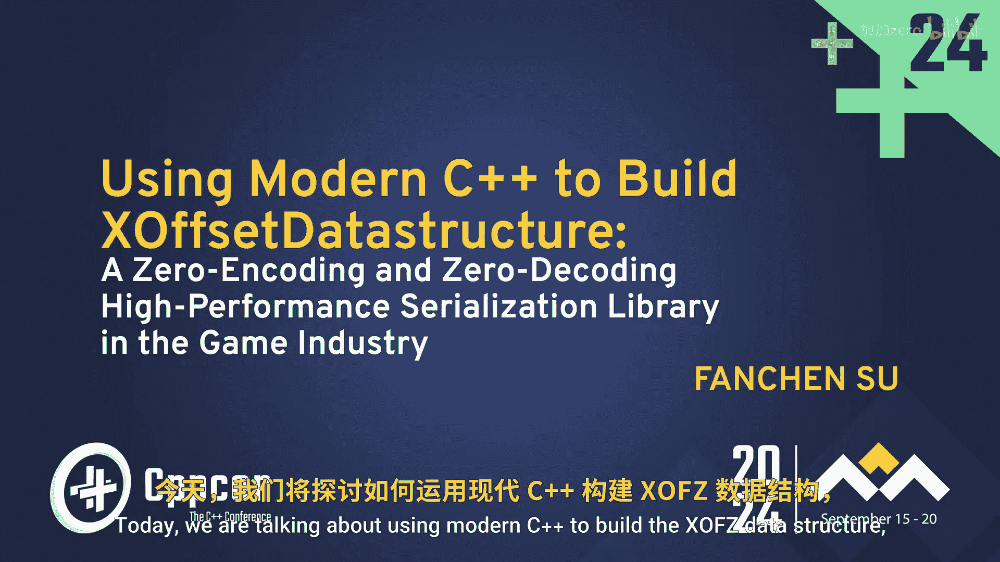
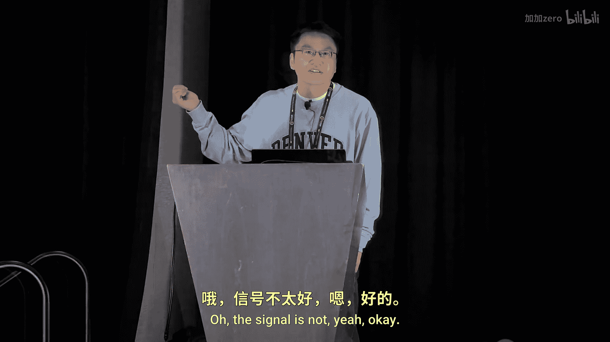
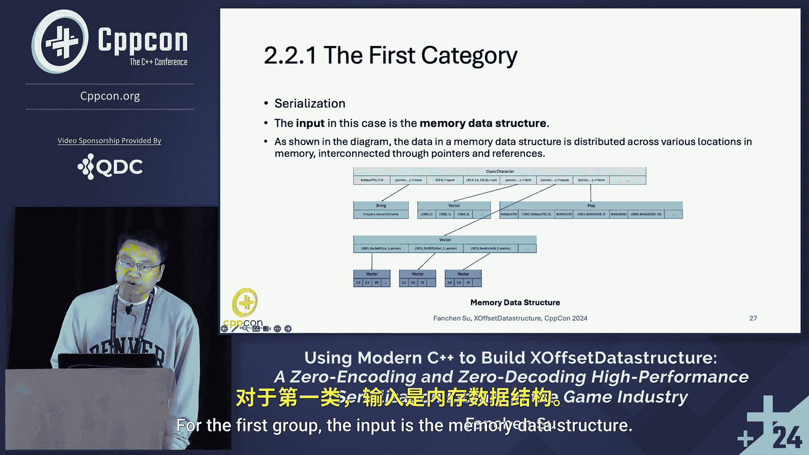

# C++ 现代编程：第 1 章：构建 XOffset 数据结构 - 零编码与零解码高性能库 🚀

在本节课中，我们将学习如何使用现代 C++ 构建一个名为 **XOffset** 的数据结构库。这个库的核心目标是实现**零编码**和**零解码**，从而在游戏开发等高性能场景中实现极速的数据移动。

---

## 1.1：标题解析与核心概念

上一节我们介绍了课程概述，本节中我们来详细解析项目标题，理解其中的核心概念。

标题包含了三个关键要素：
1.  **我们做了什么**：为游戏行业创建了一个名为 **XOffset** 的卫星库。
2.  **我们为何这么做**：为了实现**高性能**，这对游戏应用至关重要。
3.  **我们如何做到**：通过使用**零编码**和**零解码**技术，移除了不必要的处理步骤。

以下是标题中三个核心概念的详细解释：

### X 在 XOffset 中的含义
X 代表 **Extreme（极致）**。这体现在两个方面：
*   **设计上**：我们的目标不是渐进式优化（保持 O(N)），而是追求从 O(N) 到 O(1) 的**飞跃式改进**，这能带来效率的极大提升。
*   **实现上**：我们改进了数据处理和管理方式，确保每一步都具备高性能。简而言之，X 代表我们对设计和实现中极致效率的承诺。

### Offset（偏移量）的含义
我们使用**基于偏移量的指针**，而不是原始指针。这种方法使我们能够创建**可内存拷贝**的数据结构。这一点非常重要。

想象一个拥有数千名玩家的大型游戏世界。单个进程无法处理所有负载。因此，我们将世界划分为多个小区域，每个区域由自己的进程管理。当玩家在这些区域间移动时，他们的数据需要被轻松、即时地迁移。

### 零编码与零解码
我们的方法很简单：
1.  **序列化时无需编码**：我们直接存储数据。
2.  **反序列化时无需解码**：我们直接访问数据。

结果是：更快的处理速度和更少的资源消耗。在游戏行业，性能至关重要，我们需要每个操作（包括序列化、反序列化、读取和写入）都快速运行。

---

## 1.2：项目动机与要解决的问题

现在我们已经了解了标题的含义，接下来谈谈我们创建 XOffset 数据结构的原因。

在本部分，我们将探讨项目背后的动机以及我们试图解决的具体问题。

### 序列化与反序列化的重要性
序列化是将数据结构转换为数据缓冲区的过程。这种转换允许数据在不同计算环境（甚至不同时间）中被恢复。我们将序列化与反序列化分解为三个部分：输入、处理和输出。

*   **输入**：序列化的输入是精心设计的数据结构，图中连接不同字段的线条代表了指针和引用，设计时兼顾了时间和空间效率。
*   **输出**：序列化的输出是一个数据缓冲区，它是一个扁平的、连续的数据块，用于存储和传输。
*   **处理**：处理过程涉及在结构化数据和扁平数据之间进行转换。序列化将结构化数据转换为扁平数据；反序列化则执行反向操作。

### 为何序列化如此重要？
以下是三个关键数据：
1.  一项研究发现，序列化/反序列化消耗了 Google 所有应用程序中 **12%** 的处理能力。
2.  另一项研究表明，大数据应用可能花费 **18% 到 90%** 的 CPU 时间在序列化数据上。
3.  在游戏中，超过 **20%** 的 CPU 时间花费在序列化/反序列化上，这直接影响游戏的运行流畅度。

### 游戏中的数据移动场景
在游戏中，我们需要在多个层面移动数据：
1.  **服务器与客户端之间**：例如，加载新场景时的玩家和 NPC 数据。
2.  **服务器之间**：包括不同服务之间的 RPC 调用。
3.  **数据迁移**：在游戏世界中的区域和线路之间迁移数据。

当单个进程负载过重时，我们会将世界划分为不同的区域和线路。一个区域是世界的一部分，由一个进程管理；一条线路是一组逻辑上的玩家，也由一个进程管理。这种划分有助于管理稳定负载并保持游戏流畅。然而，这也意味着我们需要在这些划分之间高效地移动数据。当玩家在区域间移动或切换线路时，他们的数据需要被快速序列化、传输和反序列化。

---

## 1.3：现有序列化方法概览

上一节我们探讨了项目动机，本节中我们来看看现有的序列化方法，它们主要分为两类。

以下是两类主要序列化方法的对比：

### 第一类：MessagePack 和 Protocol Buffers
这类方法的特点如下：
*   **输入**：接受结构化数据。
*   **输出**：生成编码后的数据缓冲区。
*   **处理**：在序列化和反序列化过程中，需要进行复杂的编码和解码操作。

### 第二类：FlatBuffers 和 Cap‘n Proto
这类方法的特点如下：
*   **输入**：接受结构化数据。
*   **输出**：生成扁平的数据缓冲区。
*   **处理**：访问数据时通常需要解码步骤。

我们的 **XOffset** 方法旨在结合两者的优点，并消除其瓶颈：**实现真正的零编码和零解码**，让数据像在高速公路上无阻塞地流动一样高效。

---

## 本章总结

本节课中，我们一起学习了构建 **XOffset** 数据结构库的核心理念。我们首先解析了项目标题，理解了 **X（极致）**、**Offset（偏移量指针）** 以及 **零编码/零解码** 的含义。接着，我们探讨了在游戏等高性能领域，高效序列化的重要性以及现有方法存在的瓶颈。XOffset 的目标就是通过创新的设计，移除这些瓶颈，实现数据的极速处理与迁移。在接下来的章节中，我们将深入其实现原理。