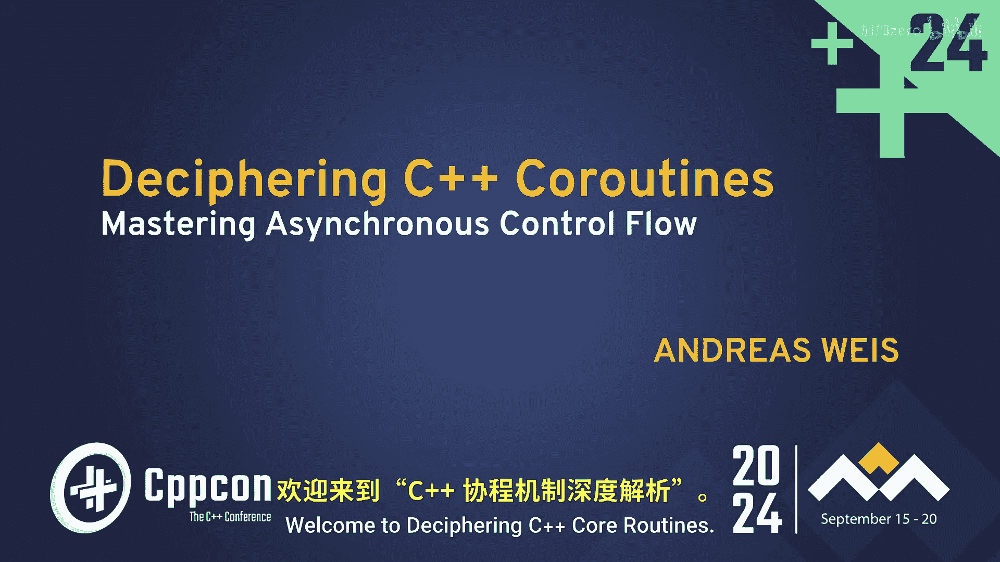
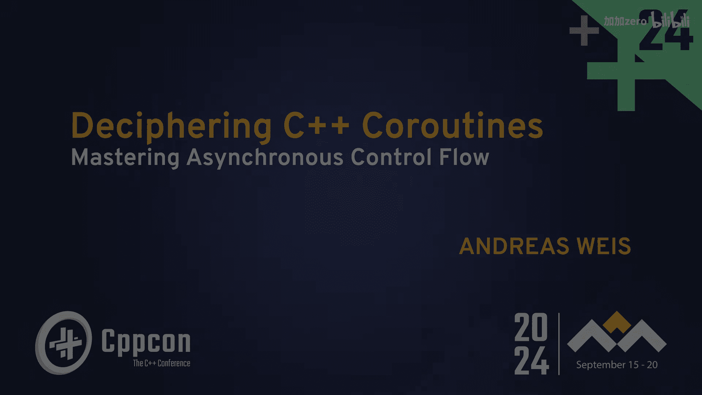
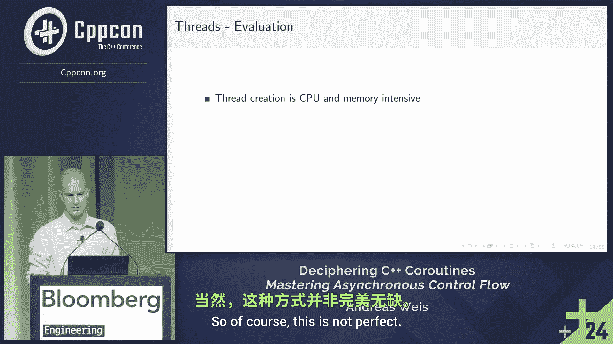

# C++协程解密：第二部分：掌握异步控制流 🚀


在本教程中，我们将深入探讨C++协程，特别是如何利用它们来实现异步控制流。我们将从第一部分的基础知识快速回顾开始，然后逐步构建一个用于异步操作的协程框架。通过本教程，你将理解如何将C++协程应用于异步编程场景。




---



## 第一部分：快速回顾与目标设定 🔄

上一部分我们介绍了C++协程的基本语言机制。本节中，我们将简要回顾这些核心概念，并明确本教程的目标。

C++协程本质上是一个可以中途暂停，稍后恢复执行的函数。其状态在暂停期间会被完整保存。

协程机制包含三个主要部分：

1.  **返回类型**：即协程函数的返回类型。这是一个用户定义的类型，定义了调用者与协程交互的接口。其设计空间非常灵活。
    *   代码示例：`MyCoroutineReturnType my_coroutine() { ... }`
2.  **承诺类型**：这是编译器侧的接口，用于定制协程启动和关闭时的行为。
3.  **可等待体**：同样是编译器侧的接口，用于定义协程挂起或恢复时发生的行为。任何可以与之配合使用的类型都是一个可等待体。
    *   核心操作符：`co_await`

自C++23起，标准库提供了 `std::generator` 这一协程返回类型，它允许函数中途生成值，并实现了范围概念。

本教程的目标是展示如何利用这些基础机制，构建类似其他语言中 `async/await` 模式的异步编程能力。我们将专注于单线程下的异步控制流，不涉及多线程。

---

## 第二部分：构建异步协程的心智模型 🧠

上一节我们回顾了协程的组成部分，本节中我们来看看如何将其应用于异步场景。

我们常将协程比作“协作式线程”。假设我们有一个复杂任务，它由多个函数调用链构成：外层函数依赖中层函数的结果，中层函数又调用一个执行I/O操作的内层函数。

最简单的实现方式是让内层函数使用阻塞式I/O。但问题在于，当内层函数等待时，整个线程都被占用，无法执行其他有用工作。

我们的目标是：当需要等待时，不是阻塞线程，而是**挂起**整个调用链，将其状态暂存。这样，主线程就可以在等待期间去处理其他任务。这就是异步协程的核心动机。

一种直接的替代方案是为每个任务创建新线程。但这会引入线程管理和同步的复杂性。协程提供了一种更轻量级的解决方案。

---

## 第三部分：设计异步任务类型 ⚙️

上一节我们明确了异步等待的目标，本节中我们开始设计一个具体的协程返回类型来实现它。

我们需要一个 `Task` 类型作为协程的返回类型。调用者获得这个 `Task` 后，应该能够启动它并等待其完成。

以下是 `Task` 类型的基本框架和其关联的承诺类型：

```cpp
struct Task {
    struct promise_type {
        // 协程启动时调用
        Task get_return_object() { return {}; }
        std::suspend_always initial_suspend() noexcept { return {}; }
        std::suspend_always final_suspend() noexcept { return {}; }
        void return_void() {}
        void unhandled_exception() { std::terminate(); }
    };
};
```

目前，这个 `Task` 在创建后即挂起，且没有提供恢复它的方法。我们需要为其添加存储和操作协程句柄的能力。

---

## 第四部分：存储与传递协程句柄 🔗

上一节我们定义了一个基础的 `Task`，本节中我们为其添加存储协程句柄的能力，以便后续恢复执行。

承诺类型需要存储其产生的协程句柄，而 `Task` 对象则需要持有这个句柄。我们修改代码如下：

```cpp
struct Task {
    struct promise_type {
        // 存储本协程的句柄
        std::coroutine_handle<> handle;
        Task get_return_object() {
            // 创建Task时，将承诺对象自身的句柄传递过去
            return Task{std::coroutine_handle<promise_type>::from_promise(*this)};
        }
        ... // initial_suspend, final_suspend 等保持不变
    };

    // Task对象持有一个泛化的协程句柄
    std::coroutine_handle<> handle;
    // 构造函数
    explicit Task(std::coroutine_handle<> h) : handle(h) {}
};
```

现在，当一个 `Task` 协程被调用时，它会返回一个持有其自身句柄的 `Task` 对象。但目前调用者仍然无法等待或启动这个任务。

---

## 第五部分：使Task可等待 ⏳

上一节 `Task` 对象持有了句柄，本节中我们让 `Task` 类型本身成为一个可等待体，这样另一个协程就可以使用 `co_await` 来等待它完成。

为了使 `Task` 可等待，我们需要为其实现 `await_ready`, `await_suspend`, `await_resume` 这三个成员函数。

```cpp
struct Task {
    ...
    bool await_ready() const noexcept { return false; } // 通常不准备就绪，需要挂起
    void await_suspend(std::coroutine_handle<> awaiting_coroutine) noexcept {
        // 当有人等待此Task时，我们需要保存等待者的句柄。
        // 但目前我们还没有地方存储它。这是下一步要解决的问题。
    }
    void await_resume() noexcept {} // 此Task不产生值，恢复时无操作
};
```

关键点在于 `await_suspend`：当协程A `co_await` 一个 `Task` B时，编译器会将协程A的句柄传递给 `Task B.await_suspend()`。我们需要一种机制，在 `Task` B完成后，用这个句柄来恢复协程A。

---

## 第六部分：连接等待链——简单的解决方式 🔄

上一节我们遇到了如何存储“等待者”句柄的问题，本节中我们先探讨一种简单直接的解决方案。

一个简单的方法是：让 `Task` 的承诺类型直接存储一个“继续执行”的句柄。当 `Task` 完成时，就恢复这个句柄。

```cpp
struct Task {
    struct promise_type {
        std::coroutine_handle<> continuation; // 新增：存储谁在等我
        ...
        void return_void() {
            // 协程完成时，如果有等待者，则恢复它
            if (continuation) {
                continuation.resume();
            }
        }
        ...
    };
    ...
    void await_suspend(std::coroutine_handle<> awaiting_coroutine) noexcept {
        // 将等待者的句柄存入承诺对象
        handle.promise().continuation = awaiting_coroutine;
    }
};
```

这种设计在简单链式调用时有效（A 等待 B，B 等待 C）。但它有一个明显缺陷：**它只能存储一个“继续”句柄**。如果一个 `Task` 被多个其他协程等待，或者我们需要实现更复杂的调度，这种结构就不够用了。

---

## 第七部分：引入调度器概念 🗂️

上一节的简单方案暴露了管理的局限性，本节中我们引入一个中心化的**调度器**来管理协程的恢复。

调度器负责维护一组准备就绪、可以运行的协程。当一个异步操作完成时，它通知调度器，调度器则决定恢复哪个（或哪些）等待中的协程。

我们需要修改设计：
1.  `Task` 不再直接恢复其等待者。
2.  当 `Task` 完成时，它将自己（或其代表的完成事件）提交给调度器。
3.  调度器根据策略（如FIFO队列）选择下一个要执行的协程并恢复它。

这更接近真实的异步运行时（如IOCP、epoll事件循环）的工作方式。`await_suspend` 的逻辑将变为：将当前等待的协程句柄注册到与异步操作关联的回调或调度队列中。

---

## 总结 📝

本节课我们一起学习了如何将C++协程用于异步控制流。

我们从回顾协程的三个核心部分（返回类型、承诺类型、可等待体）开始。然后，我们构建了实现异步操作的心智模型，目标是挂起等待中的调用链以释放线程。

接着，我们逐步设计了一个基础的 `Task` 类型，使其能够存储协程句柄并成为可等待体。我们首先尝试了一种简单的直接恢复方案，但发现了其在管理多个依赖关系时的不足。最后，我们引入了调度器的概念，这是构建健壮异步系统的关键，它负责管理协程的恢复顺序，解耦了操作完成与协程恢复之间的直接联系。



通过这个过程，你应该对如何在C++中利用协程构建异步编程抽象有了更深入的理解。真正的实现（如`cppcoro`、`Boost.Asio`协程支持）会在此基础上增加错误处理、内存管理、调度策略等更多复杂而必要的功能。