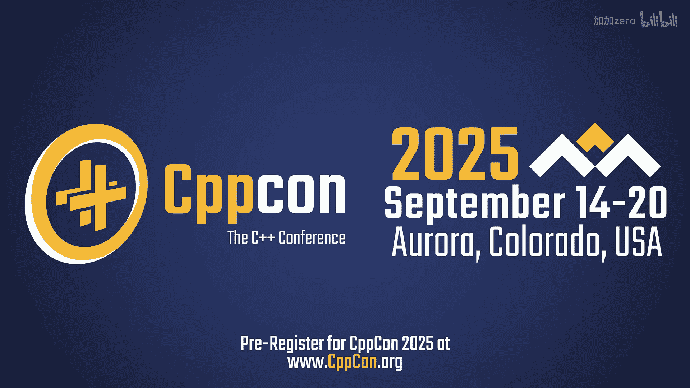
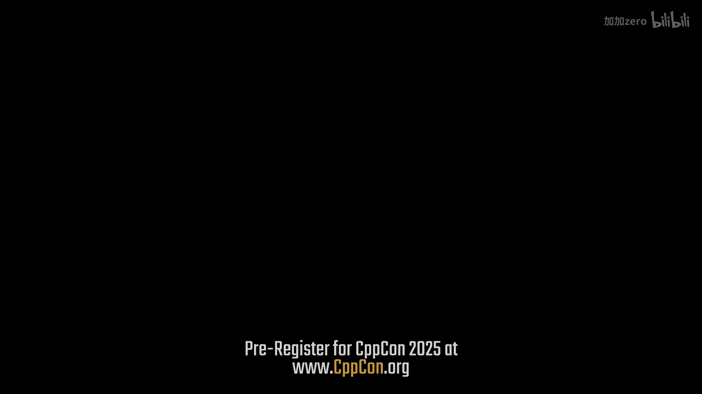
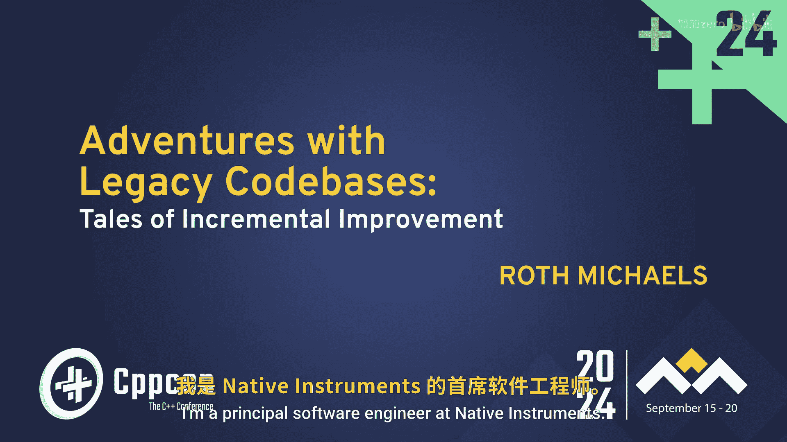
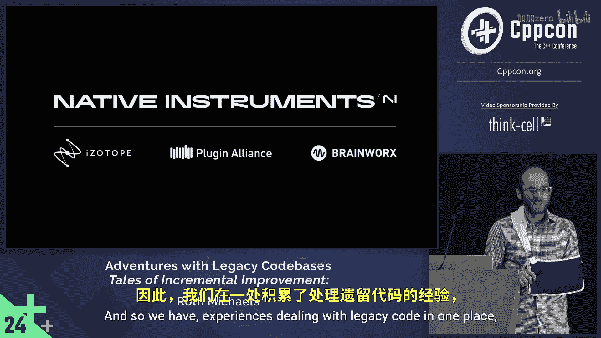
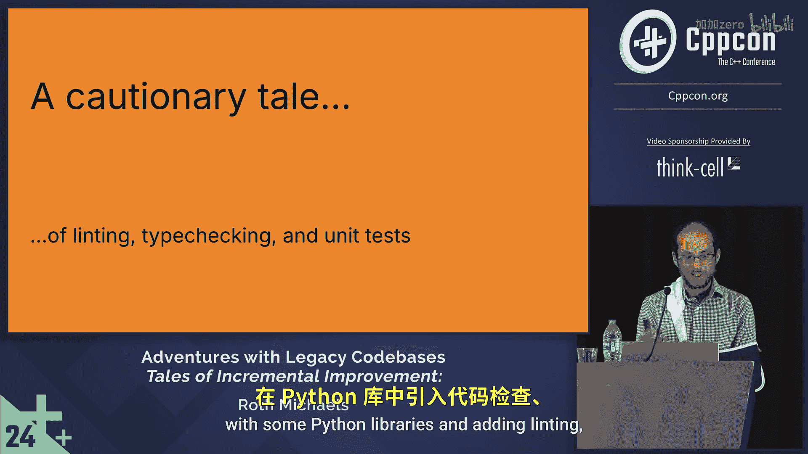
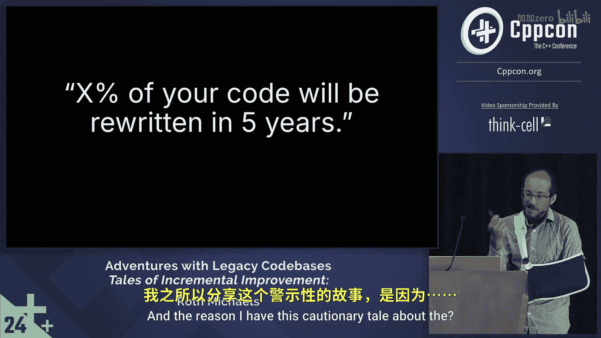

# CppCon【中英⚡CppCon 2024】 p24 P25 Adventures with C++ Legacy Codebases： Tales of Incremental Improvement - Rot -BV1NHEEzdE92_p24-

It's been pretty amazing to be kind of at the forefront at the cutting edge。

 to see all the luminaries in the field and you find out that these big names are just people with a lot of common interests that overlap with yours and who would only be too happy to talk with you about them。

。

I'm Roth Michaels， I'm a principal software engineer at nativeative Instruments and you might have heard me give other talks at CBVCon in the past Cl I worked at isotope a few years ago。

 native instruments， isotope and then the brainworks and plug Allance brands all kind of three big players in the digital audio space went through a merger and so that's kind of the big theme of today's talk is these are all 20 plusy old companies and so we have experiences dealing with legacy code in one place and then what do we do when we're pulling this all together so。

For those who don't know what native instruments and as to and brainworks are。

 we make hardware and software for music and audio production。

 So everything from mixing and mastering records， producing beats， DJ software。

 postproduction to clean up audio for film， television， radio and all sorts of things like this。

 And this picture here is showing some products existing within Apple's audio editor logic。

 And this is kind of another big part of our world is all we do make some applications。

 a lot of what we make are DLL plugins that run inside of somebody else's process and memory space with a bunch of other folks playing along。

 So that's often something that surprised the people when they hear about our industry。

 But that's not too much of a topic that we'll get into today。

 But you'll see later that our kind of experience with working this way LED to some of our code sharing techniques。

😊，So to finish off your Wednesday at CPcon， this is going to be a little bit light on code。

 there is non-zero code slides， but this is mostly story time where we're going to kind of go through a bunch of experiences of I had trying to improve our own legacy code base on the Boston side of things at isotope and then four different strategies we've played with for how to share code with three giant C++ code bases that range from 20 to 25 years old。

Before I get into that this is kind of something I like to do in the beginning of all my talks is encourage all of you to give a talk this talk today。

 like I said， it's story time， it's a bunch of interesting things I've discovered and worked with and things that worked and didn't work over the last few years。

 I'm sure many of you in the audience or listening online。

IPro have interesting stories to share that have happened either in your personal experiments or work。

 And if you've never spoken at a conference， I encourage you to think about trying it out。

 There's a lot of good resources for getting feedback on your proposals and also if you haven't signed it。

 it's probably too late this year， but the lightning talks are also another great way to dip your feet into things and just want to mention that my whole life isn in legacy code。

 one of my first talkscon was actually about getting to write new libraries。

 And so while we do get to write new libraries from time to time that are using the latest greatest C+ plus best practices and all that。

 we still have lots and lots and lots of old code that we're dealing with。😊。

Som going to ask for a little audience participation here。

 could anyone throw out and I don't need to go the mic， I'll repeat them。

 but some things that come to mind for you when you hear legacy code and what that is。Yes。

 code without tests。 I think that's my first bullet point。 on the next side。

 Anything else built under an old standard。Old standards， technical debt。In production。

Moonlithic game production， I didn't thought of that one， but that's。

I like that one as soon as it's in production， considering it legacy is good。

 Anyone else wants to throw something in my career。😊，Come from the beginning of your career。

No documentation， I think a lot of new code has that， maybe that comes out of the box legacy also。

So these are some of the things that were on my list。

 certainly not exhaustive but inspired some things we'll talk about， yeah， Si， no tests。Not always。

 but usually there's lots and lots and lots of code。 Maybe you don't even use it anymore。 All of it。

 you don't know。 likely very old， likely the authors might not be around anymore。

 so you might have huge libraries in your codebase that hey they work。 We know how to use them。

 but who wrote that code we don't know about when you see the to do comment from the founding CTO written 18 years ago。

 you have no idea， oh， does this actually matter or was this as a dream of his and no one cares about this anymore。

 So I mentioned standards working're old standard I think maybe even trickier one is a codebase that has been across many standards。

 I think it I up in Boston well before I joined， I think they were prec 98 for a little bit。

 and then went through all the transition。 So we definitely have many eras of code things in our codebase like one example is we have a capital con expert macro because I think one compiler had it and one didn't and so we did that。

 new and old styles。And I put that twice。 I think the second new and old is supposed to mean like programming paradigms。

Bad decisions from the past that might have actually made sense 20 years ago with the way the business and the software went then。

 But as things grown， they realized， oh， wow， we've got performance problems due to this。

 And not always， but possibly written by a less skilled engineering organization。

 If your company legacy code came from being a startup。

 they might have been fresh college grads have found this company and are just very new to C plus plus And over the years as they build up the business can hire more and more experienced people。

 the knowledge and skill level， the C plus at the company can rise。

 but that might mean you see some pretty weird stuff in your old code。

So I just wanted to put an aside on this。 This is something my colleague told me about on Monday。

 and since my talk moved up from Friday， I didn't have a chance to actually try this tool out。

 but he recommend this book to me your code is a crime scene for understanding how to look at legacy code。

 but there's a cool tool that comes with it called codemat that will apparently tell you things about your codebase。

 looking at the Git history like。How much your code is written by people that don't work at the company anymore。

 Or every time you change this class， you also change this function over here every time that happens。

 And then you could look at that and say， like， was that a good thing。

 Are these related for business reasons or。Is it just tight coupling that shouldn't exist。

 So I recommend you check out that tool。 I haven't had a chance yet， but it sounds cool。😊。

And just a disclaimer a few times throughout this talk。

 I might mention like doing things for business reasons when we make our engineering trade off。

 and obviously， not everyone might be in a business context and I to be working on open source。

 But really， what I mean is making engineering decisions that are going for the sake of you delivering value to your users as quickly as possible and being pragmatic about that。

 So you're not focused just on making the prettiest codebase you can make。

And another aspect if I've mentioned， you， lots and lots of code this is a slide I made for a presentation a number of years ago about just the Boston isotope side of the code base。

 and we see we're dealing with millions of lines of firstpart code that exist across all of our modern and legacy product lines and now that we're three merge companies。

 this could easily be few more millions of lines of code。

So before we go into talking about like some good strategies for dealing with legacy code。

 I want to tell you a cautionary tale of something I saw recently with some Python libraries and adding Liing。

 type checking and unit tests。

So internally， we wanted to update how we're dealing with our Python tooling。

 want to use poetry versus setup Pi， if you don't know what this means doesn't matter。

 pi product Ta files for restructuring stuff， but our default template for best practice for a new Python library。

 we were using that to roll out to old libraries and so this all of a sudden activated newlins or new type checking and actually pass those Ls and type checking you would have to change the code。

And some of these libraries are working fine on their own。 But introducing these newly changing code。

 I say half the time this modernization was done。 there was an unknown breaking bug that was introduced when these code changes happened。

 a similar one is I had a team a test automation team that wanted to have a goal of increasing test coverage on their tools。

 But instead of just having a mandate like， okay， we're gonna have tests on all new code。

 they actually went back to a bunch of easy small libraries and added unit tests there。

But those libraries are like single-purpose Uni style tools that probably are never going to get another feature again。

 They were。 We might not ever have a bug fix。 So why did you put that effort into making those changes。

 especially if you had to refactor to make something more testable。

 But if you actually that refactor really means you didn't change behavior。

 And that's actually very tricky to also do when you're testing so。

If you need to add more tests for stuff that doesn't have it。

 it's probably good to think about other at higher level testing。

 like acceptance testing to make sure you have some coverage because adding tests on tested code doesn't necessarily make that code right if you have to change something。

Another thing is， you， this is maybe putting a lot of effort into something that didn't matter putting testing on code or're not changing because on Benine and Ma Gooldt's podcast。

 I forget which episode， but one of them mention some thesis that over I forget what percent But they said over five years。

 a whole bunch of your code base is's probably gonna to get touched or rewritten and those are the parts you might want to care about modernizing and improving but the parts that are down deep in the guts that do their thing。

 hopefully it's correct， you know if no one's touching it。

 what is that extra test coverage are gonna give you。

 And the reason I have this cautionary tale about the。

You know that。