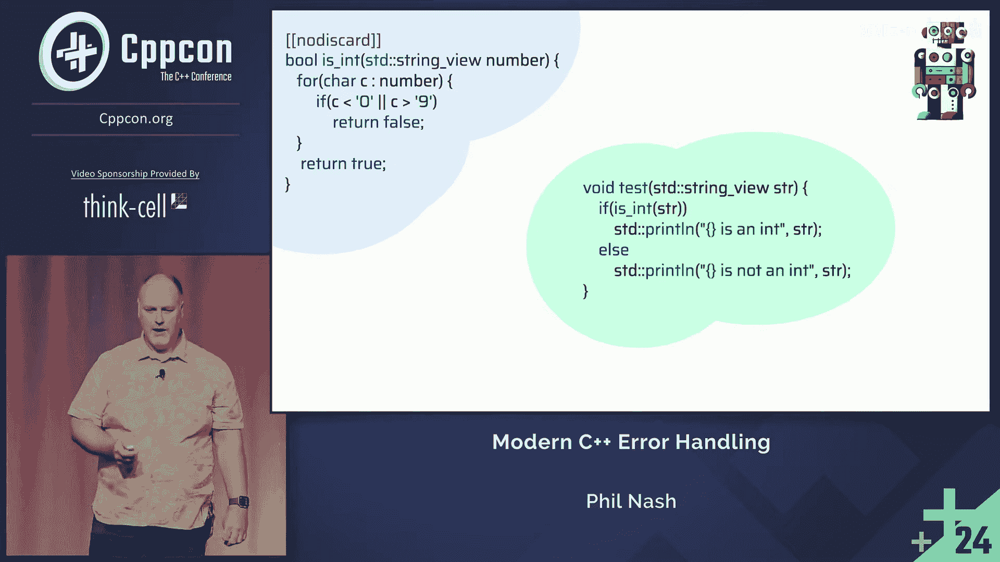

# 现代C++错误处理：第1部分：失望处理 😊


在本教程中，我们将学习现代C++中的错误处理技术。课程分为两部分：第一部分探讨“失望”处理，即针对可预测错误条件的处理；第二部分将讨论逻辑错误和契约。我们将通过一个将字符串解析为整数的简单示例，逐步介绍各种错误处理方法。

## 概述

错误处理是编程的核心部分。本节中，我们将专注于处理“失望”——那些可以预见、可以处理并从中恢复的错误条件。我们将从传统方法开始，逐步过渡到现代C++技术。

## 解析字符串为整数：初始实现

我们从一个简单的字符串解析函数开始。这个函数没有错误处理，仅作为后续讨论的基础。

```cpp
int parse_int(std::string_view s) {
    int result = 0;
    for (char c : s) {
        if (c >= '0' && c <= '9') {
            result = result * 10 + (c - '0');
        } else {
            break;
        }
    }
    return result;
}
```

这个实现有两个退出点，但只有最后一个返回完全解析的整数。它没有错误处理机制。

以下是调用该函数的一些示例：

```cpp
std::println("{}", parse_int("123"));    // 输出: 123
std::println("{}", parse_int("123abc")); // 输出: 123
std::println("{}", parse_int("abc"));    // 输出: 0
```

在某些情况下，“尽力而为”并继续执行可能是正确的做法。但通常，我们需要区分这些错误条件并采取适当的措施。

## 传统错误处理方法

上一节我们看到了一个没有错误处理的简单解析器。本节中，我们来看看一些传统的错误处理方法。

### 使用单独的函数进行验证

一种方法是使用一个单独的函数来验证字符串是否可以解析为整数。

```cpp
bool is_int(std::string_view s) {
    // 实现验证逻辑
    // 返回 true 如果字符串可以完全解析为整数
}
```

这种方法在某些情况下是有效的，但它无法区分不同类型的错误（例如，以非数字字符开头 vs. 中间包含非数字字符）。

### 使用错误代码

为了提供更多信息，我们可以引入错误代码。

以下是使用枚举作为错误代码的示例：

```cpp
enum class parse_status {
    ok,
    partial,
    invalid
};

parse_status parse_int_with_status(std::string_view s, int& out) {
    // 解析逻辑
    // 根据解析结果设置 out 并返回相应的 parse_status
}
```

这种方法允许调用代码根据错误类型做出决策，但它需要处理输出参数，并且组合性不佳。

### 使用输出参数

另一种常见模式是使用输出参数来返回结果，同时使用返回值表示状态。

```cpp
parse_status parse_int_out_param(std::string_view s, int& result) {
    result = 0;
    bool has_digits = false;
    
    for (char c : s) {
        if (c >= '0' && c <= '9') {
            result = result * 10 + (c - '0');
            has_digits = true;
        } else {
            break;
        }
    }
    
    if (s.empty() || !has_digits) {
        return parse_status::invalid;
    }
    
    // 检查是否完全解析
    // 简化：假设我们需要检查是否解析了整个字符串
    return parse_status::ok; // 简化版本
}
```

这种方法有效，但感觉不够现代，组合起来也比较困难。

## 现代C++方法

上一节我们回顾了传统错误处理方法。本节中，我们将探讨现代C++提供的更优雅的解决方案。

### 使用 `std::optional`

C++17 引入了 `std::optional`，它可以表示一个可能存在也可能不存在的值。

```cpp
std::optional<int> parse_int_optional(std::string_view s) {
    int result = 0;
    bool has_digits = false;
    
    for (char c : s) {
        if (c >= '0' && c <= '9') {
            result = result * 10 + (c - '0');
            has_digits = true;
        } else {
            break;
        }
    }
    
    if (!has_digits) {
        return std::nullopt;
    }
    
    return result;
}
```

`std::optional` 对于简单的“有值/无值”场景很有用，但它无法携带错误详情。

### 使用 `std::expected`

C++23 引入了 `std::expected`，它可以表示一个期望的值或一个错误。



```cpp
std::expected<int, parse_error> parse_int_expected(std::string_view s) {
    int result = 0;
    bool has_digits = false;
    
    for (char c : s) {
        if (c >= '0' && c <= '9') {
            result = result * 10 + (c - '0');
            has_digits = true;
        } else {
            break;
        }
    }
    
    if (!has_digits) {
        return std::unexpected(parse_error::invalid_input);
    }
    
    return result;
}
```

`std::expected` 提供了更丰富的错误处理能力，允许携带详细的错误信息。

## 错误处理模式比较

以下是不同错误处理方法的比较：

1.  **返回错误代码**：传统，明确，但组合性差
2.  **输出参数**：避免重复计算，但接口不够优雅
3.  **`std::optional`**：现代，简单，但错误信息有限
4.  **`std::expected`**：功能丰富，现代，支持错误传播

选择哪种方法取决于具体需求：是否需要错误详情、错误恢复策略、以及代码的组合性要求。

## 总结

本节课中，我们一起学习了现代C++中的“失望”处理技术。我们从简单的无错误处理实现开始，逐步介绍了传统错误代码方法，最后探讨了现代C++中的 `std::optional` 和 `std::expected`。这些技术帮助我们处理可预测的错误条件，使代码更加健壮和可维护。

下一部分中，我们将讨论逻辑错误和契约，这些用于处理不可预测的错误条件和程序中的bug。