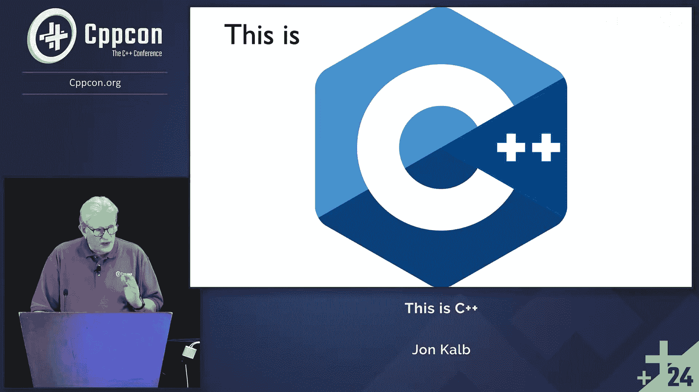
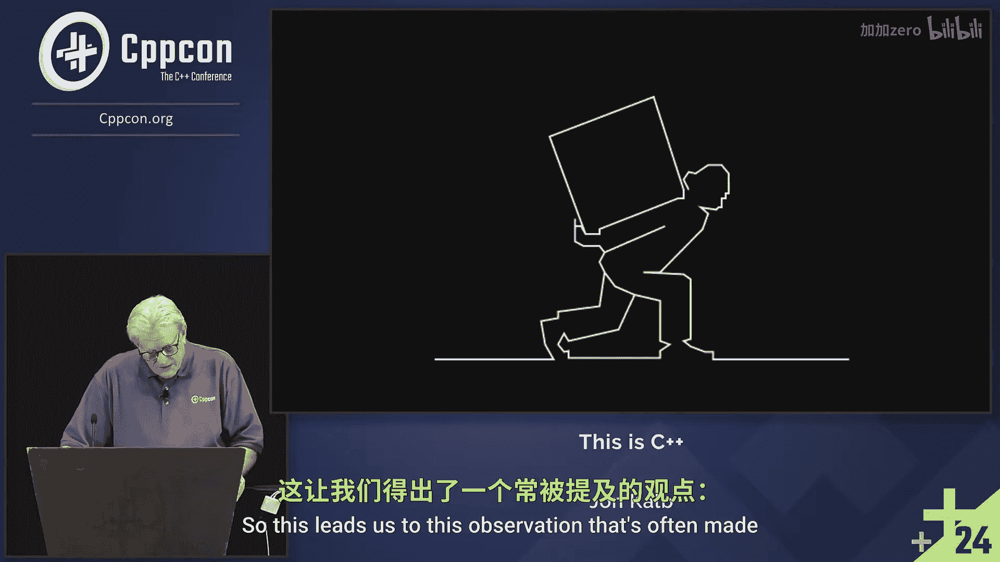
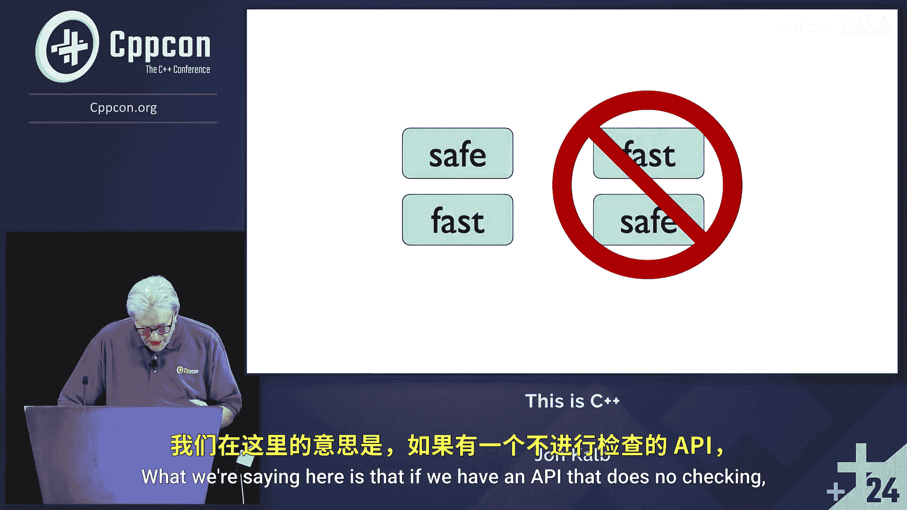

# CppCon【中英⚡CppCon 2024】 p27 P29 Moved-from Objects in C++ - Jon Kalb - CppCon 2024 -BV1NHEEzdE92_p27-

The great thing of becoming to CPPCon is you get to see many。

 many interesting people and many interesting problems that are solved。

All right， the title of this talk is this is C+ plus。

 and my expectation is that everyone in this audience already knows what C++ is。

I'm going to cover C++ from the point of view of what is C++4。

What is people trying to accomplish and how does it accomplish it？

Understanding this is important for two reasons。 The first is that we have a better understanding of how best to use C++。

 and I think that's why most of us are here。 We want to use C++ better。

 The second reason is that it helps us to consider how C++ should evolve。

 understanding what C++ is trying to accomplish， guides us in designing new language and library features。

In this talk， I'll explain what people's left is trying to accomplish and how it accomplishes it。

 I'll give some examples that illustrate this。I'll then consider something that I consider one of the most important points of controversy facing C plus plus today。

 And we'll see how that an understanding of the defining aspects of C plus+ illuminate that controversy。

 Finally， we'll discuss the implications of this insight for one of the biggest challenges the C plus plus community faces。

So the first question is， what is C++ superpower， And I want to answer the question。

 What is C+ plus superpower。 But before I tell you that， what I think the answer is。

 I want to explain that C++ has several superpowers， and none of them is unique to C++。

Some people might suggest that C+ plus superpowers might be flexibility， portability， expressiveness。

 etc cetera。 These are important。 But at its root， C+ plus superpower is。Uncompromising performance。

We try to design C++ to maximize flexibility， portability， expressiveness， safety， all these things。

 but never at the cost of performance。Why do we make this choice？Because this is C+ plus。

 that's the right answer。 Just shout it out。There一个。Allright。

 so when we're faced with a trade off between better safety at the cost of performance。

 we don't accept that trade off。Why not？Because this is C plus plus。 All right。

 members of the Standard Committee understand this。

 understand this and what's expected of C plus plus and that the definition of C plus plusquin quote have no。

 sorry。Leave no room for a lower level language。What this means in practice is that although we may add various features that provide us with high level abstractions。

 allowing us to reason about code at a high level。We don't add features that violate our zero overhead rule。

Now， sometimes this is misunderstood to mean that features must have no overhead。

 which seems to come from the name， but the zero overhead rule states that features when not used must incur no overhead and if used。

 must incur no overhead greater than what would be required to implement the feature by hand。

So how does C plus+ provide uncompromising performance。I think there are several ways。

 but I think the key one is。That the user's code is implemented directly with corresponding machine language instructions。

 if they exist。For example， if the user's code calls for adding two integers。

Then we implement this with the machine language instruction to add to integers。

 Division is implemented with an integer division instruction，1 exists。But you say。

 surely every language does this。 Well， not necessarily。 Let's look at these examples。

So they they illustrate what I'm what I'm talking about。

 These operations are implemented with single instructions。But let's look at the functions。

Are they safe。How about a？How could that fail？Integer overflow。

 And the same thing is true for multiply。 Now， we don't need to worry about integer overflow for divide。

 But what's the problem there， potential problem。Dividing by 0， right， Allright。

 So all of these functions represent some safety concern。So， our challenge is。

That what we'd like to be able to do is have C+ compilers generate code for ideally， all platforms。

That that be， that is efficient and can be generated efficiently on all platforms。

 unless there's a bug in the hardware， all the platforms are going to yield the same result for the non corner cases。

But different platforms will handle corner cases in different ways。

 So if all platforms behave the same way in corner cases， we would just define that that。

 that's the consistent behavior of what our language is。Of course。

 we could pick one behavior and then emulate that on platforms that don't support that behavior。

But the issue there is that part of the cost of emulating a particular behavior for corner cases is。

Doing so is going to slow down the non corner cases。

 That is the common cases would be inevitably slowed down by trying to emulate some type of behavior。

So in C plus plus， we don't define behavior in corner cases。

You could imagine a language that prioritized safety。

 defining some reasonable behavior for these cases。 For example。

 there might be a few options for what we might do in division by 0。 We might， for example。

 make the result be the maximum inature value。 It as close to infinity as we can get。

 right Okay we might throw an exception。 We might set some static error flag。

 There's a number of things we might do。The actual behavior turns out to not be important for this point because any kind of implementation is going to require us to have to make a test。

In all cases， to determine if this is the corner case。

So let's take a look at at what I've created here， this divivafe。

 So what it does is it returns the maximum value。 It's about the easiest possible way you could implement something that handles division by zero。

 But notice what the cost is。It produces twice the number of instructions。

 and there's there's a test in there。 These are performance killing。

 This is significantly more expensive because we added this safety。So keep in mind。

 what we're doing here is the simplest possible thing in the case of division by zero。

 We're not throwing an exception。 We're not setting some air flag。 We're just returning a constant。

But the cost is that there there's twice as many instructions with， with a branch。

 So rather than take this safe C+ plus approach， C++ opts for performance。

 Why do we take that option。Because this is C++。All right。

 now someone might point out that we don't always take this route。

 consider SDD vector the index operator， this provides element access without range checking。

 but in addition the standard library provides the at member function which provides the same service with range checking。

This is a rare case where C++ offers both a safe and an unsafe operation。🤧Excuse me。

 an unsafe option。So the important thing to note here。Is that in practice。Which one is used。

Almost always， it's the index operator。So if there were only one option offered。

Which option would that be， It would be the index operator。 It would be the unsafe option。

Why is that the option we would offer。Because this is C++ now。

You might argue that this is a false feeling a better performance。

Because it is a logic error to attempt to access an out of range index。Therefore。

 somebodys going to have to do the checking。 If we don't do the checking in the library。

 all we've done is shift the burden to the collar。

So we're not any better off。But that's not really the way it works。

 because it is possible that the call's code is going to do a number of different accesses on the same element。

We might do a couple of reads and then a write。 And in that case。

 we only have to do the range check once。For a number of operations， if we call the ad operation。

 it's going to do that range check every time。But it's even worse than that， because。

Most of the time we access a vector。We do it in a loop。

 and we've set the loop up in such a way that we're not going to have an out of range access ever。

 There's never a reason to do an out to do a range check。

 So if we have the range check in built into the operator。

 it's it's a waste of time every time in those situations。So this leads us to this operation。

 this observation that's often made that you can build safe on top of fast。

 but you can't build fast on top of safe。

Now， what does that mean， what we're saying？

