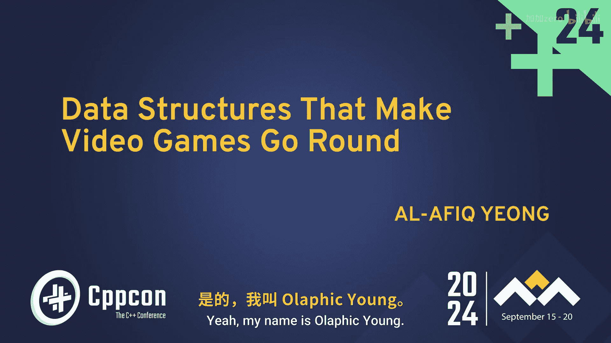
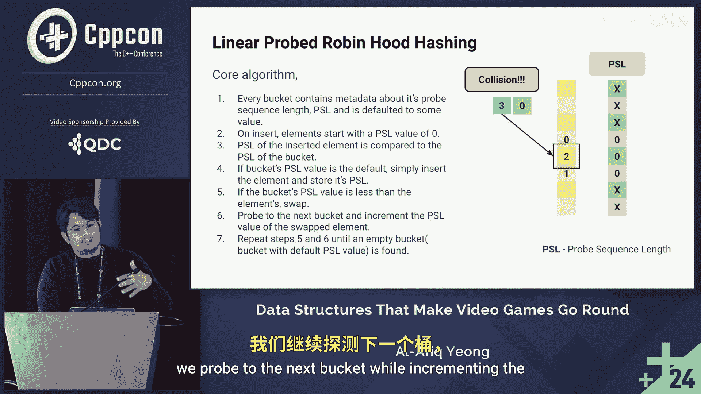

# CppCon【中英⚡CppCon 2024】 p28 P30 C++ Data Structures That Make Video Games Go Round - Al-Afiq Yeong - CppCon -BV1NHEEzdE92_p28-

From game development to high frequency trading， thanks to QDC， the Quant Develop Cer。Hello， hello。

 can everybody hear me？Okay cool yeah， my name is Algm。

 I have a Se systems programmer from Criitterion Games， we're a subsidiary of EA。

Working on battlettlefield， just a show of hands。 how many in the room is from the gaming industry。

Okay， quite a number， but not the entire room， which is good， right。

 so they can tell you stuff that you don't know about。So this is meant to be a more lighthearted。

 fun talk。 we're not going to see any code。It's the last session for the whole conference anyway， so。

It's going to be diagrams， animations。You，We're going to have fun。

And a more exciting title would be exposing the games industry， one data structure at a time。

But I imagine that， you know， my employer wouldn't be happy if they see this， so yeah。So let's begin。

 I'm going to start by just saying， you know， games are complicated。

If we take a look at the retro games from the perspective of the modern era。

The all games were fairly simple， they were 2D， 2。5 d right if you look at doom Doom wasn't even 3D。

 it was 2D with fancy map that you know fool us into believing it was 3D。

They were all mostly single threaded， oftentimes made from scratch， we know game engines。

They had short release cycle usually between one to two years and the code base is small by modern standards right I believe Doom Classic only had about 60。

000 lines of code out of those 60000 sorry， 60000 lines in total out of those 60。

000 lines there were only about 40，000 of them were code and if we compare to you know what we have in this modern era that's probably the size of a package or library。

Fast forward to today， if we look at AAA games， they're all 3D， you。

 with photoreistic physics based rendering。All of them are multi threadreaded。

 you can never run a AA game single threadily these days。Oftentimes maybe with a game engine。

 it would be impossible to make a AAA game without one， you know， it'll just take a really long time。

They have really long development cycles compared to the goal all days， you know。

 it's four to five years， anything less than that is a bonus， or they really had a good pipeline。

And they have large， complex code bases， right， oftentimes for their own reasons。But regardless of。

 you know， if the games， if the game is old or if they're new。

 the structure of the game is still roughly the same。If we take a look at the old games。

 they will look something like this。 you start the game， it goes through some initialization process。

You start the error handler job system， virtual file system， whatever， you know。

 once it's not initializing all of its systems， it goes into the game loop where the first part of the game loop is always listening for inputs from the message pump。

And then right after that， it goes through all of the gameplay systems， your AI， physics， animation。

 And once we were done with all of the simulation， we will package all that data and send it to the renderer where the renderer will then you know。

Compute the data that we send it over to and send it to the GPU so that we see fancy pictures on the screen。

And last but not least， there's audio。Because you， we want to hear stuff， right， when we play games。

And this basically repeats itself until the player has a bad day and quits the game。Now。

 fast forward to today， it's still somewhat similar。

 except most of these categories would have its own threat because of how high of a workload it computes。

We start the game， Thus all of the initialization goes into the game loop。

 the game the game loop in the main thread， we then just listen for inputs from the kernels message pump。

And then in the simulation category， we have a thread， runs all of the gameplay systems。

 Once it's done， packages all of that information and sends it to the renderer。

Fnderer then does all of its fancy stuff， maybe do some compute。

And there we see fancy pictures on the screen。B in audio and repeats itself until。

 you know the player has a bad day quits。So why am I telling you all of this well this is a data structure stock。

 but I can't tell you about the data structures without first going into some of the systems。

 give you context on what it's doing。And see the problem that they face， right， the system face。

 So we're gonna start off with initialization。In the initialization step。

 we first read through all of the environmental variables， we set up the error handler。

Boots up the job systems where we would。Spawn a thread for each of those categories。

 maybe spawn the worker threads as well。We would set up the resource registry。

 which is the system we're going to take a look at。Reads the boot data。

 and then once it's done reading the boot data， it's going to go into the game loop。

So why do we need a resource registry in video games Well。

 games are made with a lot of different types of assets， right， we have models， we have materials。

Textures， audio files。Behavioral trees for your AI systems and the resource registry acts as a place where we started。

 manipulate those data and also expose them to the system whenever required。Sorry。

 whenever never request it。And the way how the resource Regstry works is like this。

Whenever a level is streamed in， there is usually a resource bundle that is associated with the level。

 So whenever a level is streamed in， the resource bundle is unpacked and all of the data is kept in the resource registry。

And whenever a system requests a resource， it can request by some kind of identifier， it can be a UI。

 it can be a good。Or it can be a resource ID。So looking at this。

 we know that the resource registry needs some form of associative container to map the identifier to the resource。

And the most common associative container that is being used is。Still another map。

But synna map has a problem， it's a chaining hashmat and the way how it adds to the chain is with a linked list。

 there is a link list for each bucket in the array。

But we know that Nickckless isn't really cash rent。Right and also。

 especially when the under map has a really high load factor， there's a lot of pointer jumping。

So ideally， not we would like to not use the link this。The second problem with under map is that。

We see over here that the objects are widely distributed inside of their array。

That would mean that another map kind of has high variance by default， right。

 the objects are stored widely apart。So because of this。

 what most games companies use is instead some kind of open address hashm。

And an open addressing hasm is basically。A thirdnot map without the linked list part， right。

 is just a contiguous block of memory。This way we have better cash performance when we're iterating through the container。

And the most， and we resolve collisions by probing in the。In the contiguous block of memory。

Common probing methods are linear probing， quadratic probing， we can double hash。

 but the one that we're going to talk about today is Robin Hood Hasing。

Now you'll have to forgive me if my tongue twists and jumbles a little bit when I explain about Robin Hood Hashing because it's quite a difficult concept to explain。

 So the way how Robin Hood hashing works is like this。

You have a contiguous block of memory where that memory contains a bunch of bucket arrays。

Each bucket array is associated to some kind of metadata。

 which is the PSL short for probe sequence length。And the PL basically the PL of an object basically means basically means。

How much have the object probed from the initial bucket that it was supposed to be until the object found a place to be stored？

So it starts like this。We have an object。 with a keyo 0。 We hash the object。

Finds an empty bucket array starts it in， and because we didn't probe when we were inserting the element。

 we just keep the PSL value to0。Next， we have an object with a key of one。

 tries to insert it into the container， no collision， so we store it in the bucket array。

And because we didn't probe， we update the PSO value as zero。Then we have the next item of mine。

We tried to store it， hash the key， there is no collision。

And then we just store the element inside the bucket array while assigning the PO value to 0。

Then we hit our first collision， right， we tried to store an object that has a keyO3， we hash。

 tries to insert it into a bucket array， but it collides with a bucket array with a bucket that already has an element stored in it。

So when this happens， we need to introduce a variable called a local variable called for the probe sequence length。

And because this bucket already contains an element， we probe with the。

