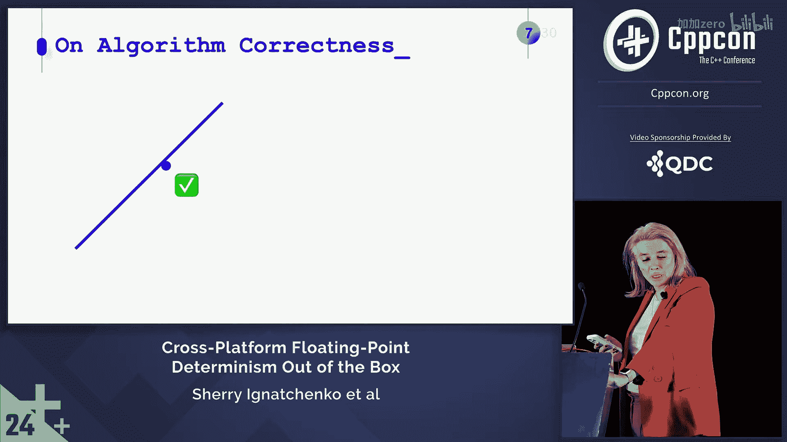

# C++ 跨平台浮点数确定性：1：概述与定义

在本节课中，我们将要学习什么是浮点数计算的确定性，以及为什么它在跨平台开发中至关重要。我们将从基本定义开始，探讨其重要性，并了解为何长期以来它被视为一个难以解决的问题。

## 什么是确定性？

确定性这一术语有多种可能的定义。我们将重点关注其中的三种。

第一种定义是：如果给定完全相同的输入，同一个可执行文件的行为完全一致，我们就称该程序是确定性的。这个定义相对容易实现，主要需要处理未初始化变量和多线程等问题。

第二种定义是：由完全相同的源代码构建，但针对不同平台的可执行文件，在给定相同输入时行为完全一致。对于整数运算，这通常是可能的。但对于浮点数运算，这变成了一项极其困难的任务。据我所知，在我们之前，没有人真正解决过这个问题。

第三种定义实际上更为重要。它意味着同一个函数在不同的上下文中行为完全一致。显然，特别是在浮点数领域，并且考虑到我们生活在非关联运算的世界中，这并不一定成立。同一个浮点函数，如果从代码中两个不同的位置调用，即使参数完全相同，也可能返回不同的结果。这实际上是一个大问题。

## 为什么确定性如此重要？

那么，根据不同定义，这些确定性为何如此重要呢？

第一种定义（同一可执行文件的确定性）很重要，因为我们希望保持可重现性，并且希望拥有稳定性。如果每次运行时都产生不同的结果，就很难为其制定合理的测试。

第二种定义（跨平台确定性）对于分布式模拟（包括在线游戏，特别是实时战略游戏）至关重要。就在昨天，Eds（他今天也在场）进行了一次演讲，描述了他自己的游戏如何依赖确定性来减少服务器和客户端之间的流量。这个想法非常可靠，然而，为了让其在他的场景中生效，他不得不将所有模拟重写为定点数运算。否则，他将无法实现跨不同平台的确定性。

第三种定义（不同上下文中的确定性）甚至更为重要，因为它关系到算法的鲁棒性，并避免可怕的“幽灵”问题。我们曾以艰难的方式了解到这一点。当时，我们有一个在二维空间中运行的算法，遇到了这样一种情况：有一条线，线附近有一个点。这个“附近”意味着该点有时会落在容差范围内。对于算法目的而言，这个点是在线的左侧还是右侧并不重要。我们的算法无法接受的是，该点同时出现在线的两侧。此时，算法开始崩溃。而这正是因为我们从两个不同的上下文调用了同一个内联函数，尽管参数完全相同，但在不同上下文中它给出了微妙不同的结果。

更普遍地说，我们发现，有些算法在数学上是坚实的，当我们将其视为定点数算法时也是坚实的，但从浮点数的角度来看，它们却会崩溃。如果你仔细想想，这其实相当明显。因为在浮点数的世界里，与数学和定点数不同，加法不存在结合律。每当我们在浮点数领域进行加法时，每次加法后都有一个隐式的舍入操作。而这个舍入操作相对于加法本身并不是线性的，因此加法的顺序在浮点数视图中确实很重要，而在数学和定点数中则不是这样。大多数时候，这类算法可以重写，使其即使在浮点数情况下也能保持坚实，但要做到这一点，我们需要...