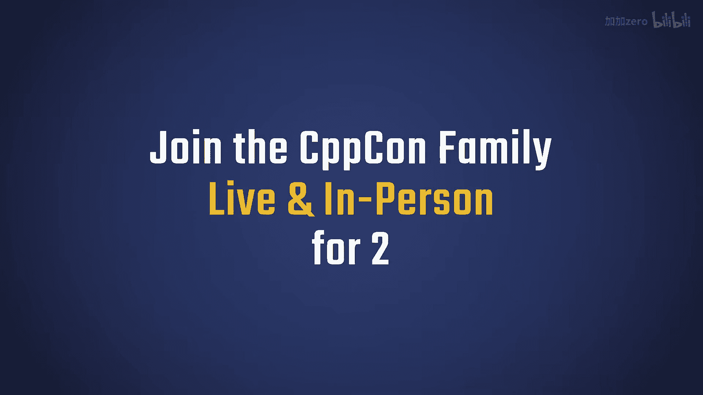
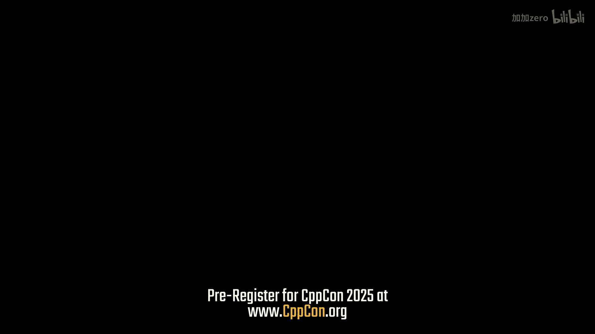
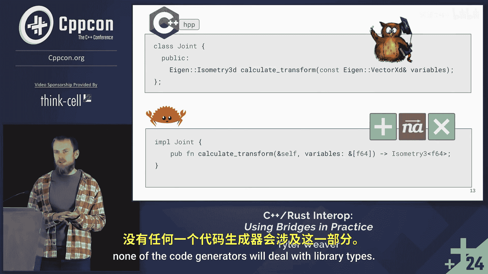

# CppCon【中英⚡CppCon 2024】 p30 P32 C++⧸Rust Interop： A Practical Guide to Bridging the Gap Between C++ and Rust -BV1NHEEzdE92_p30-

🎼The Rockies are over there。🎼Don't just go to the conference。

 go and see the Rocky Mountain National Park， go hiking up at Bear Lake or something。

 don't do what I did， which is just to come for the conference， go and see the area。

Okay。Hello I'm Tyler， we're going to talk about rest In out。This is not going to be nearly as。

Maybe as controversial as you might think it would be。s I'll just tell you the punchline up front。

 It's easier than you think。There's a thing I love about C++。

 I feel like C++ is the greatest nerd snipe it has。😊，So many dark corners you can stare into。

 and sometimes they're buses full of money that keep running into us。

Keeping doing keeping us coming back to it。And。There's this other language that I think has a lot。

A lot in common。I got started with it about three years ago。It's been great。To continue like。

C+ is full of fidly little details。 I remember this Timmore posted this on Twitter after the CPP St guy wrote a book on initialization and there's a lot of little details。

 And this is the feeling that I get doing rust interruptop。 There's a lot of little details。

 but none of them are really that hard by themselves。 It's just the culmination of it feels。😊。

It feels challenging， but if you break it apart， it's not that bad。In the past。

 I felt like this was a vibe I would get。In the Sos community， that seems to be changing。

I think it's。I think at first， you know， new things。Feel threatening。

But they can be full of wonderful things that we can learn。

 just different ways of thinking about things。So let's get started when we in the beginning。

 what we're going to do is just glue these two things together。 We're going to ignore。

The rest of the details will come to them later， and we're going to do it in the simplest way possible。

What I mean by that is we're going to do it in the most manual way possible。

We are still fairly early in rust and C++ Interop， and so even if you use code generators。

 even if you use a bunch of tools， you still end up in situations where you have to do it manually。

 you have to pull it apart and see what's happening， sometimes you have to add things yourself。啊。

This all comes from stuff that I've done。 I was in this situation where there was a large C plus plus library that I worked on。

 a bunch of applications built on top of it， and various robotics algorithms were implemented in plugins so that you could compare the plugins。

And so that you could at runtime， swap out things。I had written some new robotics algorithm code in rust。

 and I wanted to include it with this rest of this application。

So that's where I got started with this。The basics of rust to interrupt is you're building a bridge from two places that are comfortable and easy。

There's safe Ru， we're not going to talk much about safe Ru in this talk。

 there's plenty of resources on how to learn to write it。

And on the other side we got our C++ header file， we're going to present a well behaved C++ thing that our users so our users don't have to look underneath。

The content of this talk is largely about the middle there。

We're going to build some unsafe rust with a C interface。

And we're going to write the implementation for that header。In， in a source file that uses that。

You'll see there are some logos here or some characters， one you may not be familiar with is choo。

 the unsafe urchin。It's a fun character and I like it a lot。 everybody knows about Ferris。

 but we are coral also。😊，It's a different language in some ways。

So this is where we're going to start。 We have a joint type。The Rio one had a lot more members to it。

 but this gives you a good flavor of it， and we have a function。That will create a new one。

And on the C+ plus side， we want a joint type that contains this rust type。

 So we're going to make a move only type。You may see I don't have a copy move construct or a copy or constructor or assignment。

Because I've specified a move assignment or defaulted one。

The compiler will hopefully delete it for me。 Also， you're going to see a member。

Variable that will also have that effect。The only thing I have to specify is the constructor。

 everything else is default in this case。On the unsafe side， the coro's side。

We're going to write a couple C functions， one to create a new object and one to delete it。

This is a matching pair。 And the reason we need this or among many reasons。

 is your allocators and deallocators have to come in pairs。You have to。

 if you allocate something in rust， you need to delocate it in rust。

Because the memory layout is different。And you can get in a lot of surprising trouble if you try to mix a delocator on C++ side。

So we have this function that'll call the new and we have one that'll call the delete essentially。

 and you'll notice the new， there's no unsafe in the new， there's a couple details here。

 there's no unsafe in the new because it is safe to create and leak memory。

There's nothing you be about doing that。嗯。And there's a couple other details。

 there's this no mangle attribute that's because rust like C+ plus mangles function names and we need it to not mangle this function names so that we can link to it and call it through the C interface and then there's X and C which tells the compiler this has C calling conventions。

 it'll make sure that I only put types in it that can be called from C or represent it in C The leader it is unsafe。

We're taking in a raw pointer and we're going to get this at link time so we can't the compiler can't see through to the call site。

 so we can't know anything about the lifetime of this raw pointer， can't know that it's valid。

 we're going to write the other side。A lot of this。So a lot of what writing good。

 unsafe code is about is。Carefully checking and then building a well behaved interface for your users。

 So you write them and you write it in pairs。You write the call site and the consumer。

On the C+ plus side in our header file， we have a unique pointer that's going to store this opaque pointer to the rust object。

 We need this because later we're going to make methods。

And the rest side that we're also going to have a pair of on the C plus plus side。

 we need the object to be able to call it。The deletelir， you remember， robot Joint free。

 was that function that I wrote。We have a template here that's part of the unique pointers template arguments that I will show in just a bit。

 but one the thing that's cool about this is right， my deor is defaulted。

 I don't have to manually implement a deor。I just hand it to the tight， and it'll do the right thing。

Here's how I implemented the type， it's just astruct with a call operator。

That takes the pointer type。And， and it calls the function。

There's a X C here to pull in to declare that that function exists。

And you see the forward declaration of the type from。The rest side。

I like to use a rust namespace here just to make it clear that that type is coming from rust。

 but you can do what you want here， it doesn't really know anything other than it's a raw pointer to some type。

The implementation at this point is really simple。 All it is is the constructor。

 and the constructor is initializing the unique pointer。And calling that function。

It's pretty straightforward， actually it's really pretty easy。It's really boring at this point。

And we now have with that， we now have a。We have a C++ object that's move only that contains a rust type。

 and you can create it and destroy it from C++。This is all stuff that code generators will do for you。

The reason that I was in this situation is explained here。In。

None of these co generators will generate， none the co generators will deal with。

