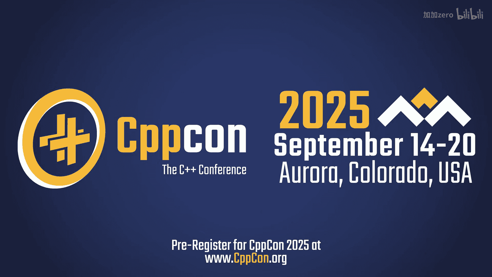
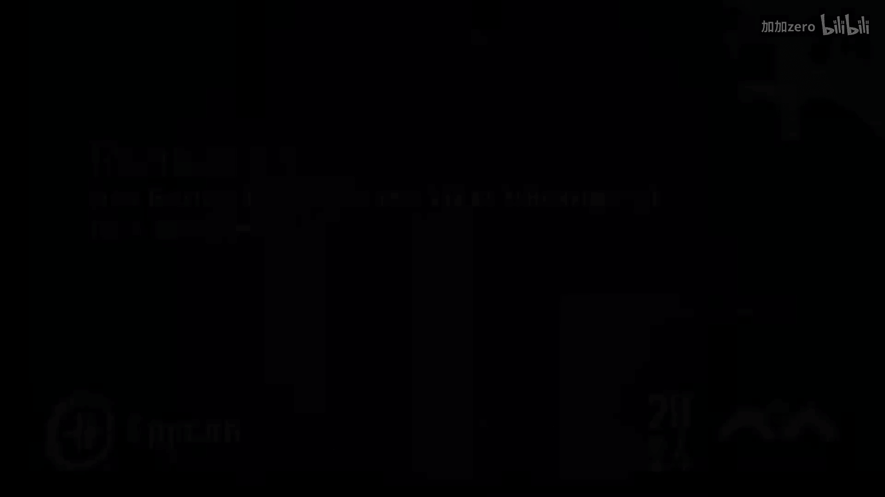
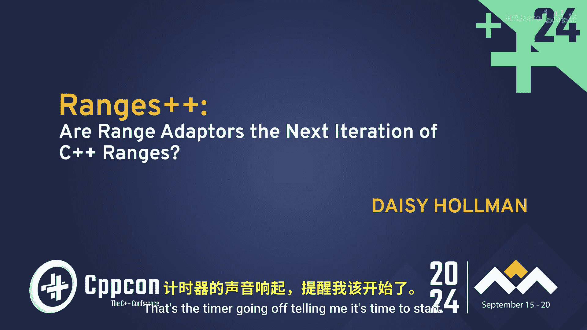

# CppCon【中英⚡CppCon 2024】 p32 P34 Ranges++： Are Output Range Adaptors the Next Iteration of C++ Ranges？ - Dais -BV1NHEEzdE92_p32-

I often learn things here in a short conversation that would take me weeks。

 months or years to gain that same experience on my own。

All right， that's。Timer going off， telling me it's time to start。 So how's everyone doing today。

 had a good。

Good CPP con so far。 It's coming in I know it's been a long week。

 If you are like in that back section， I will let you know there is a lot of code on these slides。

 no slide has more than 25 lines of code， but that's still actually quite a lot some of it's pretty small and you may have trouble reading it if you want to move for the front section。

 it'll be a lot easier alternatively if you can't move up for one reason or another。

 I did post the slides on the Discord channel on the CPP con Discord the Discord channel for this talk。

 Also feel free to leave comments， heckles whatever there code that shows me I'm wrong all of those things are fun。

 Anyway， I'm gonna dive right in， I have quite a lot to talk about and I do talk a little fast。

 So if you are lost like。Throw both hands up and say I'm completely lost。

 I'm gonna try and take questions at the end， though， like actual questions at the end。

 So if if just just some signal somehow that you're completely lost and I need to slow down。 Also。

 if you're watching on YouTube， you can watch it in slower speed because I talked very quickly。

 And I'm sorry about that。 I get very excited。 This is some really cool stuff。

 I've been hypping it up all week。 And I'm actually really excited to talk about it， so。😊。

Let's dive right in， for those of you don't know me。

 I am have been involved in the Se Sw Committee for quite a while now， eight years。

 I am currently or I say so I've worked on empty span。 I've worked on atomic refs did execution。

 quite a few other things in the standard， a lot of smaller features also。

I am currently the chair of study Group 9 of the Sea Committee Study Group9 is the group that's responsible for the design and evolution of ranges。

So this talk is a little on topic。That doesn't mean I know more about ranges than everyone on the committee。

 In fact， it specifically means I do not。 It means that I'm in charge of getting the people who know more than me about ranges to agree with each other and that's quite a challenge it also doesn't mean I'm a ranges super fan like I am a big fan of using the right tool for the job in the right situation and very many times that's not ranges。

 and I think this。This presentation may convince you of some more times that it's not the right tool over the job。

 So Im， I'm very openly critical of like certain parts of ranges。 And that's the point， right。

 That's the point we need to have all and become better with what we have in the library。

It does mean I get to play a lot with C++， a lot more than most people。

 I get to justify playing with C++ 26 features。Long before they were coming out。

 because this is something that I actually get to work on with the committee。

 And this talk is kind of mostly in the spirit of playing， right， It's like， hey。

 this kind of seems to work pretty well。 What could we do with this in the standard。

 What would it look like。😊，So I was told at the speaker's banquet and then also at the community dinner that summary slides are good。

 So here's a summary slide。 I don't do a very good job at summary slides， but let's go。😊。

We are going to start by describing a major flaw in the design of ranges， like all things C++。

 it has this barely pronouncednounceable name called Tpoasi。Just like Spney， anyone。

 can anyone off the top of their head know what teapaasi is。Okay。

 fewer people read that blog post than I thought。 Wow， not even some of my standards colleagues。 So。

 yeah， we'll get into that。 and then we'll get to the bottom of what's causing the problem。

 We're gonna do this in the daisy way。 If you've seen my talks before， you know。

 I love to dive way down deep into code into the very。Base layer。

 the very fundamental piece of things。 we're going to use real code。

 It is going to come from the standard library。 I'm going to put standard library code that I copied and pasted onto these slides。

 And if you think I'm crazy， that's probably because I am。

 And we're going to talk about a solution that turns the turns range is kind of insight out。

 hopefully by the end of the talk， you'll really understand what that means。

 And then we're going implement some of these live。 So I'm excited to do that with you all。

 And I'll call out and say， hey， can anyone figure out what goes on this line。😊。

And then we'll talk briefly about what this can mean for the future of C++ and how this maybe fits into the kind of vague picture I have for ranges that doesn't really matter because I'm not the person who decides the direction。

 It's the people in the room with me， but。Anyway， here we go。嗯。Tpoasi， I guess。

 is how you pronounce this。 It's the terrible problem of incrementing a smart iterator。

This was from a blog post in 2019 by John Bakara who's one of the cool people in the S Su community that I don't think I've ever met in person。

 if I have then please like tell me I'm sorry John and he said it's not a showto for ranges but it can be a real issue and in all cases it's good to be aware of it so hopefully you will understand what Tpoasi is by the end of this talk。

And let's illustrate it。 Let's start by illustrating this。 So again， lots of code in these slides。

This is like kind of a very， very fundamental simple use case of ranges， right。

 transformform and filter are probably two of the most fundamental operations in all of ranges。

 and a lot of different operations can be expressed as filter or as transform。

And if we do this with C++ 223， we have this print line so we can pretend we're writing Python and take a vector。

 pipe it into a transform where we're doubling things and then pipe it into a filter where we're filtering out things that aren't。

Equal to zero mod 4 and you can see if you were to like walk through this in your brain right one gets multiplied by two is not equal to mod4。

 so it doesn't get passed through two， multipied by two is equal to zero mod4。

 so we get four coming out and then three and then four times two is eight。Mod 4 is 0。

 So you get the idea， right， This is how ranges work。Let's do this a little differently。

 and let's print out。Through our， our classic printf debugging。

Or print print line debugging now that we have print line where we print out in each of one of these functions。

 how many times these things are being called。So how many times do we think we're going to see transform being called and how many times do we think we're going to see filter being called。

Anyone want to guess？So you would hope five and five， right， you would definitely hope five and five。

Unfortunately。It's a。5 and 7 or 7 and 5。 I don't forget， which order I set those things in。

 But anyway。Weird things going on here， right， transform of two is getting called twice。

I'm going to go through one way and transform before is being called twice， right。

 I'm going go through one way of understanding why that's happening。

 If you want another great way of understanding why that's happening。

 take a look at Nikco's talk from earlier this week。 Nikco just to suits。

 I don't actually know how to pronounce his last name correctly。 But I think I got it。

 Nikco gave a talk on taming the filter view where he goes through this and a bunch of other problems with the filter view。

 He does an excellent job of explaining it。 He's an actual like educator。

 So he knows what he's doing。 And I'm just kind of doing this for fun。But。

I'm going to go through it and explain it the way that I understand it。

 And hopefully you can follow that。So it filter broken right is the question。

 So we're gonna go into real standard library code。

 I'm actually going put some copy and paste code on the screen and then I'm gonna actually kind of walk through what my brain does when I'm reading this code and what my brain kind of ignores I think this is actually a really valuable skill I think it's something to have in your toolbox。

 the standard library is not a tutorial the standard library is not really meant to be read by normal programmers。

 but you still can learn something from it right you can click through in your IDE you can go to the definition you can read it a little bit。

 and sometimes it's not gonna be helpful I'll be honest。

 sometimes there's so much going on in the standard library that it's really not helpful like stood variant and statistical typicalple very hard to read code。

 but sometimes it is gonna help you and it's good to have in your toolbox that hey。

 this is not unreadable code， this is not a black box there it's code like any other code that just has a lot more complicated requirements on it。

So let's start by looking at transform view。 This is what Lib C plus plus does with transform view。

 There's quite a lot going on here。 And so when I start diving in and looking at this， I see that。

 okay， there's a difference between versions。 So I don't really care about that for understanding what I'm。

