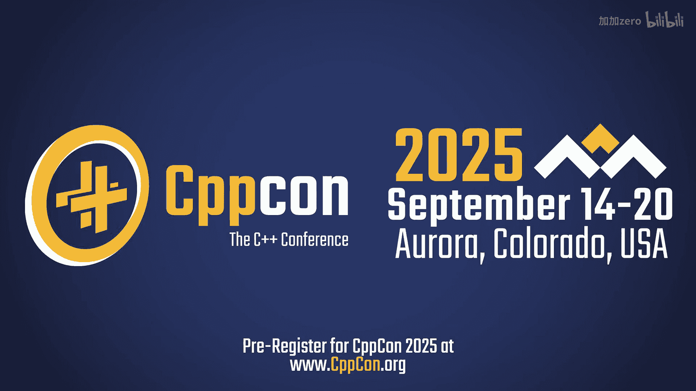
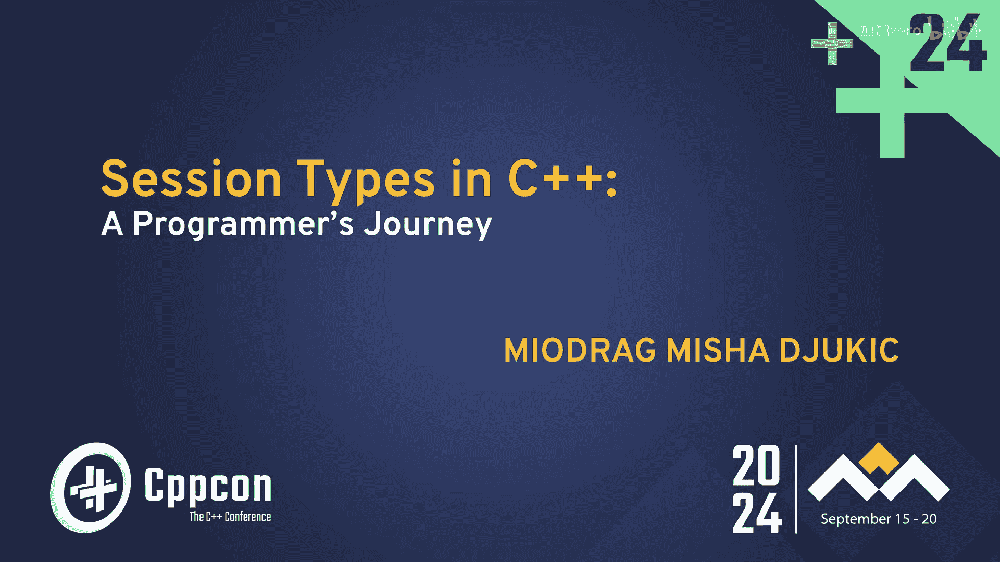
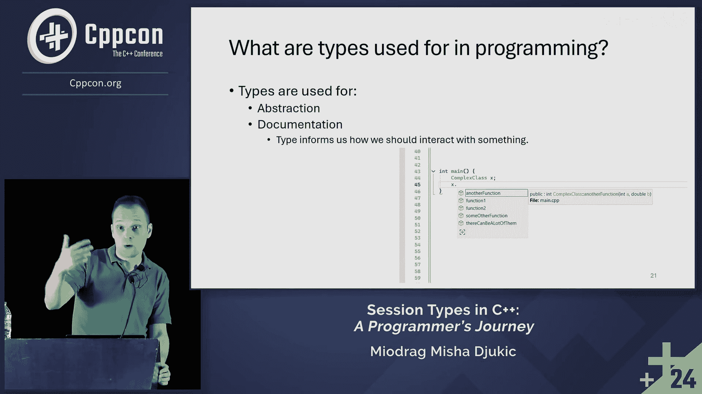

# C++中的会话类型：一个程序员的探索之旅 🚀

在本教程中，我们将跟随演讲者的思路，探索“会话类型”这一数学概念在C++中的实际应用。我们将了解什么是类型，它在编程中的多种用途，并最终理解会话类型试图解决的问题。内容将力求简单直白，适合初学者理解。

---

## 概述：什么是类型？🤔

上一节我们提到了会话类型，但要理解它，我们首先需要探讨“类型”本身。类型是编程中的一个核心概念，但它的含义可能因上下文而异。与其纠结于复杂的数学定义，不如从它在编程中的实际用途入手。

在编程语言中，类型扮演着多种角色，类似于货币在经济中的不同功能。理解这些角色，能帮助我们更好地把握“类型”的本质。

以下是类型在编程中的几个主要用途：

1.  **抽象**：类型提供了足够的信息，让我们知道如何与某个对象交互，而无需了解其背后的所有实现细节。这简化了复杂系统的理解和使用。
2.  **文档**：类型本身是一种文档。它告诉我们如何使用某个对象或如何与之交互。最明显的例子是代码自动补全功能：当你输入一个对象名并加上点操作符时，开发环境会根据其类型提示可用的方法。
3.  **错误检查**：类型系统可以在编译时或运行时检查操作的有效性，防止不匹配的操作，从而提前发现错误。
4.  **优化**：编译器可以利用类型信息生成更高效的机器代码。
5.  **模块化**：类型有助于定义清晰的接口，促进代码的模块化和组件复用。

---

## 会话类型的动机与挑战 ⚙️

上一节我们介绍了类型的一般用途，本节中我们来看看“会话类型”这一特定概念。会话类型是一个来自数学和理论计算机科学的概念，用于描述通信协议中交互的结构和顺序。

演讲者探索会话类型的直接动机非常实际：一位朋友断言这在C++中“不可能实现”。这激发了他的挑战欲。虽然在其他语言中已有不同实现，但在C++中似乎鲜有尝试。因此，本次旅程的目标就是探索在C++中实现会话类型的可能性。

---

## 总结 🎯

本节课中我们一起学习了：
1.  “类型”在编程中是一个多用途的概念，核心作用包括**抽象**、**文档**、错误检查和优化等。
2.  “会话类型”是用于规范通信协议交互顺序的一种类型理论。
3.  在C++中实现会话类型是一个有趣的挑战，其动机源于一个实际的断言，目的是探索C++语言在表达复杂协议方面的能力。

通过理解类型的基础角色，我们为后续深入探讨如何在C++中建模和实现会话类型这一更专业的领域打下了基础。