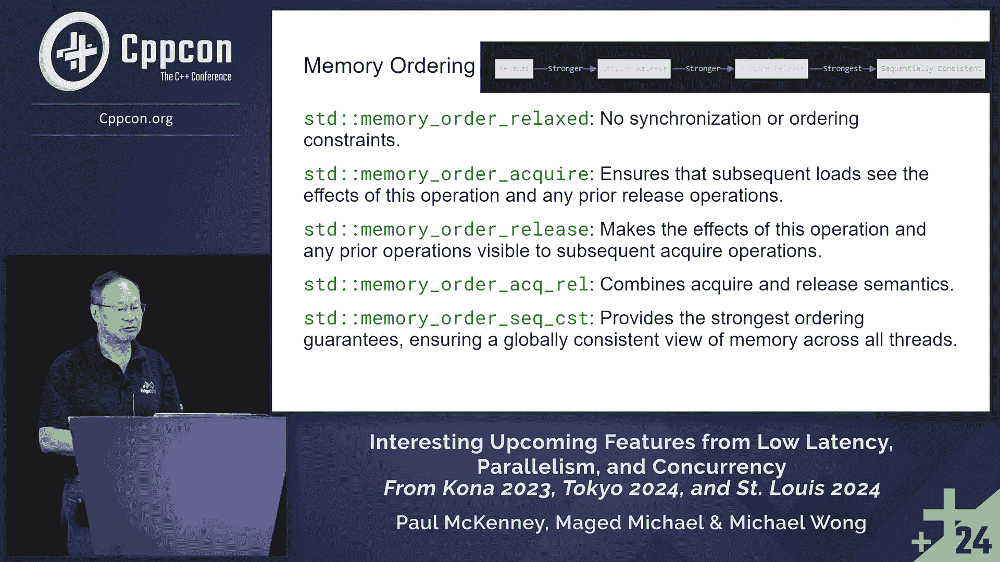

# CppCon【中英⚡CppCon 2024】 p35 P37 Recent Concurrency and Parallelism Proposals to the C++ Standard Committee - -BV1NHEEzdE92_p35-

🎼Pretty much everyone who has done something。

Very， very important in C++ is here at least every other year or so。

Directly interfacing with those people is just an incredible boon to your career。

 especially early in your career。Getting to pick people's brains on things。Just hanging out。

 talking with people you can't put a price on that。And you don't get those online。🎼。🎼。

🎼Yeah。

Okay。Welcome。

Thank you for staying till Friday to hear this session。My name is Michael Wong。

 and along with my colleagues， Mag Michael。

Paul McKinney， Paul McKinney is not here。 We want to talk to you about a few of the interesting upcoming features from low latency。

 parallelism。And concurrency， that's been an area that we've been working on all， our career。

So we like to identify generally， we like to identify these features since the last CPB con。

 So basically， since then， we've had three meetings of， of the C++ standard。

 There was one in Koa in 2023。 Theres one in Tokyo。

 There was one in Tokyo in March and then one in St。 Louis in in June。 Yes。

 we sometimes go to some interesting places。Okay。So what we do want to talk about is we want to talk about improving C plus plus 20 atomic min Max。

 which is in paper P 0，4，9，3。 You can find these papers by typing W G 21 dot link slash P0，4，9，3。

 that will。Always get you the latest version。We're going to talk about hazard pointer extensions in P3。

1，3，5。 We're going to talk about pointer tagging。P1，33，1，2，5。 And I want to talk。

 and I'm going to continue and give you an overview of how where parallelism has been and is going。

And by guiding you through parallel range algorithm。 And if we have time。

 we will talk a little more about parallel algorithm， Most likely we won't。

 There's a lot of material here。 This talk is trying to be extra technical by diving in the code a lot more than concepts。

 motivations。Okay， so you guys know me。 My name is Michael Wong。 I'm a D E， and。At colate。

 slash Intel。And let's start with C plus plus 26， atomic min Max。So as of C plus plus 20。

 atomic operations like Fetch ad and Compare exchange are supported。

 but Fechmin and Fechm are not yet part of the standard library。Even in C plus plus 23。

 which induce introduce new features like co routines， ranges and other areas for standard libraries。

 But atomic minimum maximum， believe it or not， is still not in there。

So there was a paper that that talks about this。 I'm going the wrong way。 Sorry， Alright。

 So Atomic Min Max dates back pretty far back to about 1980s。

 research on parallel parallel computing。 a lot of many platforms like Open C and Kuda。

Already support atomic min Max。 So it is needed in C plus plus。

 in so especially in multi threaded environments， race conditions can arise。

When multiple threads attempt to update a shared variable simultaneously。

 and this can lead to data corruption and unpredictable program behaviors。

 So atomic mid Max operations address this issue by ensuring that updates to the shared variables data corruption。

 Sorry， basically perform atomically。Meaning that they are indivisible and cannot be interrupted by other threats。

So atomic min Max operations offer a lot of benefits。

 They give you an efficient and safe way to concurrently update share variables。

 They eliminate the atomic min Max operations。 Sorry， they give you。

 they eliminate the need for explicit locking。And this can lead to basically improvements in performance and scalability。

 especially in highly concurrent scenarios。 Now， additionally， atomic min Max。

Give you the ability to implement lock free data structures。Which further enhance performance。

So this is the proposed interface。Okay， the colors is not too bad。 Hopefully， you can see that。

 I was trying to highlight all the keywords and all the variables so that you can distinguish them。

The C Pfa Sand Library gives you the ability to do atomic min Max operation using the the colon colon atomic template。

Class and its member functions， fetchm and fetch min。 Now。

 these functions atomically update the shared variable with the maximum。

Or minimum of its current value。 And then。And in a way。

 this is similar to other atomic operations like Fetch ad， which already exists。

If you look at some performance data， you'll see that the hardware support can be significant。 Okay。

 It can be significantly faster。 This is basically a graph that shows benchmark results comparing the time and contentions across multiple core。

😊，So what this does is that it shows that。The hardware instructions outperform a cast loop。

 a compare and swap loop。As the core count increases。

 but it also shows that the performance scales well with the core count。 So right now。

 you can actually， the standard gives you the ability to implement it if your hardware supports it。

 okay。Here's the code example。 Now， this is an excellent example to demonstrate your usage of atomic fetch。

嗯。Fetchm operation in a multi threaded environment。 So in this example。

 we basically have multiple threads concurrently searching for the maximum value within a different range。

And each thread uses atomic fetchm to atomically update and share。

 update the shared max underscore value variable。 The final value of the max value represents the maximum value found。

 So There is a pretty basic idea。 Let's walk through the examples。 So， first of all， like I said。

 this program finds a maximum value in the range from 0 to 999 using parallel processing。

It demonstrates。The how atomic fetch mats can be used for thread safe updates in a。

In a reduction operation。 Basically。 So the key component here。

 you'll see is that there's a stood colon colon atomic angle bracket int， max underscore value。

And that's basically a shared atomic variable to store。The maximum of value。

Theres also a fine underscore max in range function。 And this processes a subrange。

And updates the max value。Theres the main function。

Which creates and manipulates and manages the threats。Each processing a subrange。

So let's look closely up to the fine max in range function。

This basically takes a start and end value， defining a subrange。It its through the subrange。

 updating the max underscore value。Using Fech_ Max。It uses memory order relaxed for efficiency。

 meaning that the order doesn't matter， Usually in things like this。

 when you' looking for the value total max， the order doesn't matter just like an encounter。Next。

 let's look at the the thread creation on the right side。 This creates 10 threads。

Each processing a range of 100 numbers。So thread0 processes 0 to 99。Rightr one processes 100 to 199。

So 9， obviously， processes 900 to 999。Let's look at the atomic operation。

 So the atomic operation is max underscore value dot fetch， underscore max。Prenhesis。

I comma stood cold cold memory auto relaxed， so it atomically updates max underscore value if I is greater。

😊，And it ensures save updates without explicit locking。 This is lock free programming right here。😊。

It's reachable now to everyone。 That's the significant thing。 You don't have to be an expert now。

 Well， you still have to be a little bit。あ。Question over here， yes。

That's because the fetchm takes care of it inside of it， yes。But。And you can do different ones later。

 yeah。So continuing on the thread joining on the far right side at the bottom。

 this is necessary because the main thread waits for all the worker threads to compete to complete。

 And then it ensures all the ranges have been processed before printing the result。

The result is going to be the final max underscore value， which is going be obviously 999。

Nothing tricky there。😊，This is the largest number in the overall range。

The benefits of this approach is parallelism。 It utilized multiple cores Okay。

 for faster processing on your CPU here。 We're gonna show you how to do your GPU later on。

It gives you lot free programming。 There's no。 There are no explicit lock。 And it。

 and this reduces contention。 And over it， the less lock you have， the less contention there will be。

It simple， atomic fetch Max simplifies the implementation。Now。I talk about memory ordering。

 and I've been deeply involved with atomics and memory ordering for about 20 years now。

