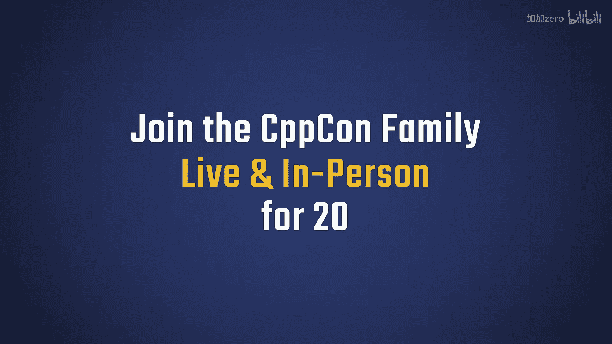
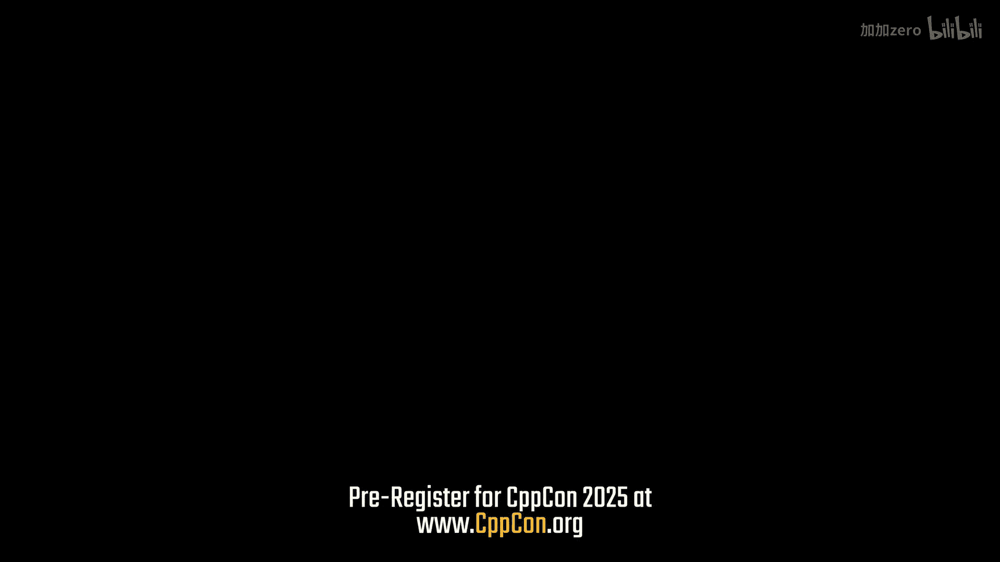
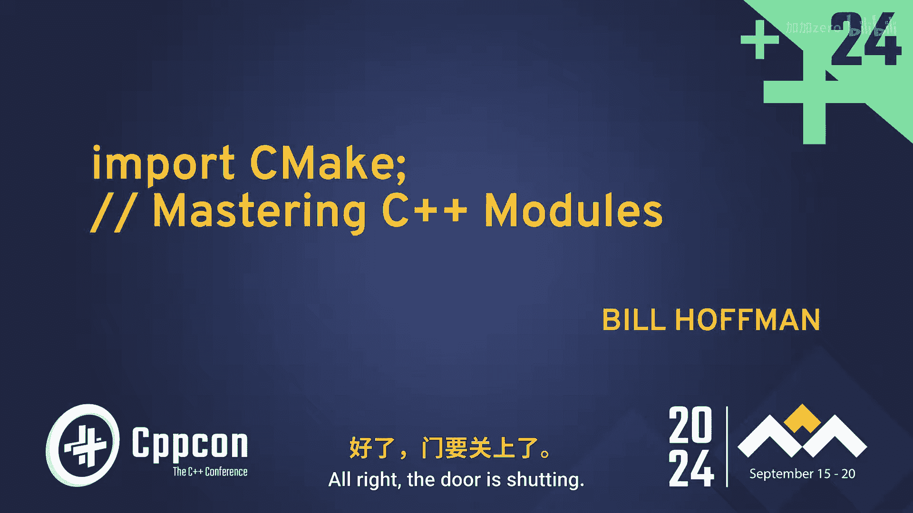
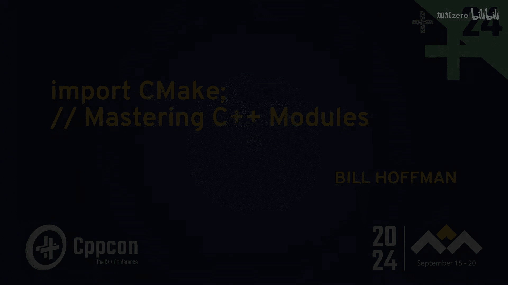
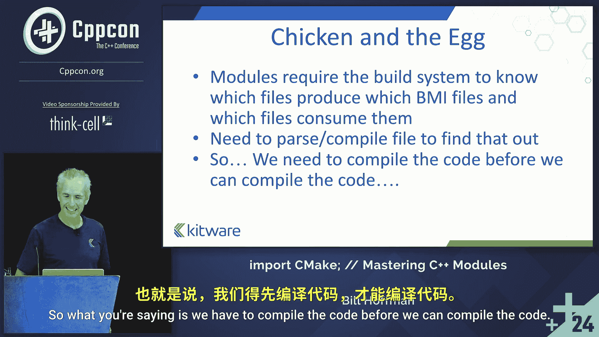

# CppCon【中英⚡CppCon 2024】 p36 P38 import CMake; ⧸⧸ Mastering C++ Modules - Bill Hoffman - CppCon 2024 -BV1NHEEzdE92_p36-

I love coming here so much of life is about finding your people and I spent a long time trying to figure out where my people were and they're here。

Yeah。

All right， the door is shutting。

You guys are trapped now， okay。

Alright， let's get this show started。 Is everyone excited to hear about C plus plus 20 modules。😊。

All right。Okay， yeah， I'm going talk about C plus plus modules， import SeeMake。

 mastering C plus plus modules。Maybe a little bit of an ambitious title。

 I don't know if anybody can master them， but we'll see what we can do。Okay。

 a little introduction here。The guy， blank guy， seamate guy。 like people say， hey。

 that's the seamate guy。That's the sandal guy， right， I run around in sandals。

 That's me running the Ladville 100 Ul marathon up in the mountains。And the Kitware guy。

 I'm one of the five founders of a company called Kitware。

 and we do scientific visualization software。About me a little bit。 So from 1990 to 1999。

I worked at G E Research， their corporate research center in Schectady， New York。

And I worked in a computer vision group。And when I got there， I was， you know。

 fresh out of college and。Really excited to hear about this thing I knew I was a C programmer。

 and there was a C plus plus thing， like。😊，Wow， objectorian programming with C。 Like。

 this is really cool。 And I helped move them from symbolics list machines to C plus plus on Soers with Linux and Windows。

 And I kind of became the build software library guy， you know， GMake auto tools。😊，You know。

 it was kind of a self preservation thing to get into the software process。

Because we always did demos in the， the vision group。 And my boss would be like。

 when we do this demo， the people would stay up all night and we'd show it to some important customer。

You know， and then。All right， it's done。And then， two weeks later， it lost to be like， hey。

 some guys driving by。 It's real important。 Can you show that demo you guys did two weeks ago。

 I'm like， sure Oh， no， it doesn't work。What did these guys do And I update then I'm up like all night。

 you know， fixing whatever bugs all these people cause of the software anyway。

 So that's how I got into sort of software process。 You know。

 so I didn't have to stay up all night at work。 And then in 1998。

 I helped start Kitware and I do lots of， I did lots of development， CMake I T K， VP K。

 I'm mostly in management now。 I'm looking for funding pointyho Boska。😊，So， you know。

 people might call me the sea make guy， but you know， it's really a community effort。

 Lots of contributors at Kitware， Brad King， Ben Bael are obviously big， huge contributors。

 Craig Scott as well。 You know， it's not just Kiware people。 It's a big community and。And basically。

 I thought， yeah， I'd like to thank all of you for， you know， using CMake and supporting it。

 You know， that using it is supporting it。 And we'll get to that and sort of fits with the theme of the modules。

Quick thing about Kiware。 We built on open source software。 We have a computer vision group。

 data analytics， scientific computing， medical computing， and software solutions。

I like to throw this in in presentations about Cm。 people like， where did CMake come from。

 Why'd you do it， Kitworth is actually the lead engineering team for the creation of the insightsight。

 segmentation and registration toolkit。 So it's funded by the National Library of Medicine。

 And it was to create， codify the state of the art in。😊。

Segmentation registration tools for medical data。 So MRI I， C T。

 and they actually have this data set where they froze people solid and sliced them and took pictures。

 So they had reference data for the C T in the MR。 So they created this big C plus plus library。

 and we were tasked with just， you know， it's got a work cross platform。

The state of the art back then was auto tools on Unix。

 checked in visual Studio 6 projects on on Windows。

 and maybe someone knew how to get something working on a Mac。So I wanted to fix that。

 and I remember pitching it。To the I T K group And some guy from CM MU is like， though。

 why are you creating the I T K build system， Can't we just use some standard thing out there？

 But before you let me answer， he's like， oh， wait。

 you're not talking about creating an I T K build system。

 You're talking out creating a build system for the whole world and all of C plus plus。 I'm like。

 yes， world domination。😊，It takes a long time to grow a standard thing like that and get that world domination。

 But it eventually got， you know， thanks to everyone。 I think， you know， part of it was very。

 it was a very pragmatic project。 and it still has， you know， some leftovers from that， you know。

 from day one， it built I T K and a grad student could get in there and build I T K。

 and write their own little project with it。 You know， the syntax was a little bit ugly。

 And it grew over time。 and there's probably some mistakes in there。

 but it always worked and it was very useful。😊，Alright， enough for the background。

 let's talk about modules。Okay。This was a talk that Daniel Russeso gave at C plus plus now。

 talking about the challenge of implementing header units。 So for the sake of this talk。

 I'm going to be talking about named modules only。It's sort of interesting。 know。

 the hetero and units were， hey， let's create this way， you know。

 it would be a way to use all the legacy code。 but it actually taxes the build system and the tooling。

😊，Even more than the named modules。 So like， everything has to be perfect before you can get to use this legacy supporting thing。

 so。Maybe we'll never get those， but I'm hoping we do get name modules worked out。

 and we we'll talk about in this talk。So I always have fun。 You know，2023， I said， hey， Cha GPT。

 does CMake support C plus plus 20 modules。😊，Sure it is， Bill。Here's how you do it。

And it produced some garly g seamate code。Doesn't really make sense。 Doesn't do modules。

 And Cmate didn't do modules then anyways。So in 2024， I'm like，Does he do it？

It actually got some good text here。 It's used the C X， X module， Ta types， not really a target type。

 It's a part of a header set。File set。And then， it gave some。M， that's not the right code at all。

That's building a shared module with my module CPP， so。

So what this tells me is there's not enough module code out there in the world to teach chat GPT how to do CMake modules。

 So that's part of the goal of this talk is to get people psyched about modules and to show them how to do it in CMake And maybe in 2025 when you ask chat GP about CMake modules。

 It'll answer right。 So can we all help change chat GT。😊，All right， what's the module。Okay。

 so this is， you know， to replace header fileses。 So this is a simple module。 I'm exporting module B。

And then I'm exporting this function called B， in this module。So pretty simple。

 And someone could say， import B。And then they would be able to call this function B。

And what happens is with that， when the compiler sees。That module， it has to get compiled， right。

 This， This code gets compiled by the compiler。 And as the side effect of that compilation。

 or with special flags， you can ask it to create the。Built module interface， or the BMI。

MC calls these do IFC files， GCC dot GCM， Kang dot PCM。Whatever， they're built module interfaces。

 And that's what I'm going to be calling them in this talk。

 And that's the nomenclature that Bryce and Boris came up with it。 So that's what we're going with。

Okay， so here's where it gets tricky for build systems。So look at this simple example。

 I've got my B module that we just had and an A module， so。B exports， B， and A imports。B， so。

We try to compile A。And oh oh， I get there。Can't find module B。嗯。This isn't C plus plus。 What is it。

 So with include files， this wouldn't be a problem because I would pound include。But now。

 what has to happen is。The order actually matters。 So B has to be compiled。

 and that BMI has to be created before you can compile a。So if we look at it and we compile it。

The other way around， and we do B first， and then A。Well a， it all works。

So now we've got a conundrum， right， It's kind of a chicken in the egg。

Modules require the build system and know which file produces which BMI files and which ones consume them。

So we're going to need to parse and compile the file to find that out。So what you're saying？

