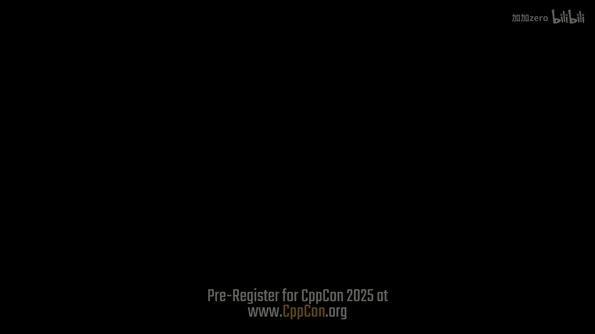
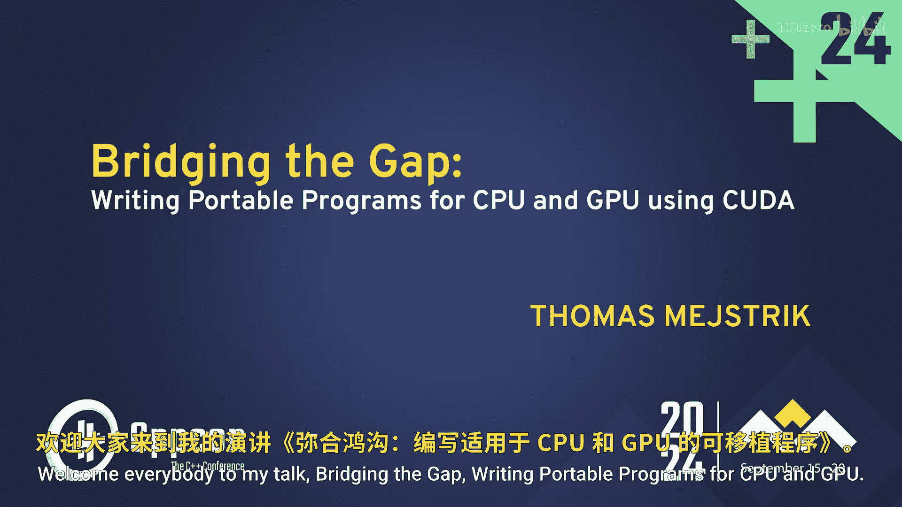
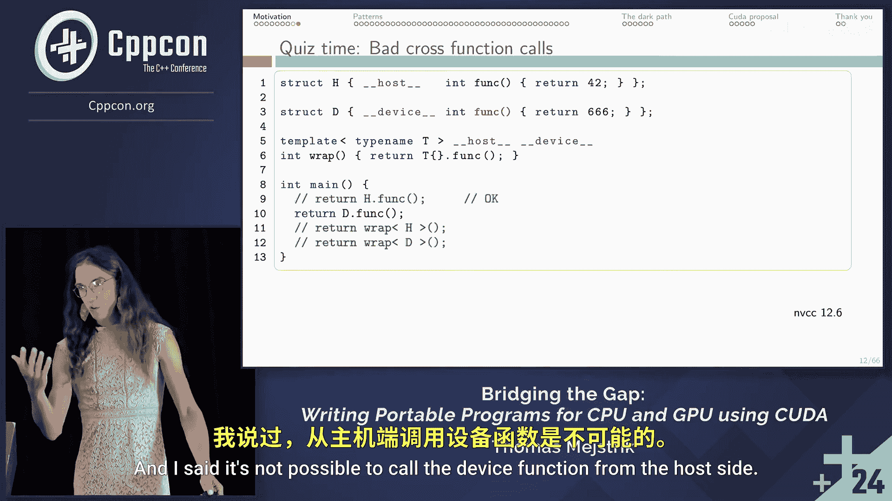

# CppCon【中英⚡CppCon 2024】 p38 P40 Bridging the Gap： Writing Portable C++ Programs for CPU and GPU - Thomas Mej -BV1NHEEzdE92_p38-

What makes E unique is。🎼It actually creates a nice environment to collaborate to talk。

 they facilitate that people get together from networking。

 they don't just do presentations and that's it but also arrange things outside the presentations。

Welcome everybody to my talk， Bing the gap， writing portal programs for CPU and GPU。

I have a little headache， so I will make strange facial expressions sometimes so。

I'm Thomas Mesticick， I'm from University of Vienna。😊，I'm actually mathematician。

 but I worked quite some time at the company Dimida， and they already did a lot of quoa programming。

And problems we had there and the solutions I'm going to present this talk。And。My colleague。

 Sebastian Waliststein， who is a co of this。Presentation still works there。

So I will start by explaining why it is interesting what I present here。

Well while it is of use and I will show the problems and some at the end。

I will make a very short proposal to the Kuda language because I hope somebody from NVDdia will sees this。

So， okay， you can ask questions anytime。 Also during the talk， I hope I repeat them。

 So everybody hears them。 And I'm gonna start。 I could everybody who is a co developer raise their hand so that I know it。

Yes， okay。 That's good。And。Developers of other heteroroous systems like OpenC。Also。

 some more cool to developers， okay。Then。This talk is only about Kuda unfortunately。

 I somehow it got lost in the title it's written in the abstract but this talk is only about Kuda。

 So code is an extension to the C++ language and it allows to write programs for NV chip use in a very straightforward way。

 nearly as easy as it is to write it for the CPU。And I don't know about OpenC and so on。

 so don't ask me about it。 I will not be able to answer you。

 but I'm happy to hear something after the talk。OnSo。

The goal or the problem I'm presenting is you have a program which runs on the GP and you also want that it runs on the CPU。

And you don't want to duplicate a lot of code， you don't want undefined behavior。

 you don't want a lot of boilbl code。And you might think why this is actually a goal to achieve because CPUs and GPUs are designed very differently。

 so they are designed to solve different problems。 So an algorithm which runs fast on the GP it may be very slow in the CPU and vice versa。

 so usually you have an algorithm and all the parts which are fast in the GP are offed to the GPU。

So whyhy would you want to do this？ And because of this， I don't think a lot of people think about。

This actually。And I want to stress four points， these are the four points why we did this  animator。

First， there are some algorithms where the best implementation on the CPU。

Miix the one on the GP actually。 So， for example， embarrassingly parallel algorithms。

 So where you have nearly any communication between the threats and you parallelize time by just starting them multiple times。

 and then you have a n times increase。In speed， hopefully。So animator they compute。

Where it pro can fly safely so up in the air， so for each point up in the R compute。

 where it's possible to slide on it， which is perfectly embarrassingly parallel。

But that was not the only motivation for us。 The second was the user experience in the beginning of the company。

 we had to motivate our customers to use our software， so cell phone operators。

And they were actually not willing to buy a GPU。 So we had to make sure that we can show our program。

 even if they do not have a GPU。But also our for us developers， it was nice because we could。

Run our program， even if our computer did not have a T。 so for example。

 on each possible laptop in the crane and we not bound to our expensive workstation。And finally。

 debug again testing is much easier if you can do it directly on the CPU。

 I try to debug often on the GP and I never make it。Runless， smoothly。So。哦。In this talk。

 I will mostly talk about functions。 I will not talk about how to organize your memory。

 This would be a totally different talk and would need totally two hours more。

 So only just like in a cell functions on the equation of this kind of。Seeing。

 I will not talk about performance。 The goal is not that we have to well program which ones perfectly。

On the CPU too。The goal is we have a program which runs on the GP。

 and we also want that it can be CPU。And you will see。

We have mostly to navigategator route around Qa problems， actually， to achieve this。 Oh sorry， no。

Okay， now， because not everybody here was a ka is a kuda developer。

 He is a very short code introduction。 We will not need a lot power of kuda。

All you need to know for this talk is on this slide。And。In Ka， we have three types of functions。

 we have host functions， these run on their CPU， host in CPU is quite synonyms in Ka terminology。

And the host functions are stored in the memory on the CPU。

And then we have global and device functions， they run on the GPU and they're starting in the memory of the GPU。

 so device and global functions can call device and global functions and host functions can call host functions。

Global functions are a little bit special because they are the entry point to start something on the GP。

But for this talk。Purpose global functions behave as device functions。

 so I will not talk about global functions anymore， only about hosting device functions。

So here very short。Concrete example， something like Hello world， but without hellello world。

In VFA device， global and host functions， these print kernel and start and they are such functions because they are innotated with this device global or host。

Quite straightforward and main in line 7 is not annotated， this means it's a host function recently。

So in line8， we would call our start function， which is a host function， which is nice。

 Main is a host function， the host function。 Then we call it the kernel。

It starts two times three strands。Each corner brings one number。the number 0。

 which comes from the device function， everything is nice and then。The kernel finishes somehow。

 and in line 9， we would wait until all kernels finish the computation。

 and quota device synch also takes care that the。I appears on this screen。So this is on code。

If we want to execute it， we have to compile it first。

 there are two mainstream compilers or not mainstream， most used compilers。

 I would say NVCC and plan。NVCC is not a full compiler in the sense that it always needs a host compiler。

 so NVCC。Does a two step compilation， it first takes only the device stuff。Combins it for the device。

 then pass it down to the host compiler and the host compiler。Combined for the host typically at G。

But Glen can also be used as a standal long compiler。And。

I mentioned this because there are slightly different dialects in Ka， which they implemented。

 and we will see them later on。There are also other compilers like HIV A and D， but。

And so one that I will not talk about this。 this is。

 if you run the co program 6 zeros in an arbitrary order because the kernelrons are running asronously。

Okay。So now a Chris for you now you need everything。For this talk and here's a littlequi。

 The is about we have four function calls in line 9 to 12。

 And you can guess what happens if you don't like gles。

 then stay very crumpy and don't raise your hands。 But if you like thises， you can raise your hands。

So we have extractstruct H and extractstruct T。Dstruct H is supposed to be used only on the host side and T only on the device side and both synchroement the function function。

And then we have a function rep in line 6， which is a template function。 It's marked as host device。

 so it means it can run on the host in the device side。So we start easy。

 what do you think happens if you call H。fg？Who thinks we get 42 back and no compileer message output？

Yeah， this was easy。No。What happens if you call it D dot fun， This is a device function now。

And I said it's not possible。

