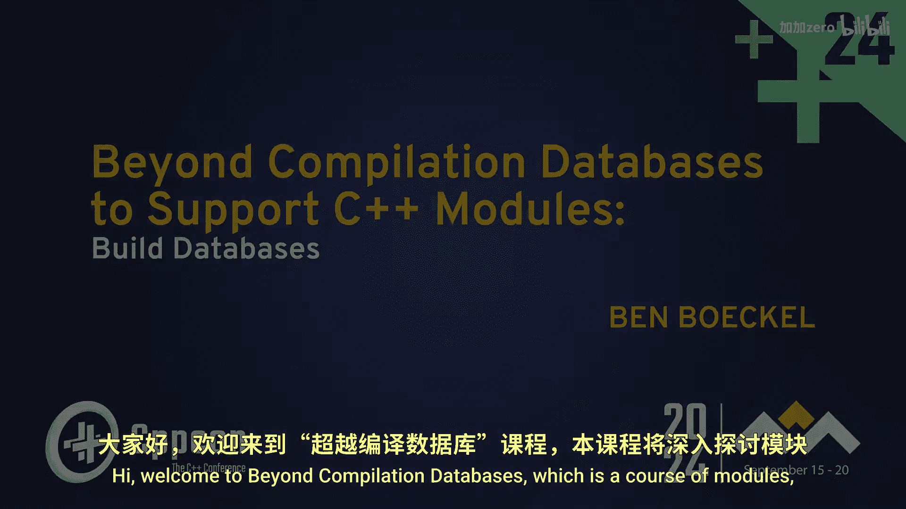
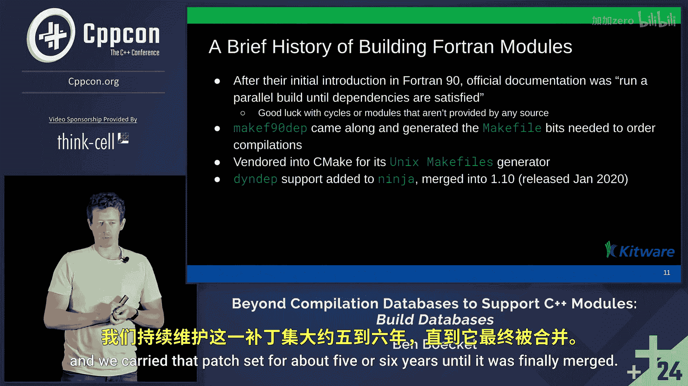

# C++ 构建系统：第1章：超越编译数据库以支持 C++ 模块：构建数据库


在本节课中，我们将要学习编译数据库的概念、它们在 C++ 模块引入后面临的局限性，以及一种名为“构建数据库”的解决方案如何应对这些挑战。

## 编译数据库简介



上一节我们介绍了课程概述，本节中我们来看看编译数据库。

编译数据库是 JSON 文档。它们是顶层包含对象的数组。每个对象描述构建过程中发生的单个命令。对象包含命令运行的工作目录、命令本身、正在编译的源文件以及将创建的输出文件。然而，输出字段是可选的，这可能导致问题。

编译数据库由 Clang 项目指定，并非 ISO 标准。但它们被广泛使用和提供，大多数构建系统都会生成它们。静态分析工具和集成开发环境使用它们来理解项目，因为仅凭 C++ 源代码本身，在不了解传递给编译器的标志的情况下，意义不大。

以下是编译数据库的一个示例：

```json
[
  {
    "directory": "/home/user/project",
    "command": "/usr/bin/g++ -I./include -c main.cpp -o main.o",
    "file": "main.cpp",
    "output": "main.o"
  }
]
```

以下是编译数据库的生成方式：

*   通常由构建系统生成，例如 CMake 或 Meson。
*   构建工具如 Ninja 也支持生成。
*   也存在包装构建过程并发现构建命令的工具。

如果由构建系统生成，它们通常与构建规则一起可用。因此，当生成 Makefile 或 Ninja 构建文件时，IDE 可以立即开始理解源代码。

## 编译数据库的局限性

上一节我们介绍了编译数据库的基本概念，本节中我们来看看其局限性。

编译数据库通常表现良好，但存在例外情况。如果缺少输出字段，源文件可能变得不明确。一个源文件可能被编译多次，例如在发布模式和调试模式下，或者因为被编辑以用于具有不同标志的多个目标。在这种情况下，IDE 需要理解哪个版本是相关的。

命令以字符串形式表示，被指定为 shell 转义。这在 Unix 系统上通常可以假设为 Bash，但在 Windows 上，通常使用 CMD，也有人使用 PowerShell，它们的转义序列非常不同。除了查看字符串并根据启发式方法猜测外，没有地方可以说明正在使用哪种 shell。

编译数据库也没有可扩展性，没有地方用于保留字段名称。因此，向此格式添加任何新字段都充满了与生态系统中其他工具可能已做的内容冲突的风险。

还存在可移植性问题。所有标志都取决于正在使用的编译器。一个标志可能不被特定版本的 GCC 支持，从而导致错误。

此外，编译数据库不提供构建图信息。它不知道是否存在预期的生成头文件，也不知道是否存在尚未找到的生成源文件。对于模块，CMake 在其策略中会在构建期间写出一些文件，然后命令会读取这些文件。因此，配置时的信息是不完整的。

## C++ 模块带来的挑战

上一节我们讨论了编译数据库的局限性，本节中我们来看看 C++ 模块如何使情况复杂化。

对于不了解的人来说，模块使编译 C++ 变得复杂。过去那种“令人尴尬的并行”构建方式（我有 N 个核心，就运行 N 个作业）已经结束。这是因为 C++ 采用了 Fortran 的编译瓶颈。

这意味着，当编译一个源文件时，会得到一个目标文件，还会得到一个称为 BMI 的文件。BMI 是构建模块接口或二进制模块接口。某些实现称之为 CMI。当某些代码导入一个模块时，它寻找的就是这个文件。但 BMI 是在编译过程中产生的，并非立即可用。

C++ 模块与 Fortran 模块的相似之处在于，它们都有编译器特定的 BMI。不能将 Clang 的模块用于 GCC，反之亦然。对于 C++，情况甚至更严格，编译标志也很重要。如果一个模块是用 C++23 编译的，而另一个代码试图用 C++26 并导入该 23 模块，这将无法工作，因为 BMI 本质上是抽象语法树的转储，当标准改变时，AST 也会改变，导致无法读取。

C++ 模块与 Fortran 的另一个共同点是，需要导入哪个模块是由源代码内容决定的，无法仅通过某些固有属性预先知道。因此，每次源文件更改时，都必须重新构建依赖图，或者在构建过程中发现依赖图将如何变化。

不同之处在于细节。Fortran 支持所谓的子模块，本质上是强制嵌套的模块，并且支持从单个翻译单元导出多个模块。C++ 不这样做，而是有分区，但分区本质上也是模块，只是不能直接导入。此外，Fortran 没有 C++ 所面临的标志问题。

## Fortran 模块构建的历史与启示

上一节我们了解了 C++ 模块的挑战，本节中我们来看看 Fortran 模块的构建历史以获取启示。

Fortran 模块在 90 年代引入。当时一家供应商的官方文档建议“运行并行构建直到成功”。这种方法在遇到循环依赖或导入未构建的模块时会导致构建永不结束。

最终，有人创建了 `f90dep` 工具，它会查看 Fortran 源代码并写出一个 Makefile 片段，说明编译此目标前需要先编译另一个目标。将这个片段包含在 Makefile 中就能获得可靠的构建。

CMake 的现任维护者 Brad King 在 2000 年代末期将其引入 CMake，并为 Makefile 生成器实现了支持。在 2010 年代中期，他又为 Ninja 实现了依赖支持，并维护了相应的补丁集。

## 构建数据库：一种解决方案

上一节我们回顾了历史，本节中我们来看看“构建数据库”这一解决方案。

构建数据库旨在解决编译数据库的局限性，特别是针对 C++ 模块。它扩展了 JSON 格式以包含更丰富的构建信息。关键改进包括明确的输出文件映射、构建图依赖关系、编译器标志的规范化表示以及支持生成的文件和模块元数据。

一个构建数据库条目可能如下所示：

```json
{
  "version": 2,
  "entries": [
    {
      "directory": "/path/to/build",
      "command": {
        "executable": "/usr/bin/g++",
        "arguments": ["-std=c++20", "-fmodules-ts", "-c", "main.cpp", "-o", "main.o"]
      },
      "inputs": ["main.cpp"],
      "outputs": ["main.o", "main.pcm"],
      "dependencies": {
        "implicit": ["module.modulemap"],
        "order-only": ["generated.h"]
      },
      "provides": [],
      "requires": ["MyModule"]
    }
  ]
}
```

构建数据库的核心优势在于它使工具能够理解完整的构建上下文，而不仅仅是单个编译命令。这对于需要知道模块 BMI 文件位置、处理生成的文件或解析复杂编译器标志链的 IDE 和构建工具至关重要。

## 总结



本节课中我们一起学习了编译数据库的基本概念及其在支持现代 C++ 特性（尤其是模块）方面的局限性。我们探讨了 C++ 模块如何改变了构建过程，使得传统的编译数据库信息不足。最后，我们介绍了一种名为“构建数据库”的扩展解决方案，它通过提供更丰富的构建上下文、依赖关系和元数据，为工具链提供了全面支持 C++ 模块化编程所需的信息。