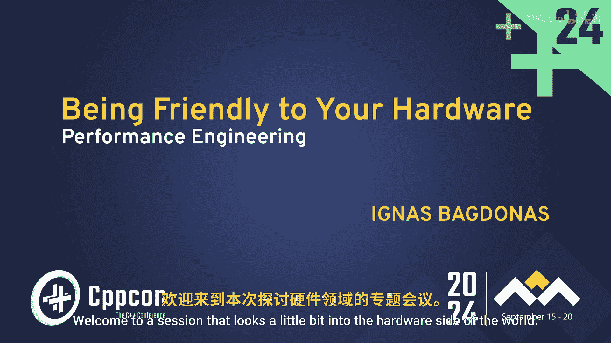
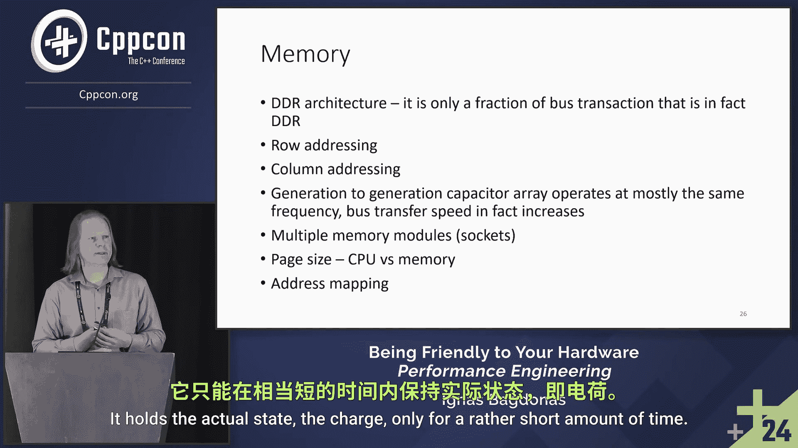

# C++性能优化：硬件友好编程入门 🚀

## 概述

在本教程中，我们将探讨软件开发中的性能优化，特别是如何编写对硬件友好的代码。我们将从硬件的基本工作原理入手，理解内存和处理器如何交互，从而帮助您编写出更高效的程序。

---

## 硬件世界初探 🖥️

上一节我们概述了本课程的目标。本节中，我们来看看软件运行的实际环境——硬件。

C++代码在编译后，并非运行在一个抽象的“C++机器”上。从实践角度看，它运行在由硬件及其周边组件构成的计算机平台上。

这个平台可以简化为几个核心部分：**处理器**、**内存**以及连接两者的**互连部件**。输入/输出（IO）虽然重要，但不在本次讨论的范围内。

处理器和内存的物理形态随着时间推移而演变，但其基本功能保持不变。处理器负责执行指令，而内存则用于存储代码和数据。

---

## 深入理解内存 💾

上一节我们介绍了计算机平台的基本构成。本节中，我们将重点剖析内存的工作原理。

动态内存（DRAM）的本质是一个由电容器组成的阵列。每个电容器存储一个电荷，代表一个逻辑电平（0或1）。这些电容器通过内部逻辑电路进行控制，以实现数据的读写。

内存访问遵循特定的电气协议。这个过程涉及发送命令、等待内部操作完成，然后才能获取或写入数据。以下是内存交互的基本步骤：

1.  **激活**：发送命令以选择内存阵列中的某一行（Row），并等待其生效。
2.  **列选择**：发送命令以选择该行中的特定片段（列，Column），并再次等待。
3.  **数据访问**：此时才能实际读取或写入目标地址的数据。
4.  **预充电与刷新**：由于DRAM的读取操作是破坏性的，读取后需要将数据写回（预充电）。同时，电容器上的电荷会随时间泄漏，因此必须定期对所有存储单元进行重新读取和写入（刷新），频率大约为几十毫秒一次。

尽管单个步骤的延迟在纳秒级别，但这些延迟会累积起来，对整体性能产生显著影响。内存接口的实际有效数据传输率（有用吞吐量）仅为其理论峰值的大约10%。

这种限制源于物理定律。例如，电容器的充放电速度受到电流大小和晶体管可承受电压的限制。在高度集成的电路内部，无法使用过大的电流或电压。

从市场发展来看，内存的**阵列速度**（电容单元本身的速度）在过去25年间（从DDR1到DDR5）提升有限。真正的巨大提升在于**数据传输速率**（即接口带宽），这体现在上图中绿色的部分。然而，如果无法快速地从内存阵列中获取数据，高带宽的优势就无法充分发挥。

---

## 内存架构与协议 📡

上一节我们了解了内存访问的物理延迟和限制。本节中，我们来看看这些限制背后的架构和协议原因。

内存采用分层式的二维地址结构，这主要是出于电气工程和制造工艺的考虑。将所有单元线性排列会带来信号完整性问题。

从协议角度看，连接到内存组件的信号引脚数量有限，这也是需要采用这种动态寻址结构的原因之一。此外，我们必须牢记动态内存（DRAM）的“动态”特性——它需要持续的刷新来维持数据。

---

## 总结

在本节课中，我们一起学习了硬件友好编程的基础知识。我们了解到，C++程序运行在真实的硬件平台上，而非抽象机器。我们深入探讨了动态内存（DRAM）的工作原理，包括其基于电容的存储方式、包含激活、列选、数据访问和刷新的访问协议，以及由物理定律决定的性能瓶颈。最后，我们明白了内存的二维架构、有限引脚和动态刷新特性是其工作方式的根本原因。理解这些硬件底层机制，是进行有效软件性能优化的第一步。